[TOC]


## JavaScript

1. JavaScript（是什么？）
   - 是一种运行在客户端（浏览器）的编程语言，实现人机交互效果。
2. 作用（做什么？）
   - 网页特效（监听用户的一些行为让网页作出对应的反馈）
   - 表单验证（针对表单数据的合法性进行判断）
   - 数据交互（获取后台的数据，渲染到前端）
   - 服务端编程（node.js）
3. JavaScript的组成（有什么？）

-  ECMAScript:
   - 规定了js基础语法核心知识。
     - 比如：变量、分支语句、循环语句、对象等等
-  Web APIs：
   - DOM 操作文档，比如对页面元素进行移动、大小、添加删除等操作
   - BOM 操作浏览器，比如页面弹窗，检测窗口宽度、存储数据到浏览器等等


### JS的引入方式

##### **内部 JavaScript**

- 直接写在html文件里，用script标签包住
- 规范：script标签写在</body>上面
- 拓展：alert('你好，js') 页面弹出警告对话框

```js
<script>
    alert('嗨，欢迎来传智播学习前端技术！')
</script>
</body>
```

> 注意事项

我们将 <script> 放在HTML文件的底部附近的原因是浏览器会按照代码在文件中的顺序加载 HTML。

如果先加载的 JavaScript 期望修改其下方的 HTML，那么它可能由于 HTML 尚未被加载而失效。

因此，将 JavaScript 代码放在 HTML页面的底部附近通常是最好的策略。


##### **外部 JavaScript**

代码写在以 `.js`结尾的文件里

语法：通过 script 标签，引入到 html 页面中。

```js
<body>
    <!-- 通过src引入外部js文件 -->
    <script src="my.js"></script>
</body>
```

>注意事项

1. script标签中间无需写代码，否则会被忽略！
2. 外部JavaScript会使代码更加有序，更易于复用，且没有了脚本的混合，HTML也会更加易读，因此这是个好的习惯。


##### **内联 JavaScript**

- **代码位置**：代码写在标签内部，用 onclick
- **语法**：无具体语法展示，仅作概念说明
- **注意事项**：此处作为了解即可，但是后面 vue 框架会用这种模式

示例代码

```js
<body>
  <button onclick="alert('逗你玩~~~')">点击我月薪过万</button>
</body>
```


###  注释和结束符

通过注释可以屏蔽代码被执行或者添加备注信息，JavaScript 支持两种形式注释语法：

##### 单行注释

使用 `// ` 注释单行代码

##### 多行注释

使用 `/* */` 注释多行代码

> 编辑器中单行注释的快捷键为 `ctrl + /`

##### 结束符

在 JavaScript 中 `;` 代表一段代码的结束，多数情况下可以省略 `;` 使用回车（enter）替代。

> 实际开发中有许多人主张书写 JavaScript 代码时省略结束符 `;`


### 输入和输出

##### 输出语法:

语法 1:（一般不用了）

```js
document.write('要出的内容')
```

作用: 向 body 内输出内容

注意: 如果输出的内容写的是标签, 也会被解析成网页元素

语法 2:

```js
alert('要出的内容')
```

作用: 页面弹出警告对话框

语法 3:

```js
console.log('控制台打印')
```

作用: 控制台输出语法, 程序员调试使用

##### 输入语法：

语法：`prompt('请输入您的姓名:')`

作用：显示一个对话框，对话框中包含一条文字信息，用来提示用户输入文字


### 字面量

##### 定义：

源代码中，直接写出的，不需要计算的、能够被编译器直接理解，并转化成对应数据类型的值

##### 示例：

- 我们工资是：1000，此时1000就是数字字面量。

- '黑马程序员'是字符串字面量。

  

### 变量

定义：计算机中用来存储数据的“容器”，简单理解是一个个的盒子。用来存储数据的

##### 声明变量

语法：`let 变量名`

- 声明变量有两部分构成：声明关键字、变量名（标识）。

举例：`let age`

- 我们声明了一个`age`变量。
- `age`即变量的名称，也叫标识符。


##### 变量赋值

定义：定义了一个变量后，你就能够初始化它（赋值 。在变量名之后跟上一个 “=”，然后是数值。）

```js
// 1. 声明一个 age 变量
let age
// 2. age 变量赋值为 18
age = 18
// 3. 输出age变量
alert(age)
```

> 是通过变量名来获得变量里面的数据


##### 更新变量

变量赋值后，还可以通过简单地给它一个不同的值来更新它。

```js
// 声明了一个age变量，同时里面存放了18这个数据
let age = 18
// 变量里面的数据发生变化更改为19
age = 19
// 页面输出的结果为19
document.write(age)
```

> let 不允许多次声明一个变量。


##### 声明多个变量

定义：变量赋值后，还可以通过简单地给它一个不同的值来更新它。

语法：多个变量中间用逗号隔开。

```js
let age = 18, uname = 'pink'
```

> 看上去代码长度更短，但并不推荐这样。为了更好的可读性，请一行只声明一个变量。


##### 交换变量的值

**步骤**：

1. 声明一个临时变量 temp
2. 把 num1 的值赋值给 temp
3. 把 num2 的值赋值给 num1
4. 把 temp 的值给 num2

> 没了~~~临时变量不用自动销毁


##### 变量的命名规则和规范

**规则**

- 不能用关键字

  > 关键字：有特殊含义的字符，JavaScript 内置的一些英语词汇。例如：let、var、if、for等

- 只能用下划线、字母、数字、$组成，且数字不能开头

- 字母严格区分大小写，如 Age 和 age 是不同的变量

**规范**

- 起名要有意义

- 遵守小驼峰命名法

  > 第一个单词首字母小写，后面每个单词首字母大写。例：userName


##### ‼️ let 和 var 区别

let声明局部变量，不可重复声明，先使用后声明会报错

var声明全局变量，可重复声明，二次声明会覆盖其前一次的声明；如果在编译阶段会将全局变量在不同的作用域中提升至全局位置，所以可以先使用后声明，但是赋值得先赋值


### 常量

**定义**：使用 const 声明的变量称为“常量”

**使用场景**: 当某个变量**永远不会改变**的时候, 就可以使用 const 来声明, 而不是let。

**命名规范**: 和变量一致

**常量使用:**

```js
// 声明一个常量
const G = 9.8
//输出这个常量
console.log(G)
```

> 常量不允许重新赋值, 声明的时候必须赋值(初始化)；并且不能二次赋值


### 数据类型

##### **基本数据类型**

基本数据类型是按值访问的，存储在栈内存中，共有 6 种：

| 类型        | 说明                     | 示例                       |
| ----------- | ------------------------ | -------------------------- |
| `number`    | 数字类型，包括整数和小数 | `10`, `3.14`, `-100`       |
| `string`    | 字符串类型，文本数据     | `'hello'`, `"JavaScript"`  |
| `boolean`   | 布尔类型，表示逻辑值     | `true`, `false`            |
| `undefined` | 未定义类型               | 变量声明但未赋值时的默认值 |
| `null`      | 空值类型                 | 表示“无”或“空对象指针”     |
| `symbol`    | 符号类型（ES6 新增）     | 用于创建唯一标识符         |

> 💡 注意：虽然 `null` 被认为是对象类型（`typeof null` 返回 `"object"`），但它属于基本数据类型。

##### **引用数据类型**

引用类型的数据存储在堆内存中，通过引用地址访问，主要包括：

| 类型       | 说明                                           |
| ---------- | ---------------------------------------------- |
| `object`   | 对象类型，用于存储键值对                       |
| `array`    | 数组类型，一种特殊的对象，用于存储有序数据集合 |
| `function` | 函数类型，也可看作可调用的对象                 |

> 🔍 扩展说明：
>
> - 在 JavaScript 中，**数组和函数本质上都是对象**，因此引用类型统称为 `object`。
> - 使用 `typeof` 检测引用类型时，对象、数组返回 `"object"`，函数返回 `"function"`。


##### 数值类型

定义：在 JavaScript 中，**所有数字**（无论是整数还是小数）都属于 `number` 类型。

```js
let age = 25;        // 整数
let price = 9.99;    // 小数
let temp = -10;      // 负数
```

🔍 `typeof` 检测结果均为 `"number"`：

```js
console.log(typeof 100);     // "number"
console.log(typeof 3.14);    // "number"
```

> JS 是弱数据类型,变量到底属于那种类型,只有赋值之后,我们才能确认
>
> Java 是强数据类型 例如 int a = 3 必须是整数


###### NaN

NaN 不等于任何人，包括他自己

NaN 代表一个计算错误。它是一个不正确的或者一个未定义的数学操作所得到的结果

```js
console.log('老师' - 2) // NaN
```

NaN 是粘性的。任何对 NaN 的操作都会返回 NaN

```js
console.log(NaN + 2) // NaN
```


##### 字符串类型

定义：通过单引号、双引号或反引号包裹的数据都叫字符串，单引号和双引号没有本质上的区别，推荐使用单引号

```js
let uname = '小明' // 使用单引号
let gender = "男" // 使用双引号
let goods = `小米` // 使用反引号
let tel = '13681113456' // 看上去是数字，但是引号包裹了就是字符串
let str = '' // 这种情况叫空字符串
```

> 1. 无论单引号或是双引号必须成对使用
> 2. 单引号/双引号可以互相嵌套, 但是不以自己嵌套自己 (口诀: 外双内单, 或者外单内双)
> 3. 必要时可以使用转义符 ,输出单引号或双引号


###### 字符串拼接

**场景**：

+运算符 可以实现字符串的拼接。

**口诀**：数字相加，字符相连


##### 布尔类型

`true` —— 真（表示“是”或“开启”）

`false` —— 假（表示“否”或“关闭”）

```js
let isLogin = true;
let isLoading = false;

console.log(typeof true);   // "boolean"
console.log(typeof isLogin); // "boolean"
```

> 布尔值常用于条件判断、循环控制和逻辑运算。

```html
<!DOCTYPE html>
<html lang="en">
<head>
  <meta charset="UTF-8">
  <title>JavaScript 基础 - 数据类型</title>
</head>
<body>
  
  <script> 
    //  pink老师帅不帅？回答 是 或 否
    let isCool = true // 是的，摔死了！
    isCool = false // 不，套马杆的汉子！

    document.write(typeof isCool) // 结果为 boolean
  </script>
</body>
</html>
```


##### undefined

定义：`undefined` 是 JavaScript 中的一种**基本数据类型**（也是其唯一的值），表示**“未定义”或“没有值”**。

######  什么时候会出现 `undefined`？

1. **变量声明但未赋值**

```js
let age;
console.log(age); // undefined
```

2. **对象中不存在的属性**

```js
let user = { name: "小明" };
console.log(user.age); // undefined
```

3. **函数没有返回值**

```js
function sayHello() {
  console.log("Hello");
}
let result = sayHello(); // 函数没有 return
console.log(result);     // undefined
```

4. **函数参数未传值**

```js
function greet(name) {
  console.log("你好，" + name);
}
greet(); // 没传参数
// 输出：你好，undefined
```


##### null

###### 什么是 `null`？

`null` 是 JavaScript 中的一个**基本数据类型**，表示 **“空值”或“无对象”** —— 即**有意地表示“这里什么都没有”**。

```js
let selectedUser = null;
console.log(selectedUser); // null
```

> 📌 关键点：`null` 是**开发者主动赋值**的，表示“我明确知道这个变量现在没有值，但以后可能会有”。


###### `null` 的特点

| 特性     | 说明                                                         |
| -------- | ------------------------------------------------------------ |
| 类型     | 基本数据类型（但 `typeof null` 返回 `"object"` —— 这是 JS 的历史 bug ❗） |
| 值       | 只有一个值：`null`                                           |
| 含义     | “空值”、“无”、“未指向任何对象”                               |
| 谁设置的 | 通常由**开发者手动赋值**                                     |

```js
console.log(null);           // null
console.log(typeof null);    // "object" （错误！应为 "null"）
```

> ⚠️ `typeof null === "object"` 是一个著名的 JavaScript 设计错误，需注意。


######  `null` 的常见用途

1. **初始化变量，表示“暂无值”**

```js
let currentUser = null; // 先设为空，登录后再赋值
```

2. **清空对象引用**

```js
let data = { name: "张三", age: 25 };
data = null; // 主动释放引用，便于垃圾回收
```

3. **表示函数返回“无结果”**

```js
function findUser(id) {
  // 如果没找到用户，返回 null
  return null;
}
```

4. **DOM 操作中表示“元素不存在”**

```js
let element = document.getElementById("notExist");
console.log(element); // null （注意：不是 undefined）
```


###### 如何正确检测 `null`？

由于 `typeof null` 返回 `"object"`，不能直接用 `typeof` 判断。

✅ 正确方法：使用严格相等 `===`

```js
let value = null;

if (value === null) {
  console.log("value 是 null");
}
```

❌ 错误方式：

```js
if (typeof value === "null") { ... } // 永远不会成立！
```


##### `null` vs `undefined` 对比

| 对比项        | `null`                     | `undefined`                  |
| ------------- | -------------------------- | ---------------------------- |
| 含义          | “**人为设为空**”           | “**自动未定义**”             |
| 设置者        | 开发者主动赋值             | JavaScript 自动设置          |
| 使用场景      | 初始化、清空、表示“无结果” | 变量声明未赋值、属性不存在等 |
| `typeof` 结果 | `"object"`（历史 bug）     | `"undefined"`                |
| 推荐做法      | ✅ 手动赋值                 | ❌ 避免手动赋 `undefined`     |


### 检测数据类型

##### 通过typeof关键字检测数据类型

typeof运算符可以返回被检测的数据类型。它支持两种语法形式：

1. **作为运算符**：typeof x （常用的写法）
2. **函数形式**：typeof(x)

换言之，有括号和没有括号，得到的结果是一样的，所以我们直接使用运算符的写法。

```js
<script>
let num = 10;
console.log(typeof num);

let str = 'pink';
console.log(typeof str);

let str1 = '10';
console.log(typeof str1);

let flag = false;
console.log(typeof flag);

let un;
console.log(typeof un);

let obj = null;
console.log(typeof obj);
</script>
```


### 模板字符串

##### 什么是模板字符串？

**定义**：**模板字符串**（Template Strings / Template Literals）是 ES6（ES2015）引入的一种新语法，用于更方便地创建和拼接字符串。

它使用**反引号（```）**包裹字符串，支持：

- 多行文本
- 嵌入变量和表达式（插值）
- 函数调用、运算等

| 特性           | 描述                                                         | 示例                                                         |
| -------------- | ------------------------------------------------------------ | ------------------------------------------------------------ |
| **基本语法**   | 使用反引号（`` ` ``）定义模板字符串。                        | `` `这是一个模板字符串` ``                                   |
| **变量插值**   | 使用 `${}` 语法在字符串中嵌入变量或表达式。                  | `` `姓名: ${name}, 年龄: ${age}` ``                          |
| **多行支持**   | 自然支持多行文本，不需要额外的换行符或转义字符。             | `` `这是第一行<br>这是第二行` ``                             |
| **表达式嵌入** | 可以在 `${}` 中嵌入任意有效的JavaScript表达式，包括函数调用和运算符。 | `` `结果: ${2 + 3}, 函数结果: ${myFunction()}` ``            |
| **嵌套模板**   | 可以在一个模板字符串中嵌套另一个模板字符串。                 | `` `外部模板: ${`内部模板: ${value}`} ` ``                   |
| **标签模板**   | 可以为模板字符串添加标签，以便对生成的字符串进行进一步处理。 | `` taggedTemplate`Hello ${name}!` ``                         |
| **HTML转义**   | 不自动转义HTML内容，因此需要手动处理以防止XSS攻击。          | `` `<div>${userInput}</div>` `` （注意：需确保 `userInput` 安全） |


##### 基本语法

```javascript
let message = `这是一个模板字符串`;
console.log(message); // 输出: 这是一个模板字符串
```

##### 变量插值

```javascript
let name = "Alice";
let age = 30;
let message = `姓名: ${name}, 年龄: ${age}`;
console.log(message); // 输出: 姓名: Alice, 年龄: 30
```

##### 多行支持

```javascript
let multiLine = `这是第一行
这是第二行`;
console.log(multiLine);
// 输出:
// 这是第一行
// 这是第二行
```

##### 表达式嵌入

```javascript
let a = 5;
let b = 10;
let result = `两数之和: ${a + b}`;
console.log(result); // 输出: 两数之和: 15

function add(x, y) {
    return x + y;
}

let expressionResult = `函数结果: ${add(3, 4)}`;
console.log(expressionResult); // 输出: 函数结果: 7
```

##### 嵌套模板

```javascript
let value = "嵌套内容";
let nestedTemplate = `外部模板: ${`内部模板: ${value}`} `;
console.log(nestedTemplate); // 输出: 外部模板: 内部模板: 嵌套内容
```

##### 标签模板

```javascript
function taggedTemplate(strings, ...values) {
    return strings.map((str, i) => `${str}${values[i] || ''}`).join('');
}

let name = "Alice";
let greeting = taggedTemplate`Hello ${name}!`;
console.log(greeting); // 输出: Hello Alice!
```

#### 

### 类型转换

定义：把一种数据类型的变量转换成我们需要的数据类型

##### 隐式转换

1. **+号**可以将其他类型转换为数值类型，有字符串的加法 `"" + 1`，结果是 `"1"`
2. **减法 -**（像大多数数学运算一样）只能用于数字，它会使空字符串 `""` 转换为 `0`
3. `null` 经过数字转换之后会变为 `0`
4. `undefined` 经过数字转换之后会变为 `NaN`
5. 任何数据和字符串相加都是拼接状态


##### 显式转换

定义：开发者**主动控制**类型转换过程，确保程序行为的准确性和可读性。

###### 1. **转换为字符串（String）**

- 使用 `String()` 函数：

  ```js
  let num = 123;
  let str = String(num);        // "123"
  let bool = String(true);      // "true"
  ```

- 使用 `.toString()` 方法：

  ```js
  let num = 456;
  let str = num.toString();     // "456"
  ```

------

###### 2. **转换为数字（Number）**

**Number（数据）**

> 转成数字类型
>
> 如果字符串里有非数字，转换失败结果为 NaN，不是一个数字
>
> NaN 也是number 类型的数据，代表非数字

**parselnt（数据）（整数）**

> 只保留整数

**parseFloat（数据）（小数）**

> 可以保留小数

- 使用 `Number()` 函数：

  ```js
  let str = "123";
  let num = Number(str);        // 123
  
  Number("12.3");   // 12.3
  Number("abc");    // NaN
  Number(true);     // 1
  Number(false);    // 0
  ```

- 使用 `parseInt()` 和 `parseFloat()`（常用于字符串转数字，可自动忽略非数字字符）：

  ```js
  parseInt("123px");   // 123
  parseFloat("3.14abc"); // 3.14
  ```

- 使用一元加号 `+`（简写方式）：

  ```js
  let num = +"123";   // 123
  let x = +"3.14";    // 3.14
  ```

------

###### 3. **转换为布尔值（Boolean）**

- 使用

  ```
  Boolean()
  ```

  函数：

  ```js
  Boolean(1);        // true
  Boolean(0);        // false
  Boolean("hello");  // true
  Boolean("");       // false
  Boolean(null);     // false
  ```

> 注意：只有 `0`、`""`、`null`、`undefined`、`NaN`、`false` 转为 `false`，其余都为 `true`。


##### 区别

| 对比项       | **显式转换（Explicit Coercion）**                            | **隐式转换（Implicit Coercion）**       |
| ------------ | ------------------------------------------------------------ | --------------------------------------- |
| **定义**     | 开发者**主动、明确地**将一种类型转换为另一种类型             | JavaScript **自动、悄悄地**进行类型转换 |
| **谁触发**   | 你写的代码（调用函数）                                       | JS 引擎根据运算符或上下文自动触发       |
| **是否可见** | 代码中明显能看到转换函数                                     | 看不到转换过程，容易被忽略              |
| **常见方法** | `Number()`, `String()`, `Boolean()` `parseInt()`, `toString()` 等 | `+`, `-`, `!`, `if`, `                  |
| **可控性**   | ✅ 高：你知道它会发生                                         | ⚠️ 低：容易产生意外结果                  |
| **可读性**   | 更清晰，意图明确                                             | 可能让代码变得“神奇”或难懂              |


### 运算符

#### 算术运算符

数字是用来计算的，比如：乘法 * 、除法 / 、加法 + 、减法 - 等等，所以经常和算术运算符一起。

算术运算符：也叫数学运算符，主要包括加、减、乘、除、取余（求模）等

| 运算符 | 作用                                                 |
| ------ | ---------------------------------------------------- |
| +      | 求和                                                 |
| -      | 求差                                                 |
| *      | 求积                                                 |
| /      | 求商                                                 |
| **%**  | 取模（取余数），开发中经常用于作为某个数字是否被整除 |

> 注意：在计算失败时(undefined加任何值 除了字符串)，显示的结果是 NaN （not a number）

```javascript
// 算术运算符
console.log(1 + 2 * 3 / 2) //  4 
let num = 10
console.log(num + 10)  // 20
console.log(num + num)  // 20

// 1. 取模(取余数)  使用场景：  用来判断某个数是否能够被整除
console.log(4 % 2) //  0  
console.log(6 % 3) //  0
console.log(5 % 3) //  2
console.log(3 % 5) //  3

// 2. 注意事项 : 如果我们计算失败，则返回的结果是 NaN (not a number)
console.log('pink老师' - 2)
console.log('pink老师' * 2)
console.log('pink老师' + 2)   // pink老师2
```

#### 赋值运算符

赋值运算符：对变量进行赋值的运算符

 =     将等号右边的值赋予给左边, 要求左边必须是一个容器

| 运算符 | 作用     |
| ------ | -------- |
| +=     | 加法赋值 |
| -+     | 减法赋值 |
| *=     | 乘法赋值 |
| /=     | 除法赋值 |
| %=     | 取余赋值 |

```javascript
<script>
let num = 1
// num = num + 1
// 采取赋值运算符
// num += 1
num += 3
console.log(num)
</script>
```

#### 自增/自减运算符

| 符号 | 作用 | 说明                       |
| ---- | ---- | -------------------------- |
| ++   | 自增 | 变量自身的值加1，例如: x++ |
| --   | 自减 | 变量自身的值减1，例如: x-- |

1. ++在前和++在后在单独使用时二者并没有差别，而且一般开发中我们都是独立使用
2. ++在后（后缀式）我们会使用更多

> 注意：
>
> 1. 只有变量能够使用自增和自减运算符
> 2. ++、-- 可以在变量前面也可以在变量后面，比如: x++  或者  ++x 

```javascript
<script>
    // let num = 10
    // num = num + 1
    // num += 1
    // // 1. 前置自增
    // let i = 1
    // ++i
    // console.log(i)

    // let i = 1
    // console.log(++i + 1)
    // 2. 后置自增
    // let i = 1
    // i++
    // console.log(i)
    // let i = 1
    // console.log(i++ + 1)

    // 了解 
    let i = 1
    console.log(i++ + ++i + i)
  </script>
```

前置自增和后置自增有什么区别

>单独使用时，没有区别
>
>前置自增：
>
>​		++在前，先加
>
>后置自增：
>
>​		++在后，先使用再加

#### 比较运算符

使用场景：比较两个数据大小、是否相等，根据比较结果返回一个布尔值（true / false）

| 运算符 | 作用                                                         |
| ------ | ------------------------------------------------------------ |
| >      | 左边是否大于右边                                             |
| <      | 左边是否小于右边                                             |
| >=     | 左边是否大于或等于右边                                       |
| <=     | 左边是否小于或等于右边                                       |
| ===    | 左右两边是否`类型`和`值`都相等（重点）全等（以后判断是否相等） |
| ==     | 左右两边`值`是否相等 只判断                                  |
| !=     | 左右值不相等                                                 |
| !==    | 左右两边是否不全等                                           |

```javascript
<script>
  console.log(3 > 5)
  console.log(3 >= 3)
  console.log(2 == 2)
  // 比较运算符有隐式转换 把'2' 转换为 2  双等号 只判断值
  console.log(2 == '2')  // true
  // console.log(undefined === null)
  // === 全等 判断 值 和 数据类型都一样才行
  // 以后判断是否相等 请用 ===  
  console.log(2 === '2')
  console.log(NaN === NaN) // NaN 不等于任何人，包括他自己
  console.log(2 !== '2')  // true  
  console.log(2 != '2') // false 
  console.log('-------------------------')
  console.log('a' < 'b') // true
  console.log('aa' < 'ab') // true
  console.log('aa' < 'aac') // true
  console.log('-------------------------')
</script>
```

不同类型之间比较会发生隐式转换：

* 最终把数据隐式转换成number类型再比较
* 开发中，如果进行准确的比较更喜欢 === 或者 ！==

#### 逻辑运算符

使用场景：可以把多个布尔值放到一起运算，最终返回一个布尔值

| 符号 | 名称   | 日常读法 | 特点                       | 口诀                 |
| ---- | ------ | -------- | -------------------------- | -------------------- |
| &&   | 逻辑与 | 并且     | 符号两边有一个假的结果为假 | 一假则假，两个都得真 |
| \|\| | 逻辑或 | 或者     | 符号两边有一个真的结果为真 | 一真则真             |
| !    | 逻辑非 | 取反     | true变false  false变true   | 真变假，假变真，取反 |

| A     | B     | A && B | A \|\| B | !A    |
| ----- | ----- | ------ | -------- | ----- |
| false | false | false  | false    | true  |
| false | true  | false  | true     | true  |
| true  | false | false  | true     | false |
| true  | true  | true   | true     | false |

```javascript
<script>
    // 逻辑与 一假则假
    console.log(true && true)
    console.log(false && true)
    console.log(3 < 5 && 3 > 2)
    console.log(3 < 5 && 3 < 2)
    console.log('-----------------')
    // 逻辑或 一真则真
    console.log(true || true)
    console.log(false || true)
    console.log(false || false)
    console.log('-----------------')
    // 逻辑非  取反
    console.log(!true)
    console.log(!false)

    console.log('-----------------')

    let num = 6
    console.log(num > 5 && num < 10)
    console.log('-----------------')
  </script>
```


#### 运算符优先级

从上到下，优先级越低

| 优先级 | 运算符     | 顺序            |
| ------ | ---------- | --------------- |
| 1      | 小括号     | ()              |
| 2      | 一元运算符 | ++ -- !         |
| 3      | 算数运算符 | 先 * / % 后 + - |
| 4      | 关系运算符 | > >= < <=       |
| 5      | 相等运算符 | == != === !==   |
| 6      | 逻辑运算符 | 先 && 后        |
| 7      | 赋值运算符 | =               |
| 8      | 逗号运算符 | ,               |


### 表达式和语句

**定义：**表达式是生成值的代码片段，语句是执行操作的完整指令

表达式：表达式是可以被求值的代码，JS引擎会将其计算出一个结果

​				表达式可以被求值，所以他可以写在赋值语句的右侧

语句：语句是一段可以执行的代码	eg.prompt（）可以弹出一个输入框，if 语句，for 循环语句

​			而语句不一定有值，所以 alert() for 和break 等语句就不能被用于赋值

某些情况下，也可以把表达式理解为表达式语句，因为它是在计算结果，但不是必需的成分


#### 分支语句

分支语句可以让我们**有选择性**的执行想要的代码

##### if分支语句

- if语句有三种使用：单分支、双分支、多分支
- 单分支使用语法：

```
if (条件) {
    满足条件要执行的代码
}
```

- 括号内的条件为true时，进入大括号里执行代码
- 小括号内的结果若不是布尔类型时，会发生隐式转换转为布尔类型
- 如果大括号只有一个语句，大括号可以省略，但是，俺们不提倡这么做~

###### 单分支

```js
 // if单分支
        if(false){
            console.log('执行语句')
        }
        if(true){
            console.log('执行语句')
        }
        if(3>1){
            console.log("真假")
        }  
        // 除了0,所有数字都为正
        if(3){
            console.log("真")
        }
        if(0){
            console.log("jia")
        }
        // 除了""空字符串，所有数字都为真
        if(""){
            console.log("加")
        }
```

###### 双分支

双分支两条代码，只有一条被执行

```js
if (条件) {
    满足条件要执行的代码 1
} else {
    不满足条件执行的代码 2
}
```

```js
// 双分支
        let name = prompt("请输入姓名")
        let password = prompt("请输入密码")
        if(name === "wjm" && password ==="123"){
            alert('成功')
        }else{
            alert('不成功')
        }
```

```js
// 判断闰年
        let year = +prompt("请输入年份")
        if(year % 4 === 0 && year % 100 !== 0 || year % 400 === 0){
            alert('是闰年')
        }else{
            alert('不是闰年')
        }
```

###### 多分支 

选择性的满足其中的一条

- 按顺序检查每个条件。
- 执行第一个满足条件的代码块，并跳过后续条件。
- 如果没有条件满足，则执行 `else` 中的代码。

```js
if (条件1) {
    代码1 // 若条件1为真，执行代码1并跳过后续条件
} else if (条件2) {
    代码2 // 若条件1为假且条件2为真，执行代码2并跳过后续条件
} else if (条件3) {
    代码3 // 若前两个条件都为假且条件3为真，执行代码3
} else {
    代码n // 若所有条件都为假，执行代码n
}
```


##### 三元运算符

- **使用场景**：比 `if` 双分支更简洁，适用于简单的条件判断。

- **符号**：`?` 和 `:` 配合使用。

- 语法

  ```
  条件 ? 满足条件执行的代码 : 不满足条件执行的代码
  ```

- **用途**：常用于取值。

```js
        console.log(3 > 5 ? 3 : 5)
```

```js
        let num1 = +prompt('请你输入第一个数')
        let num2 = +prompt('请你输入第二个数')
        num1 > num2 ?alert(`最大值是${num1}`) : alert(`最大值是${num2}`)
```


##### switch分支语句

- **匹配全等**：执行与 `switch` 中数据全等的 `case` 对应的代码。
- **无匹配**：执行 `default` 中的代码。
- **示例**：若数据等于值2，则执行代码2。

**注意事项：**

1. **用于等值判断**，不适合区间判断。
2. **需配合 `break` 使用**，否则会发生 `case` 穿透。

```js
// switch分支语句
        switch (5) {
            case 1:
                console.log("选择1")
                break
            case 2:
                console.log("选择2")
                break
            case 3:
                console.log("选择3")
                break
            default:
                console.log('没有符合条件的')

        }
```


#### 循环语句

**while循环和for循环的区别：**

for循环是确定了循环的次数，while循环是不确定执行的次数

##### while循环

**死循环**

```js
while(true){
    
}
```

在某个期间，while循环就是在满足条件期间，重复执行某些代码

```js
while (循环条件) {
    要重复执行的代码(循环体)
}
```

- **条件判断**：与 `if` 类似，小括号内条件为 `true` 时执行循环体。
- **循环机制**：执行完大括号内的代码后，返回检查条件是否仍为 `true`。若满足则继续执行，直到条件不满足才跳出循环。


##### do-while循环

```js
do {
    // 循环体（要执行的代码）
} while (条件);
```

- **先执行一次循环体**，然后再判断条件。
- 如果条件为 `true`，就继续循环；否则结束。
- **无论条件如何，循环体至少执行一次**。


##### for循环

**死循环**

```js
for( ; ; ){
    
}
```

- **作用**：重复执行代码。
- **好处**：将变量起始值、终止条件和变化量集中声明，清晰易读。

**语法：**

```js
for (变量起始值; 终止条件; 变量变化量) {
    // 循环体
}
```

**示例：**

```js
        // for循环
        for(let i = 1 ; i <= 3 ; i++){
            console.log('月薪过万')
        }
```


###### for-in 和 for-of的区别

> - `for...in`：遍历**索引（键）**，不推荐用于数组。
> - `for...of`：遍历**元素值**，推荐用于数组。


**总结**

- 想遍历对象的**属性名**？ → 用 `for...in`
- 想遍历数组/字符串的**元素值**？ → 用 `for...of`
- **不要用 `for...in` 遍历数组的值**，容易出错！

✅ 正确姿势：

```
for (let key in obj)      // 遍历对象的键
for (let value of arr)    // 遍历数组的值
```


###### for循环嵌套

> 外层循环打印行数
>
> 内层循环打印列数

```js
for（外部声明记录循环次数的变量；循环条件；变化值）{
    for（内部声明记录循环次数的变量；循环条件；变化值）{
        循环体
    }
}
```

说明：

> **一个循环里再套一个循环，一般用在for循环里**

```js
        // 循环嵌套
        for(let i = 1 ; i <= 3 ; i++){
            console.log(`记录了第${i}天`)
            for(let a = 1 ; a <= 5 ; a++){
                console.log(`记录了第${a}个单词`)
            }
        }
```

例子：

* 5行5列星星

```js
        // 5行5列星星
        let row = +prompt('请输入行数：')
        let col = +prompt('请输入列数：')
        // 外层循环打印行数
        for(let i = 1 ; i <= row ; i++){
            // 内层循环打印列数
            for(let a = 1 ; a <= col ; a++){
                document.write('⭐')
            }
            document.write('<br>')
        }
```

* 三角星星

```js
        // 三角星星
        let row = +prompt("请输入行数：")
        let col = +prompt("请输入列数：")

        for(let i = 1 ; i <= row ; i++){
            for(let a = 1 ; a <= i ; a++){
                document.write("⭐")
            }
            document.write('<br>')
        }

```

* 99乘法表

```js
        // 99乘法表
        for(let i = 1 ; i <= 9 ; i++){
            for(let a = 1 ; a <= i ; a++){
                document.write(`<span>${a} x ${i} = ${i * a}</span>`)
            }
            document.write('<br>')
        }
```


##### 循环三要素

1. **变量起始值**：设定初始值。
2. **终止条件**：避免死循环，必须有明确的结束条件。
3. **变量变化量**：通过自增或自减逐步接近终止条件。


> 案例：

循环的例子：

1.  输入 1 - 100 

```js
        // 输入 1 - 100 
        let i = 1
        while(i <= 100){
            console.log(`这是第${i}个数`)
            i++
        }

        console.log("----")

```

2. 计算从1+ 到100总和

```js
        // 计算从1+ 到100总和
        let a = 1
        let sum = 0
        while(a <= 100){
            sum = sum +a
            a++
        }
        console.log(sum)

```

3. 1-100的偶数和

```js
        // 1-100的偶数和
        let num = 1
        let sum2 = 0
        while (num <= 100) {
            if (num % 2 == 0) {
                sum2 = sum2 + num
            }
            num++
        }
        console.log(sum2)

```


##### 循环退出

**break**: 退出整个循环。

```js
        let a = 1
        while (a <= 5) {
            if (a === 3){
                  break
            }

            console.log(`我要吃${a}个包子`)
            a++

        }
```

```js
 while(true){
            let love = prompt("你爱我吗")
            if(love === "我爱你"){
                break
            }
        }
```

注意：			

> break 是终止整个循环


**continue**: 结束本次循环，结束后继续执行

```js
        let i = 1
        while (i <= 5) {
            if (i === 3) {
                i++
                continue
            }
            console.log(`我吃了${i}个包子`)
            i++
        }
```

> continue 是结束本次循环，结束后继续执行
>
> **`continue` 会跳过它后面的代码**。
> 如果 `i++` 写在 `continue` 后面，就不会执行，导致 `i` 不更新 → 死循环！


> 案例：存钱取钱

```js
let mon = 100
while(true){
    let re = +prompt(
        `
        请选择你所需要的操作：
        1.存钱
        2.取钱
        3.查看余额
        4.退出
        `
    )
    if(re === 4){
        break
    }
    switch(re){
        case 1 : 
            let cun = +prompt('请输入您要存的金额数')
            mon = mon + cun 
            break
        case 2: 
            let qu = +prompt('请输入您要取走的金额')
            mon = mon -qu
            break
        case 3: 
            alert(`您的存款是${mon}`)
            break
    }
}
```


##### 无限循环

while（true）/while（1）可以进行死循环，需要用 break 退出循环

for( ， ，) 也会死循环，同样需要用break退出死循环


### 数组

定义：一种按顺序保存数据的数据类型

作用：多个数据用数组保存，放到一个变量中，管理方便

#### 声明数组

1. 字面量声明数组

```js
        let arr = [1,2, 'wjm', 'true']
```

2. 使用new Array构造函数声明

```js
        let arr1 = new Array(1,2,'wzx')
```

> - 数组按顺序保存数据，每个数据有自己的编号（索引或下标）。
> - 计算机中编号从0开始，如小明为0，小刚为1。
> - 数组可存储任意类型的数据。

#### 遍历数组

定义：遍历数组就是从头到尾，一个一个查看或处理数组里的每个数据

语法：用`for`循环遍历数组里的每个数组

```js
for (let i = 0; i < 数组名.length; i++) {
    数组名[i]
}
```

```js
let nums = [10, 20, 30, 40, 50];
for (let i = 0; i < nums.length; i++) {
    document.write(nums[i]);
}
```

> 说明
>
> - 初始化 `i` 为 0。
> - 每次循环检查 `i` 是否小于数组长度。
> - 访问并处理 `nums[i]`，然后 `i` 自增。


#### 数组的增、删、查、改

- **查（查询数据）**：

  - `数组[下标]`：访问数组元素。

- **改（重新赋值）**：

  - `数组[下标] = 新值`：修改指定位置的元素。

  ```js
          let arr = []
          console.log(arr[0])        // undefined
          arr[1] = 2
          arr[2] = 3
          console.log(arr)
  ```

  ```js
          // 修改
          let arr = ['red','pink','blue']
          console.log(arr)      //['red', 'pink', 'blue']
          arr[0] = 'orange'
          console.log(arr)      //['orange', 'pink', 'blue']
  ```

  ```js
          let arr = ['pink','orange','blue']
          console.log(arr)          //['pink', 'orange', 'blue']
          
          for(let i = 0 ; i <= arr.length-1 ; i++){
              arr[i] = arr[i]+'老师'
          }
          console.log(arr)          //['pink老师', 'orange老师', 'blue老师']
  ```

- **增（添加数据）**：

  - `arr.push(新增内容)`：在末尾添加。

  ```js
          // 新增
          let arr = [2,8899,9034]
          console.log(arr)        //[2, 8899, 9034]
          arr.push(78787878,9876,'blackpink')
          console.log(arr)           //[2, 8899, 9034, 78787878, 9876, 'blackpink']
  ```

  - `arr.unshift(新增内容)`：在开头添加。

  ```js
          let arr = [23,982,35,6,435]
          console.log(arr)      //23, 982, 35, 6, 435]
          arr.unshift(45345,45235,234234)
          console.log(arr)      //[45345, 45235, 234234, 23, 982, 35, 6, 435]
  ```

  例子：数组筛选

  ```js
          let arr = [87,91,90,59,81,79,94,80]
          let newArr = []
          for(let i = 0 ; i <= arr.length-1 ; i++){
              if(arr[i]>=90){
                  newArr.push(arr[i])
              }
          }
          console.log(newArr)
  ```

- **删（删除数据）**：

  - `arr.pop()`：删除末尾元素。

  ```js
          let arr = [2,45,67,29]
          arr.pop()
          console.log(arr)
  ```

  - `arr.shift()`：删除开头元素。

  - `arr.splice(下标, 删除个数)`：从指定位置删除指定数量的元素。

    **`splice()` 方法：删除指定元素**

    - **语法**：

      ```js
      arr.splice(start, deleteCount)
      ```

      - `start`：起始位置（从0开始计数）
      - `deleteCount`：删除的元素个数（可选，默认删除到数组末尾）

    - **示例**：

      ```js
              let arr = [234,66,23,78,1,0,4]
              arr.splice(1,2)
              console.log(arr)        //[234, 78, 1, 0, 4]
      ```

> 案例：**数组求和/平均值**

```js
// 数组求和
let arr = [2,8,4,2,9]
let sum = 0

for(let i = 0 ; i <= arr.length-1 ; i++){
    sum += arr[i]
}

// //数组求和
console.log(sum)
// //数组平均值
console.log(sum / arr.length )

```

> 案例：**求数组最大值/最小值**

```js
let arr = [2,738,45,66,21,50]
let max = 0
let min = 0
for(let i = 1 ; i <= arr.length-1 ; i++){
    //最大值
    if(max < arr[i]){
        max = arr[i]
    }
    //最小值
    if(min > arr[i]){
        min = arr[i]
    }
}
console.log(max)
console.log(min)

```


#### 数组中的map方法

定义：用于对数组中的每个元素进行**转换操作**，并返回一个**新数组**，其长度与原数组相同。

##### ✅ 基本语法

```js
const newArray = array.map(function(element, index, array) {
  return element+'颜色';
});
console.log(newArray)
```

- **`element`**：当前遍历的元素
- **`index`**（可选）：当前元素的索引
- **`array`**（可选）：原数组
- **返回值**：一个由回调函数返回值组成的新数组

> 🚫 `map()` **不会修改原数组**，而是返回一个全新的数组。

##### 🔍 核心特点

| 特性             | 说明                                       |
| ---------------- | ------------------------------------------ |
| **纯函数式转换** | 每个元素一对一映射到新值                   |
| **不改变原数组** | 原数组保持不变（不可变性）                 |
| **返回新数组**   | 长度与原数组一致                           |
| **必须有返回值** | 回调函数中 `return` 的值将构成新数组的元素 |

> 案例：将字符串数组转为大写

```js
const fruits = ['apple', 'banana', 'orange'];

const upperFruits = fruits.map(fruit => fruit.toUpperCase());

console.log(upperFruits); // ['APPLE', 'BANANA', 'ORANGE']
console.log(fruits);      // ['apple', 'banana', 'orange']（原数组不变）
```


#### 数组的join方法

定义：`join()` 是 JavaScript 数组的一个内置方法，用于将数组中的所有元素**连接成一个字符串**。

数组-->字符串

##### ✅ 基本语法

```js
const str = array.join([separator]);
```

- **`separator`**（可选）：指定连接每个元素的分隔符。

  - 如果省略，默认使用英文逗号 `,`。
  - 可以是任意字符串（如 `'-'`、`' '`、`''` 等）。
  - 如果传入 `undefined` 或 `null`，也会被当作字符串处理（`"undefined"` 或 `"null"`）。

- **返回值**：一个由数组元素拼接而成的字符串。

  > 🚫 `join()` **不会修改原数组**，而是返回新字符串。

##### 🔍 核心特点

| 特性                                     | 说明                           |
| ---------------------------------------- | ------------------------------ |
| **返回字符串**                           | 所有元素被转换为字符串后拼接   |
| **可指定分隔符**                         | 自定义元素之间的连接符号       |
| **空数组返回空字符串**                   | `[]`.join() → `""`             |
| **`undefined` 和 `null` 被转为空字符串** | 但作为分隔符时会作为字符串处理 |

##### 🧪 基本示例

###### 1. 默认分隔符（逗号）

```js
const fruits = ['apple', 'banana', 'orange'];
const result = fruits.join();
console.log(result); // "apple,banana,orange"
```

###### 2. 自定义分隔符

```js
console.log(fruits.join('-'));   // "apple-banana-orange"
console.log(fruits.join(' '));   // "apple banana orange"
console.log(fruits.join(' | ')); // "apple | banana | orange"
console.log(fruits.join(''));    // "applebananaorange"（无分隔）
```

###### 3. 数字数组

```js
const numbers = [1, 2, 3, 4];
console.log(numbers.join(''));     // "1234"
console.log(numbers.join(' + '));  // "1 + 2 + 3 + 4"
console.log(numbers.join('0'));    // "1020304"
```

###### 4. 包含 `undefined` 或 `null` 的数组

```
const arr = ['a', undefined, 'c', null];
console.log(arr.join('-')); // "a--c-"（undefined 和 null 转为空字符串）
```

> ⚠️ 注意：`undefined` 和 `null` 作为**元素**时，会被转为空字符串；但作为**分隔符**时，会变成字符串 `"undefined"` 或 `"null"`。

```js
['a', 'b'].join(undefined); // "aundefinedb"
['a', 'b'].join(null);      // "anullb"
```

###### 5. 空数组

```js
console.log([].join('-')); // ""（空字符串）
```


##### 💡 实际应用场景

###### 1. 构造 URL 查询参数

```js
const params = ['name=Alice', 'age=25', 'city=Beijing'];
const queryString = params.join('&');
console.log(queryString); // "name=Alice&age=25&city=Beijing"
```

###### 2. 生成文件路径（跨平台注意）

```jsp
const pathParts = ['home', 'user', 'docs'];
const path = pathParts.join('/'); // Unix: "home/user/docs"
// 或 Windows: pathParts.join('\\') → "home\user\docs"
```

###### 3. 拼接 HTML 片段（简单场景）

```js
const items = ['Apple', 'Banana', 'Orange'];
const html = `<ul><li>${items.join('</li><li>')}</li></ul>`;
console.log(html);
// "<ul><li>Apple</li><li>Banana</li><li>Orange</li></ul>"
```

> ⚠️ 复杂 HTML 拼接建议使用模板引擎或 DOM 操作。

###### 4. 将数字数组转为连续字符串（如验证码）

```js
const code = [1, 2, 3, 4, 5, 6];
const pin = code.join(''); // "123456"
```

------

##### ✅ 与 `toString()` 的区别

| 方法             | 行为                                            |
| ---------------- | ----------------------------------------------- |
| `arr.join()`     | 可自定义分隔符                                  |
| `arr.toString()` | 固定使用逗号 `,` 分隔，等价于 `join()` 不传参数 |

```
[1, 2, 3].toString();     // "1,2,3"
[1, 2, 3].join();         // "1,2,3"
[1, 2, 3].join('-');      // "1-2-3" —— 只有 join 支持
```


##### ✅ 总结

> `join()` 的本质是：**“把数组变成字符串”**

- ✅ 用于将数组元素拼接为字符串
- ✅ 可自定义分隔符
- ✅ 不修改原数组
- ✅ 所有元素自动转为字符串
- ✅ `undefined` 和 `null` 元素转为空字符串


#### 数组总结

| 操作     | 推荐方法                                                     |
| -------- | ------------------------------------------------------------ |
| 添加元素 | `push()`（末尾）、`unshift()`（开头）                        |
| 删除元素 | `pop()`（末尾）、`shift()`（开头）、`splice(起始位置，删除个数)` |
| 查找元素 | `find() `（找**元素的索引**（位置），返回数字）、`indexOf()`、`includes()` |
| 遍历     | `for...of`、`map()`、`forEach()`                             |
| 转换     | `map()`、`filter()`、`reduce()`                              |
| 合并     | `concat()`、`[...arr1, ...arr2]`                             |
| 拷贝     | `[...arr]`、`slice()`、`structuredClone()`                   |


### 冒泡排序

定义：冒泡排序是一种通过重复比较相邻元素并交换位置，使较大元素像“冒泡”一样逐渐移到数组末尾的排序算法。

相邻两数比较，大的往后“冒”，每轮把最大数放到末尾。

> 外循环控制**轮数**（每轮冒出一个最大值），内循环负责**比较和交换**相邻元素。

```js
        let arr = [4,5,9,0,1]
        for(let i = 0 ; i <= arr.length-1 ; i++){
            for(let j = 0 ; j <= arr.length-i -1 ; j++){
                if(arr[j]>arr[j+1]){
                    let temp = arr[j]
                    arr[j] = arr[j+1]
                    arr[j+1] = temp
                }
            }
        }
        console.log(arr)           //[0, 1, 4, 5, 9]
```

**数组的 `sort()` 方法可以排序**

语法：

```js
let arr = [4, 2, 5, 1, 3];

// 1. 升序排列写法
arr.sort(function (a, b) {
    return a - b;
});
console.log(arr); // [1, 2, 3, 4, 5]

// 降序排列写法
arr.sort(function (a, b) {
    return b - a;
});
console.log(arr); // [5, 4, 3, 2, 1]
```

总结：

- `sort()` 方法用于对数组元素进行排序。
- 默认按字符串顺序排序，需自定义比较函数实现数字排序。
- **升序**：`return a - b`
- **降序**：`return b - a`


### 函数

**定义**：执行特定任务的代码块。

**作用**：封装相同或相似逻辑，便于复用和精简代码。

**示例**：`alert()`, `prompt()`, `console.log()` 是预封装的 JS 函数，直接调用即可。

**总结：**函数将代码“打包”，通过调用实现功能，如 `alert()` 显示提示框。


#### 函数的使用

##### **函数的声明语法：**

```js
function 函数名() {
    函数体
}
```

- **`function`**：关键字，用于定义函数。
- **`函数名`**：自定义的函数名称。
- **`()`**：参数列表（可为空）。
- **`{}`**：包含函数体，即执行的具体代码。


##### 函数有哪些声明方式？

1. 用function关键字定义一个带参数的函数
2. 将一个匿名函数赋值给变量的函数
3. 用箭头定义的函数
4. 构造函数的方式


##### 函数名命名规范：

- 和变量命名基本一致。
- 尽量使用小驼峰式命名法。
- 前缀应为动词。
- 命名建议：常用动词约定。


##### **函数的调用语法：**

```js
// 函数调用，这些函数体内的代码逻辑会被执行
函数名()
```

**注意：**

- 声明（定义）的函数必须调用才会真正被执行。
- 使用 `()` 调用函数。

**示例：**

```js
// 函数一次声明可以多次调用，每一次函数调用函数体里面的代码会重新执行一次
sayHi()
sayHi()
```

我们曾经使用的 `alert()`, `parseInt()` 这种名字后面跟小括号的本质都是函数的调用。


**函数体：**

**函数体是存放具体功能代码的地方，只有调用函数时这些代码才会运行**

- **定义**：函数的组成部分，用于“包裹”相同或相似的代码。
- **执行时机**：只有在调用函数时，函数体内的代码才会被执行。
- **位置**：所有实现函数功能的代码都写在函数体内。

**示例：**

```js
function sayHi() { // 函数体开始
    console.log('嗨~'); // 函数体内容
} // 函数体结束

sayHi(); // 调用函数，执行函数体内的代码
```

 求两个数的和

```js
        function sum (){
            let num1 = +prompt("请输入第一个数：")
            let num2 = +prompt("请输入第二个数：")
            console.log(num1 + num2)
        }
        sum()
```

1-100的累加和

```js
        function sum(){
            let getsum = 0
            for(let i = 1 ; i <= 100 ; i++){
                getsum = getsum +i
            }
            console.log(getsum)
        }
        sum()
```


#### 函数的参数

##### 动态参数`arguments`

定义：`arguments`是函数内部内置的**伪数组**变量

```js
function getSum() {
    let sum = 0;
    for (let i = 0; i < arguments.length; i++) {
        sum += arguments[i];
    }
    console.log(sum);
}

getSum(2, 3, 4);
getSum(1, 2, 3, 4, 2, 2, 3, 4);
```

特点：

1. `arguments`是一个伪数组，**只存在于函数中**
2. `arguments`的作用是动态互殴去函数的实参
3. 可以通过for循环依次得到传递过来的实参


##### 剩余参数 （. . .）

使用场景：用于获取多余的实参

特点：

1. `...`是语法符号，置于最末函数形参之前，用于获取多余的实参，**只存在于函数中**
2. 借助`...`获取的剩余实参，是个真数组
3. 开发中，提倡多使用**剩余参数**

基本语法：

```html
    <script>
        function arrA(...arr){
            console.log(arr)
        }
        arrA(1,12,4)
        arrA(1,12,4,456)
    </script>
```


##### `arguments`和 剩余函数 的区别

`arguments`是伪数组

剩余参数是真数组


#### 展开运算符

**定义**：**展开运算符（Spread Operator）** 也是用三个点 `...` 表示，但它与剩余参数的用法相反——用于“展开”数组或对象。

**作用**：展开数组或对象

**运用场景**：求数组最大值，合并数组

```js
// 求数组最大值/最小值
const arr = [1,23,4,66,80]
console.log(Math.max(...arr))   // 80
console.log(Math.min(...arr))   // 1

// 合并数组
const arr1 = [2,7,2]
const arr2 = [...arr1,...arr]
console.log(arr2)     // [2, 7, 2, 1, 23, 4, 66, 80]
```


##### 展开运算符 or 剩余参数

剩余参数：函数参数中使用，得到真数组

展开运算符：数组中使用，数组展开


#### 函数的传参

极大的提高了函数的灵活性

若函数完成功能需要调用者传入数据，那么就需要用有参数的函数。

##### **声明语法：**

```js
function 函数名(参数列表) {
    函数体
}
```

- **函数名**：自定义的函数名称。
- **参数列表**：用于接收外部传入的数据，多个参数用逗号隔开。
- **函数体**：包含具体执行的代码逻辑。


##### **参数列表：**

- 用于指定函数需要接收的数据。
- 多个数据用逗号分隔。

**示例：**

1. 计算平方：

   ```js
   function getSquare(num1) {
       document.write(num1 * num1);
   }
   ```

2. 计算和：

   ```js
   function getSum(num1, num2) {
       document.write(num1 + num2);
   }
   ```

**总结：**

- 参数列表允许函数接收外部数据。
- 函数体中使用这些参数进行计算或操作。

例子： x-x的累加和

```js
function num (start,end){
    let sum = 0
    for(let i = 1 ; i <= end ; i++){
        sum = sum + i
    }
    console.log(sum)
}
num(1,88)   //实参--调用的小括号里面
num(1,100)   //实参
```


##### 函数传参

> 函数可以分为形参和实参。
>
> 函数声明时，小括号里面的是形参，形式上的参数。
>
> 函数调用时，小括号里面的是实参，实际的参数。
>
> 尽量保持形参和实参的个数一致。

- **形参**：声明函数时，写在函数名右边小括号里的参数，相当于函数内部的变量。

  > 函数声明时小括号内的参数，相当于变量，用于**接收实参**。
  >
  > 如果没有传递实参，默认值为 `undefined`。

  - 示例：`function getSum(num1, num2)` 中的 `num1` 和 `num2`。

- **实参**：调用函数时，传入的具体值，给形参赋值。

  > 函数调用时小括号内的参数，可以是变量、常量或表达式，**实际传给形参的值**。

  - 示例：`getSum(10, 20)` 中的 `10` 和 `20` 分别赋值给 `num1` 和 `num2`。

- **形参和实参的关系**：

  - 形参是函数内的变量（如 `num1`）。
  - 实参是给这些变量赋的具体值（如 `10` 赋给 `num1`）。

- **开发建议**：尽量保持形参和实参个数一致，避免错误。

- **常见示例**：

  - `alert('打印')`、`parseInt('11')`、`Number('11')` 都是函数调用并传递实参的例子。


##### 参数默认值

这个默认值只会在缺少实参参数传递时才会被执行，所以有参数会优先执行传递过来的实参，否则默认为 `undefined`。

- **形参可以看作变量**，如果未传入实参，默认值为 `undefined`。

  - 示例：`getSum()` 调用时，`x` 和 `y` 都是 `undefined`，计算结果为 `NaN`。

- **改进方法**：给形参设置默认值（如 `0`），避免 `undefined` 导致的错误。

  - 示例代码：

    ```
    function getSum(x = 0, y = 0) {
        document.write(x + y);
    }
    ```

- **效果**：

  - `getSum()` 结果为 `0`（默认值相加）。
  - `getSum(1, 2)` 结果为 `3`（传入值相加）。


##### 函数返回值

函数内部不需要输入结果，而是**返回结果**

> - 当调用某个函数，这个函数会返回一个结果出来。
> - 这就是有返回值的函数。

- **内置函数有返回值**：
  - 如 `prompt('请输入你的年龄?')` 返回用户输入的字符串。
  - `parseInt('111')` 返回转换后的整数。
- **内置函数无返回值**：
  - 如 `alert('我是弹框，不需要返回值')` 只显示信息，不返回任何值。
- **根据需求设定**：
  - 自定义函数时，根据实际需要决定是否设置返回值。

```js
        // 函数的返回值
        function fn(){
            return 20
        }
        let re = fn()
        console.log(re)
```

> **return 作用**：将函数内部的执行结果传递给外部使用。
>
> **return 后代码不执行**：遇到 return 后，函数立即结束，后面的代码不会运行。因此，**return 后的数据不要换行写。**
>
> **无 return 的情况**：如果函数没有 return 语句，默认返回 `undefined`。

例子：

```js
        function getMax(x,y){
            return x > y ? x : y
        }
        let max = getMax(11,234)
        console.log(max)
```

* 求任意数组的最大值/最小值，并且返回

```js
        // 求任意数组的最大值/最小值，并且返回
        function getArr(arr = []) {
            let max = arr[0]
            let min = arr[0]

            for (let i = 1; i <= arr.length - 1; i++) {
                if (max < arr[i]) {
                    max = arr[i]
                }
                if (min > arr[i]) {
                    min = arr[i]
                }
            }
            return [max,min]
        }

        let max = getArr([1, 10, 5, 2, 9])
        console.log(max)

```


#### 函数的补充

两个相同的函数后面的会覆盖前面的函数。

```js
        // 函数的覆盖
        function fn(){
            console.log(1)
        }
        function fn(){
            console.log(2)
        }
        fn()    //2
```


在JavaScript中，实参的个数和形参的个数可以不一致：

- 如果形参过多，会自动填上 `undefined`（了解即可）。
- 如果实参过多，多余的实参会忽略（函数内部有一个 `arguments`，里面装着所有的实参）。

```js
        function fn (a,b){
            console.log(a+b)
        }
        // 实参多于形参    剩下的实参不参与计算
        fn(1,2,3)         //3
        // 实参少于形参     
        fn(1)             //1 + undefined = NaN
```


函数一旦碰到 `return` 就不会再往下执行了，**函数的结束用 `return`**。

> break 的结束和 return 的结束有什么区别？

break 的结束是结束循环，return 的结束是结束函数


#### 函数提升

定义：会把所有函数声明提升至当前作用域的最前面；只提升函数声明，不提升函数调用，不提升赋值。

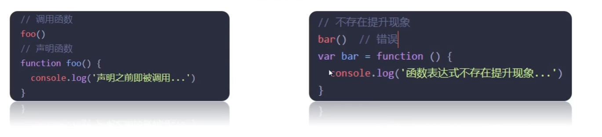

特点：

1. 函数提升能够使函数的声明调用更灵活
2. 函数表达式不存在提升的现象
3. 函数提升出现在相同作用域当中


### 箭头函数

**定义**：箭头函数简化了我们之前写的函数书写方式，他和之前函数表达式的创建函数行为是相同的。在任何使用函数表达式的地方，都可以使用箭头函数

```js
     //Es5
    let sum = function(a,b){
        return a + b;
    }
    // Es6
    let sum1 = (a,b) =>{
        return a + b;
    }
    console.log(sum(1,2));//3
    console.log(sum1(1,2));//3

```

#### 基本语法

```js
const fn = (x) => {
    console.log(x)
}
fn(1)
```

**单个参数可省略小括号**

```js
const fn = x => {
    console.log(x)
}
fn(1)
```

**单行代码可省略大括号**

```js
const fn = x => console.log(x)
fn(1)
```

**只有一行代码的时候，我们可以省略大括号**

```js
const fn = x => x + x
console.log(fn(1))
```

**单行返回对象要用括号包裹**

```js
// 错误：大括号被解释为代码块
const fn = x => { name: x, age: 20 } // 返回 undefined

// 正确：用括号包裹对象
const fn = x => ({ name: x, age: 20 })
console.log(fn('张三')) // {name: '张三', age: 20}
```


#### 箭头函数参数

**箭头函数没有`arguments`**

箭头函数也没有 `arguments` 变量。

当我们需要使用当前的 `this` 和 `arguments` 转发一个调用时，这对装饰器（decorators）来说非常有用。

例如，`defer(f, ms)` 获得了一个函数，并返回一个包装器，该包装器将调用延迟 `ms` 毫秒：

```js
js 体验AI代码助手 代码解读复制代码function defer(f, ms) {
  return function() {
    setTimeout(() => f.apply(this, arguments), ms)
  };
}

function sayHi(who) {
  alert('Hello, ' + who);
}

let sayHiDeferred = defer(sayHi, 2000);
sayHiDeferred("John"); // 2 秒后显示：Hello, John
```

不用箭头函数的话，可以用剩余函数去写：

```js
js 体验AI代码助手 代码解读复制代码function defer(f, ms) {
  return function(...args) {
    let ctx = this;
    setTimeout(function() {
      return f.apply(ctx, args);
    }, ms);
  };
}
```

在这里，我们必须创建额外的变量 `args` 和 `ctx`，以便 `setTimeout` 内部的函数可以获取它们。


#### 箭头函数没有 ' this ' 

定义：箭头函数没有`this`，如果访问`this`，则会从外部获取

使用它在对象内部进行迭代

```js
let group = {
  title: "Our Group",
  students: ["John", "Pete", "Alice"],

  showList() {
    this.students.forEach(
      student => alert(this.title + ': ' + student)
    );
  }
};

group.showList();

```

这里 `forEach` 中使用了箭头函数，所以其中的 `this.title` 其实和外部方法 `showList` 的完全一样。那就是：`group.title`。

如果我们使用正常的函数，则会出现错误：

```js
js 体验AI代码助手 代码解读复制代码let group = {
  title: "Our Group",
  students: ["John", "Pete", "Alice"],

  showList() {
    this.students.forEach(function(student) {
      // Error: Cannot read property 'title' of undefined
      alert(this.title + ': ' + student)
    });
  }
};

group.showList();
```

报错是因为 `forEach` 运行它里面的这个函数，但是这个函数的 `this` 为默认值 `this=undefined`，因此就出现了尝试访问 `undefined.title` 的情况。

但箭头函数就没事，因为它们没有 `this`。

> **不能对箭头函数进行 `new` 操作**
>
> 不具有 `this` 自然也就意味着另一个限制：箭头函数不能用作构造器（constructor）。不能用 `new` 调用它们。

> **箭头函数 VS bind**
>
> 箭头函数 `=>` 和使用 `.bind(this)` 调用的常规函数之间有细微的差别：
>
> - `.bind(this)` 创建了一个该函数的“绑定版本”。
> - 箭头函数 `=>` 没有创建任何绑定。箭头函数只是没有 `this`。`this` 的查找与常规变量的搜索方式完全相同：在外部词法环境中查找。


### 解构赋值

定义：可以将数组中的值或对象的属性取出，赋值给其他变量

#### 数组解构

定义： 数组解构是将**数组的单元值**快速批量**赋值**给**一系列变量**的简洁语法。

基本语法：

1. 赋值运算符 `=` 左侧的 `[]` 用于批量声明变量
2. **右侧数组的单元值**将被赋值给**左侧的变量**
3. 变量的顺序对应数组单元值的位置依次进行赋值操作

```html
<script>
    const arr = [100,60,80]
    const [max , min , arg] = arr
    console.log(max)
</script>
```


```js
// 交换两个变量
let a = 1;
let b = 2;   // 必须加分号
[b,a] = [a,b]
console.log(a,b)
```


变量多，单元值少，undefined

```js
const [a,b,c,d] = [1,2,3]
console.log(a)  // a
console.log(b)  // b
console.log(c)  // c
console.log(d)  // undefined
```


变量少，单元值多

```js
const [a,b] = [1,2,3]
console.log(a)  //1
console.log(b)  //2
```


剩余参数，变量少，单元值多

```js
const [a,b,...c] = [1,2,3]
console.log(a)  //1
console.log(b)  //2
console.log(c)  // [3,4]
```


防止undefined传递单元值的情况，可以设置默认值

```js
const [a = '手机', b = '华为'] = ['小米']
console.log(a) // 小米
console.log(b) // 华为
```


按需导入，忽略某些返回值

```js
const [a,b, ,d] = [1,2,3,4]
console.log(a)  // 1
console.log(b)  // 2
console.log(d)  // 4
```


二维数组

```js
// 二维数组
const arr = [1,2,[3,4]]
console.log(arr[0])   // 1
console.log(arr[1])   // 2
console.log(arr[2])   // [3,4]
console.log(arr[2][1])  //4
```


多维数组解构

```js
const [a,b,c] = [1,2,[3,4]]
console.log(a)  // 1
console.log(b)  // 2
console.log(c)  // [3,4]
```

```js
const [a,b,[c,d]] = [1,2,[3,4]]
console.log(a)  // 1
console.log(b)  // 2
console.log(c)  // 3
console.log(d)  // 4
```


补充：JavaScript 必须加分号的情况

1. 立即执行函数

```js
(function t() { })();
// 或者
;(function t() { })()
```

2. 数组解构

当数组开头，特别是前面有语句时，必须注意加分号：

```js
;[b, a] = [a, b]
```


#### 对象解构

定义：对象解构是将对象属性和方法快速批量赋值给一系列变量的简洁语法

基本语法：

1. 赋值运算符 `=` 左侧的 `{}` 用于批量声明变量，**右侧对象的属性值**将被赋值给**左侧的变量**
2. **对象属性的值**将被赋值给与**属性名相同的变量**
3. 注意解构的变量名不要和外面的变量名冲突，否则报错
4. 对象中找不到与变量名一致的属性时，变量值为 `undefined`

**对象解构的变量名 可以重新改名**

方法： 旧变量名：新变量名

```js
const{uname:username,age} = {uname:'pink老师',age:18}
```

**多级对象解构**

```js
const pig = {
    name:'佩奇',
    family:{
        mother:'猪妈妈',
        father:'猪爸爸',
        sister:'乔治'
    },
    age:6
}
// 多级对象解构
const {name,family:{mother,father,sister}} = pig
console.log(name)
console.log(mother)
console.log(father)
console.log(sister)
```


### forEach

定义：forEach () 方法用于调用数组的每个元素，并将元素传递给回调函数

使用场景： 遍历数组的每个元素；适合遍历数组对象

语法：

```js
被遍历的数组.forEach(function(当前数组元素，当前元素索引号){
    
})
```

```js
const arr = ['red','green','pink']
arr.forEach(function(item,index){
    console.log(item)
    console.log(index)
})
```

注意：forEach主要是遍历数组；参数当前数组元素必须要写的，索引号可选

 


### 作用域

**定义**：**限定名字**在程序中**有效和可用**的**代码范围**。

**作用**：提高程序逻辑的局部性，增强可靠性，减少名字冲突。

#### **全局作用域**：

定义：全局作用域中声明的变量，任何其他作用域都可以访问。

弊端：

> 1. 为 `window` 对象动态添加的属性默认也是全局的，**不推荐！**
> 2. 函数中未使用任何关键字（如 `let`、`const`、`var`）声明的变量会自动成为全局变量，**不推荐！！！**
> 3. 尽可能少地声明全局变量，防止全局变量被污染，影响程序稳定性与可维护性。

```js
<script>
  // 全局作用域
  // 全局作用域下声明了 num 变量
  const num = 10;

  function fn() {
    // 函数内部可以使用全局作用域的变量
    console.log(num); // 输出：10
  }

  // 此处仍是全局作用域
</script>
```

#### **局部作用域**：

###### 函数作用域

**定义**：在函数内部声明的变量只能在函数内部被访问，外部无法直接访问。且函数执行结束后局部变量会被销毁。

```js
<script>
function getSum() {
  // 函数内部是函数作用域，属于局部变量
  const num = 10
}
console.log(num) // 此处报错：函数外部不能使用局部作用域变量
</script>
```

**特点**：

> 1. 函数内部声明的变量，在函数外部无法被访问
> 2. 函数的参数也是函数内部的局部变量
> 3. 不同函数内部声明的变量无法互相访问
> 4. 函数执行完毕后，函数内部的变量实际被清空了


###### 块作用域

**定义**：块作用域（Block Scope）是指在**一对大括号** `{}` 所创建的**代码块**中**形成的作用域**。在块作用域中声明的变量或常量，只能在该**代码块**内部被访问，外部无法访问。

```js
for (let t = 1; t <= 6; t++) {
  // t 只能在该代码块中被访问
  console.log(t) // 正常
}
// 超出了 t 的作用域
console.log(t) // 报错
```

**特点**：

> 1. `let` 声明的变量会产生**块作用域**，`var` 不会产生块作用域
> 2. `const` 声明的常量也会产生块作用域
> 3. 不同代码块之间的变量无法互相访问
> 4. 推荐使用 `let` 或 `const` 声明变量


**变量的访问原则**

- 只要是代码，就至少有一个作用域。
- 写在函数内部的是局部作用域。
- 如果函数中还有函数，在这个作用域中又可以诞生一个作用域。
- 访问原则：在能够访问到的情况下先局部，局部没有再找全局。

> **特殊情况**：在函数内部，如果变量未声明直接赋值，会被视为全局变量（不推荐）。
>
> **例外情况**：函数内部的形参被视为局部变量

**作用域链**：采取就近原则的方式来查找变量最终的值


### 作用域链

**定义**：作用域链是由**当前执行环境**与**上层环境**（逐级向上）构成的层级结构，用于变量查找。作用域链本质是底层的变量查找机制

**规则**：（就近原则）

> 在函数被执行时，会优先查找当前函数作用域中查找变量
>
> 如果当前作用域查找不到则会依次逐级查找父级作用域指代全局作用域

**核心要点：**

- 作用域链是 JavaScript 实现变量查找的基础机制。
- 支持闭包、函数嵌套等高级特性。
- 遵循“由内向外”、“先近后远”的查找原则。


### 垃圾回收机制（GC）

**定义**：（不用的内存直接回收）js中内存的分配和回收都是自动完成的，内存在不适用的时候会被垃圾回收器自动回收

**内存的生命周期：**

1. **内存分配**：声明变量、函数、对象时，系统自动分配内存。
2. **内存使用**：读写变量、调用函数等操作。
3. **内存回收**：使用完毕后，由垃圾回收器自动释放不再使用的内存。

**说明**：

- 全局变量通常不会被回收（页面关闭才释放）。
- 局部变量不用了，一般会被自动回收。

⚠️ **内存泄漏**：程序分配的内存未释放或无法释放，导致内存占用持续增长。


#### 垃圾回收机制-算法说明

**堆栈空间分配区别：**

一般复杂数据类型由垃圾回收机制回收

1. **栈（操作系统）**
   - 由操作系统自动分配和释放。
   - 存放函数的参数值、局部变量等。
   - 基本数据类型（如 number、string、boolean）存储在栈中。
2. **堆（操作系统）**
   - 一般由程序员手动分配，若未释放，则由**垃圾回收机制回收。**
   - **复杂数据类型**（如对象、数组）存储在堆中。

**常见浏览器垃圾回收算法：**

引用计数法

标记清除法


##### **引用计数：**

定义：IE 使用的算法，判断对象是否“不再使用”：看是否有引用指向它。

规则如下：

1. 记录对象被引用的次数。
2. 每次被引用，计数 +1。
3. 引用减少，计数 -1。
4. 当引用次数为 0，释放内存。

✅ 简单说：**没被引用的对象 → 自动回收**。

**引用计数—弊端**

引用计数的致命问题：嵌套引用（循环引用）

```js
function fn() {
  let o1 = {};
  let o2 = {};
  o1.a = o2;      // o1 指向 o2
  o2.a = o1;      // o2 指向 o1
  return '引用计数无法回收';
}
fn();
```

原因：

1. 两个对象互相引用，彼此的引用次数永远不会为 0。

2. 引用计数算法无法判断它们是否“无用”，因此不会释放内存。

后果：引用计数法虽简单，但无法处理循环引用，是其主要缺陷。


##### 标记清除法

从根部扫描对象，能查找到的就是使用的，查找不到的就要回收

**定义**：将“不再使用的对象”定义为“**无法达到的对象**”。从根部（在 JS 中就是全局对象）出发，扫描内存中的对象。凡是能从根部到达的对象，都是**仍需使用**的。那些**无法从根部触及**的对象，被标记为不再使用，稍后进行回收。

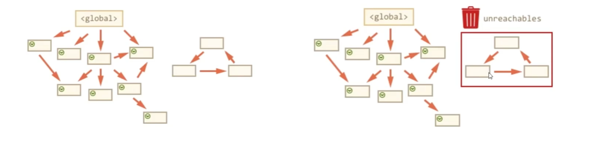

### 闭包

**定义**：**内层函数**和**外层函数的变量**一起构成了闭包

**基本格式**：

```js
// 里层函数 用到了 外层函数的变量才是闭包
function outer() {
  const a = 1;
  function f() {
    console.log(a);
  }
  f();
}
outer();

// 这个就没有闭包
function outer() {
  const a = 1;
  function f() {
    console.log(11);
  }
  f();
}
outer();
```

**作用**：封闭数据，提供操作，外部也可以访问函数内部的变量 

**闭包的作用**：

**实现共有变量**：在模块化开发中，闭包可以用来创建私有变量并暴露有限的公共接口，实现数据的封装和隔离。

**做缓存**：利用闭包可以存储计算结果，避免重复计算，提高程序效率。

**封装模块，防止全局变量污染**：通过闭包封装变量和函数，可以有效减少全局作用域的污染，保持代码的整洁和可维护性。

**弊端**：内存泄露

常见的闭包写法：外部可以访问使用函数内部的变量


**闭包应用：实现数据的私有化**

🎯 需求：

统计函数调用次数，每次调用 `count++`。

------

❌ 问题代码（不推荐）：（内存泄露）

```js
let count = 1; // 全局变量

function fn() {
  count++;
  console.log(`函数被调用${count}次`);
}

fn(); // 输出：函数被调用2次
fn(); // 输出：函数被调用3次
```

> ⚠️ 问题：`count` 是全局变量，容易被其他代码意外修改，导致数据不安全。（内存泄漏）

**什么是内存泄漏**？

**程序在运行过程中分配了内存，但未能正确释放，导致内存占用持续增加，最终影响性能甚至造成崩溃。**

------

✅ 改进方案（使用闭包实现私有数据）

```js
function fn() {
  let count = 1; // 局部变量，外部无法直接访问

  function fun() {
    count++;
    console.log(`函数被调用${count}次`);
  }

  return fun; // 返回内部函数
}

const result = fn(); // 获取返回的函数
result(); // 输出：函数被调用2次
result(); // 输出：函数被调用3次
```

------

✅ 优势：

- `count` 被封装在内部，**外部无法直接修改**。
- 实现了**数据私有化**，防止污染和误操作。
- 利用闭包特性，内部函数保留对外部变量的引用。


#### 变量提升

关键字：var

定义：把所有var声明的变量提升至**当前作用域**的最前面，**只提升声明，不提升赋值**

```js
var num;
console.log(num + '件');
num = 10;
console.log(num);
```

特点：

1. 变量在未声明即被访问时会报语法错误。
2. 变量在 `var` 声明之前被访问，其值为 `undefined`（变量提升）。
3. `let` / `const` 声明的变量不存在变量提升。
4. 变量提升只出现在相同作用域中。
5. 实际开发中推荐先声明再访问变量。


#### 匿名函数

##### **具名函数**：

- 声明时有名称（如 `function fn() {}`）。
- 可通过名称调用（如 `fn()`）。
- 具有**函数提升**（可在声明前调用）。

##### **匿名函数**：

- 声明时没有名称（如 `function() {}`）。
- 无法直接调用，必须**赋值给变量**或**作为参数传递**，或**立即执行**。

> ✅ **定义**：没有函数名的函数，也称为“无名函数”。

> ✅ **使用方式**：
>
> 1. **函数表达式**：赋值给变量使用。
> 2. **回调函数**：作为参数传递给其他函数（如 `setTimeout(fn, 1000)`）。
> 3. **立即执行函数（IIFE）**：定义后立即运行。

------

##### 写法

###### 函数表达式的写法

**函数表达式**：将匿名函数赋值给一个变量。调用时使用**变量名**。

```
let fn = function(a, b) {
    console.log('求和：', a + b);
};
```

**调用**：

```
fn(2, 3);  // 输出：求和：5
```

> ⚠️ **重要特点**：
>
> - **不会函数提升**：必须先声明，后调用。
>
> - 错误示例：
>
>   ```
>   fn();  // 报错：Cannot access 'fn' before initialization
>   let fn = function() { console.log('hello'); };
>   ```

> ✅ **参数使用**：支持形参、实参、默认值、剩余参数等，与具名函数完全相同。

------

✅ **补充说明（可选扩展）**

你还可以加一句：

> 💡 **小知识**：ES6 引入了**箭头函数** `() => {}`，它本质上也是一种匿名函数：
>
> ```
> let greet = () => console.log('Hello');
> greet();
> ```

------

✅ **总结**

你的原始笔记**完全正确**，只是可以稍作润色，使其更严谨、更完整。特别是强调：

- 匿名函数**不能提升**（与具名函数的重要区别）
- 函数表达式必须**先声明后使用**
- 匿名函数的三大用途：**赋值、传参、立即执行**


#### 立即执行函数

##### ✅ 定义

一个函数在**定义完成后立即执行**，不需要手动调用。

```js
(function() {
    console.log('我一出生就运行了！');
})();
```

------

##### ✅ 作用 / 优点

**用来创建私有作用域，防止变量污染全局**

1. **创建独立作用域**，避免变量泄露到全局，防止命名冲突。
2. **封装私有变量**，外部无法访问内部变量。
3. **避免污染全局命名空间**，尤其在早期 JS 模块化不成熟时非常重要。

```js
(function() {
    let secret = "这是私有的";
    // 外部无法访问 secret
})();
// console.log(secret); // 报错：secret is not defined
```

----

##### ✅注意事项

- **必须用分号 `;` 结尾**，否则多个 IIFE 连写可能出错：

  ```js
  (function(){})()
  (function(){})() // ❌ 报错：尝试把第二个函数当参数传给第一个
  ```

  ✅ 正确写法：

  ```js
  (function(){})();
  (function(){})();
  ```

- **不要再次调用**，因为它已经执行过了。

-------

##### ✅两种标准写法

###### 写法一：`(function(){})()` —— 更常见

```js
(function(x, y) {
    console.log(x + y);
})(1, 2); // 输出：3
```

###### 写法二：`(function(){}())` —— 也可用

```js
(function(x, y) {
    console.log(x + y);
}(1, 4)); // 输出：5
```

> 💡 两种写法功能完全相同，**第一种更推荐**，因为更清晰地表明“先定义，后调用”。

----

##### ✅补充：箭头函数也可以立即执行（ES6+）

```js
(() => {
    console.log('箭头函数版 IIFE');
})();

((name) => {
    console.log(`Hello, ${name}`);
})("小明");
```


> 案例：计算时分秒

- **小时**：`h = parseInt(总秒数 / 60 / 60 % 24)`
- **分钟**：`m = parseInt(总秒数 / 60 % 60)`
- **秒数**：`s = parseInt(总秒数 % 60)`

```js
    //计时器
    // 用户输入
    let second = +prompt('请输入秒数：')
    function getTime(t) {
        // - ** 小时 **：`h = parseInt(总秒数 / 60 / 60 % 24)`
        // - ** 分钟 **：`m = parseInt(总秒数 / 60 % 60)`
        // - ** 秒数 **：`s = parseInt(总秒数 % 60)`
        h = parseInt(t / 60 / 60 % 24)
        m = parseInt(t / 60 % 60)
        s = parseInt(t % 60)
        h = h< 10 ? '0'+h : h
        m = m < 10 ? '0' + m : m
        s = s < 10 ? '0' + s :s 
        return `转换完毕之后是${h}小时${m}分${s}秒`
    }
    let str = getTime(second)
    document.write(str)
```


#### 逻辑中断（**逻辑运算中的短路**）

- **短路**：只存在于 `&&` 和 `||` 中，当满足一定条件会让右边代码不执行。

| 符号 | 中断条件                            |
| ---- | ----------------------------------- |
| `&&` | 左边为 `false` 就中断，后面不再执行 |
| `||` | 左边为true就中断，后面不再执行      |

- **原因**：通过左边能得到整个式子的结果，因此没必要再判断右边。
- **运算结果**：无论 `&&` 还是 `||`，运算结果都是最后被执行的表达式值，一般用在变量赋值。

```js
        function fn(x,y){
            x = x || 0
            y = y || 0
            console.log(x+y)
        }
        fn(1,3)
        fn()
```

```js
        let age1 = 19
        console.log(true || age++)
        console.log(age1)
```

```js
        let age2 = 18
        console.log(11 && 22)     //都是真，这返回最后一个真值
        console.log(11 || 22)     //输出第一个真值 
```


### 构造函数

**定义**：把对象中公共的属性抽取出来，封装起来放到一个函数里，这个就是构造函数。一种特殊的函数，用来初始化对象。可以快速创建多个类似的对象

**作用**：可以快速创建多个类似的对象

**规定**：函数命名以大写字母开头；他们**只能**由 "**new**" 操作符来执行

**创建构造函数**：需要使用new关键字来调用构造函数，并将其赋值给一个变量即可

```js
function Pig(uname,age){
    this.uname = uname
    this.age = age
}
// console.log(new Pig('nihao',18))
const obj = new Pig('nihao',18)
console.log(obj)   // {uname: 'nihao', age: 18}
```

注意：

> 1. 使用**new关键字**调用函数的行为被称为**实例化**（变成了一个实际的对象）
>
> 2. 实例化构造函数时没有参数时可以省略（）
> 3. 构造函数内部无需写return，返回值即是新创造的对象
> 4. 构造函数内部的return返回的值无效，所以不要写return
> 5. new Object()  new Date() 也是实例化构造函数


#### 实例化执行过程

1. 创建新的空对象
2. 构造函数`this`指向新对象
3. 执行构造函数代码，修改`this`，添加新的属性
4. 返回新对象


#### 实例对象

定义：通过构造函数创建的对象称为实例对象

##### 实例成员

定义：**实例对象**中的**属性和方法**称为实例成员（实例属性和实例方法）

特点：

1. 为构造函数传入参数，创建结构相同但值不同的对象
2. 构造函数创建的实例对象彼此独立**互不影响**

```js
function Pig(name) {
    this.name = name
}

const peiqi = new Pig('佩奇')
const qiaozhi = new Pig('乔治')
peiqi.name = '小猪佩奇' // 实例属性
peiqi.sayHi = () => { // 实例方法
    console.log('nihao ')
}

console.log(peiqi)
console.log(qiaozhi)
console.log(peiqi === qiaozhi)
```


##### 静态成员

定义：**构造函数**的**属性和方法**被称为静态成员（静态属性和静态方法）

特点：

1. 静态成员只能构造函数来访问
2. 静态方法中的`this`指向构造函数。比如：`Date.now()`,`Math.PI`,`Math.random()`

```js
// 构造函数
function Person(name, age) {
    // 省略实例成员
}

// 静态属性
Person.eyes = 2
Person.arms = 2

// 静态方法
Person.walk = function () {
    console.log('^_^人都会走路...')
    // this 指向 Person
    console.log(this.eyes)
}
```


### 内置构造函数

**定义**：内置构造函数是编程语言在内部定义的特殊函数，它可以创建和初始化对象

**引用类型**：Object , Array , RegExp , Date等

**包装类型**：String , Number , Boolean等

**在 JavaScript 中最主要的数据类型有 6 种：**

基本数据类型：字符串、数值、布尔、undefined、null

引用类型：对象

**但是，我们会发现有些特殊情况：**

```js
// 普通字符串
const str = 'andy'
console.log(str.length) // 4
```

其实字符串、数值、布尔等基本类型也都有专门的构造函数，这些我们称为**包装类型**。
 JS 中几乎所有的数据都可以基于构造函数创建。


#### Object 

定义：`Object` 是 JavaScript 中的一个内置构造函数，用于创建**普通对象**。可以通过 `new Object()` 的方式来实例化一个对象。

```js
// 通过构造函数创建普通对象
const user = new Object({name:'小明',age:15})
```

######  静态方法

###### **`Object.keys(obj)`**

**作用**：获取对象中所有**可枚举属性的键名（key）**，返回一个字符串数组。

📌 语法：

```
Object.keys(obj)
```

📌 示例：

```js
const user = { name: '小明', age: 18, city: '北京' };
console.log(Object.keys(user)); 
// 输出: ['name', 'age', 'city']
```

- 只返回对象**自身的**、**可枚举**的属性。
- 不包括原型链上的属性。
- 返回的是一个**数组**，便于遍历或处理。

> ⚠️ 注意：`Symbol` 类型的键不会被包含。


###### **`Object.values(obj)`**

**作用**：获取对象中所有**可枚举属性的值（value）**，返回一个数组。

📌 语法：

```
Object.values(obj)
```

📌 示例：

```js
const user = { name: '小明', age: 18, city: '北京' };
console.log(Object.values(user)); 
// 输出: ['小明', 18, '北京']
```

- 与 `Object.keys()` 对应，返回的是值而不是键。
- 顺序与 `Object.keys()` 一致（按属性插入顺序）。

> ✅ 常用于快速提取所有字段值进行处理。


###### **`Object.assign() `**

**作用：** `Object.assign` 是一个静态方法，常用于**对象之间的拷贝**操作，可以将源对象的所有可枚举属性复制到目标对象上。

**示例：**

```js
const o = { name: 'wjm', age: 18 };

// 创建一个空对象，然后使用 Object.assign 进行拷贝
const oo = {};
Object.assign(oo, o);
console.log(oo); // { name: 'wjm', age: 18 }

// 向对象 o 添加新属性 gender
Object.assign(o, { gender: 'male' });
console.log(o); // { name: 'wjm', age: 18, gender: 'male' }
```


#### Array

**定义**：`Array` 是 JavaScript 内置的构造函数，用于**创建数组**。

```js
const arr = new Array(3, 5)
console.log(arr) // [3, 5]
```

> 创建数组建议使用**字面量语法**（如 `[3, 5]`），**不要使用 `Array` 构造函数**创建。

###### 数组常用方法对比表

| 方法      | 作用     | 说明                                                         |
| --------- | -------- | ------------------------------------------------------------ |
| `forEach` | 遍历数组 | 不返回新数组，经常用于查找或遍历数组元素                     |
| `filter`  | 过滤数组 | **返回新数组**，返回的是筛选满足条件的数组元素               |
| `map`     | 迭代数组 | **返回新数组**，返回的是处理之后的数组元素；想要使用返回的新数组 |
| `reduce`  | 累计器   | 返回累计处理的结果，经常用于求和等                           |

**数组常见方法**

| 序号 | 方法名      | 说明                                                         |
| ---- | ----------- | ------------------------------------------------------------ |
| 5.   | `join`      | 实例方法：将数组元素拼接为字符串，返回字符串（重点）         |
| 6.   | `find`      | 实例方法：查找元素，返回符合测试条件的第一个数组元素值；如果没有符合条件的则返回 `undefined`（重点） |
| 7.   | `every`     | 实例方法：检测数组所有元素是否都符合指定条件；如果**所有元素**都通过检测则返回 `true`，否则返回 `false`（重点） |
| 8.   | `some`      | 实例方法：检测数组中是否有元素满足指定条件；**如果数组中有元素满足条件**则返回 `true`，否则返回 `false` |
| 9.   | `concat`    | 实例方法：合并两个数组，返回生成的新数组                     |
| 10.  | `sort`      | 实例方法：对原数组单元值进行排序（会修改原数组）             |
| 11.  | `splice`    | 实例方法：删除或替换原数组中的元素（会修改原数组）           |
| 12.  | `reverse`   | 实例方法：反转数组（会修改原数组）                           |
| 13.  | `findIndex` | 实例方法：查找元素的索引值，返回第一个匹配元素的索引；如果没有匹配则返回 `-1` |

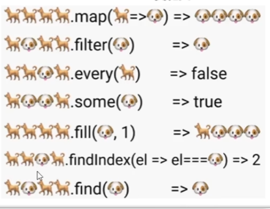


```js
const numbers = [1, 2, 3, 4, 5];

// forEach：遍历，无返回值
numbers.forEach(num => console.log(num)); // 输出每个数字

// filter：过滤出偶数
const evens = numbers.filter(num => num % 2 === 0); // [2, 4]

// map：将每个数乘以 2
const doubled = numbers.map(num => num * 2); // [2, 4, 6, 8, 10]

// reduce：求和
const sum = numbers.reduce((acc, num) => acc + num, 0); // 15
```

###### Array.reduce()

**作用**：`reduce` 返回累计处理的结果，经常用于求和、累积计算等场景。

**reduce执行过程**

1. **如果没有起始值**，则“上一次值”以数组的第一个元素的值作为初始值。
2. **每一次循环**，把**返回值**作为下一次循环的“上一次值”。
3. **如果有起始值**，则该起始值作为第一次循环的“上一次值”。

```js
        // 数组reduce方法
        // arr.reduce(function(上一个值，当前值){}，初始值)
        const arr = [1,2,3]
        // 没有初始值
        const title = arr.reduce(function(prev,current){
            return prev+current
        })
        console.log(title)    // 6

        // 有初始值
        const total = arr.reduce(function(prev,current){
            return prev+current
        },10)
        console.log(total)   //16

        // 箭头函数
        const tatal = arr.reduce((prev,current) => prev+current,10)
        console.log(tatal)  // 16

```

###### Array.from()

伪数组转换为真数组

```html
<body>
    <ul>
        <li>1</li>
        <li>2</li>
        <li>3</li>
    </ul>

    <script>
        const lis = document.querySelector('li')
        const liss = Array.from('li')
        console.log(liss)
    </script>
</body>
```


#### string

| 序号 | 方法/属性                                | 说明                                                         |
| ---- | ---------------------------------------- | ------------------------------------------------------------ |
| 1.   | `length`                                 | 实例属性：用于获取字符串的长度（重点）                       |
| 2.   | `split('分隔符')`                        | 实例方法：将字符串按指定分隔符拆分为数组（重点）             |
| 3.   | `substring(开始索引[, 结束索引])`        | 实例方法：用于截取字符串（不包含结束索引），从指定位置开始到结束位置前一个字符（重点） |
| 4.   | `startsWith(检测字符串[, 检测位置索引])` | 实例方法：检测字符串是否以某字符开头，返回 `true` 或 `false`（重点） |
| 5.   | `includes(搜索字符串[, 检测位置索引])`   | 实例方法：判断一个字符串是否包含在另一个字符串中，返回 `true` 或 `false`（重点） |
| 6.   | `toUpperCase()`                          | 实例方法：将字符串中的字母转换为大写                         |
| 7.   | `toLowerCase()`                          | 实例方法：将字符串中的字母转换为小写                         |
| 8.   | `indexOf()`                              | 实例方法：检测字符串是否包含某字符，返回首次出现的位置索引；未找到返回 `-1` |
| 9.   | `endsWith()`                             | 实例方法：检测字符串是否以某字符结尾，返回 `true` 或 `false` |
| 10.  | `replace()`                              | 实例方法：用于替换字符串中的内容，支持正则表达式匹配         |
| 11.  | `match()`                                | 实例方法：用于查找字符串，支持正则表达式匹配                 |

```js
const str = "Hello World";

// 1. length
console.log(str.length); // 11

// 2. split
// split 把字符串转换为数组，和 join 相反
console.log(str.split(" ")); // ['Hello', 'World']
console.log(str.split(""));  // ['H','e','l','l','o',' ','W','o','r','l','d']

// 3. substring
console.log(str.substring(0, 5)); // 'Hello'（从索引0到4）
console.log(str.substring(6));    // 'World'（从索引6到最后）

// 4. startsWith
console.log(str.startsWith("He")); // true
console.log(str.startsWith("Hi")); // false

// 5. includes
console.log(str.includes("ll"));   // true
console.log(str.includes("xyz"));  // false

// 6. toUpperCase / toLowerCase
console.log(str.toUpperCase()); // 'HELLO WORLD'
console.log(str.toLowerCase()); // 'hello world'

// 7. indexOf
console.log(str.indexOf("l"));    // 2（第一个'l'的位置）
console.log(str.indexOf("xyz"));  // -1（未找到）

// 8. endsWith
console.log(str.endsWith("ld"));  // true
console.log(str.endsWith("abc")); // false

// 9. replace
console.log(str.replace("World", "JavaScript")); // 'Hello JavaScript'
console.log(str.replace(/l/g, "X"));             // 'HeXXo WorXd'（使用正则替换所有'l'）

// 10. match
console.log(str.match(/l/g)); // ['l', 'l', 'l']（匹配所有'l'）
```

##### toString

**定义**：`toString` 是 JavaScript 中几乎所有对象都继承的一个方法，它用于将**一个值**转换为**字符串**表示

###### `Object.prototype.toString`

作用：返回一个表示该对象的字符串，格式为 `[object Type]`。

```js
Object.prototype.toString.call({})        // "[object Object]"
Object.prototype.toString.call([])        // "[object Array]"
Object.prototype.toString.call(new Date)  // "[object Date]"
Object.prototype.toString.call(/abc/)     // "[object RegExp]"
Object.prototype.toString.call(null)      // "[object Null]"
Object.prototype.toString.call(undefined) // "[object Undefined]"
```

说明：这个方法非常有用，常被用来**精确判断数据类型**，因为它不会被对象自身的 `toString` 方法覆盖（除非特意重写）。

**对象的`toString()`**

1. 如果`toString`接收的值是`undefined`，则返回“[object Undefined]"
2. 如果`toString`接收的值是`null`，则返回“[object Null]"

```js
let a={}
let b=[]
let c='hello'

console.log(Object.prototype.toString(a));//[object Object]
console.log(Object.prototype.toString.call(b)); //[object Array]
console.log(Object.prototype.toString.call(c));//[object String]

```

**为何`b`和`c`使用`Object.prototype.toString()`时为何同时使用了`call()`？**

直接调用数组和字符串实例的`toString`方法可能会受到对象原型上`toString`方法被覆盖的影响。而使用`Object.prototype.toString.call()`确保了调用的是最原始、未被修改的`toString`方法，提高了代码的稳定性和可靠性。

**数组的`toString()`**

```js
let arr=[1,2,3];
console.log(arr.toString());//"1,2,3"
```

数组的`toString()`方法是一个非常实用且内置的功能，它能够将数组中的所有元素转换成字符串形式，并用逗号`,`连接这些字符串，最后返回一个由这些字符串组成的单个字符串。这个过程简单直观，非常适合于需要将数组内容以易于阅读的文本格式展示的场景。

**其它的`toString()`**

```js
js 体验AI代码助手 代码解读复制代码//Number
let num = 123;
console.log(num.toString()); // 输出 "123"

//String
let str = "Hello";
console.log(str.toString()); // 输出 "Hello"

//Boolean
console.log(true.toString()); // 输出 "true"
console.log(false.toString()); // 输出 "false"

//函数function
let func = function() { return "Hello"; };
console.log(func.toString()); // 输出 "function (){ return "Hello"; }"
```

直接将值修改成字符串字面量


###### `Function.prototype.toString`

作用：这是**函数对象**特有的toString方法，返回一个表示该函数源代码的字符串

```js
function hello() {
  console.log("Hello");
}

hello.toString();
// 输出：
// "function hello() {
//   console.log("Hello");
// }"
```

说明：对于**内置构造函数**，这个方法会返回一个标准的、代表该函数的字符串，通常是 `[native code]`，表示它是用底层语言（如 C++）实现的，而不是 JavaScript 源码。

```js
Array.toString();
// 输出： "function Array() { [native code] }"

Number.toString();
// 输出： "function Number() { [native code] }"

Object.toString();
// 输出： "function Object() { [native code] }"
```


#### Number

定义：Number 是内置的构造函数，用于**创建数值** 常用方法

常用方法：

`toFixed() `设置保留小数位的长度

```js
// 数值类型
const price = 12.345
// 保留两位小数 四舍五入
console.log(price.toFixed(2)) // 12.35
```

 


### 处理`this`

没有明确指示指向`window`，严格模式下指向`undefined`

#### `this`指向

##### 普通函数

```js
// 普通函数
function sayHi() {
    console.log(this)
}

// 函数表达式
const sayHello = function () {
    console.log(this)
}
```

**调用方式与 this 值：**

- `sayHi()` → `this` 指向 `window`（非严格模式）
- `window.sayHi()` → `this` 指向 `window`

> **说明：** 当没有明确调用者时，普通函数在非严格模式下 `this` 指向全局对象（浏览器中为 `window`）。


###### 对象方法中的this

```js
// 普通对象
const user = {
    name: '小明',
    walk: function () {
        console.log(this)
    }
}

// 动态为 user 添加方法
user.sayHi = sayHi
user.sayHello = sayHello

// 调用方法
user.sayHi()
user.sayHello()
```

**结果：**

- `user.sayHi()` → `this` 指向 `user` 对象
- `user.sayHello()` → `this` 指向 `user` 对象

> **说明：** 当函数作为对象的方法被调用时，`this` 指向该对象。


###### 严格模式下的this

```js
<script>
'use strict'
function fn() {
    console.log(this) // undefined
}
fn()
</script>
```

**结果：**

- `fn()` → `this` 为 `undefined`

> **说明：** 在严格模式下，如果函数没有明确的调用者，`this` 不再指向 `window`，而是为 `undefined`。


1. **箭头函数会默认帮我们绑定外层 `this` 的值**
    → 所以在箭头函数中，`this` 的值和外层的 `this` 是一样的。
2. **箭头函数中的 `this` 引用的是最近作用域中的 `this`**
    → 它不会创建自己的 `this`，而是继承外部上下文的 `this`。
3. **向外层作用域中，一层一层查找 `this`，直到有 `this` 的定义**
    → 沿着作用域链向上查找，找到最近的 `this` 绑定。


##### 箭头函数

✅ **1. 箭头函数没有自己的 `this`**

- 它**不会创建独立的执行上下文**。
- 因此，**`this` 不由调用方式决定**（不像普通函数）。

------

✅ **2. `this` 继承自外层作用域（词法作用域）**

- 箭头函数中的 `this` 是**定义时所在作用域的 `this`**，而不是调用时的。
- 会**沿作用域链向上查找**，直到找到最近一个有 `this` 绑定的上下文。

------

✅ **3. 不受以下操作影响**

- 无法通过 `call()`、`apply()`、`bind()` 改变箭头函数的 `this`。
- 即使作为对象方法、事件回调或构造函数使用，`this` 依然保持定义时的值。

------

⚠️ **常见陷阱（不推荐使用箭头函数的场景）**

| 场景                        | 问题                                                 |
| --------------------------- | ---------------------------------------------------- |
| **对象方法**                | `this` 不指向对象本身，而是外层作用域（如 `window`） |
| **DOM 事件回调**            | `this` 指向 `window`，而非触发事件的元素             |
| **原型方法（`prototype`）** | `this` 无法绑定到实例，导致逻辑错误                  |
| **构造函数**                | 箭头函数不能作为构造函数（会报错）                   |

------

 **推荐使用场景**

- 数组方法中的回调（如 `map`、`filter`、`forEach`），需保留外层 `this`
- 定时器、Promise 回调等需要稳定 `this` 上下文的场合

```js
// DOM 节点
const btn = document.querySelector('.btn')

// 箭头函数：此时 this 指向 window
btn.addEventListener('click', () => {
    console.log(this) // 输出: window
})

// 普通函数：此时 this 指向 DOM 对象（即 btn）
btn.addEventListener('click', function () {
    console.log(this) // 输出: <button class="btn">...</button>
})
```


#### 改变this

##### `call()`了解

使用call方法调用函数，同时指定调用函数中this的值

`fun.call(thisArg,arg1,arg2,...)`

> thisAry：在fun函数运行时指定的this值
>
> arg1 , arg2 : 传递的其他参数
>
> 返回值就是函数的返回值，因为他就是调用函数

```js
<script>
const obj = {
    uname: 'pink'
}

function fn(x, y) {
    console.log(this) // window
    console.log(x + y)
}

// 1. 调用函数
// 2. 改变 this 指向
fn.call(obj, 1, 2)
</script>
```


##### `apply()`

使用apply方法调用函数，并指定`this`和参数（以数组形式），特别适用于处理数组参数的场景

`fun.apply(thisArg, [argsArray])`

1. **`thisArg`**
   - 在 `fun` 函数运行时指定的 `this` 值。
   - 即：调用函数时，`this` 指向的对象。
2. **`argsArray`**
   - 传递给函数的参数，**必须是一个数组**（或类数组）。
   - 如果没有参数，可以传 `null` 或省略。
3. **返回值**
   - 返回的是被调用函数的返回值。
   - 因为 `apply` 本质是调用函数，所以返回结果与直接调用函数一致。

```js
    <script>
        const obj = {
            name:'nihao'
        }
        function fn(x,y){
            console.log(this)
            console.log(x+y)
        }
        fn.apply(obj,[1,2])
        // 返回值 本身就是再调用函数，多以返回值就是函数的返回值

        
        // 求数组最大值
        const arr = [100,22,85]
        const max = Math.max.apply(Math,arr)   // 100 
        console.log(max)
        console.log(Math.max(...arr))
    </script>

```


##### `bind()`

`bind()`方法不会调用函数，但是能改变函数内部`this`指向

`fun.bind(thisArg,arg1,arg2,...)`

1. **`thisArg`**
   - 在 `fun` 函数运行时指定的 `this` 值。
   - 即：调用函数时，`this` 指向的对象。
2. **`arg1, arg2, ...`**
   - 传递给函数的预设参数（可选）。
   - 这些参数会被“绑定”到新函数中，在调用时自动传入。

 **返回值**：

- 返回一个**由指定 `this` 值和初始参数改造后的原函数拷贝（新函数）**。
- 这个新函数在调用时会使用绑定的 `this` 和参数。

**使用场景**：

当我们**只想改变 `this` 指向，但不立即调用函数**时，可以使用 `bind`。

```js
document.querySelector('button').addEventListener('click', function () {
    // 禁用按钮
    this.disabled = true;

    // 使用 setTimeout 延迟 2 秒后启用按钮
    window.setTimeout(function () {
        // 在这个普通函数里面，我们要将 this 由原来的 window 改为 btn
        this.disabled = false;
    }.bind(this), 2000);
});
```

1. **`this` 的问题**
   - 外层事件回调函数中的 `this` 指向按钮元素（DOM 对象）。
   - 但 `setTimeout` 中的回调是普通函数，其 `this` 默认指向 `window`，导致无法正确操作按钮。
2. **使用 `.bind(this)` 解决**
   - `.bind(this)` 将 `setTimeout` 回调函数中的 `this` 绑定到外层的 `this`（即按钮元素）。
   - 这样在定时器执行时，`this.disabled = false` 能正确作用于按钮。
3. **效果**
   - 点击按钮 → 立即禁用（`disabled = true`）
   - 2 秒后 → 自动启用（`disabled = false`）


#### **`call`、`apply` 和 `bind` 的对比总结**

------

##### ✅ **相同点：**

- 都可以**改变函数内部的 `this` 指向**。

------

##### 🔍 **区别点：**

1. **`call` 和 `apply` 会调用函数，并且改变函数内部 `this` 指向。**
   - 执行函数并立即运行。
2. **`call` 和 `apply` 传递参数的方式不同：**
   - `call`：参数以 **逗号分隔的形式** 传递（如 `arg1, arg2, ...`）。
   - `apply`：参数必须以 **数组形式** 传递（如 `[arg1, arg2, ...]`）。
3. **`bind` 不会调用函数，但可以改变函数内部 `this` 指向。**
   - 返回一个**绑定好 `this` 和参数的新函数**，需手动调用。

------

##### 🎯 **主要应用场景：**

- **`call`**
   → 调用函数并传递参数，适用于需要立即执行且参数为独立值的场景。

- **`apply`**
   → 经常与数组配合使用，例如借助 `Math.max()` 或 `Math.min()` 求数组的最大/最小值：

  ```js
  const nums = [1, 5, 3, 9];
  Math.max.apply(null, nums); // 等价于 Math.max(1, 5, 3, 9)
  ```

- **`bind`**
   → 不调用函数，但希望提前绑定 `this` 上下文。
   → 常用于：

  - 改变定时器内部的 `this` 指向
  - 事件处理中保持上下文
  - 创建“预设”函数对象


### 面向对象编程（oop）

定义：面向对象是把事务分解成为一个个对象，然后由对象之间分工与合作

说明：在面向对象程序开发思想中，每一个对象都是功能中心，具有明确分工 

功能：面向对象是以对象功能来划分问题，而不是步骤

面向对象的特性：封装性，继承性，多态性

 

#### **面向过程编程**

**优点：**

性能比面向对象高

适合与硬件联系紧密的系统，例如单片机就采用面向过程编程

**缺点：**

不如面向对象易维护、易复用、易扩展

------

#### **面向对象编程**

**优点：**

易维护、易复用、易扩展

具有封装、继承、多态等特性

可设计出低耦合的系统，使系统更加灵活、易于维护

**缺点：**

性能比面向过程低

| 特性         | 面向过程编程                     | 面向对象编程               |
| ------------ | -------------------------------- | -------------------------- |
| **性能**     | 高                               | 相对较低                   |
| **适用场景** | 硬件相关、嵌入式系统（如单片机） | 复杂应用、大型软件系统     |
| **可维护性** | 差                               | 好（封装、继承、多态支持） |
| **复用性**   | 差                               | 好                         |
| **扩展性**   | 差                               | 好                         |

> JS实现面向对象需要借助**构造函数**来实现
>
> 构造函数存在浪费内存的问题


### 原型

#### 原型

公共的属性写到构造函数里；公共的方法写到原型对象身上

**定义**：是一个对象，将prototyoe称为**原型对象**

**作用**：共享方法；可以把那些不变的方法，直接定义在prototype对象上

构造函数和原型里面的this指向：实例化的对象

```js
let that;
function Person(name) {
    this.name = name;
    that = this;
}
const o = new Person();
console.log(that === o); // true
```

```js
let that;
function Person(name) {
    this.name = name;
}
Person.prototype.sing = function () {
    that = this;
}
const o = new Person();
o.sing();
console.log(that === o); // true
```


案例：给数组方法，求最大值，最小值，求和

```js
// 最大值
const arr = [1, 2, 3]
Array.prototype.max = function (arr) {
    return Math.max(...this)
    // 原型函数里面的this指向 实例对象arr
}
console.log(arr.max())

// 最小值
Array.prototype.min = function () {
    return Math.min(...this)
}
console.log(arr.min())

// 求和
Array.prototype.sum = function () {
    return this.reduce((prev, item) => prev + item, 0)
}
console.log([1, 2, 3].sum())
```


#### constructor属性

作用：该属性指向该对象的构造函数。

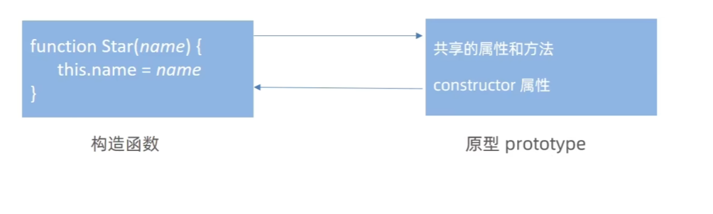

```js
function Star(){
}
const ni = new Star()
console.log(Star.prototype.constructor === Star)   // true
```

当为构造函数的原型对象（`prototype`）添加多个方法时，**推荐使用对象字面量形式赋值**，例如：

```js
Person.prototype = {
    method1: function() {},
    method2: function() {}
};
```

但这样会带来一个问题：
 👉 **原来的 `constructor` 属性会被覆盖**，导致 `Person.prototype.constructor` 不再指向 `Person` 构造函数，而是指向 `Object`。

------

🛠️ **解决方案**：

在重新赋值的原型对象中，**手动添加一个 `constructor` 属性**，使其指向原来的构造函数：

```js
Person.prototype = {
    constructor: Person, // 修复 constructor 指向
    method1: function() {},
    method2: function() {}
};
```

------

🔍 为什么重要？

- `constructor` 是用于识别对象是哪个构造函数创建的。
- 如果不修复，可能会导致类型判断或继承链出错。
- 特别是在使用 `instanceof` 或需要访问构造函数时，`constructor` 的正确性很重要。

---

案例：

```js
function Star(){
}
const ni = new Star()
console.log(Star.prototype.constructor === Star)   // true
console.log(Star.prototype)
Star.prototype = {
// 从新只会创造这个原型对象的构造函数
    constructor:Star,
    sing:function(){
        console.log('唱歌')
    },
    dance:function(){
        console.log('跳舞')
    }
}
console.log(Star.prototype)

```


#### 对象原型

**定义**：对象中都会有一个属性`_proto_`指向构造函数的`prototype`原型对象，之所以我们对象可以使用构造函数`prototype`原型对象的属性和方法，就是因为对象有对象原型的存在

**作用**：每一个对象都会有一个对象原型`_proto_`，对象原型指向的是该构造函数的原型对象`prototype`

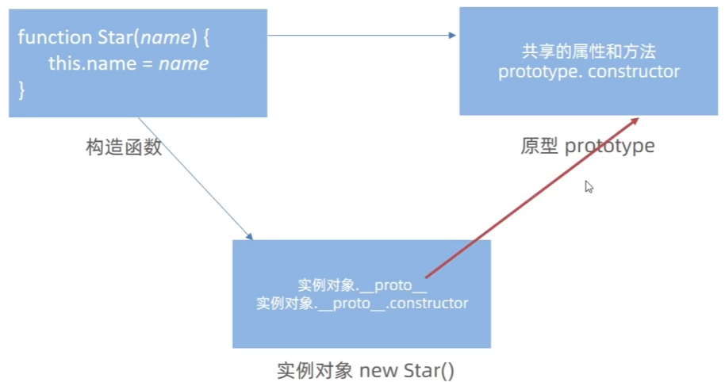


总结：

1. **`__proto__` 是非标准属性**
   - 它是浏览器实现中的一个“非标准”属性（虽然广泛支持），用于访问对象的原型。
   - 标准写法是通过 `Object.getPrototypeOf(obj)` 来获取原型。
2. **`[[Prototype]]` 与 `__proto__` 意义相同**
   - `[[Prototype]]` 是 JavaScript 引擎内部使用的、不可直接访问的机制。
   - `__proto__` 是它的**可访问表现形式**，两者都指向对象的原型对象。
3. **作用：指向实例对象的原型**
   - 每个对象都有一个 `__proto__`，它指向其构造函数的 `prototype` 对象。
   - 例如：`new Person()` 创建的对象，其 `__proto__` 指向 `Person.prototype`。
4. **`__proto__` 的原型中也有 `constructor` 属性**
   - 即：`obj.__proto__.constructor` 通常指向创建该对象的构造函数。
   - 例如：`p.__proto__.constructor === Person`，说明 `p` 是由 `Person` 构造函数创建的。

```js
function Star() { }

const ldh = new Star();

// 对象原型 __proto__ 指向构造函数的原型对象
console.log(ldh.__proto__);

// console.log(ldh.__proto__ === Star.prototype)

// 对象原型里面有 constructor 指向构造函数 Star
console.log(ldh.__proto__.constructor);
```


**原型对象、对象原型的区别 / 关系**

| 名称     | 对应属性                                          | 是什么？                                                     |
| -------- | ------------------------------------------------- | ------------------------------------------------------------ |
| 原型对象 | `构造函数.prototype`                              | 是一个普通的对象，由构造函数提供，用来存放所有实例共享的属性和方法。 |
| 对象原型 | `实例.__proto__` 或 `Object.getPrototypeOf(实例)` | 是每个对象内部的一个指针，指向它的“原型”，也就是它从哪里继承属性和方法。 |

关系：对象原型`__proto__`指向构造函数的原型对象`prototype`


#### 原型继承

定义：继承是面向对象编程的另一个特征，通过继承进一步提升代码封装的程度

案例：

```js
// 用构造函数写，new出来的对象，结构一样，但是对象不一样，另外两个构造函数的方法之间就互不影响
function People () {
    this.eyes = 2
    this.head = 1
    this.ears = 2
}
function Woman() {

}
// Woman 通过原型继承people
Woman.prototype = new People
// 原来的构造函数被覆盖，指回原来的构造函数
// 子类（子构造函数）；父类（父构造函数）
// 子类的原型 = new 父类
Woman.prototype.constructor = Woman
// 给Woman实例化
const woman = new Woman()
// 添加一个方法
Woman.prototype.baby = function(){
    console.log('baby')
}
console.log(woman)

function Man() {

}
// Man 通过原型继承people
Man.prototype = new People
// 原来的构造函数被覆盖，指回原来的构造函数
Man.prototype.constructor = Man
const man = new Man()
console.log(man)
```


#### **原型链**

定义：基于原型对象的继承使得不同构造函数的原型对象关联在一起，并且这种关联的关系是一种链状结构，我们将原型对象的链状结构关系称为原型链

每个对象都有一个内部属性 `[[Prototype]]`（可通过 `__proto__` 或 `Object.getPrototypeOf()` 访问）

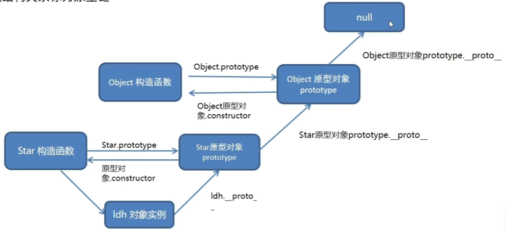

当访问一个对象的属性或方法时：

- 先在对象自身查找；
- 找不到就去它的原型（`__proto__`）上找；
- 还找不到，就继续往上找原型的原型，直到 `null` 为止。

这个链条就是 **原型链**。

规则：JavaScript 在访问属性时，会沿着对象 → 原型 → Object.prototype → null 的链路逐级查找，直到找到或结束，`__proto__` 是这条链的指针，`instanceof` 用于判断原型关系。


#### `instanceof`运算符

**定义**：`instanceof` 是 JavaScript 中的一个**二元运算符**，用于检测一个对象是否是某个构造函数（或类）的实例。它通过检查**原型链**来判断对象的类型。

```js
对象 instanceof 构造函数
// 如果该对象是这个构造函数的实例，返回 true
// 否则返回 false
```

**案例**：

```js
// 定义一个构造函数
function Person(name) {
    this.name = name;
}

const alice = new Person("Alice");

console.log(alice instanceof Person); // true
console.log(alice instanceof Object);  // true，因为所有对象都继承自 Object
```

**工作原理**：从左边的对象开始，沿着 `__proto__` 链向上查找，看是否能找到右边构造函数的 `prototype`。

```js
alice instanceof Person
// 等价于检查：
Person.prototype.isPrototypeOf(alice)
// 或者：alice.__proto__ === Person.prototype（或在其原型链中）
```

**注意**：

1. 只适用于对象和函数
2. 在多窗口或多框架页面中可能出错
3. Es6 `class` 也适用

**实际用途**：

1. 判断对象类型（比 `typeof` 更精确，尤其对数组、自定义对象）
2. 类型校验、错误处理、多态编程

**总结**：`instanceof` 是用来判断“**这个对象是不是由某个构造函数（或类）创建的**”，它通过原型链进行查找，是 JavaScript 中实现类型判断的重要工具。


### 对象

定义：对象是一种数据类型，一种无序的数据集合

* 是JavaScript里的**一种数据类型**

* 可以理解为一种**无序的数据集合**，注意数组是有序的数据集合
* 如果用多个变量保存则比较松散，用对象比较统一

**特点**:无序的数据集合，可以详细的描述某个事物


#### 创建对象

1. 利用对象字面量创建对象

```js
const obj = new Object()
obj.uname = '123'
console.log(obj)
```

2. 利用`new Object`创建对象，内置对象

```js
const i = new Object({name:'你好'})
console.log(i)
```

3. 利用构造函数创建对象

```js
```


#### 对象使用

##### 对象声明语法

```js
let 对象名 = {}
```

```js
let 对象名 = new Object()
```

空对象 `null === let obj = { }`

##### 对象由属性和方法组成

属性：信息或叫特征

方法：功能或叫行为

```js
let 对象名 = {
    属性名: 属性值,
    方法名: 函数
}
```

**定义**：描述对象特征的信息称为属性，通常是名词性（如姓名、年龄等）。

**特点**：

- 属性由**属性名和值**组成，用 `:` 分隔。
- 多个属性间用 `,` 分隔。
- 属性是依附在对象上的变量。

**命名规则**：

- 属性名可用 `""` 或 `''` 包裹，但一般省略。
- 特殊符号（如空格、中横线）需加引号。

```js
        let wjm = {
            uname:'wjm',
            age:18,
            gender:'nan'
        }
        console.log(wjm)        //{uname: 'wjm', age: 18, gender: 'nan'}
```


##### 操作对象的方式

###### 对象的增、删、改、查

**属性-查**

**定义**：声明对象并添加属性后，使用 `.` 可以获取对象中属性的值，称为属性访问。

**语法**：`对象名.属性`

**作用**：简单地获取对象内部的属性值。

```js
        let obj = {
            name : 'wjm',
            age:18,
            hobby:'dance'
        }
        console.log(obj.name)    //wjm
```

查的另外一种属性

```js
对象名['属性名']
console.log(obj['goods-name'])
```

**总结：**

1. 对象名 . 属性名
2. 对象名['属性名']


**属性-改**

**语法：**`对象名.属性 = 新值`

这表示可以通过 `对象名.属性` 的形式给对象的某个属性赋新值，从而修改该属性的值

```js
        let obj = {
            name : 'wjm',
            age:18,
            hobby:'dance'
        }

        obj.name = 'wzx'
        console.log(obj);     //{name: 'wzx', age: 18, hobby: 'dance'}
```


**属性-增**

**语法：对象名.新属性 = 新值**

这表示可以通过 `对象名.新属性 = 新值` 的形式给对象添加一个新属性，并为其赋值。

```js
        let obj = {
            name : 'wjm',
            age:18,
            hobby:'dance'
        }
        obj.gender = 'nan'
        console.log(obj)          //{name: 'wjm', age: 18, hobby: 'dance', gender: 'nan'}
```


**属性-删（了解**）

**语法**：`delete 对象名.属性`

```js
let person = {
    uname: 'pink老师',
    age: 18,
    gender: '女'
}

delete person.gender // 删除 gender 属性
console.log(person)    //{uname: 'pink老师', age: 18}
```


#### 属性和方法

```js
let person = {
  // 属性（描述对象的特征）
  name: "小明",
  age: 18,

  // 方法（对象能做的事）
  sayHello: function() {
    console.log("你好，我是" + this.name);
  }
};
```

##### 属性

定义：属性是对象中的**变量**，用来描述对象的“状态”或“特征”

格式：`键: 值`（key: value）

✅ 示例：

```js
let car = {
  brand: "丰田",     // 字符串
  year: 2022,        // 数字
  isUsed: true,      // 布尔值
  owner: null        // 空值
};
```

✅ 访问属性

```
console.log(car.brand);  // "丰田" —— 点语法
console.log(car["year"]); // 2022 —— 括号语法（可用于动态访问）
```

✅ 修改属性

```
car.year = 2023;
car.color = "红色"; // 添加新属性
```


##### 对象中的方法

**定义**：对象中描述行为的信息称为方法，通常是动词性（如跑步、唱歌），本质是函数。

**特点**

1. 方法由**方法名和函数**两部分构成，用 `:` 分隔。
2. 多个属性间用 `,` 分隔。
3. 方法是依附在对象中的函数。
4. 方法名一般省略引号，除非名称包含特殊符号（如空格、中横线等）。

```js
        let obj = {
            uname:'wjm',
            age:function(x,y){
                console.log(x+y)
            },
            gender:function(a){
                console.log(a*a)
            }
        }
        obj.age(2,7)    //9
        obj.gender(4)   //16
```

声明对象并添加方法后，可以通过 `.` 调用对象中的函数，称为**方法调用**。方法还可以包含形参和实参

这样可以执行对象内的特定功能，并传递参数。


#### 遍历对象

在 JavaScript 中，对象是由**键值对**组成的集合，但与数组不同，它不具备一些数组的特性，因此不能用 `for` 循环像遍历数组那样直接遍历对象。

🔹 **为什么不能像数组一样遍历对象？**

1. **没有 `length` 属性**：

   对象不提供 `length` 属性来表示属性的数量，无法通过下标或长度控制循环。

2. **无序的键值对**：

   对象中的键值对是无序的，没有固定的顺序或规律。这与数组不同，数组有按顺序排列的下标。

##### 遍历对象 for in

```js
        let obj = {
            uname:'wjm',
            age:18,
            gender:'女'
        }
        // 遍历对象
        for(let k in obj){
            // console.log(k)   //属性名  'uname' 'age' 'gender'
            // console.log(k.uname)    //undefined
            console.log(obj[k])   //因为 k === 'uname',所以要 [k]  // 输出属性值：'wjm', 18, '女'
        }
```


#### 内置对象

定义：JavaScript 语言本身提供的一些**自带的对象**，无需手动创建或引入，可以直接使用其属性和方法。

🔹 常见内置对象概览

| 内置对象   | 主要用途                                       |
| ---------- | ---------------------------------------------- |
| `Object`   | 所有对象的基类，用于操作键值对对象             |
| `Array`    | 数组操作（如 `push`, `map`, `filter` 等）      |
| `String`   | 字符串处理（如 `slice`, `indexOf`, `replace`） |
| `Number`   | 数值类型转换与判断（如 `isNaN`, `parseInt`）   |
| `Boolean`  | 布尔值封装对象（较少直接使用）                 |
| `Date`     | 处理日期和时间                                 |
| `Math`     | 提供数学常数和函数（静态方法）                 |
| `RegExp`   | 正则表达式匹配文本                             |
| `Error`    | 错误对象基类（如 TypeError, SyntaxError）      |
| `Function` | 函数对象，所有函数的实例                       |

> 注意：这些对象大多数是“构造函数”或“静态对象”，其中 **`Math` 是唯一一个不能用 `new` 创建实例的静态对象**。这些对象大多数是“构造函数”或“静态对象”，其中 **`Math` 是唯一一个不能用 `new` 创建实例的静态对象**。


##### 内置对象math

定义：`Math` 是一个**静态对象**，所有方法和属性都通过 `Math.xxx` 直接调用，**不能实例化**。

```js
Math.PI     // 圆周率 π ≈ 3.14159
Math.E      // 自然对数的底 e ≈ 2.718
```

常用方法

| 方法                | 功能说明                               | 示例                      |
| ------------------- | -------------------------------------- | ------------------------- |
| `Math.random()`     | 返回 `[0, 1)` 之间的随机数（含0不含1） | `Math.random()` → `0.342` |
| `Math.floor(x)`     | 向下取整（舍去小数）                   | `Math.floor(2.9)` → `2`   |
| `Math.ceil(x)`      | 向上取整（进一位）                     | `Math.ceil(1.1)` → `2`    |
| `Math.round(x)`     | 四舍五入                               | `Math.round(1.5)` → `2`   |
| `Math.max(a,b,...)` | 返回最大值                             | `Math.max(3, 5, 1)` → `5` |
| `Math.min(a,b,...)` | 返回最小值                             | `Math.min(3, 5, 1)` → `1` |
| `Math.pow(x, y)`    | 幂运算：x 的 y 次方                    | `Math.pow(2, 3)` → `8`    |
| `Math.abs(x)`       | 返回绝对值                             | `Math.abs(-5)` → `5`      |
| `Math.sqrt(x)`      | 开平方根                               | `Math.sqrt(16)` → `4`     |

> 案例：随机整数

```js
// 生成 [min, max] 范围内的随机整数
function getRandom(min, max) {
    return Math.floor(Math.random() * (max - min + 1)) + min;
}
console.log(getRandom(1, 10)); // 输出 1 到 10 之间的整数
```


##### 内置对象Date

定义：用于获取、设置、格式化当前或指定的时间。

```js
let now = new Date();           // 当前时间
let date = new Date("2025-04-05"); // 指定日期
```

获取时间的方法（基于本地时区）

| 方法            | 返回值          | 注意事项                       |
| --------------- | --------------- | ------------------------------ |
| `getFullYear()` | 年份（如 2025） | ✅ 推荐使用                     |
| `getMonth()`    | 月份（0–11）    | ⚠️ 需要 +1 才是实际月份         |
| `getDate()`     | 日期（1–31）    | —                              |
| `getDay()`      | 星期几（0–6）   | 0 表示周日，1~6 表示周一到周六 |
| `getHours()`    | 小时（0–23）    | —                              |
| `getMinutes()`  | 分钟（0–59）    | —                              |
| `getSeconds()`  | 秒（0–59）      | —                              |

其他常用方法

| 方法                                | 作用                                                        |
| ----------------------------------- | ----------------------------------------------------------- |
| `getTime()`                         | 返回自 1970年1月1日0:00:00 UTC 到现在的**毫秒数**（时间戳） |
| `toString()`                        | 将日期转为可读字符串                                        |
| `toLocaleString()`                  | 格式化为本地时间字符串（推荐显示用）                        |
| `toDateString()` / `toTimeString()` | 分别获取日期部分和时间部分                                  |

```js
let timestamp = new Date().getTime(); // 获取当前时间戳
console.log(timestamp); // 如：1748421120000
```

> 💡 小提示：`getMonth()` 和 `getDay()` 返回值从 0 开始，使用时注意转换


##### 随机数函数

定义：是用来**生成随机数**的函数

**常用方法：`Math.random()`**

###### 1. `Math.random()`

这是 JavaScript 内置的随机数生成函数，它返回一个 **大于等于 0 且小于 1** 的伪随机浮点数（由算法生成看起来是随机的小数）。

```
console.log(Math.random()); // 例如：0.844592375923759
```

- 返回值范围：**0 ≤ 结果 < 1**
- 是**伪随机数**（由算法生成，非真正随机）
- 不能单独使用，需结合其他数学运算生成指定范围的数

---

###### 2. 生成指定范围的随机数

**生成 [min, max) 之间的浮点数（包含 min，不包含 max）**

```js
function getRandomFloat(min, max) {
    return Math.random() * (max - min) + min;
}

console.log(getRandomFloat(1, 10)); // 例如：5.342
```

**生成 [min, max] 之间的整数（包含 min 和 max）**

```js
function getRandomInt(min, max) {
    min = Math.ceil(min);
    max = Math.floor(max);
    return Math.floor(Math.random() * (max - min + 1)) + min;
}

console.log(getRandomInt(1, 10)); // 例如：7
```

🔍 **解释**：

> - `Math.random() * (max - min + 1)`：生成 0 到 (max-min+1) 的数
> - `Math.floor(...)`：向下取整得到整数
> - `+ min`：将范围平移到 min 到 max 之间

----

###### 3. 常见用途示例

```js
// 随机颜色
function getRandomColor() {
    return `rgb(${getRandomInt(0, 255)}, ${getRandomInt(0, 255)}, ${getRandomInt(0, 255)})`;
}

// 随机布尔值（真假）
function getRandomBoolean() {
    return Math.random() >= 0.5;
}

// 从数组中随机选取一个元素
function getRandomItem(arr) {
    return arr[getRandomInt(0, arr.length - 1)];
}
```

------

###### ⚠️ 注意事项

- `Math.random()` 生成的是**伪随机数**，不适用于加密或安全敏感的场景。
- 如果你需要加密级安全的随机数，应使用 Web Crypto API 中的 `crypto.getRandomValues()`。

```js
// 安全的随机整数（用于加密等场景）
function getCryptoRandomInt(min, max) {
    const array = new Uint32Array(1);
    crypto.getRandomValues(array);
    return array[0] % (max - min + 1) + min;
}
```

----

> 案例：

如何随机生成0-10 的随机数

```js
        function getNum(){
            return Math.floor(Math.random() * (10 + 1))
        }
        console.log(getNum())
```

如何随机生成5-10 的随机数

```js
        function getnum(){
            return Math.floor(Math.random() * (5 + 1)) + 5
        }
        console.log(getnum())
```

取到N-M的随机整数

```js
        function getRandom(N,M){
            return Math.floor(Math.random() * (M - N + 1)) + N
        }
        console.log(getRandom(5,7))
```

随机点名

```js
        // 随机点名
        let uname = ['wjm','wzx','lx','gmy','zjq','hsj','jzh']
        let random = Math.floor(Math.random()*uname.length)
        console.log(uname[random])
```

猜数字游戏 

```js
        // 猜数字游戏
        function getRandom(N,M){
            return Math.floor(Math.random() *(M-N+1))+N
        }
        let random = getRandom(1,10)
        console.log(random)
        while(true){
            let num = +prompt('请输入你猜的数字：')
            if(num > random){
                alert('您猜大了')
            }else if(num < random){
                alert('您猜小了')
            }else{
                alert('猜对啦，真厉害')
                break
            }
        }
```

声称随机颜色

```js
        // 生成随机颜色
        function getcolor(flag){
            if(flag){

            }else{
                let r = Math.floor(Math.random()*256)
                let g = Math.floor(Math.random()*256)
                let b = Math.floor(Math.random()*256)
                return `rgb(${r},${g},${b})`
            }
        }
        console.log(getcolor(false))
```


### JavaScript 数据类型与内存机制

#### 核心术语解释

| 术语                     | 含义说明                                               | 示例                                                         |
| ------------------------ | ------------------------------------------------------ | ------------------------------------------------------------ |
| **关键字**               | 在 JS 中具有特殊语法意义的词，不能用作变量名或函数名   | `let`, `var`, `function`, `if`, `else`, `for`, `switch`, `break` 等 |
| **保留字**               | 当前未使用，但未来可能成为关键字的词，**建议避免使用** | `int`, `char`, `long`, `short`（来自其他语言）               |
| **标识符（Identifier）** | 变量名、函数名、属性名等的统称                         | 如 `userName`, `getData`, `obj`                              |
| **表达式（Expression）** | 能“产生一个值”的代码片段，常包含运算符                 | `10 + 5`, `age >= 18`, `x * y`, `"hello" + "world"`          |
| **语句（Statement）**    | 一段可执行的完整代码，通常以分号结束                   | `if (x > 0) { ... }`, `for(...)`, `let a = 10;`              |


#### JavaScript 数据类型概览

JS 数据类型分为两大类：

| 类型                         | 特点                                                     | 常见类型                                                     |
| ---------------------------- | -------------------------------------------------------- | ------------------------------------------------------------ |
| **基本数据类型（值类型）**   | 按值访问，存储在**栈内存**中，赋值是**值的拷贝**         | `String`, `Number`, `Boolean`, `Null`, `Undefined`, `Symbol`, `BigInt` |
| **复杂数据类型（引用类型）** | 按引用访问，实际数据在**堆内存**中，变量保存的是**地址** | `Object`, `Array`, `Function`, `Date`, `RegExp`, `Map`, `Set` |


##### 基本数据类型（值类型）

✅ 7 种原始类型（Primitive Types）

| 类型              | 说明                             | 示例                                  |
| ----------------- | -------------------------------- | ------------------------------------- |
| `String`          | 字符串                           | `"hello"`, `'world'`                  |
| `Number`          | 数字（整数和小数）               | `42`, `3.14`, `-10`                   |
| `Boolean`         | 布尔值                           | `true`, `false`                       |
| `Null`            | 空值（表示“无”）                 | `null`                                |
| `Undefined`       | 未定义（变量声明但未赋值）       | `let x; console.log(x)` → `undefined` |
| `Symbol` (ES6)    | 唯一且不可变的值，用于对象属性键 | `Symbol('id')`                        |
| `BigInt` (ES2020) | 表示任意精度的大整数             | `123n`, `BigInt(100)`                 |

- **值类型（简单类型）**：直接存储具体值，包括 `string`、`number`、`boolean`、`undefined` 和 `null`。例如：

  ```js
  let a = 5; // 存储的是数字5本身
  ```

- **不可变性**：基础类型的值不能被改变，任何“修改”都会创建新值。
- **按值比较**：两个基础类型变量比较的是它们的值。

```js
let a = 10;
let b = a;
b = 20;
console.log(a); // 10 → a 没有被改变

let str = "hello";
str[0] = "H"; // 无效，字符串不可变
console.log(str); // "hello"
```


##### 复杂数据类型（引用类型）

✅ 常见引用类型

| 类型         | 说明             | 示例                          |
| ------------ | ---------------- | ----------------------------- |
| `Object`     | 对象             | `{ name: "Tom" }`             |
| `Array`      | 数组             | `[1, 2, 3]`                   |
| `Function`   | 函数             | `function() {}` 或 `() => {}` |
| `Date`       | 日期对象         | `new Date()`                  |
| `RegExp`     | 正则表达式       | `/abc/`, `new RegExp("abc")`  |
| `Map`, `Set` | ES6 新增集合类型 | `new Map()`, `new Set()`      |

- **可变性**：对象的内容可以被修改。
- **按引用赋值**：赋值时赋值的是**引用地址**，而不是数据本身。
- **按引用比较**：`==` 或 `===` 比较的是引用地址，不是内容。

```js
let obj1 = { name: "Tom" };
let obj2 = obj1;
obj2.name = "Jerry";
console.log(obj1.name); // "Jerry" → obj1 被改变了！

let arr1 = [1, 2, 3];
let arr2 = arr1;
arr2.push(4);
console.log(arr1); // [1, 2, 3, 4] → arr1 也被改变了
```

```
// 即使内容相同，不同对象也不相等
console.log({} === {}); // false
console.log([1,2] == [1,2]); // false
```

示例代码和图解： 

```js
let usrObj = {}
```

```js
let b = new Array(); // 存储的是数组的地址，实际数组内容在堆内存中
```


#### 堆栈

##### 一、基本概念

JavaScript 的内存空间主要分为三种：

1. **栈（Stack）**：由操作系统自动分配和释放，用于存放**原始数据类型**和**函数调用上下文**。
2. **堆（Heap）**：用于存储**复杂数据类型（引用类型）**的对象，内存空间较大但管理更复杂。
3. **队列（Queue）**：主要用于事件循环（Event Loop），不在本篇重点。

> ⚠️ 注意：这里的“栈”和“堆”指的是**内存区域**，不是数据结构中的“栈”或“堆”。

------

##### 二、栈（Stack）

###### ✅ 特点

- **后进先出（LIFO）**
- 存取速度快
- 空间较小
- 自动分配和释放
- 存储**原始值（Primitive values）** 和**函数执行上下文**

##### ✅ 存储内容

1. **原始数据类型**：
   - `undefined`, `null`, `boolean`, `number`, `string`, `symbol`, `bigint`
   - 这些值直接存储在栈中
2. **函数调用栈（Call Stack）**：
   - 每次函数被调用时，会创建一个“执行上下文”（Execution Context）
   - 上下文包含变量、参数、this 等信息，压入调用栈
   - 函数执行完毕后，上下文从栈中弹出

##### ✅ 示例：原始值赋值（按值传递）

```
let a = 10;
let b = a;  // 复制的是值
b = 20;

console.log(a); // 10
console.log(b); // 20
```

> ✅ 变量 `a` 和 `b` 各自拥有独立的栈空间。

------

##### 三、堆（Heap）

###### ✅ 特点

- 动态分配内存
- 空间大，但访问速度较慢
- 用于存储**引用类型对象**
- 内存管理由垃圾回收机制（GC）负责

###### ✅ 存储内容

所有**引用类型（Reference Types）** 都存储在堆中：

- `Object`
- `Array`
- `Function`
- `Date`
- `RegExp`
- 等等

> 💡 实际上，**变量名（标识符）仍然在栈中**，它保存的是指向堆中对象的**引用地址**。

###### ✅ 示例：引用类型赋值（按引用传递）

```
let obj1 = { name: "Alice" };
let obj2 = obj1;        // 复制的是引用地址
obj2.name = "Bob";

console.log(obj1.name); // "Bob"
console.log(obj2.name); // "Bob"
```

> ❌ `obj1` 和 `obj2` 指向堆中同一个对象，修改一个会影响另一个。

------

##### 四、堆与栈的对比表

| 对比项   | 栈（Stack）                | 堆（Heap）             |
| -------- | -------------------------- | ---------------------- |
| 存储内容 | 原始类型、函数执行上下文   | 引用类型对象           |
| 分配方式 | 自动分配，快速             | 动态分配，较慢         |
| 管理方式 | 先进后出，函数结束自动释放 | 手动/垃圾回收（GC）    |
| 访问速度 | 快                         | 慢                     |
| 空间大小 | 小（有限）                 | 大（动态扩展）         |
| 数据共享 | 不共享                     | 多个变量可引用同一对象 |
| 赋值行为 | 按值传递                   | 按引用传递             |

------

##### 五、常见问题解析

###### 1. 为什么对象是引用传递？

因为对象实际存储在堆中，变量只是保存了它的“地址”。多个变量赋值时，复制的是地址，而非整个对象。

###### 2. 如何实现深拷贝？

避免引用共享，需手动创建新对象：

```js
// 方法1：JSON 序列化（仅适用于简单对象）
let newObj = JSON.parse(JSON.stringify(obj));

// 方法2：展开运算符（浅拷贝）
let newObj = { ...obj };

// 方法3：递归深拷贝函数（推荐处理复杂结构）
function deepClone(obj) {
  if (obj === null || typeof obj !== 'object') return obj;
  if (obj instanceof Date) return new Date(obj);
  if (obj instanceof Array) return obj.map(item => deepClone(item));
  if (typeof obj === 'object') {
    let cloned = {};
    for (let key in obj) {
      if (obj.hasOwnProperty(key)) {
        cloned[key] = deepClone(obj[key]);
      }
    }
    return cloned;
  }
}
```

------

##### 六、调用栈（Call Stack）示例

```js
function first() {
  console.log("First");
  second();
}

function second() {
  console.log("Second");
  third();
}

function third() {
  console.log("Third");
}

first();
// 输出：
// First
// Second
// Third
```

###### 调用过程：

1. `first()` 被调用 → 压入栈
2. `second()` 被调用 → 压入栈
3. `third()` 被调用 → 压入栈
4. `third()` 执行完 → 弹出
5. `second()` 执行完 → 弹出
6. `first()` 执行完 → 弹出

> 🔁 如果递归太深，会导致 **栈溢出（Stack Overflow）**

------

##### 七、总结

| 关键点                    | 说明                     |
| ------------------------- | ------------------------ |
| 原始类型 → 栈             | 直接存储值，赋值独立     |
| 引用类型 → 堆（引用在栈） | 存储对象，变量保存地址   |
| 赋值时注意引用共享        | 修改一个可能影响其他变量 |
| 深拷贝必要时使用          | 避免意外修改             |
| 调用栈管理函数执行顺序    | LIFO 结构，防止无限递归  |

------

📌 **一句话记住**：

> “**小而快的数据放栈里，大而复杂的对象放堆里，变量只是通往它们的钥匙。**”


### 拷贝

#### 浅拷贝

**定义**：

拷贝的是对象的第一层属性

简单数据类型：直接拷贝值

引用数据类型：拷贝的地址

**常见实现方式**

对象：`{...obj}`、`Object.assign({}, obj)`

数组：`[...arr]`、`arr.concat()`、`arr.slice()`

**特点**：

✅ 一层属性修改互不影响（基本类型）。

❌ 多层嵌套时，深层引用类型仍共享地址，修改会**相互影响**。、

**方法**：

1. `Object.create`：主要用于实现原型继承，但他也可以视为一种特殊的浅拷贝，新对象的原型被设置为原对象

   ```js
   let obj = {
       a:1
   }
   let obj2 = Object.create(obj)
   obj.a=2
   console.log(obj2.a);     // 输出2
   ```

   ```
   obj2
     └── [[Prototype]] → obj
                         └── a: 2   ← 被修改了
   ```

2. `Object.assign`：将源对象的可枚举属性复制到目标对象，适合合并多个对象

   ```js
   let obj={
       a:1,
       b:[1,2,3]
   }
   let obj1 = Object.assign({},obj)
   obj.b.push(4)
   console.log(obj1);      //输出{ a: 1, b: [ 1, 2, 3, 4 ] }
   ```

3. `Array的concat、slice、解构赋值`：如`[].concat(arr)`、`arr.slice(0)`、`[...arr]`，这三个方法都会返回一个新的数组，`[].concat(arr)`通过与空数组连接，`arr.slice(0)`对数组从0开始分割，`[...arr]`将数组解构重新赋值，都是对数组进行浅拷贝。

   ```js
   let arr=[1,2,3,{a:1}]
   let arr1=arr.slice(0)
   let arr2=[...arr]
   let arr3=[].concat(arr)
   arr[3].a=2
   console.log(arr1);//[ 1, 2, 3, { a: 2 } ]
   console.log(arr2);//[ 1, 2, 3, { a: 2 } ]
   console.log(arr3);//[ 1, 2, 3, { a: 2 } ]
   ```

4. `Array的toReversed().reverse()`: `arr.toReversed()`会将原数组倒序后返回一个新的数组，通过先反转再反转数组来实现浅拷贝，非直观但有效。

   ```js
   let arr=[1,2,3,{a:1}];
   let arr2=arr.toReversed().reverse();
   arr[3].a=2;
   console.log(arr2);//输出[ 1, 2, 3, { a: 2 } ]
   ```


#### 深拷贝

深拷贝拷贝的是对象，不是地址

实现一个深拷贝函数通常需要递归地检查每个属性，如果属性值是对象，则递归调用自身进行拷贝；否则，直接复制该属性值。这种方法灵活性高，可以处理更多特殊情况，但实现相对复杂。

**常用方法**：

1. 通过递归实现深拷贝
2. `lodash`，`cloneDeep`
3. 通过`JSON.stringify()`实现

**作用**：使得新对象与原对象完全独立，互不影响。

**注意**：使用 JSON.stringify() 和 JSON.parse() 进行深拷贝时，会忽略 undefined、Symbol 和函数等特殊值。

```js
let obj = {
    name: '我真的很困',
    like: {
        type: 'coding',
        a: undefined,
        b: null,
        c: function () {
            console.log('hello');
        },
        e: Symbol('hello'),
// acef都拷贝不了
    }
}
let newObj= JSON.parse(JSON.stringify(obj))
console.log(newObj);

```

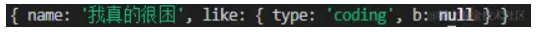


**`JSON.parse(JSON.stringify(obj))`**

1. **无法识别BigInt类型**：当对象中包含BigInt类型的值时，这个方法会将其转换为字符串，因为JSON标准不支持BigInt类型。因此，复制后的对象中的BigInt值不再是BigInt，而是字符串。

2. **无法拷贝`undefined`、`function`、`Symbol`属性**：

- `undefined`的属性值会被忽略，因为它不是JSON格式的一部分。
- 函数（`function`）作为对象的属性不能被序列化，所以在解析后会丢失。
- `Symbol`作为键或值同样不会被处理，因为JSON.stringify会忽略Symbol类型的键，且Symbol值也不能被直接序列化。

3. **无法处理循环引用**：如果对象结构中存在循环引用（即对象A的某个属性引用了对象B，同时对象B的某个属性又引用了对象A），`JSON.stringify`会抛出错误，因为它无法正确地序列化这样的结构。

```js
let obj={
    a:1,
    b:{n:2},
    c:'cc',
    d:true,
    e:undefined,
    f:null,
    g:function(){},
    h:Symbol(1)
}

let newObj=JSON.parse(JSON.stringify(obj))
console.log(newObj)//{ a: 1, b: { n: 2 }, c: 'cc', d: true, f: null }
obj.b.n=1
console.log(newObj)//{ a: 1, b: { n: 2 }, c: 'cc', d: true, f: null }
//实现了深度拷贝，但是没有拷贝`undefined`、`function`、`Symbol`
```


**`structuredClone(obj)`**

它能完美地克隆大多数值，包括循环引用，但兼容性需考虑。

```js
let obj={
    a:1,
    b:{n:1}
}

const newObj=structuredClone(obj);
obj.b.n=3
console.log(newObj);//{ a: 1, b: { n: 1 } }
```


**自定义deepCopy函数**

```js
let obj = {
    a: 1,
    b: { n: 2 },
    c: 'cc',
    d: true,
    e: undefined,
    f: null,
    g: function () { },
    h: Symbol(1),
    i: [1, 2, 3]
}
function deepCopy(obj) {
    let newObj = {}
    for (let key in obj) {
        if (obj.hasOwnProperty(key)) {
            //obj[key]是不是对象 typeof obj[key] === 'object'&& obj[key] !== null
            if (obj[key] instanceof Object) {
                newObj[key] = deepCopy(obj[key])
            } else {
                newObj[key] = obj[key]
            }
        }
    }
    return newObj
}
let obj2= deepCopy(obj);
console.log(obj2);
obj.i[0]=0
console.log(obj2);
/*输出结果：
{
  a: 1,
  b: { n: 2 },
  c: 'cc',
  d: true,
  e: undefined,
  f: null,
  g: {},
  h: Symbol(1),
  i: { '0': 1, '1': 2, '2': 3 }
}
{
  a: 1,
  b: { n: 2 },
  c: 'cc',
  d: true,
  e: undefined,
  f: null,
  g: {},
  h: Symbol(1),
  i: { '0': 1, '1': 2, '2': 3 }
}
*/
```


**js库 lodash 里面 cloneDeep 内部实现了深拷贝**

```js
const obj = {
    uname: 'pink',
    age: 18,
    hobby: ['篮球', '足球'],
    family: {
        baby: '小pink'
    }
}

// 语法：_.cloneDeep(要被克隆的对象)
const o = _.cloneDeep(obj)

console.log(o)
o.family.baby = '老pink'
console.log(obj)
```

- 使用 `_.cloneDeep()` 对对象 `obj` 进行**深拷贝**。
- 深拷贝会递归地复制所有嵌套的属性，包括数组和对象。
- 修改副本 `o` 中的 `family.baby` 不会影响原对象 `obj`。
- 因此，`console.log(obj)` 输出的 `baby` 仍然是 `'小pink'`。

`lodash.cloneDeep()`

能正确处理：

- 原始值（string, number, boolean）
- 数组、对象
- `BigInt`、`Date`、`RegExp`
- 循环引用（部分版本支持）


### 递归函数

**定义**：如果一个函数在内部可以调用其本身，那么这个函数就是递归函数

**理解**：函数在执行过程中调用自己，“自己调用自己”

**作用**：递归函数的作用与循环类似，常用于处理具有重复结构的问题

**注意**：递归容易导致“**栈溢出**”错误，因为每次调用函数都会压入调用栈；**必须设置退出条件**（通常通过`return`实现），否则会无限递归，最终报错

> **递归是函数调用自身，需有明确的退出条件，否则会导致栈溢出。**

错误案例：

```js
function fn() {
  fn(); // 没有退出条件
}
fn();
```

案例：

```js
let i = 1
function fn() {
    console.log(`这是第${i}次`)
    if(i >= 6){
        return
    }
    i++
    fn()
}
fn()

```


#### 函数递归

利用递归函数实现`setTimeout`模拟`setInterval`效果

```html
<body>
    <div></div>
    <script>
        function time(){
            document.querySelector('div').innerHTML = new Date().toLocaleString()
            setTimeout(time,1000)
        }
        time()
    </script>
</body>

```


### 异常处理

#### `throw`抛异常

**定义**：异常处理是指预估**代码执行过程中**可能发生的错误，然后最大程度的避免错误的发生导致整个程序无法继续进行

**特点**：

1. `throw`抛出异常信息，程序也会**终止执行**
2. `throw`后面跟的是错误提示信息
3. `Error`对象配合`throw`使用，能够设置更详细的错误信息

```js
function fn(x,y){
    if(!x || !y){
        throw new Error('参数不能为空')
    }
}
fn()
```


#### `try` /` catch` 捕获错误信息

浏览器提供

关键字：`try`,`catch`,`finally`

```js
        function fn(){
            try{
                // 可能发送错误代码，要写到try
                const p = document.querySelector('.p')
                p.style.color = ' red'
            }catch(err){
                // 拦截错误，提示浏览器提供的错误信息，但是不中断程序的执行
                console.log(err.message)
                throw new Erray('你看看')
                // 需要加return 中断程序
                // return
            }
            finally{
                // 不管程序对不对，一定会执行的代码
                console.log('321')
            }
            console.log('弹出对话框')
        }
        fn()
```

特点：

1. **`try...catch` 用于捕获错误信息**
   - `try...catch` 是 JavaScript 中处理异常的核心语法结构，用来捕获运行时发生的错误。
2. **将预估可能发生错误的代码写在 `try` 代码段中**
   - 把可能出错的代码（如文件读取、网络请求、类型转换等）放在 `try` 块中执行。
3. **如果 `try` 代码段中出现错误后，会执行 `catch` 代码段，并截获到错误信息**
   - 当 `try` 块中的代码抛出异常（如 `Error`、`TypeError` 等），程序不会崩溃，而是跳转到 `catch` 块。
   - `catch` 可以接收错误对象，例如：`catch(err)`，可获取错误类型和消息。
4. **`finally` 不管是否有错误，都会执行**
   - `finally` 块无论是否发生错误，都会被执行一次。
   - 常用于资源释放、关闭连接、清理操作等。


#### debugger

使用`debugger`语句，以便在调用函数时调用调试器

```js
function potentiallyBuggyCode() {
  debugger;
  // 做一些可能会出现错误的检查、单步调试等。
}
```

当 debugger 被调用时，执行暂停在 `debugger` 语句的位置。就像在脚本源代码中的断点一样。


### Web API基本

#### 变量声明

优先使用`const`

原因：能明确表示不可变、提升代码可读性，又能防止意外修改，是包括 React 在内的现代开发最佳实践。

1. **语义化更好**：`const`表明这个变量是一个常量，不会被重新赋值，这使得代码更易读和理解。
2. **避免不必要的修改**：很多变量在声明时就已经确定不会被更改，使用`const`可以防止意外的重新赋值，减少错误。
3. **实际开发中的最佳实践**：例如在React框架中，开发者普遍倾向于使用`const`来声明变量，除非明确需要改变。

特点：

1. `const` 声明的值不能更改，而且 `const` 声明变量的时候需要里面进行初始化。

2. 但是对于引用数据类型，`const` 声明的变量，里面存的不是值，而是地址。

```
const arr = [1, 2, 3];
```

解释：

1. 当使用 `const` 声明一个引用类型的变量（如数组、对象）时，`const` 确保的是这个变量所引用的内存地址不会改变。也就是说，你不能将 `arr` 重新赋值为另一个数组或对象。
2. 但是，你可以修改 `arr` 所指向的数组的内容，因为 `const` 只保护了引用本身，而不是引用所指向的数据。
3. 因为对象是引用类型，里面存储的是地址，只要地址不变，就不会报错

```js
const arr = [1, 2, 3];
arr.push(4); // 允许，因为修改的是堆中的数组内容
console.log(arr); // 输出: [1, 2, 3, 4]

arr = [4, 5, 6]; // 不允许，因为尝试改变 const 变量的引用地址
// 这将导致错误: TypeError: Assignment to constant variable.
```

> 建议数组和对象使用const来声明


#### API作用和分类

作用：就是使用JS去操作html和浏览器

分类：DOM（文档对象模型）、BOM（浏览器对象模型）


#### DOM（Document Object Model）

定义：文档对象模型。是用来呈现以及与任意HTML或XML文档交互的API

解释：DOM是浏览器提供的一套用来**操作网页内容**的功能


##### DOM树

定义：

- 将 HTML 文档以树状结构直观地表现出来，我们称之为文档树或 DOM 树。
- 描述网页内容关系的名词。
- 作用：**文档树直观地体现了标签与标签之间的关系**。


##### DOM对象

定义：浏览器根据html标签生成的JS 对象

特点：

所有的标签属性都可以在这个对象上面找到。

修改这个对象的属性会自动映射到标签身上。

```html
<body>
  <div>123</div>
  <script>
    const div = document.querySelector('div')
    // 打印对象
    console.dir(div)  // dom 对象
  </script>
</body>
```

**核心思想：**把网页内容当作对象来写

**document 对象**

- 是 DOM 里提供的一个对象。
- 所以它提供的属性和方法都是用来访问和操作网页内容的。
  - 例：`document.write()`
- 网页所有内容都在 `document` 里面。


### 获取DOM对象

定义：查找元素DOM元素就是利用JS选择页面中标签元素


#### 根据CSS选择器来选择DOM元素

##### 选择匹配的**第一个**元素

```js
document.querySelector('css选择器')
```

```html
<body>
    <div class="box">导航栏</div>
    <script>
        const title = document.querySelector('.box')     //导航栏
    </script>
</body>

```

参数：**字符串**：包含一个或多个有效的 CSS 选择器，如 `'div'`, `'.class'`, `'#id'` 等。

返回值：**HTMLElement 对象**：返回与 CSS 选择器匹配的第一个元素。如果没有找到匹配的元素，则返回 `null`。


##### 选择匹配的**全部**元素

```js
document.querySelectorAll('css选择器')
```

```html
<body>
    <div class="box">导航栏</div>
    <div class="box1">头部</div>
    <div class="box2">内容</div>
    <script>
        const title = document.querySelectorAll('.box')     
    </script>

```

参数：包含一个或多个有效的 CSS 选择器 **字符串**

返回值：CSS 选择器匹配的 NodeList 对象集合

>  注意：`document.querySelectorAll` 返回的是一个**伪数组（类数组对象）

它具有以下特点：

- **有长度和索引号**：可以像数组一样通过索引访问元素。
- **没有数组方法**：不支持 `pop()`, `push()` 等数组方法。

要访问其中的每个对象，需要使用遍历（如 `for` 循环）来获取。例如：

```js
const elements = document.querySelectorAll('ul li');
for (let i = 0; i < elements.length; i++) {
    console.log(elements[i]);
}
```

简而言之，伪数组类似数组但缺少一些数组方法，需用循环访问其元素

> 哪怕只有一个元素，通过 querySelectorAll ()获取过来的也是一个**伪数组**，里面只有一个元素而已


##### 常用方法介绍

**getElementById()**

- 返回值：Element
- 功能：获取指定id的元素节点。
- 示例：`document.getElementById('box')`

**getElementsByName()**

- 返回值：NodeList/HTMLCollection

- 功能：获取相同name属性的元素集合。

- 示例：

  ```javascript
  document.getElementsByName('goods'); // 获取所有name为goods的元素
  document.getElementsByName('goods')[0]; // 获取第一个name为goods的元素
  ```

**getElementsByTagName()**

- 返回值：NodeList/HTMLCollection

- 功能：获取相同标签名的元素集合。

- 示例：

  ```javascript
  document.getElementsByTagName('*'); // 获取所有元素
  document.getElementsByTagName('li'); // 获取所有<li>元素
  document.getElementsByTagName('li')[0]; // 获取第一个<li>元素
  document.getElementsByTagName('li').length; // 获取<li>元素的数量
  ```

- 注：可通过下标访问元素，使用`.length`获取元素数量。

**getElementsByClassName()**

- 返回值：NodeList
- 功能：获取相同类名的元素集合。
- 参数：String类型，类名（多个类名用空格分隔）。
- 示例：`document.getElementsByClassName('example')`

##### 重点提示

- `getElementsByTagName()`不仅可以通过`document`对象调用，还可以通过元素节点`Element`来访问。

```js
// 注意，下面的方法都只需要定义一个字符串类型的参数即可

// document.getElementById(id值) 根据id值获取到页面的指定元素，id是唯一的，返回值类型为Element [HTMLXXXElement]
var div1Element = document.getElementById("div1"); // 获取得到id值为div1的元素节点
// div1Element 是元素节点，可以直接调用innerText
// alert(div1Element.innerText);

// document.getElementsByClassName(class值) 根据class属性值获取到页面的指定元素，返回值HTMLCollection
// 通过getElementsByClassName获取到0个或多个
var allCp = document.getElementsByClassName("cp"); // 获取到class值为cp的元素节点
// allCp不是元素节点，不能直接调用innerText
// 我们可以把HTMLCollection当成是数组来处理，通过下标获取到指定的元素节点
// alert(allCp[2].innerText);

// document.getElementsByName(name值) 根据name属性值获取到页面的指定元素，返回值HTMLCollection
var allPp = document.getElementsByName("pp");
// alert(allPp[0].innerText);

// document.getElementsByTagName(标签名) 根据标签名获取到页面的指定元素，返回值HTMLCollection
var allP = document.getElementsByTagName("p"); // 获取到页面中所有的p元素
// alert(allP[0].innerText);
// alert(allP.length);

// 这四个方法，其中getElementById()/getElementsByName()只能通过document来调用

// 但是 getElementsByClassName()和getElementsByTagName()不仅可以通过document来调用，也可以通过元素节点来调用
// 如果同document来调用这两方法，那么表示从文档中获取指定元素；如果通过元素节点来调用，那么表示获取指定元素节点里面的指定元素；
// 获取到div1里面的所有p标签元素，通过div1元素节点来调用和getElementsByTagName();
var div1AllP = div1Element.getElementsByTagName("p");
// alert(div1AllP.length);

// 获取第二个div里面的class为cp的元素
var allDiv = document.getElementsByTagName("div");
var towDiv = allDiv[1];
var div2Cp = towDiv.getElementsByClassName("cp");
// alert(div2Cp.length);

// Element 表示元素节点，代表的是一个元素节点
// HTMLCollection 表示元素节点集合，这个集合里面存储的都是元素节点，其实就是JS的数组，通过下标可以获取到指定的元素节点
// NodeList 表示节点列表，节点里面里面存储的可能是各种各样的节点，其实就是JS数组
// 扩展：元素节点.innerText 获取到元素节点的文本内容
```


### 操作元素内容

DOM 对象与标签：DOM 对象由标签生成，操作标签即操作 DOM 对象。

点语法：使用点语法操作对象。

#### 修改内容方式

##### 对象.innerText 属性

> 将文本内容添加/更新到任意标签位置
>
> 显示纯文本，不解析标签

```html
<body>
    <div class="box">导航栏</div>
    <div class="box1">头部</div>
    <div class="box2">内容</div>
    <script>
        const title = document.querySelector('.box')     
        console.log(title.innerText)
        title.innerText = '头部'
    </script>
</body>

```


##### 对象.innerHTML属性

> 将文本内容添加/更新到任意标签位置
>
> 会解析标签，多标签建议使用模板字符

```html
<body>
    <div class="box">导航栏</div>
    <div class="box1">头部</div>
    <div class="box2">内容</div>
    <script>
        const title = document.querySelector('.box')     
        console.log(title.innerText)
        title.innerHTML = '<strong>neirong</strong> '
    </script>
</body>

```


#### 常用属性修改

通过 JS 设置/修改标签元素属性

**最常见的属性：**

- `href`
- `title`
- `src`

语法：

```
对象.属性 = 值
```

举例说明：

```js
// 1. 获取元素
const pic = document.querySelector('img');

// 2. 操作元素
pic.src = './images/b02.jpg';
pic.title = '刘德华黑马演唱会';
```

解释：

使用 `document.querySelector` 方法获取页面中的 `` 元素。

通过设置 `pic.src` 和 `pic.title` 属性来修改图片的源路径和标题。


#### 操作元素样式属性

通过 JS 设置/修改标签元素的样式属性

示例场景：

- 通过轮播图小圆点自动更换颜色样式。
- 点击按钮可以滚动图片，这是移动的图片的位置 `left` 等等。

**方法**：

1. **通过 style 属性操作 CSS**

> 注意：一定要加引号；小驼峰命名法（box.style.backgroundColor）

```html
    <style>
        .box{
            width: 200px;
            height: 200px;
            background-color: #778;
        }
    </style>
</head>
<body>
    <div class="box"></div>

    <script>
        const box = document.querySelector('.box')
        box.style.width = '300px'
        box.style.backgroundColor = 'red'
        box.style.border = '2px solid blue'
        box.style.backgroundImage = "src('./图片链接')"
    </script>
```

2. **操作类名 (className) 操作 CSS**

优势：可以同时修改多个属性

注意：className 会被覆盖元素原有的所有类

修改样式

如果修改的样式比较多，直接通过 `style` 属性修改比较繁琐，我们可以通过借助于 CSS 类名的形式。

语法：

```js
// active 是一个 CSS 类名
元素.className = 'active'
```

> 注意：

由于 `class` 是关键字，所以使用 `className` 去代替。

`className` 是使用新值替换旧值，如果需要添加一个类，需要保留之前的类名。

```html
    <style>
        div{
            width: 100px;
            height: 100px;
            background-color: #225;
        }
        .box{
            width: 200px;
            height: 200px;
            background-color: #778;
        }
    </style>
</head>
<body>
    <div></div>

    <script>
        const div = document.querySelector('div')
        div.className = 'box'
    </script>

```


3. **通过 classList 操作类控制 CSS**

**优点**：为了解决 className 容易覆盖以前的类名，我们可以通过 classList 方式追加和删除类名

语法：

```js
// 追加一个类
元素.classList.add('类名')

// 删除一个类
元素.classList.remove('类名')

//三个方法，注意加（）

// 切换一个类
元素.classList.toggle('类名')

//不替换以前的类名
```

解释：使用 `classList` 可以更灵活地管理元素的类名，避免直接使用 `className` 时可能覆盖原有类名的问题。

```html
    <style>
        .box {
            width: 200px;
            height: 200px;
            background-color: #778;
        }

        .active {
            width: 100px;
            height: 100px;
            background-color: #225;
        }
    </style>
</head>

<body>
    <div class="box"></div>

    <script>
        const div = document.querySelector('div')
        div.classList.add('active')
    </script>

```

**修改样式**

- `add()` 方法用于添加类名。
  * 追加类add()类名不加点，并且是字符串 `div.classList.add('active')`
- `remove()` 方法用于删除类名。
- `toggle()` 方法用于切换类名（如果类名存在则删除，不存在则添加）。


#### 操作表单元素属性

- 表单很多情况，也需要修改属性，比如点击眼睛，可以看到密码，本质是把表单类型转换为文本框
- 正常的有属性有取值的 跟其他的标签属性没有任何区别

> 获取: DOM对象.属性名
> 设置: DOM对象.属性名 = 新值

```js
表单.value = '用户名'
表单.type = 'password'
```

```html
//表单.value = '用户名'
<body>
    <input type="text" value="电脑">
    <script>
        const uname = document.querySelector('input')
        // 获取值 获取表单里面用的值 表单.value
        console.log(uname.value)
    </script>
</body>
```

```html
// 表单.type = 'password'
<body>
    <input type="text" value="电脑">
    <script>
        const uname = document.querySelector('input')
        // 获取值 获取表单里面用的值 表单.value
        // console.log(uname.value)
        // 设置表单的值
        uname.value = '你好'
        uname.type = 'password'
    </script>
</body>
```


表单属性中添加就有效果，移除就没有效果，一律使用布尔值表示。如果为 `true` 代表添加了该属性，如果是 `false` 代表移除了该属性。

比如：`disabled`、`checked`、`selected`

```html
<body>
    <input type="checkbox" name="" id="" checked>
    <button>点击</button>
    <script>
        const ipt = document.querySelector('input')
        // console.log(ipt.checked)     //只接受布尔值
        ipt.checked = true
        // ipt.checked = 'true'     //会选中，不提倡 有隐式转换
        const btn = document.querySelector('button')
        btn.disabled = true    //禁用按钮
    </script>
</body>

```

**修改表单属性**

1. **获取表单元素**：使用 `document.getElementById()`, `querySelector()` 等方法。
2. **修改其属性或属性值**：直接通过点语法（`.`）操作 DOM 对象的属性。


**点击轮播图侧边栏出现小箭头**

```js
academic.addEventListener('click', function () {
    arrow1.style.opacity = 0
    arrow2.style.opacity = 1
    arrow3.style.opacity = 0
    arrow4.style.opacity = 0
})
```


**修改背景图**

```js
    const Stu = document.querySelector('.Stu')
    Stu.style.backgroundImage = "url('../img/banner_bgc.png')"
    Stu.style.backgroundColor = ''; // 清空背景颜色

```


#### 自定义属性（`data-*`）

定义：在网页开发中，有时需要为 HTML 元素附加一些**私有数据**（如 ID、状态、配置等），但又不想影响标准属性。这时就可以使用 **自定义属性**。

---

##### 标准属性 vs 自定义属性

| 类型           | 定义                       | 示例                                  | 操作方式                           |
| -------------- | -------------------------- | ------------------------------------- | ---------------------------------- |
| **标准属性**   | HTML 标签原生支持的属性    | `id`, `class`, `title`, `src`, `href` | 可用点语法或 `getAttribute()` 操作 |
| **自定义属性** | 开发者自定义的数据存储属性 | `data-id`, `data-name`, `data-role`   | 推荐使用 `dataset` 操作            |

> ✅ **推荐使用 `data-\*`**：避免污染标准属性，符合 HTML5 规范，不会引起兼容性问题。

---

##### 自定义属性：`data-*`

###### ✅ 1. 定义与命名规则

- 所有自定义属性必须以 **`data-` 开头**，如：`data-id="1"`。
- 后续名称可自定义，建议使用小写字母、数字、连字符（`-`）。
- 支持多个自定义属性共存。

```html
<div 
  data-id="123" 
  data-user-name="小明" 
  data-age="20" 
  data-role="admin">
  用户信息
</div>
```

------

###### ✅ 2. 访问方式：`dataset` 属性

通过 JavaScript 的 DOM 对象，使用 `.dataset` 来读取或修改所有 `data-*` 属性。

> 🔍 **命名转换规则**：
>
> - HTML 中使用**短横线命名**（kebab-case）：`data-user-name`
> - JS 中通过**驼峰命名**（camelCase）访问：`dataset.userName`

📌 示例代码：

```js
const div = document.querySelector('div');

console.log(div.dataset.id);        // "123"
console.log(div.dataset.userName);  // "小明" （data-user-name → userName）
console.log(div.dataset.age);       // "20"
console.log(div.dataset.role);      // "admin"
```

> 💡 小技巧：
>  `dataset` 返回一个 `DOMStringMap` 对象，包含所有 `data-*` 属性。


##### 修改属性的方法

| 类别                     | 方法               | 语法示例                                                     | 适用场景                                                     | 优点                             | 缺点 / 注意事项                                      |
| ------------------------ | ------------------ | ------------------------------------------------------------ | ------------------------------------------------------------ | -------------------------------- | ---------------------------------------------------- |
| **普通 JavaScript 对象** | 点号语法 `.`       | `obj.property = value`                                       | 属性名为合法标识符（如 `name`, `favoriteColor`）             | 简洁、易读                       | 不支持含空格或特殊字符的属性名                       |
|                          | 方括号语法 `[]`    | `obj["property"] = value`                                    | 属性名含空格、连字符或动态字符串（如 `"first name"`, `"data-value"`） | 灵活，支持任意属性名             | 语法稍显冗长                                         |
|                          | 动态属性名         | `obj[dynamicKey] = value`                                    | 属性名在运行时确定（如变量 `key = "score"`）                 | 支持动态设置属性                 | 需确保变量有正确值                                   |
|                          |                    | `const key = "age"; obj[key] = 30;`                          |                                                              |                                  |                                                      |
| **HTML 元素（DOM）**     | `dataset` 属性     | `element.dataset.camelCase = value` （如 `data-user-id` → `userId`） | 修改 `data-*` 自定义属性                                     | 语义清晰、安全、自动驼峰转换     | 仅支持 `data-*` 属性，需现代浏览器支持               |
|                          | `setAttribute()`   | `element.setAttribute('attr-name', value)`                   | 修改任意 HTML 属性（包括 `data-*` 和非 `data-*`）            | 通用性强，兼容性好，可创建新属性 | 需注意属性名拼写，不自动转换命名                     |
|                          | 直接赋值（不推荐） | `element.customProp = value`                                 | 临时存储数据（仅 JS 层面）                                   | 操作简单                         | **不会反映在 HTML 标签上**，易与标准属性冲突，不可靠 |

`setAttribute()` 方法

```js
element.setAttribute(name, value);
```

- `name`：要设置的**属性的名称**（字符串）。
- `value`：要设置的**属性的值**（会被自动转换为字符串）。

✅ 示例 1：修改 `data-*` 属性（手动处理命名）

假设你有这样一个 HTML 元素：

```
<div id="box" data-user-id="123" data-page-name="Home">内容</div>
```

你想用 `setAttribute` 修改 `data-user-id` 和 `data-page-name`。

##### 正确写法：

```js
const element = document.getElementById('box');

// 必须原样写出带连字符的属性名
element.setAttribute('data-user-id', '456');
element.setAttribute('data-page-name', 'About');
```

✅ 结果：

```
<div id="box" data-user-id="456" data-page-name="About">内容</div>
```


----

##### 自定义属性的增删查改（CRUD）

###### 1️⃣ **查（Read）—— 获取属性值**

```js
console.log(div.dataset.id);        // 获取 data-id 的值
console.log(div.dataset.userName);  // 获取 data-user-name 的值
```

------

###### 2️⃣ **增（Create）与 改（Update）—— 添加或修改**

语法相同：直接赋值即可。

```js
// ✅ 添加新属性
div.dataset.role = "admin";              // → data-role="admin"
div.dataset.userEmail = "xiao@qq.com";   // → data-user-email="xiao@qq.com"

// ✅ 修改已有属性
div.dataset.age = "25";                  // 修改 data-age 为 "25"
```

> ✅ **自动转换**：JS 赋值时会自动转为 HTML 属性（驼峰 → 短横线）

------

###### 3️⃣ **删（Delete）—— 删除属性**

方法一：`delete` 操作符（✅ 推荐）

```js
delete div.dataset.userName;  // 删除 data-user-name 属性
```

方法二：赋值为 `null`

```js
div.dataset.age = null;       // 也会删除该属性
```

❌ 错误做法：赋值为 `undefined`

```js
div.dataset.id = undefined;   // ❌ 结果是 data-id="undefined"（字符串！）
```

> ⚠️ **切记**：`undefined` 会被转为字符串 `"undefined"`，**不会删除属性**！

---

> 案例

```html
<div data-id="1" data-user-name="张三" data-age="18">用户1</div>

<script>
  const userDiv = document.querySelector('div');

  // 查
  console.log(userDiv.dataset.id);         // "1"
  console.log(userDiv.dataset.userName);   // "张三"

  // 增 / 改
  userDiv.dataset.role = "vip";
  userDiv.dataset.age = "20";

  // 删
  delete userDiv.dataset.userName;

  // 最终 HTML: <div data-id="1" data-age="20" data-role="vip">用户1</div>
</script>
```


### 定时器

#### 定时器-间接函数

##### 什么是 `setInterval`？

`setInterval` 是 JavaScript 提供的一个**全局函数**，用于**重复执行**一段代码，每隔指定时间自动调用一次函数。

✅ 基本语法：

```js
let timerId = setInterval(函数, 间隔时间（毫秒）);
```

- **函数**：要执行的回调函数（不能加括号）
- **间隔时间**：单位是**毫秒**（1000 毫秒 = 1 秒）
- **返回值**：一个**数字类型的定时器 ID**，用于后续清除定时器


##### 基本用法示例

1. 使用匿名函数

```js
setInterval(function() {
    console.log('每秒打印一次');
}, 1000); // 每隔 1000ms（1秒）执行一次
```

2. 使用已定义的函数名（推荐）

```js
function fn() {
    console.log('打印');
}
setInterval(fn, 1000); // ✅ 正确：传函数名，不加 ()
```

> ❌ 错误写法：`setInterval(fn(), 1000)`
>  原因：`fn()` 会**立即执行**，传给 `setInterval` 的是 `fn` 的返回值（通常是 `undefined`），导致定时器失效。


##### 关闭定时器？

✅ 步骤：

1. 创建定时器时，**保存返回的 ID** 到一个变量。
2. 使用 `clearInterval(变量名)` 来停止定时器。

示例：

```js
let timer = setInterval(function() {
    console.log('hi~~');
}, 1000);

// 满足条件后停止（比如点击按钮、倒计时结束等）
clearInterval(timer);
```

> ⚠️ **重要**：不清除定时器会导致：

- 内存泄漏
- 无意义的代码持续执行
- 页面性能下降


#### 定时器-延时函数

##### 什么是 `setTimeout`？

`setTimeout` 是 JavaScript 提供的一个**全局函数**，用于**延迟执行一段代码**，且**只执行一次**。

✅ 基本语法：

```js
let timerId = setTimeout(回调函数, 延迟时间（毫秒）);
```

- **回调函数**：延迟后要执行的函数（不能加括号）
- **延迟时间**：单位是**毫秒**（1000 毫秒 = 1 秒）
- **返回值**：一个**数字类型的定时器 ID**，用于后续取消执行


##### 基本用法示例

```js
const div = document.querySelector('div');

setTimeout(function() {
    div.style.display = 'none'; // 3秒后隐藏 div
}, 3000); // 3000 毫秒 = 3 秒
```

> 💡 也可以使用箭头函数：

```js
setTimeout(() => {
    console.log('3秒后执行');
}, 3000);
```


##### 取消延时执行

使用 `clearTimeout(timerId)` 可以在延迟结束**前取消执行**。

✅ 步骤：

1. 调用 `setTimeout` 时，**保存返回的 ID**。
2. 在需要时调用 `clearTimeout(定时器ID)` 取消。

示例：

```js
let timer = setTimeout(() => {
    console.log('这行代码不会执行');
}, 2000);

// 在 1 秒后取消定时器
setTimeout(() => {
    clearTimeout(timer);
    console.log('定时器已取消');
}, 1000);
```

> 📌 应用场景：用户在倒计时跳转前进行了操作，取消跳转。


### 事件监听（绑定）

能够给DOM元素添加事件监听

定义：让程序检测是否有事件产生，一旦触发就调用函数响应。

术语: 绑定事件或注册事件。 

**示例**:

- 鼠标经过显示下拉菜单。
- 点击播放轮播图。

**语法**

```js
元素对象.addEventListener('事件类型', 要执行的函数)
```

**三要素**

1. **事件源**: 触发事件的 DOM 元素，获取DOM，（按钮）。
2. **事件类型**: 如 `click`, `mouseover` 等触发方式。
3. **事件处理函数**: 执行的具体操作。

* 注意：

> 事件类型要加引号
>
> 函数是点击之后再去执行，每次点击都会执行一次

```html
<script>
    // 数据数组
    const arr = ['马超', '黄忠', '赵云', '关羽', '张飞'];
    // 定时器的全局变量
    let timerId = 0;
    // 随机号要全局变量
    const random = 0;
    // 业务1. 开始按钮模块
    const qs = document.querySelector('.qs');
    // 1.1 获取开始按钮对象
    const start = document.querySelector('.start');
    // 1.2 添加点击事件
    start.addEventListener('click', function () {
        timerId = setInterval(function () {
            // 随机数
            random = parseInt(Math.random() * arr.length);
            // console.log(arr[random]);
            qs.innerHTML = arr[random];
        }, 35);
    });

    // 2. 关闭按钮模块
    const end = document.querySelector('.end')
    end.addEventListener('click', function () {
        clearInterval(timerId)
        // 结束了，可以删除掉当前抽取的那个数组元素
        arr.splice(random, 1)
        console.log(arr)
    })
</script>
```


#### 事件监听版本

- **DOM L0**
  - `事件源.on事件 = function() {}`
- **DOM L2**
  - `事件源.addEventListener(事件, 事件处理函数)`
- **区别**:
  - `on` 方式会被覆盖，`addEventListener` 方式可绑定多次，拥有事件更多特性，推荐使用。

```html
<body>
    <button>点击</button>
    <script>
        const btn = document.querySelector('button')
        btn.addEventListener('click',function(){
            alert(11)
        }) 
        btn.addEventListener('click',function(){
            alert(22)
        })
    </script>
</body>
```


#### 事件类型

定义：事件是 JavaScript 实现**交互功能**的核心机制。通过监听用户行为（如点击、输入、按键等），我们可以动态响应并更新页面内容。

---

##### 事件监听基础语法

```js
element.addEventListener('事件名', 回调函数);
```

- `element`：要监听的 DOM 元素
- `'事件名'`：如 `'click'`、`'input'` 等（字符串）
- `回调函数`：事件触发时要执行的代码

---

##### 1️⃣ 鼠标事件（Mouse Events）

| 事件         | 触发条件                | 特点                                    |
| ------------ | ----------------------- | --------------------------------------- |
| `click`      | 鼠标点击（按下 + 抬起） | 最常用，用于按钮点击等                  |
| `mouseenter` | 鼠标进入元素区域        | **不冒泡到子元素**，推荐用于 hover 效果 |
| `mouseleave` | 鼠标离开元素区域        | 与 `mouseenter` 配对使用                |

> ✅ 推荐使用 `mouseenter` 和 `mouseleave` 替代 `mouseover` / `mouseout`，避免子元素触发问题。

示例：

```js
const div = document.querySelector('div');

// 鼠标进入
div.addEventListener('mouseenter', function() {
    console.log('轻轻的我来了');
});

// 鼠标离开
div.addEventListener('mouseleave', function() {
    console.log('轻轻的我走了');
});
```

> 📌 应用场景：菜单展开/收起、按钮悬停效果、图片放大等。

---

##### 2️⃣ 焦点事件（Focus Events）

适用于表单元素（如 `<input>`、`<textarea>`、`<select>`）

| 事件    | 触发条件                                    | 特点               |
| ------- | ------------------------------------------- | ------------------ |
| `focus` | 元素获得焦点（如点击或 Tab 键进入）         | 常用于提示输入格式 |
| `blur`  | 元素失去焦点（如点击其他地方或 Tab 键离开） | 常用于验证输入内容 |

示例：

```js
const input = document.querySelector('input');

input.addEventListener('focus', function() {
    console.log('输入框获得了焦点');
});

input.addEventListener('blur', function() {
    console.log('输入框失去了焦点');
});
```

> 📌 应用场景：

- 输入框获得焦点时显示提示
- 失去焦点时验证邮箱、手机号格式

----

##### 3️⃣ 键盘事件（Keyboard Events）

| 事件      | 触发条件                 | 特点                   |
| --------- | ------------------------ | ---------------------- |
| `keydown` | 键盘按键**被按下时**触发 | 按住不放会**连续触发** |
| `keyup`   | 键盘按键**抬起时**触发   | 通常只触发一次         |

> ⚠️ 注意：`keydown` 在长按情况下会重复触发，而 `keyup` 只在释放时触发一次。

示例：

```js
const input = document.querySelector('input');

input.addEventListener('keydown', function() {
    console.log('键盘按下了');
});

input.addEventListener('keyup', function() {
    console.log('键盘抬起了');
});
```

> 📌 应用场景：

- 按 Enter 键提交表单
- 监听方向键控制游戏人物
- 限制输入内容（如只允许数字）

----

##### 4️⃣ 文本事件（Input Events）

| 事件     | 触发条件                                        | 特点                                     |
| -------- | ----------------------------------------------- | ---------------------------------------- |
| `input`  | **输入内容发生变化时**立即触发                  | 包括键盘输入、粘贴、剪切、拖拽等所有方式 |
| `change` | `change` 事件在控件**失去焦点前**都**不会**触发 |                                          |

> ✅ `input` 是监听输入最**全面、实时**的事件，推荐用于实时搜索、字数统计等。

示例：

```js
const input = document.querySelector('input');

input.addEventListener('input', function() {
    console.log('用户输入了内容');
    console.log('当前值：', this.value); // 获取输入框内容
});
```

> 📌 应用场景：

- 实时搜索（输入即搜索）
- 密码强度检测
- 字数统计（如微博、评论框）
- 表单内容预览


#### 事件对象

##### 定义：

> 事件对象是一个包含**事件触发**时相关信息的**对象**
>
> 事件绑定的回调函数的第一个参数是事件对象

使用场景包括：

- 判断用户按下的键，如按下回车键可以发布新闻。
- 判断鼠标点击了哪个元素，从而执行相应的操作。

##### 获取：

事件绑定的回调函数的**第一个参数**是事件对象，通常命名为 `event`、`ev` 或 `e`。

示例代码：

```js
元素.addEventListener('click', function (e) {
    // 处理点击事件
});
```

```html
<body>
    <button>点击</button>
    <script>
        const btn = document.querySelector('button')
        btn.addEventListener('click',function(e){
            console.log(e)
        })      //PointerEvent {isTrusted: true, pointerId: 1, width: 1, height: 1, pressure: 0, …}
    </script>
</body>
```

##### 一般通用属性（所有事件都可用）

| 属性名          | 类型      | 说明                                                         |
| --------------- | --------- | ------------------------------------------------------------ |
| `type`          | `string`  | 事件的类型（如 `"click"`、`"keydown"`、`"submit"`）。        |
| `target`        | `Element` | **事件最初触发的 DOM 元素**（即事件从哪里开始）。 ⚠️ 注意：不是 `this`，`this` 是绑定事件的元素。 |
| `currentTarget` | `Element` | **当前正在处理事件的元素**（通常等于 `this`）。 在事件冒泡/捕获中，`target` 和 `currentTarget` 可能不同。 |
| `eventPhase`    | `number`  | 事件当前所处的阶段： `0`=无，`1`=捕获，`2`=目标，`3`=冒泡。  |
| `bubbles`       | `boolean` | 该事件是否会**向上冒泡**（如 `click` 会，`focus` 不会）。    |
| `cancelable`    | `boolean` | 是否可以调用 `preventDefault()` 来阻止默认行为（如链接跳转、表单提交）。 |
| `timeStamp`     | `number`  | 事件触发时的时间戳（毫秒），从页面加载开始计算。             |
| `isTrusted`     | `boolean` | 表示事件是否由**用户真实操作**触发（`true`），还是由脚本触发（`false`） |

##### 鼠标事件持有属性

| 属性名                                     | 说明                                                         |
| ------------------------------------------ | ------------------------------------------------------------ |
| `clientX`, `clientY`                       | 鼠标指针相对于**浏览器可视窗口**的坐标（含滚动）。           |
| `pageX`, `pageY`                           | 鼠标指针相对于**整个网页文档**的坐标（含滚动）。             |
| `screenX`, `screenY`                       | 鼠标指针相对于**用户屏幕**的坐标。                           |
| `offsetX`, `offsetY`                       | 鼠标指针相对于**事件目标元素内容区域**的坐标（不含边框）。   |
| `button`                                   | 按下的鼠标按钮： `0`=左键，`1`=中键，`2`=右键。              |
| `buttons`                                  | 当前按下的所有鼠标按钮的组合值（用于多键同时按下）。         |
| `ctrlKey`, `shiftKey`, `altKey`, `metaKey` | 布尔值，表示 `Ctrl`、`Shift`、`Alt`、`Meta`（Mac 的 Command）键是否被按下 |


案例：事件对象，键盘类型，只有敲空格键Enter才能触发，其余的触发不了

```html
<body>
    <!-- <button>点击</button> -->
    <input type="text">
    <script>
        const input = document.querySelector('input')
        input.addEventListener('keyup',function(e){
            // console.log(11)
            console.log(e.key)
            if(e.key === 'Enter'){
                console.log('我按写了回车键')
            }
        })
    </script>
</body>
```


拓展：trim（）

去除字符串左右两边的 空格

```html
<body>
    <script>
        const str = '           red                '
        console.log(str.trim())      // 去除元素空格 
    </script>
</body>

```


####  环境对象 

##### `this` 的定义

- `this` 是一个**关键字**，在函数内部自动存在。
- 它指向**调用该函数的那个对象**，即函数运行时的执行上下文。
- **`this` 的值在函数调用时确定**，而不是定义时。

---

##### 常见调用方式与 `this` 指向

| 调用方式         | `this` 指向            | 说明                                 |
| ---------------- | ---------------------- | ------------------------------------ |
| **普通函数调用** | `window`（浏览器环境） | 非严格模式下；严格模式为 `undefined` |
| **对象方法调用** | 该对象本身             | 谁调用，`this` 就指向谁              |
| **构造函数调用** | 新创建的实例对象       | 使用 `new` 关键字创建对象时          |
| **事件处理函数** | 绑定事件的 DOM 元素    | 如按钮点击，`this` 是按钮元素        |
| **箭头函数**     | 外层作用域的 `this`    | 箭头函数没有自己的 `this`，继承外层  |

---

##### 详细场景解析

###### 1️⃣ 普通函数调用 → `this` 指向 `window`

```js
function fn() {
    console.log(this); // window
}
fn(); // 等价于 window.fn()
```

> ⚠️ 注意：
>
> - 在浏览器中，全局对象是 `window`
> - 在严格模式下（`'use strict'`），`this` 为 `undefined`

------

###### 2️⃣ 对象方法调用 → `this` 指向该对象

```js
const obj = {
    name: '张三',
    say() {
        console.log(this); // obj
        console.log(this.name); // '张三'
    }
};
obj.say(); // 调用者是 obj，所以 this 是 obj
```

> ✅ 关键：方法必须是**通过对象调用**，`this` 才指向该对象。

------

###### 3️⃣ 事件处理函数 → `this` 指向绑定的 DOM 元素

```js
const btn = document.querySelector('button');
btn.addEventListener('click', function() {
    console.log(this); // btn 元素
    this.style.color = 'red'; // 改变按钮颜色
});
```

> 💡 优势：可以直接用 `this` 操作当前触发事件的元素，无需再查询。

------

###### 4️⃣ 构造函数调用 → `this` 指向新创建的实例

```js
function Person(name) {
    this.name = name;
    console.log(this); // 新创建的 person 实例
}
const person = new Person('李四');
```

> ✅ `new` 关键字会创建一个新对象，并将 `this` 绑定到该对象。

------

###### 5️⃣ 箭头函数 → `this` 指向外层作用域

```js
const obj2 = {
    fn: () => {
        console.log(this); // window（外层是全局作用域）
    }
};
obj2.fn();

// 常见用法：在事件中保持外层 this
const user = {
    name: '小明',
    delayPrint() {
        setTimeout(() => {
            console.log(this.name); // '小明'（箭头函数继承外层 this）
        }, 1000);
    }
};
user.delayPrint();
```

> ⚠️ 注意：**箭头函数没有自己的 `this`**，它的 `this` 是继承定义时外层函数或全局作用域的 `this`。

----

##### 经典示例对比

```js
// 普通函数
function fn() { console.log(this); } // this → window

// 对象方法
const obj = { fn() { console.log(this); } }; // this → obj

// 事件处理
btn.addEventListener('click', function() {
    console.log(this); // this → btn
});

// 箭头函数
const obj2 = { fn: () => console.log(this) }; // this → window（外层）
```


#### 回调函数

##### 什么是回调函数？

✅ 定义：

**回调函数**是指将一个函数作为**参数**传递给另一个函数，并在某个事件发生或操作完成后，由外部函数来**调用这个函数**。

✅ 核心思想：

- 函数是一等公民，可以像数据一样被传递。
- 实现**延迟执行**或**定制行为**，提高代码的灵活性和复用性。

✅ 基本语法：

```js
function fn() {
    console.log('我是回调函数');
}

someFunction(fn); // 将 fn 作为参数传入
```

✅ 示例：

```js
function fn() {
    console.log('回调函数');
}
setInterval(fn, 1000); // fn 被 setInterval 在每秒后调用
```

> 💡 `fn` 没有立即执行，而是“等别人回头来调用它”。

------

##### 回调函数的分类

| 类型         | 执行时机 | 是否阻塞     | 典型例子                              |
| ------------ | -------- | ------------ | ------------------------------------- |
| **同步回调** | 立即执行 | ✅ 阻塞主线程 | `forEach`, `map`, `filter`            |
| **异步回调** | 延迟执行 | ❌ 不阻塞     | `setTimeout`, `setInterval`, 事件监听 |

----

##### 同步回调

✅ 定义：

在外部函数调用后**立即执行**的回调函数，中间没有异步任务（如定时器、网络请求、事件等待）。

🔑 核心特点：

| 特点              | 说明                             |
| ----------------- | -------------------------------- |
| **1. 立即执行**   | 回调函数传入后，马上被调用       |
| **2. 阻塞主线程** | 主函数必须等回调执行完才能继续   |
| **3. 顺序执行**   | 代码从上到下依次执行，顺序可预测 |

✅ 常见例子：

```js
function myCallback(item) {
    console.log("处理:", item);
}

[1, 2, 3].forEach(myCallback);
console.log("循环结束");
```

**输出顺序：**

```js
处理: 1
处理: 2
处理: 3
循环结束
```

> ✅ 所有操作是**同步、按序、立即执行**。

✅ 使用场景：

| 场景               | 示例                                                  |
| ------------------ | ----------------------------------------------------- |
| **数组方法**       | `forEach`, `map`, `filter`, `reduce`, `some`, `every` |
| **自定义逻辑封装** | 数据处理、格式转换                                    |
| **工具函数**       | 排序规则、验证函数等                                  |

```js
// 自定义函数中使用回调
function process(data, callback) {
    const result = data * 2;
    return callback(result); // 立即调用
}
```

---

##### 异步回调

✅ 定义：

回调函数**不会立即执行**，而是被注册，等待某个异步操作（如定时、事件、网络请求）完成后才执行。

> 📣 **“请记住我，当某件事发生时，再调用我。”**

🔑 核心特点：

| 特点                  | 说明                                 |
| --------------------- | ------------------------------------ |
| **1. 延迟执行**       | 回调被“排队”，稍后执行               |
| **2. 非阻塞**         | 不会卡住主线程，程序继续执行后续代码 |
| **3. 事件驱动**       | 由用户操作、定时器、网络响应等触发   |
| **4. 执行时机不确定** | 可能写在前面，但执行在后面           |

✅ 常见例子：

1. `setTimeout`

```js
console.log("第一步");
setTimeout(() => console.log("第三步"), 1000);
console.log("第二步");
```

**输出：**

```js
第一步
第二步
第三步
```

2. 事件监听

```js
btn.addEventListener('click', () => {
    console.log("按钮被点击了！");
});
```

> 点击时才执行，典型的异步回调。

3. 网络请求（`fetch`）

```js
console.log("开始请求");
fetch('/api/data').then(() => {
    console.log("数据返回了！");
});
console.log("继续做其他事");
```

> `.then()` 中的回调是异步的。


### 事件流

定义：事件完整执行过程中的流动路径

两个阶段：事件捕获，事件冒泡

-----

#### 事件捕获

**定义**：从DOM的根元素开始执行对应的事件（从外到里）。

**实现**：需要编写代码才能看到效果。

##### 代码示例

```javascript
DOM.addEventListener(事件类型, 事件处理函数, 是否使用捕获机制)
```

##### 参数说明

- 第三个参数传入 `true` 表示在捕获阶段触发（很少使用）。
- 传入 `false` 表示在冒泡阶段触发，默认值为 `false`。
- 使用 `LO` 事件监听时，只有冒泡阶段，没有捕获。

```html
<!DOCTYPE html>
<html lang="en">

<head>
    <meta charset="UTF-8">
    <meta name="viewport" content="width=device-width, initial-scale=1.0">
    <title>Document</title>
    <style>
        .father {
            width: 400px;
            height: 400px;
            background-color: #550;
        }

        .son {
            width: 200px;
            height: 200px;
            background-color: #089;
        }
    </style>
</head>

<body>
    <div class="father">
        <div class="son"></div>
    </div>

    <script>
        const fa = document.querySelector('.father')
        const so = document.querySelector('son')
        document.addEventListener('click', function () {
            alert('nihao')
        },true)
        document.addEventListener('click', function () {
            alert('father')
        },true)
        document.addEventListener('click', function () {
            alert('son')
        },true)

    </script>
</body>

</html>
```

-----

#### 事件冒泡

定义：当一个元素的事件被触发时，同样的事件将会在该元素的所有祖先元素中依次被触发。这一过程叫做事件冒泡

- **简单理解**：当一个元素触发事件后，会依次向上调用所有父级元素的同名事件。
- **默认行为**：事件冒泡是默认存在的。
- **监听设置**：在L2事件监听中，`addEventListener` 的第三个参数默认为 `false`，表示使用冒泡阶段。
- **执行过程：**
  1. **触发起点**：事件从最内层的**目标元素**（触发事件的元素）开始。
  2. **向上冒泡**：事件会逐级向上传播，依次触发其**父元素、祖父元素……直到根元素（如 `document` 或 `window`）**。
  3. **顺序执行**：按照 DOM 层级从内到外（子 → 父 → 祖先）依次执行每个元素上绑定的**同类型事件处理函数**。

示例代码

```js
const father = document.querySelector('.father');
const son = document.querySelector('.son');

document.addEventListener('click', function() {
    alert('我是爷爷');
});

father.addEventListener('click', function() {
    alert('我是爸爸');
});

son.addEventListener('click', function() {
    alert('我是儿子');
});
```

-------

#### 阻止冒泡

- **问题**：默认存在冒泡模式，事件可能影响到父级元素。
- **需求**：若要将事件限制在当前元素内，需阻止事件冒泡。
- **前提**：阻止冒泡需要获取事件对象。
- **方法**：使用 `event.stopPropagation()`。

```js
element.addEventListener('click', function(event) {
    event.stopPropagation(); // 阻止事件冒泡
});
```

- **注意**：此方法不仅在冒泡阶段有效，在捕获阶段也有效

-----

#### 解绑事件

##### L0 事件移除解绑

on事件方式，直接使用null覆盖就可以实现事件的解绑

**语法**：

```js
// 绑定事件
btn.onclick = function () {
    alert('点击了');
}

// 解绑事件
btn.onclick = null;
```

这段代码展示了如何使用 `on` 事件绑定和解绑方法。通过将 `onclick` 属性设置为一个函数来绑定点击事件，然后将其设置为 `null` 来解除绑定。 

##### L2 事件移除解绑

addEventListener方式，必须使用：

```js
removeEventListener(事件类型, 事件处理函数, [获取捕获或者冒泡阶段])
```

**例如**：

```js
function fn() {
    alert('点击了');
}
// 绑定事件
btn.addEventListener('click', fn);
// 解绑事件
btn.removeEventListener('click', fn);
```

**注意**：匿名函数无法被解绑。

------

#### 鼠标经过的区别 

- `mouseover` 和 `mouseout` 会有冒泡效果。
- `mouseenter` 和 `mouseleave` 没有冒泡效果（推荐）。

##### 传统 `on` 注册 (L0)

- **覆盖问题**：同一对象，后注册的事件会覆盖前面的。
- **解绑方式**：直接将事件处理函数设为 `null`。
- **执行阶段**：都是在冒泡阶段执行。

##### 事件监听注册 (L2)

- **语法**：`addEventListener(事件类型, 事件处理函数, 是否使用捕获)`.
- **不覆盖**：后注册的事件不会覆盖前面的。
- **阶段选择**：通过第三个参数决定在冒泡或捕获阶段执行。
- **解绑方法**：必须使用 `removeEventListener(事件类型, 事件处理函数, 获取捕获或者冒泡阶段)`。
- **匿名函数限制**：匿名函数无法被解绑。

案例：

```html
<!DOCTYPE html>
<html lang="en">

<head>
    <meta charset="UTF-8">
    <meta name="viewport" content="width=device-width, initial-scale=1.0">
    <title>Document</title>
    <style>
        .dad {
            width: 400px;
            height: 400px;
            background-color: #501;
        }

        .son {
            width: 300px;
            height: 300px;
            background-color: rgb(138, 102, 148);
        }
    </style>
</head>

<body>
    <div class="dad">
        <div class="son"></div>
    </div>

    <script>
        const dad = document.querySelector('.dad')
        const son = document.querySelector('.son')
        dad.addEventListener('mouseenter', function () {
            console.log('鼠标经过')
        })
        dad.addEventListener('mouselive', function () {
            console.log('鼠标离开')
        })
        son.addEventListener('mouseenter', function () {
            console.log('鼠标经过')
        })
        son.addEventListener('mouselive', function () {
            console.log('鼠标离开')
        })

    </script>
</body>

</html>
```

-----

#### 事件委托

**定义**：**事件委托**是利用**事件冒泡**机制，将子元素的事件监听绑定到其父元素上，通过判断 `event.target` 来执行对应操作的一种编程技巧。

**优点**：减少注册次数，可以提高程序性能

**原理**：利用事件冒泡的特点。

* 给**父元素**注册事件（委托给**父元素**），当子元素被触发时，事件会冒泡到父元素上，从而触发父元素的事件处理函数。

**语法**：通过 `event.target.tagName` 获取真正触发事件的元素

`e.target.tagName`

| 部分           | 含义                                                         |
| -------------- | ------------------------------------------------------------ |
| **`e`**        | 事件对象（event object） 当事件（如点击、输入等）发生时，浏览器自动传入的参数，包含事件的详细信息。 |
| **`.target`**  | 事件对象的属性 指向**真正触发事件的 DOM 元素**（也就是“事件源”）。 ✅ 例如：你点击了一个 `<button>`，`e.target` 就是这个 `<button>` 元素。 |
| **`.tagName`** | DOM 元素的属性 返回该元素的**HTML 标签名**，且**始终是大写字符串**。 |

```js
ul.addEventListener('click', function(){}); // 执行父级点击事件
```

```html
<body>
    <ul>
        <li>第1个孩子</li>
        <li>第2个孩子</li>
        <li>第3个孩子</li>
        <li>第4个孩子</li>
        <li>第5个孩子</li>
        <p>不变色</p>
    </ul>

    <script>
        //点击每个小li 当前li文字变成红色
        //1.获得父级
        const ul = document.querySelector('ul')
        ul.addEventListener('click',function(e){
            // this.style.color = 'pink'
            // console.log(e.target)
            // e.target.style.color = 'pink'
            // 我们只要点击li才会有效果
            if(e.target.tagName === 'LI'){
                e.target.style.color = 'pink'
            }
        })
</script>
</body>
```

---

#### 阻止默认行为

**需求**：在某些情况下需要阻止元素的默认行为，如阻止链接跳转或表单提交。

**方法**：使用 `e.preventDefault()`。

**示例代码**

```js
const form = document.querySelector('form');
form.addEventListener('click', function(e) {
    e.preventDefault(); // 阻止表单默认提交行为
});
```

这段代码阻止了表单的默认提交行为。


### 其他事件

#### 页面加载事件

1. **加载外部资源**：当图片、外联CSS和JavaScript等外部资源加载完毕时会触发的事件。
2. 为什么要学
   - 有时需要在页面资源全部加载完成后执行某些操作。
   - 老代码习惯将script写在head中，这时直接查找DOM元素可能找不到。
3. **事件名**：`load`
4. **触发对象**：`window`或 `document`
5. 监听页面所有资源加载完毕
   - 给window添加`load`事件

```js
// 页面加载事件   等待页面所有资源加载完毕，就回去执行回调函数
window.addEventListener('load', function () {
    // 执行的操作
});
```

> 注意：不光可以监听整个页面资源加载完毕，也可以针对某个资源绑定load事件

----

##### **DOM加载完成**

* **事件名**：DOMContentLoaded

>  为什么要这么做？
>
> **因为网页加载是分阶段进行的，开发者往往不需要等图片、样式全加载完，只想在 DOM 结构准备好后就立即操作页面。**
>
> 所以浏览器提供 `DOMContentLoaded` 事件，让 JS 能 **尽早执行**，提升性能和用户体验。

- 当初始的 HTML 文档被完全加载和解析完成之后，DOMContentLoaded 事件被触发，而无需等待样式表、图像等完全加载
- 监听页面DOM加载完毕：
  - 给 document 添加 DOMContentLoaded 事件

```js
document.addEventListener('DOMContentLoaded', function () {
    // 执行的操作
});
```

-----

#### 元素滚动事件

**事件名**：scroll

**定义**：滚动条在滚动的时候**持续触发**的事件

为什么要学？

- 很多网页需要检测用户把页面滚动到某个区域后做一些处理，比如固定导航栏，比如返回顶部

监听整个页面滚动：

```js
// 页面滚动事件
window.addEventListener('scroll', function () {
    // 执行的操作
});
```

```html
    <style>
        body{
            height: 3000px;
        }
    </style>
</head>
<body>
    <script>
        window.addEventListener('scroll',function(){
            console.log('我滚了')
        })
    </script>
</body>

```

-----

##### 获取位置

`scrollLeft` 和 `scrollTop` 是用于获取或设置元素被卷去的大小的属性，具体来说：

- **用途**：它们可以获取元素内容往左、往上滚出去看不到的距离。
- **可读写**：可以读取也可以修改。这两个值是可读写的，意味着你可以读取当前滚动位置，也可以设置新的滚动位置。

> 注意：尽量在scroll事件里面获取被卷去的距离

例如，你可以使用它们来控制页面或元素的滚动位置。


```html
<!DOCTYPE html>
<html lang="en">
<head>
    <meta charset="UTF-8">
    <meta name="viewport" content="width=device-width, initial-scale=1.0">
    <title>Document</title>
    <style>
        body{
            padding-top: 100px;
            height: 3000px;
        }

        div{
            overflow: scroll;
            margin: 100px;
            width: 200px;
            height: 200px;
            border: 1px solid #000;
        }
    </style>
</head>
<body>
    <div>
        我里面有很多文字
        我里面有很多文字
        我里面有很多文字
        我里面有很多文字
        我里面有很多文字
        我里面有很多文字
        我里面有很多文字
        我里面有很多文字
        我里面有很多文字
        我里面有很多文字
        我里面有很多文字
        我里面有很多文字
        我里面有很多文字
        我里面有很多文字
        我里面有很多文字
        我里面有很多文字
        我里面有很多文字
        我里面有很多文字
        我里面有很多文字
        我里面有很多文字
        我里面有很多文字
        我里面有很多文字
        我里面有很多文字
    </div>
    <script>
        // window.addEventListener('scroll',function(){
        //     // console.log('我滚了')
        // })
        const div = document.querySelector('div')
        div.addEventListener('scroll',function(){
            // console.log(11)
            // scrollTop 被卷去的头部
            console.log(div.scrollTop)
        })
    </script>
</body>
</html>
```


##### 滚动到指定的坐标

- `scrollTo()` 方法可把内容滚动到指定的坐标
- 语法：
  - 元素.scrollTo(x, y)

示例代码：

```js
// 让页面滚动到 y 轴1000像素的位置
window.scrollTo(0, 1000)
```

----------

##### 页面尺寸事件

- 当窗口尺寸改变时触发的事件：`resize`

- 监听窗口大小变化：

  ```js
  window.addEventListener('resize', function () {
    // 执行的代码
  });
  ```

- 检测屏幕宽度：

  ```js
  window.addEventListener('resize', function () {
    let w = document.documentElement.clientWidth;
    console.log(w);
  });
  ```


> 案例：电梯问题

```html
<!DOCTYPE html>
<html lang="en">

<head>
    <meta charset="UTF-8">
    <meta name="viewport" content="width=device-width, initial-scale=1.0">
    <title>Document</title>
    <style>
        .content {
            margin: 0 auto;
        }

        .all {
            display: flex;
            justify-content: center;
        }

        .box {
            width: 300px;
        }

        .box1,
        .box2,
        .box3,
        .box4,
        .box5 {
            width: 300px;
            height: 400px;
            background-color: rgb(168, 181, 223);
            margin-bottom: 20px;
        }

        .btn {
            margin-left: 600px;
            margin-top: 200px;
            position: fixed;
        }

        .p1,
        .p2,
        .p3,
        .p4,
        .p5,
        .top {
            width: 40px;
            height: 40px;
            background-color: rgb(202, 178, 224);
            margin-bottom: 20px;
        }
    </style>
</head>

<body>
    <div class="all content">
        <div class="box ">
            <div class="box1">box1</div>
            <div class="box2">box2</div>
            <div class="box3">box3</div>
            <div class="box4">box4</div>
            <div class="box5">box5</div>
        </div>
        <div class="btn">
            <div class="p1">
                <a href="javaScript:;" id="p1">p1</a>
            </div>
            <div class="p2">
                <a href="javaScript:;" id="p2">p2</a>
            </div>
            <div class="p3">
                <a href="javaScript:;" id="p3">p3</a>
            </div>
            <div class="p4">
                <a href="javaScript:;" id="p4">p4</a>
            </div>
            <div class="p5">
                <a href="javaScript:;" id="p5">p5</a>
            </div>
            <div class="top">
                <a href="javaScript:;" id="backTop">顶部</a>
            </div>
        </div>
    </div>

    <script>
        const bt = document.querySelector('.top')
        window.addEventListener('scroll', function () {
            const n = document.documentElement.scrollTop

            if(n >= 300){
                bt.style.opacity = 1
            }else{
                bt.style.opacity = 0
            }
        })

        const backtop = document.querySelector('#backTop')
        backtop.addEventListener('click',function(){
            document.documentElement.scrollTop = 0
        })

        const p1 = document.querySelector('#p1')
        p1.addEventListener('click',function(){
            window.scrollTo(0,0)
        })

        const p2 = document.querySelector('#p2')
        p2.addEventListener('click',function(){
            window.scrollTo(0,400)
        })

        const p3 = document.querySelector('#p3')
        p3.addEventListener('click',function(){
            window.scrollTo(0,840)
        })

        const p4 = document.querySelector('#p4')
        p4.addEventListener('click',function(){
            window.scrollTo(0,1260)
        })

        const p5 = document.querySelector('#p5')
        p5.addEventListener('click',function(){
            window.scrollTo(0,1680)
        })
    </script>
</body>

</html>
```

-------------------


### 获取元素的 html 和 body 的元素写法

> 获取 html 的元素写法 `document.documentElement`

```html
<script>  
    window.addEventListener('scroll', function () {
            // 获取html的元素写法
            // document.documentElement
            console.log(document.documentElement)
            // 获取body的元素写法
            console.log(document.body)
</script>
```

```html
<script> 
    const div = document.querySelector('div')
    window.addEventListener('scroll', function () {
        // // 获取html的元素写法
        // // document.documentElement
        // console.log(document.documentElement)
        // // 获取body的元素写法
        // console.log(document.body)

        //可以知道页面到底滚动了多少，被卷去了多少，scrollTop
        // console.log(document.documentElement.scrollTop)
        const n = document.documentElement.scrollTop
        if(n >= 100 ){
            div.style.display = 'block'
        }else{
            div.style.display = 'none'
        }
    })
</script>
```

##### 


#### 元素尺寸与位置

使用场景：
 通过 JS 获取元素在页面中的位置，当页面滚动到该元素时自动触发操作，无需手动计算滚动距离，简化逻辑。

- **获取宽高**：

  - `offsetWidth` 和 `offsetHeight` 获取元素的可视宽高（含宽高、padding、border）
  - 返回数值，便于计算
  - 注意：元素隐藏时返回 0

- **获取位置**：

  1. 

  - `offsetLeft` 和 `offsetTop` 获取元素距离定位父元素的左 / 上距离
  - 只读属性

  2. **方法名称**：`element.getBoundingClientRect()`

  **功能描述**：返回元素的大小（宽高）及其相对于视口（浏览器窗口可见区域）的位置信息。

  **返回值**：一个包含 `left`, `right`, `top`, `bottom`, `width`, `height` 等属性的对象，用于精确计算元素在屏幕中的位置。

> 案例：**滚动吸顶效果**

```html
<!DOCTYPE html>
<html lang="en">

<head>
    <meta charset="UTF-8">
    <meta name="viewport" content="width=device-width, initial-scale=1.0">
    <title>Document</title>
    <style>
        .content {
            margin: 0 auto;
        }

        .head {
            position: fixed;
            width: 100%;
            height: 80px;
            background-color: rgb(88, 124, 160);
        }

        .body {
            width: 400px;
            height: 1900px;
            background-color: rgb(121, 179, 195);
        }

        .kill {
            width: 90px;
            height: 90px;
            background-color: rgb(212, 161, 228);
            /* position: absolute; */
            top: 400px;
        }
    </style>
</head>

<body>
    <div class="head"></div>
    <div class="body content">
        <div class="kill"></div>
    </div>

    <script>
        const head = document.querySelector('.head')
        const kill = document.querySelector('.kill')
        window.addEventListener('scroll',function(){
            const n = document.documentElement.scrollTop
            if( n >= kill.offsetTop){
                head.style.top = 0
            }else{
                head.style.top = '-80px'
            }
        })
    </script>
</body>

</html>
```


> 案例：**导航下划线跟随效果**

```html
<!DOCTYPE html>
<html lang="en">

<head>
    <meta charset="UTF-8">
    <meta name="viewport" content="width=device-width, initial-scale=1.0">
    <title>Document</title>
    <style>
        .content {
            margin: 0 auto;
        }

        .all {
            width: 900px;
            position: relative;
            /* 为 .line 定位提供参考 */
            padding-top: 20px;
        }

        .box {
            width: 900px;
            height: 70px;
            display: flex;
            justify-content: space-evenly;

        }

        .box1,
        .box2,
        .box3,
        .box4,
        .box5,
        .box5,
        .box6 {
            width: 60px;
            height: 60px;
            background-color: rgb(211, 211, 152);
            text-align: center;
            line-height: 60px;
            cursor: pointer;
        }

        .line {
            position: absolute;
            width: 60px;
            height: 20px;
            border-bottom: 2px solid #782ac7;
            transition: transform 0.3s ease;
      transform: translateX(0); /* 初始位置 */
        }
    </style>
</head>

<body>
    <div class="all content">
        <div class="box content">
            <div class="box1">
            </div>
            <div class="box2">
            </div>
            <div class="box3">
            </div>
            <div class="box4">
            </div>
            <div class="box5">
            </div>
            <div class="box6">
            </div>
        </div>
        <div class="line"></div>
    </div>


    <script>
        const line = document.querySelector('.line')
        const box = document.querySelector('.box')
        box.addEventListener('click', function (e) {
            if (e.target.tagName === 'DIV') {
                // console.log(11)
                line.style.transform = `translateX(${e.target.offsetLeft}px)`
            }
        })
    </script>
</body>

</html>
```

说明：

```
我们来一步步帮你理解：为什么 e.target.tagName === 'A' 时，就等于点击的是 <a> 标签？

🌟 关键点：e.target 是什么？
在事件处理中，e 是事件对象（event object），它包含了很多信息。其中：

e.target：表示实际被点击的元素（即触发事件的那个 DOM 元素）。
tagName：是这个元素的标签名，比如 'DIV'、'A'、'SPAN' 等。
✅ 举个例子
假设 HTML 结构如下：

html
深色版本
<ul class="tabs-list">
  <li><a href="#">首页</a></li>
  <li><a href="#">关于</a></li>
</ul>
你给 .tabs-list 添加了点击事件：

js
深色版本
list.addEventListener('click', function(e) {
  console.log(e.target.tagName); // 输出: "A"
});
当你点击“首页”这个链接时：

实际点击的是 <a> 标签。
所以 e.target 指向的就是那个 <a> 元素。
e.target.tagName 就是 'A'（大写）。
🔍 为什么要判断 === 'A'？
因为：

你可能点击的是 <a> 标签内部的文字，但你只想对 <a> 做操作。
如果你直接用 e.target 移动 .line，可能会误判点击了其他元素（比如 span 或 i）。
所以加一个判断：只有当点击的是 <a> 标签时才执行移动逻辑。
✅ 总结一句话：
e.target.tagName === 'A' 的意思是：“我点击的这个元素是不是一个 <a> 链接？如果是，就执行下面的操作。”

这确保了你的代码只响应 <a> 的点击，不会误触发其他元素。

💡 补充小知识：
tagName 返回的是大写字符串，所以要用 'A'，不是 'a'。
这种写法常用于「事件委托」，避免给每个 <a> 单独绑定事件。
希望这样解释清楚啦！✨
```

------------------

##### 📌 **DOM 元素尺寸与位置相关属性说明**

| 属性                            | 作用                                         | 说明                                                         |
| ------------------------------- | -------------------------------------------- | ------------------------------------------------------------ |
| `scrollLeft` 和 `scrollTop`     | 表示被卷去的头部和左侧（即滚动条滚动的距离） | 配合页面滚动使用，**可读写**                                 |
| `clientWidth` 和 `clientHeight` | 获取元素的可见宽度和高度                     | 不包含 `border`、`margin`，但包含 `padding` 和滚动条；用于 JS 获取元素大小，**只读属性** |
| `offsetWidth` 和 `offsetHeight` | 获取元素的总宽度和高度                       | 包含 `border`、`padding`、滚动条等，**只读属性**             |
| `offsetLeft` 和 `offsetTop`     | 获取元素距离其定位父级元素的左、上边距       | 用于获取元素在父容器中的相对位置，**只读属性**               |

##### ✅ 总结要点：

- **`client\*`**：不包含边框和外边距，适合计算可视区域。
- **`offset\*`**：包含边框和内边距，适合获取实际占位大小和位置。
- **`scroll\*`**：表示滚动偏移量，常用于滚动监听或定位。


### 日期对象

#### 实例化

- **实例化概念**：
   在代码中使用 `new` 关键字创建对象的操作称为 **实例化**。
- **创建时间对象并获取时间**：`new Date()`

##### 获取当前时间

```js
const date = new Date();
```

- 创建一个表示当前系统时间的 `Date` 对象。

##### 获取指定时间

```js
const date = new Date('2008-8-8');
console.log(date);
```

- 创建一个表示指定日期（如 2008 年 8 月 8 日）的 `Date` 对象。
- 可通过 `console.log()` 输出查看具体时间格式。

------

📌 **总结**：

- 使用 `new Date()` 实例化一个 `Date` 对象。
- 不带参数 → 当前时间；带字符串参数 → 指定时间。
- 是 JavaScript 中处理时间的基础方法

```html
    <script>
        // 得到当前的时间
        const date = new Date()
        console.log(date)
        // 指定时间
        const date1 = new Date('2025-9-24 16:38')
        console.log(date1)
    </script>

```

------------

#### 日期对象方法

| 方法            | 作用               | 说明                                                        |
| --------------- | ------------------ | ----------------------------------------------------------- |
| `getFullYear()` | 获取年份           | 返回四位数年份（如 2024）                                   |
| `getMonth()`    | 获取月份           | 取值范围为 `0 ~ 11`，需要`getMonth()+1`                     |
| `getDate()`     | 获取月份中的某一天 | 返回当月的日期（如 1~31），不同月份取值范围不同             |
| `getDay()`      | 获取星期           | 返回星期几，取值范围为 `0 ~ 6`，其中 0 表示周日，6 表示周六 |
| `getHours()`    | 获取小时           | 返回当前小时，取值范围为 `0 ~ 23`（24 小时制）              |
| `getMinutes()`  | 获取分钟           | 返回当前分钟，取值范围为 `0 ~ 59`                           |
| `getSeconds()`  | 获取秒             | 返回当前秒数，取值范围为 `0 ~ 59`                           |

------------

#### 时间戳

> 获取时间戳，是为了**把“时间”变成“数字”**，从而让程序能高效地**计算、比较、存储和控制时间相关逻辑**。

- **时间戳**：从 **1970年1月1日 00:00:00** 到现在的毫秒数（如：`1700000000000`）。
- **用途**：用于计算倒计时，比如未来时间 - 当前时间 = 剩余毫秒。
- 算法
  1. `未来时间戳 - 当前时间戳 = 剩余毫秒`
  2. 将毫秒转换为天、时、分、秒
- 示例
  - `2000ms - 1000ms = 1000ms`
  - `1000ms = 0小时0分1秒`

> 📌 时间戳是实现倒计时的核心工具。

##### 三种获取时间戳的方式

1. **使用 `getTime()` 方法**

   ```js
   const date = new Date();
   console.log(date.getTime());
   ```

   - 先创建 `Date` 实例，再调用 `.getTime()`

2. **简写：`+new Date()`**

   ```js
   console.log(+new Date());
   ```

   - 利用一元加号自动转换为时间戳
   - 无需实例化，更简洁

3. **使用 `Date.now()`**

   ```js
   console.log(Date.now());
   ```

   - 静态方法，直接返回当前时间戳
   - 无需创建对象，性能好

> 前两种可以返回指定时间的时间戳，第三种不行 只能得到当前的时间戳


> 案例：倒计时效果

用将来的时间戳减去现在的时间戳

**转换公式：**

- `d = parseInt(总秒数 / 60 / 60 / 24);` // 计算天数
- `h = parseInt(总秒数 / 60 / 60 % 24);` // 计算小时
- `m = parseInt(总秒数 / 60 % 60);` // 计算分钟
- `s = parseInt(总秒数 % 60);` // 计算当前秒数

```html
<!DOCTYPE html>
<html lang="en">

<head>
    <meta charset="UTF-8">
    <meta name="viewport" content="width=device-width, initial-scale=1.0">
    <title>Document</title>
</head>

<body>
    <div>
        <div class="offWork">一周年纪念日</div>
        <div class="clock">
            <span id="hour">00</span>
            <span id="minute">25</span>
            <span id="second">35</span>
        </div>
    </div>

    <script>
        // 封装函数
        function countColor() {
            // 获取当前时间戳
            const now = +new Date()
            // 获取将来的时间戳
            const fu = +new Date('2025-11-09 00:00:00')
            // console.log(now,fu)
            const count = (fu - now) / 1000
            console.log(count)

            d = parseInt(count / 60 / 60 / 24); // 计算天数
            h = parseInt(count / 60 / 60 % 24); // 计算小时
            h = h < 10 ? '0' + h : h
            m = parseInt(count / 60 % 60);// 计算分钟
            m = m < 10 ? '0' + m : m
            s = parseInt(count % 60); // 计算当前秒数
            s = s < 10 ? '0' + s : s
            console.log(d, h, m, s)

            // 把对应的事件写到对应的盒子里
            document.querySelector('#hour').innerHTML = h
            document.querySelector('#minute').innerHTML = m
            document.querySelector('#second').innerHTML = s
        }

        // 先调用一次
        // 开启定时器
        setInterval(countColor, 1000)
    </script>
</body>

</html>
```


### 节点操作

**DOM节点**

定义：DOM树里每一个内容都称之为**节点**

#### **节点类型**

- **元素节点**
  - 所有的标签，比如 `body`、`div`
  - `html` 是根节点
- **属性节点**
  - 所有的属性，比如 `href`
- **文本节点**
  - 所有的文本
- **注释节点**


#### 查找结点

##### 元素节点

###### 父节点查找： 

- **parentNode** 属性
  - 返回最近一级的父节点，找不到则返回 `null`

------

**语法示例：**

```js
子元素.parentNode
```

------

**说明：**
 `parentNode` 是 DOM 节点的一个属性，用于获取当前元素的直接父节点。如果该元素没有父节点（例如 `document` 节点），则返回 `null`。

```html
<!DOCTYPE html>
<html lang="en">

<head>
    <meta charset="UTF-8">
    <meta name="viewport" content="width=device-width, initial-scale=1.0">
    <title>Document</title>
    <style>
        .parent {
            width: 300px;
            height: 300px;
            background-color: rgb(55, 19, 83);
        }

        .son {
            width: 100px;
            height: 100px;
            background-color: rgb(172, 142, 192);
        }
    </style>
</head>

<body>
    <div class="gf">
        <div class="parent">
            <div class="son"></div>
        </div>
    </div>

    <script>
        const baby = document.querySelector('.son')
        console.log(baby)
        console.log(baby.parentNode)   // 只能得到最近一级   // 得到父元素
        console.log(baby.parentNode.parentNode)  //得到祖先元素（爷爷）
    </script>
</body>

</html>
```


###### 子元素查询

- **childNodes**
   ✅ 获得所有子节点，包括文本节点（空格、换行）、注释节点等
- **children 属性（重点）**
   ✅ 仅获得所有元素节点（如 `<div>`、`<p>` 等标签）
   ✅ 返回的是一个伪数组（类数组对象）

------

**语法示例：**

```
父元素.children
```

------

**说明：**

- `childNodes` 返回包含所有类型的子节点（元素、文本、注释等）的 NodeList。
- `children` 只返回元素节点（即 HTML 标签），忽略文本和注释节点，常用于实际开发中获取子元素。
- `children` 返回的是一个“伪数组”，可以使用数组方法（如 `forEach`、`map`）但需注意兼容性或转换为真实数组。

```js
const ul = document.querySelector('ul')
console.log(ul.children)       // 得到的是伪数组 选择的是亲子元素
```


###### **兄弟关系查找：**

1. **下一个兄弟节点**
    → `nextElementSibling` 属性
    （获取当前元素的下一个同级元素节点）
2. **上一个兄弟节点**
    → `previousElementSibling` 属性
    （获取当前元素的上一个同级元素节点）

------

**说明：**

- `nextElementSibling` 和 `previousElementSibling` 仅返回**元素节点**，忽略文本节点、注释等非元素节点。
- 这两个属性常用于在 DOM 树中遍历相邻的兄弟元素。

```js
        const li2 = document.querySelector('ul li:nth-child(2)')
        console.log(li2.previousElementSibling) //上一个兄弟
        console.log(li2.nextElementSibling)   //下一个元素
```


##### 属性节点

###### 查找与操作方法

| 方法                    | 语法                                 | 作用                                                     | 示例                                                  |
| ----------------------- | ------------------------------------ | -------------------------------------------------------- | ----------------------------------------------------- |
| 1. `getAttribute()`     | `elem.getAttribute('name')`          | 获取指定属性的**字符串值**（保持原始 HTML 值）           | `link.getAttribute('href')` → `"https://example.com"` |
| 2. `hasAttribute()`     | `elem.hasAttribute('name')`          | 判断元素是否包含**某个属性**，返回 `true`/`false`        | `link.hasAttribute('target')` → `false`               |
| 3. `setAttribute()`     | `elem.setAttribute('name', 'value')` | 设置或**添加**一个属性                                   | `link.setAttribute('target', '_blank')`               |
| 4. `removeAttribute()`  | `elem.removeAttribute('name')`       | 移除指定属性                                             | `link.removeAttribute('class')`                       |
| 5. `element.attributes` | `elem.attributes`                    | 获取所有属性节点的**动态集合**（`NamedNodeMap`），可遍历 | `for (let attr of link.attributes) { ... }`           |
| 6. 直接属性访问         | `elem.name` 或 `elem.href`           | 快速访问标准 DOM 属性（注意：部分属性名不同）            | `link.href` → 完整 URL `link.id` → `'link1'`          |

###### 💡 使用建议

- 查值用：`getAttribute()`
- 判断是否存在用：`hasAttribute()`
- 修改用：`setAttribute()` / `removeAttribute()`
- 遍历所有属性用：`element.attributes`
- 快速读写标准属性（如 `id`, `src`, `href`）可用点语法（`elem.id`）


###### 作用

**`getAttribute()` —— 读取原始信息**

**🔧 作用：**获取 HTML 中写的原始属性值，常用于读取配置、自定义数据。

**💡 实际用途举例：** 读取自定义数据（`data-*`）

```html
<button data-user-id="1001" data-action="delete">删除</button>
```

```js
const btn = document.querySelector('button');
const userId = btn.getAttribute('data-user-id'); // "1001"
// 用于发送删除请求
fetch(`/api/user/${userId}`, { method: 'DELETE' });
```


**`hasAttribute()` —— 判断是否存在（开关式控制）**

**🔧 作用**：像“开关检测”一样，判断某个功能是否启用。

**💡 实际用途举例：** 表单验证：检查是否必填

```html
<input type="text" name="email" required>
```

```js
if (input.hasAttribute('required')) {
    if (!input.value) {
        alert('此项为必填');
    }
}
```


**`setAttribute()` —— 动态添加或修改功能**

🔧 作用：给元素“打标签”或“开功能”，是最常用的**动态控制手段**。

**💡 实际用途举例：** 添加 `class` 实现样式切换

```js
allExternalLinks.forEach(link => {
    link.setAttribute('target', '_blank');
    link.setAttribute('rel', 'noopener noreferrer'); // 安全性
});    //| 🔹 启用新窗口打开链接 |
```


**`removeAttribute()` —— 关闭功能或清理状态**

**🔧 作用**：“关掉开关”，恢复默认状态。

**💡 实际用途举例：** 关闭弹窗

```js
submitBtn.removeAttribute('disabled'); // 恢复可点击
```


**`element.attributes` —— 批量处理或调试**

**🔧 作用：**遍历所有属性，适合做**通用处理、日志、序列化**。

**💡 实际用途举例：**调试时查看元素有哪些属性


**直接属性访问（`elem.href`, `elem.id`）—— 快速高效读写**

**🔧 作用：**比 `getAttribute` 更快，且能获取**浏览器解析后的值**。

**💡 实际用途举例：** 获取完整 URL（自动解析）

```js
const a = document.querySelector('a');
console.log(a.href); // 输出 https://example.com/page
// 即使 HTML 写的是 "/page"，也能得到完整地址
```


#### 增加节点

##### 创建节点

创建一个指定标签名的**元素节点**


##### **创建元素节点方法：**

```js
// 创造一个新的元素节点
document.createElement('标签名')
```

------

**说明：**

- `document.createElement()` 是JavaScript中用于创建新元素节点的方法。
- 参数 `'标签名'` 是要创建的HTML标签名称，例如 `'div'`、`'p'`、`'span'` 等。
- 该方法返回一个**新的元素节点对象**，但不会自动添加到页面中，需通过 `appendChild()` 或其他插入方法将其加入DOM树。

```html
<script>
        // 创建节点
        const div = document.createElement('div')
        console.log(div)
</script>
```


#### 追加节点

- 插入到父元素的最后一个子元素：

  ```js
  // 插入到这个父元素的最后
  父元素.appendChild(要插入的元素)
  ```

- 插入到父元素中某个子元素的前面：

  ```js
  // 插入到某个子元素的前面
  父元素.insertBefore(要插入的元素, 在哪个元素前面)
  ```

------

**说明：**

- `appendChild()`：将指定节点添加为父元素的最后一个子节点。
- `insertBefore()`：将指定节点插入到父元素中某子元素的前面，第二个参数是目标参照元素。
- 新创建的节点必须通过这些方法插入 DOM 树，才能在页面上显示。

```js
        // 追加节点
        const ul = document.querySelector('ul')
        const li = document.createElement('li')
        li.innerHTML = '我是li'

        // insertBefore(插入的元素，放到那个元素的前面)
        ul.insertBefore(li,ul.children[0])
```


#### 克隆节点

- 使用 `元素.cloneNode(布尔值)` 复制一个已有节点。

- 参数说明：

  - `true`：克隆包含所有子节点（深克隆）。
  - `false`：仅克隆自身，不包含子节点（浅克隆）。

  > 深克隆是克隆节点本身和克隆其子节点
  >
  > 浅克隆是克隆节点本身

- 默认值为 `false`。

```html
<body>
    <ul>
        <li>1</li>
        <li>2</li>
        <li>3</li>
    </ul>

    <script>
        const ul = document.querySelector('ul')
        // 克隆节点 元素.cloneNode
        const li1 = ul.children[0].cloneNode(true)
        // const li1 = document.querySelector('ul li:first-child')
        // 追加
        ul.appendChild(li1)
    </script>
</body>

```


#### 删除节点

- 在 JavaScript 原生 DOM 操作中，要删除元素必须通过**父元素删除**

- 语法：

  ```js
  父元素.removeChild(要删除的元素)
  ```

- 注：

  - ➤ 如不存在父子关系，则删除不成功

  - ➤ 删除节点与隐藏节点（

    ```css
    display: none
    ```

    ）有区别：

    - 隐藏节点仍存在于 DOM 中，只是不可见；
    - 删除节点则从 HTML 结构中彻底移除。

```html
<body>
    <ul>
        <li>nihao </li>
    </ul>

    <script>
        const ul = document.querySelector('ul')
        ul.removeChild(ul.children[0])
    </script>
</body>

```


### M端事件

移动端有其独特之处，例如**触屏事件 touch**（也称触摸事件），Android 和 iOS 均支持。

- **触屏事件 touch**：Android 和 iOS 都有
- **touch 对象**：代表一个触摸点，可能是手指或触控笔，用于响应用户对屏幕或触控板的操作

##### **常见的触屏事件**：

| 触屏 touch 事件 | 说明                            |
| --------------- | ------------------------------- |
| `touchstart`    | 手指触摸到一个 DOM 元素时触发   |
| `touchmove`     | 手指在一个 DOM 元素上滑动时触发 |
| `touchend`      | 手指从一个 DOM 元素上移开时触发 |

------

> ✅ 这些事件专为移动设备设计，常用于实现滑动、点击等交互行为。

```html
<!DOCTYPE html>
<html lang="en">
<head>
    <meta charset="UTF-8">
    <meta name="viewport" content="width=device-width, initial-scale=1.0">
    <title>Document</title>
    <style>
        div{
            width: 300px;
            height: 300px;
            background-color: rgb(155, 128, 119);
        }
    </style>
</head>
<body>
    <div></div>

    <script>
        const div = document.querySelector('div')
        div.addEventListener('touchstart',function(){
            console.log('开始了')
        })
        div.addEventListener('touchend',function(){
            console.log('结束了')
        })
        div.addEventListener('touchmove',function(){
            console.log('在移动')
        })
    </script>
</body>
</html>
```


### JS插件

- **插件**：别人写好的代码，我们只需复制对应代码，即可直接实现相应效果。
- **学习插件的基本过程**：
  - 熟悉官网，了解插件功能需求：
    https://www.swiper.com.cn/
  - 查看在线演示，找到符合需求的 demo：
    https://www.swiper.com.cn/demo/index.html
  - 查看基本使用流程：
    https://www.swiper.com.cn/usage/index.html
  - 查看 API 文档，配置自己的插件：
    https://www.swiper.com.cn/api/index.html
- **注意**：多个 Swiper 同时使用时，类名需注意区分，避免冲突。


### window对象

#### BOM（浏览器对象模型）

定义：是 JavaScript 操作浏览器的接口。

- 核心是 `window` 对象，它是全局对象，所有 JS 代码都在它的上下文中运行。
- `document`、`alert()`、`console.log()` 都是 `window` 的属性或方法。
- 全局变量和函数自动变成 `window` 的属性和方法。
- 调用时可以省略 `window`，比如 `alert()` 就等于 `window.alert()`。

👉 简单说：**`window` 是一切的起点，所有浏览器操作都从它开始。**

```html
    <script>
        console.log(document === window.document)
        function fn(){
            console.log(11)
        }
        window.fn()
        const num = 10
        console.log(window.num)
    </script>

```


#### js执行机制

JavaScript 是**单线程**的，意思是：**同一时间只能做一件事**。

- 比如添加和删除 DOM 元素，必须一个接一个来，不能同时进行。
- 所有任务排成队，前一个做完，后一个才开始。
- 如果某个 JS 代码执行太久，页面就会“卡住”，感觉不动了（阻塞渲染）。

👉 简单说：**JS 一次只能干一件事，干完才能干下一件，太慢会卡页面。**

解决：

为了解决这个问题，HTML5 引入了 **Web Worker**，可以让 JS 在后台开多个“线程”干活，不阻塞主线程。

于是就出现了：

- **同步**：按顺序执行，前面没完后面不能开始。
- **异步**：比如定时器、网络请求，可以“先走”，等结果回来再处理。

👉 简单说，本质区别：**这条流水线上各个流程的执行顺序不同。** 


##### 同步任务

 在主线程上按顺序执行，形成**“执行栈”**，一个接一个。


##### 异步任务：

 不阻塞主线程，通过回调函数实现。分三种：

1. **事件**：比如 `click`、`resize`
2. **资源加载**：比如 `load`、`error`
3. **定时器**：比如 `setTimeout`、`setInterval`

这些异步任务会先放进一个“任务队列”（也叫消息队列），等主线程空了，再依次执行。

👉 简单说：
 **同步：排队执行；异步：先放一边，等主线程空了再处理。**


##### 执行顺序：

1. 先执行 **执行栈** 中的同步任务（主车道）。
2. 异步任务（如 `setTimeout`）放入 **任务队列**（应急车道）。
3. 同步任务全部完成后，系统从任务队列中取出异步任务，依次执行。

👉 简单说：
 **先干完主线程的事，再处理“排队”的异步任务。**


#### 事件循环

##### 事件循环

定义：一个不断检查“是否有任务可执行”的机制，它连接了执行栈和任务队列，驱动整个异步流程


##### 执行栈

定义：JavaScript 执行代码的“主流程”，像一个函数调用的“栈”结构，先进后出。


##### 宏任务

定义：由浏览器或 Node.js 提供的异步操作，比如 `setTimeout`、`setInterval`、`I/O`、`UI 渲染` 等。


##### 微任务

定义：优先级更高的异步任务，比如 `Promise.then()`、`MutationObserver`、`process.nextTick`（Node.js）


##### 他们之间和事件循环的关系

执行栈 -->`同步任务 `/` 异步任务`

同步任务直接执行 ， 异步任务执行 --> `宏任务` / `微任务`

宏任务 -- > 宏任务队列  ， 微任务 -- > 微任务队列

微任务队列 将所有的 微任务 由`事件循环`推入执行栈中进行执行

全部执行完后

由浏览器决定渲染任务是否需要执行，不需要就算了，需要的话就由事件循环推入执行栈进行执行

这是一轮完成

第二轮

将宏任务队列里的排列第一的宏任务拿出来，由事件循环推入执行栈进行执行

开始第二轮执行

> 案例：

```js
console.log('1');

setTimeout(() => {
    console.log('2');
    Promise.resolve().then(() => {
        console.log('3');
    });
}, 0);

Promise.resolve().then(() => {
    console.log('4');
});

console.log('5');
```

输出结果：

```js
1
5
4
2
3
```


#### location对象

定义：`location` 对象是浏览器提供的，用来获取或修改当前页面的 URL。它既是 `window` 的属性，也是 `document` 的属性，可以直接使用。

主要用途：

1. **获取当前页面的 URL 信息**：如协议、主机名、端口、路径等。
2. **导航到新的页面**：通过修改 `location` 的属性或调用其方法，可以让浏览器跳转到另一个地址。
3. **重新加载当前页面**。
4. **操作 URL 的一部分而无需完全重定向**（例如使用 `replace()` 方法）。

> 案例：定时器并跳转

```html
<body>
    <a href="https://juejin.cn">支付成功<span>5</span>秒之后跳转</a>

    <script>
        const a = document.querySelector('a')
        let num = 5
        let timeID = setInterval(function(){
            num--
            a.innerHTML = `支付成功<span>${num}</span>秒之后跳转`
            if(num === 0){
                clearInterval(timeID)
                location.href = "https://juejin.cn"
            }
        },1000)
    </script>
</body>

```

##### 主要属性

假设当前页面的 URL 是：`https://www.example.com:8080/path/page.html?name=John&age=30#section1`

| 属性                      | 返回值                                                       | 说明                               |
| :------------------------ | :----------------------------------------------------------- | :--------------------------------- |
| `location.href`           | `"https://www.example.com:8080/path/page.html?name=John&age=30#section1"` | 完整的 URL                         |
| `location.protocol`       | `"https:"`                                                   | 使用的协议（包括冒号）             |
| `location.host`           | `"www.example.com:8080"`                                     | 主机名和端口号                     |
| `location.hostname`       | `"www.example.com"`                                          | 主机名（不包含端口）               |
| `location.port`           | `"8080"`                                                     | 端口号（如果未指定，则为空字符串） |
| `location.pathname`       | `"/path/page.html"`                                          | 路径部分                           |
| `location.search`         | `"?name=John&age=30"`                                        | 查询字符串（以 `?` 开头）          |
| `location.hash`           | `"#section1"`                                                | 哈希/锚点部分（以 `#` 开头）       |
| `location.reload`         |                                                              | 刷新                               |
| `location.reload（true）` |                                                              | 强制刷新                           |

```js
// 获取当前 URL 的各部分
console.log(location.href);        // 完整 URL
console.log(location.hostname);    // www.example.com
console.log(location.search);      // ?name=John&age=30

// 跳转到新页面
location.href = "https://www.google.com";
// 或者
location.assign("https://www.google.com");

// 替换当前页面（无历史记录）
location.replace("https://www.github.com");

// 重新加载页面
location.reload();

// 修改 hash，常用于单页应用路由
location.hash = "#profile";
```


##### 实际应用场景

- **前端路由**：现代 SPA（单页应用）框架（如 React Router、Vue Router）利用 `location.hash` 或 `history API` 配合 `location` 对象实现无刷新跳转。
- **URL 参数解析**：通过 `location.search` 提取查询参数。
- **页面跳转与重定向**：根据用户状态自动跳转登录页或主页。
- **安全检查**：验证当前页面是否运行在预期的域名下。


#### navigator对象

定义：`navigator` 对象是浏览器提供的一个内置 JavaScript 对象，用于**获取浏览器和设备的相关信息**。它属于 `window` 对象（即 `window.navigator`），在全局可以直接访问。

##### 常见属性（用于获取信息）

| 属性                      | 说明                                                         |
| ------------------------- | ------------------------------------------------------------ |
| `navigator.userAgent`     | 返回浏览器的用户代理字符串（如 Chrome、Firefox 版本及操作系统信息） |
| `navigator.platform`      | 返回运行浏览器的操作系统平台（如 `Win32`、`MacIntel`、`Linux x86_64`） |
| `navigator.language`      | 返回浏览器首选语言（如 `zh-CN`、`en-US`）                    |
| `navigator.languages`     | 返回用户可接受的语言数组（按优先级排序）                     |
| `navigator.cookieEnabled` | 返回布尔值，表示是否启用 Cookie                              |
| `navigator.onLine`        | 返回布尔值，表示设备是否联网（`true` 在线，`false` 离线）    |
| `navigator.plugins`       | 返回浏览器安装的插件列表（仅现代浏览器支持有限访问）         |
| `navigator.vendor`        | 返回浏览器厂商名称（如 `Google Inc.`）                       |

```js
console.log(navigator.userAgent); // 查看浏览器信息
console.log(navigator.language);  // 输出: zh-CN
console.log(navigator.onLine);    // 检查是否在线
```

##### 常见方法（用于功能检测或操作）

| 方法                                                         | 说明                                                         |
| ------------------------------------------------------------ | ------------------------------------------------------------ |
| `navigator.geolocation.getCurrentPosition(success, error)`   | 获取用户当前位置（需用户授权），常用于地图或定位服务         |
| `navigator.clipboard.readText()`                             | 读取剪贴板中的文本（需 HTTPS 和用户权限）                    |
| `navigator.clipboard.writeText(text)`                        | 将文本写入剪贴板（实现“复制到剪贴板”功能）                   |
| `navigator.mediaDevices.getUserMedia({video: true, audio: true})` | 请求访问摄像头和麦克风（用于音视频通话、拍照等）             |
| `navigator.permissions.query()`                              | 查询某项权限（如地理位置、通知）的状态                       |
| `navigator.sendBeacon(url, data)`                            | 在页面卸载时异步发送少量数据到服务器（适合日志上报）         |
| `navigator.vibrate()`                                        | 控制设备振动（移动端有效，如 `navigator.vibrate(200)` 振动 200ms） |

> ⚠️ 注意：这些方法涉及隐私，通常需要用户授权。

```js
// 查看基本信息
console.log(navigator.userAgent);
console.log(navigator.language);
console.log(navigator.onLine ? '在线' : '离线');

// 复制文本到剪贴板
navigator.clipboard.writeText('Hello World').then(() => {
  alert('已复制！');
});

// 获取地理位置
if (navigator.geolocation) {
  navigator.geolocation.getCurrentPosition(position => {
    console.log(position.coords.latitude, position.coords.longitude);
  });
}
```


##### 实际用途

- **兼容性判断**：根据 `userAgent` 或特性检测适配不同浏览器。
- **功能检测**：判断是否支持某项 API（如地理定位）。
- **用户体验优化**：根据语言或网络状态调整页面行为。


#### history对象

定义：它是用来**操作浏览器会话历史记录**的对象。

解释：`history` 对象允许你在用户访问过的页面之间**前进、后退或跳转**，也可以在不刷新页面的情况下**修改历史记录**，常用于单页应用（SPA）中实现无刷新导航。

它属于 `window` 对象，所以可以直接使用：`window.history` 或简写为 `history`。

#####  常见方法

| 方法                | 说明                                                         |
| ------------------- | ------------------------------------------------------------ |
| `history.back()`    | 返回上一页（等同于点击浏览器“后退”按钮）                     |
| `history.forward()` | 前进到下一页（等同于点击“前进”按钮）                         |
| `history.go(n)`     | 跳转到历史记录中的某一页： - `go(-1)`：后退一页 - `go(1)`：前进一页 - `go(0)`：刷新当前页 |

##### 高级方法（HTML5 新增）——用于单页应用

| 方法                                      | 说明                                                         |
| ----------------------------------------- | ------------------------------------------------------------ |
| `history.pushState(state, title, url)`    | 在历史记录中添加一个新条目，**不刷新页面** — 常用于 SPA 添加路由 |
| `history.replaceState(state, title, url)` | 替换当前历史记录条目，**不会留下原页面记录**                 |
| `popstate` 事件                           | 当用户点击“前进/后退”按钮时触发，用于监听历史变化            |

##### 实际应用场景

- **单页应用（SPA）路由**：如 Vue Router、React Router 使用 `pushState` 实现 `/user`、`/profile` 等路径切换。
- **防止重复提交**：通过替换状态避免用户后退看到旧表单。
- **用户体验优化**：在动态加载内容后更新 URL，保持可书签性。

**注意事项**

- `pushState` 和 `replaceState` 不会触发页面刷新，但需要你自己处理页面内容变化。
- 出于安全考虑，不能读取历史记录中的具体 URL 列表（只能知道长度）。
- 操作 history 需确保目标 URL 与当前页面同源（协议 + 域名 + 端口相同）。

##### 实现路由跳转

 **核心方法**：`pushState()` 和 `replaceState()`

| 方法                                      | 作用                                           |
| ----------------------------------------- | ---------------------------------------------- |
| `history.pushState(state, title, url)`    | 添加一个新的历史记录条目（用户可后退）         |
| `history.replaceState(state, title, url)` | 替换当前历史记录条目（不新增记录），不刷新页面 |

> 📌 注意：这两个方法不会触发页面刷新，你需要自己更新页面内容。

语法：

```js
history.pushState(state, title, url);
```

- `state`：一个对象，用于存储该状态的相关数据（如页面标题、参数等），可为空 `{}`。
- `title`：页面标题（目前大多数浏览器忽略这个参数，可传空字符串 `""`）。
- `url`：新的 URL（可选，必须同源）。

##### `popstate` 事件

监听 `history` 对象的 `popstate` 事件非常简单，它是实现**单页应用（SPA）路由**的关键，用于响应用户点击**浏览器前进、后退按钮**时的 URL 变化。

**`popstate` 事件的特点**

1. **触发时机**：
   - 用户点击浏览器的 **后退（Back）** 按钮
   - 用户点击浏览器的 **前进（Forward）** 按钮
   - 调用 `history.back()`、`history.forward()`、`history.go()` 时
2. **`event.state` 是什么？**
   - 就是之前调用 `history.pushState(state, ...)` 或 `history.replaceState(state, ...)` 时传入的 `state` 对象。
   - 如果是普通页面跳转（非 pushState），`event.state` 为 `null`。

**监听 `popstate` 事件的步骤：**

1. 使用 `window.addEventListener('popstate', handler)`。
2. 在事件处理函数中，通过 `event.state` 获取之前保存的状态。
3. 根据 `location.pathname` 或 `event.state` 更新页面内容。

> 💡 **一句话**：`popstate` 是你实现“无刷新前进后退”的耳朵，专门听浏览器历史变化。


### 本地存储

本地存储是放在浏览器里面的

定义：本地存储（Local Storage）是现代Web浏览器提供的一种在用户本地设备上存储数据的技术。允许网站在用户的浏览器中保存相对大量的数据（通常每个域名可达5-10MB），并且这些数据没有过期时间，除非被显式删除或用户清除浏览器缓存。

> 注意：本地存储只能存字符串类型

#### 主要特点：

1. **持久性**：与会话存储（sessionStorage）不同，本地存储的数据不会因为关闭浏览器或重启电脑而丢失。数据会一直保留在用户的设备上，直到被程序删除或用户手动清除浏览器数据。
2. **同源策略**：本地存储遵循同源策略，即只有同源（相同的协议、域名和端口）的页面才能访问同一份本地存储数据。这保证了数据的安全性，防止跨站访问。
3. **客户端存储**：所有数据都存储在用户的浏览器中，不会随每次HTTP请求发送到服务器，这减少了网络传输的开销。
4. **数据类型**：本地存储只能存储字符串类型的数据。如果需要存储对象或数组，需要先使用`JSON.stringify()`将其转换为字符串，读取时再用`JSON.parse()`解析。

#### 常用方法（JavaScript）：

键值对：key : 键 		value : 值  

- `localStorage.setItem(key, value)`：存储数据。
- `localStorage.getItem(key)`：根据键获取数据。
- `localStorage.removeItem(key)`：删除指定键的数据。
- `localStorage.clear()`：清除所有数据。
- `localStorage.key(index)`：获取指定索引的键名。


#### 分类

##### 1. `localStorage`

- **生命周期**：**持久化**存储，除非主动清除，否则数据长期保留。

- **作用域**：同源策略下共享（所有同源窗口/标签页可访问）。

- **容量**：通常 5–10 MB。

- **使用场景**：用户设置、主题偏好、离线缓存等长期数据。

  

**语法：**（往里面存数值，会被转变为字符串）

存储数据：`localStorage.setItem(key, value)`：存储数据

获取数据：`localStorage.getItem(key)`：根据键获取数据

删除数据：`localStorage.removeItem(key)`：删除指定键的数据。

##### 2. `sessionStorage`

- **生命周期**：仅限当前会话。关闭标签页或窗口后**自动清除。**
- **作用域**：仅当前标签页会话内有效，不同标签页不共享。
- **容量**：与 `localStorage` 相当。
- **使用场景**：临时状态保存、表单数据防丢失、单次会话数据。

> ✅ 共同点：仅支持字符串存储，API 简洁（`setItem`, `getItem` 等）


#### 处理复杂数据类型

> 注意：JSON对象，属性和值有引号，而是引号统一是双引号

在浏览器的本地存储机制中，**原生仅支持字符串类型**的数据存储。因此，处理复杂数据类型（如对象、数组、日期、Blob、函数等）需要通过特定策略进行**序列化与反序列化**，或选择更高级的存储方案。

##### `localStorage` / `sessionStorage`：仅支持字符串，需手动序列化

**✅ 支持处理的复杂类型：**

- 对象（Object）
- 数组（Array）
- 嵌套结构
- 日期（需特殊处理）

**❌ 不支持直接存储：**

- `undefined`, `function`, `symbol`
- `Date` 对象（会转为字符串）
- `Map`, `Set`, `RegExp`, `Error`
- `Blob`, `File`, `ArrayBuffer`

**✅ 正确做法：使用 `JSON.stringify()` 和 `JSON.parse()`**

```html
<script>
const obj = {
  uname: 'pink老师',
  age: 18,
  gender: '女'
};

// 1. 复杂数据类型存储必须转换为 JSON 字符串存储
localStorage.setItem('obj', JSON.stringify(obj));
// → 存储的是字符串：{"uname":"pink老师","age":18,"gender":"女"}

// 2. 取出时需将 JSON 字符串转换回对象
const storedStr = localStorage.getItem('obj');
const restoredObj = JSON.parse(storedStr);
console.log(restoredObj); // { uname: 'pink老师', age: 18, gender: '女' }
</script>
```

```js
// 存储复杂对象
const user = {
  name: "Alice",
  age: 30,
  tags: ["developer", "web"],
  lastLogin: new Date() // 注意：Date 会被转为字符串
};

localStorage.setItem('user', JSON.stringify(user));

// 读取并还原
const stored = localStorage.getItem('user');
const userData = JSON.parse(stored);
console.log(userData.lastLogin); // 字符串，非 Date 对象
```


**`JSON.stringify()` 和 `JSON.parse()`的区别**

| 方法                    | 作用                                                         | 方向                          |
| ----------------------- | ------------------------------------------------------------ | ----------------------------- |
| `JSON.stringify(value)` | 将 JavaScript 值（对象、数组、字符串等）转换为 **JSON 格式的字符串**，转换为字符串（存） | ✅ 序列化（Object → String）   |
| `JSON.parse(string)`    | 将 **JSON 格式的字符串** 解析还原为对应的 JavaScript 值（对象、数组等），转换为对象 （取） | 🔙 反序列化（String → Object） |

```js
const obj = { name: "Alice", age: 25, city: "Beijing" };

// 1. 序列化：对象 → JSON 字符串
const jsonString = JSON.stringify(obj);
console.log(jsonString); // '{"name":"Alice","age":25,"city":"Beijing"}'
console.log(typeof jsonString); // "string"

// 2. 反序列化：JSON 字符串 → 对象
const parsedObj = JSON.parse(jsonString);
console.log(parsedObj); // { name: "Alice", age: 25, city: "Beijing" }
console.log(typeof parsedObj); // "object"
```

| 对比项           | `JSON.stringify()`                   | `JSON.parse()`            |
| ---------------- | ------------------------------------ | ------------------------- |
| 功能             | 序列化（对象 → 字符串）              | 反序列化（字符串 → 对象） |
| 输入             | JavaScript 值                        | JSON 字符串               |
| 输出             | JSON 字符串                          | JavaScript 值             |
| 关系             | “打包”                               | “拆包”                    |
| 必须配合使用场景 | `localStorage`、API 请求、消息传递等 |                           |


### 正则表达式

定义：是用于匹配**字符串**中**字符组合**的模式

作用：**验证数据格式**、**查找匹配内容**、**替换文本内容**、**提取结构化信息**

#### 定义正则表达式语法：

正则表达式使用：

1. 定义规则（使用字面量）

`const 变量名 = /表达式/`

其中 /  / 是正则表达式字面量

2. 是否匹配

`test()` 方法

用来查看正则表达式与指定的字符串是否匹配。

**语法：**

```
regObj.test(被检测的字符串)
```

**示例：**

```js
// 要检测的字符串
const str = 'IT培训,前端开发培训,IT培训课程,web前端培训,Java培训,人工智能培训';

// 1. 定义正则表达式，检测规则
const reg = /前端/;

// 2. 检测方法
console.log(reg.test(str)); // true
```

------

**说明：**

- `test()` 方法返回一个布尔值（`true` 或 `false`），表示字符串是否与正则表达式匹配。
- 在示例中，正则表达式 `/前端/` 在字符串中找到了匹配项，因此返回 `true`。


#### 语法

正则表达式的语法是一套由**普通字符**和**特殊元字符**（或称元字符、元符号）组成的规则

##### **.检索（查找）符合规则的字符串：**

**`exec()` 方法**

在一个指定字符串中执行一个搜索匹配。

##### **语法：**

```
regObj.exec(被检测字符串)
```

##### **示例：**

```js
// 要检测的字符串
const str = 'IT培训,前端开发培训,IT培训课程,web前端培训,Java培训,人工智能培训';

// 1. 定义正则表达式，检测规则
const reg = /前端/;

// 2. 检测方法
console.log(reg.exec(str)); // 返回的是数组
```

##### **输出结果：**

```js
[
  '前端', 
  index: 5, 
  input: 'IT培训,前端开发培训,IT培训课程,web前端培训,Java培训,人工智能培训', 
  groups: undefined
]
```

##### **说明：**

- 如果匹配成功，`exec()` 方法返回一个数组，包含匹配的文本、索引位置、原字符串等信息。
- 如果匹配失败，`exec()` 方法返回 `null`。

#### 判断是否符合规则的字符串

`test()` 方法只返回 `true` 或 `false`，不会给出具体的匹配内容。要**提取**内容，JavaScript 提供了其他方法，最常用的是 `exec()` 和 `match()`。

##### 1. 使用 `exec()` 方法提取内容

`exec()` 方法会返回一个数组，包含匹配结果和分组信息。

- **语法**：`regObj.exec(被检测的字符串)`
- 返回值
  - 如果找到匹配，返回一个数组。
    - `array[0]`：完整的匹配项。
    - `array[1], array[2], ...`：如果使用了括号 `()` 分组，这些是各分组的内容。
  - 如果未找到匹配，返回 `null`。

示例：提取课程名称

```js
// 要检测的字符串
const str = 'IT培训,前端开发培训,IT培训课程,web前端培训,Java培训,人工智能培训';

// 定义正则表达式，使用括号()来捕获我们想要的部分
// 这里捕获“培训”前面的所有文字
const reg = /(.+)培训/;

// 执行提取
const result = reg.exec(str);

console.log(result); // 输出: ['IT培训', 'IT'] (数组形式)
console.log(result[0]); // 输出: IT培训 (完整匹配)
console.log(result[1]); // 输出: IT (第一个分组捕获的内容)
```

> **注意**：`exec()` 只能找到**第一次**匹配。如果需要找所有匹配，可以循环使用或用 `match()`。


##### 2. 使用 `match()` 方法提取内容

`match()` 方法更常用于查找**所有**匹配项。

- **语法**：`字符串.match(正则表达式)`
- 返回值
  - 如果正则表达式有全局标志 `g`，返回一个包含所有匹配项的数组。
  - 如果没有 `g` 标志，行为类似于 `exec()`，返回一个包含第一个匹配项及其分组的数组。
  - 如果没有匹配，返回 `null`。

示例：提取所有以“培训”结尾的课程名

```js
// 要检测的字符串
const str = 'IT培训,前端开发培训,IT培训课程,web前端培训,Java培训,人工智能培训';

// 定义正则表达式，加上全局标志 g
const reg = /(.+)培训/g;

// 执行提取，获取所有匹配
const results = str.match(reg);

console.log(results); // 输出: ['IT培训', '前端开发培训', 'IT培训课程', 'web前端培训', 'Java培训', '人工智能培训']
```

示例：提取所有课程名称（不包括“培训”）

```js
// 使用 match() 并结合分组
const str = 'IT培训,前端开发培训,IT培训课程,web前端培训,Java培训,人工智能培训';
const reg = /(.+)培训/g;

const results = str.match(reg);
// 结果是一个数组，每个元素都是完整的匹配项，如 "IT培训"

// 如果只想提取括号内的部分，需要更复杂的处理（例如遍历结果数组并手动分割），或者使用 exec() 循环。
```

------

总结

| 方法      | 用途                     | 返回值                            |
| :-------- | :----------------------- | :-------------------------------- |
| `test()`  | **判断**是否匹配         | `true` 或 `false`                 |
| `exec()`  | **提取**单个匹配项及分组 | 数组（含匹配内容、分组）或 `null` |
| `match()` | **提取**所有匹配项       | 包含所有匹配项的数组，或 `null`   |

**结论**：

- 您图片中的 `test()` 方法是用来**判断**的，不是用来**提取**的。
- 如果您想**提取**字符串中的特定内容，应该使用 `exec()` 或 `match()` 方法。
- 在您的例子中，如果想提取出像 "IT"、"前端开发"、"IT培训课程" 等这些“培训”前面的文字，可以使用 `exec()` 或 `match()` 配合正则表达式 `/(.+)培训/` 来实现。


#### 元字符（特殊字符）

元字符写法：[ a-z ]

定义：元字符是一些具有特殊含义的字符，可以极大**提高灵活性**和**强大的匹配功能**

##### 边界符

(表示位置，开头和结尾，必须用什么开头，用什么结尾)

定义：正则表达式中的边界符用来提示字符所处的位置，主要有两个字符

- **`^`**：匹配输入字符串的**开始**位置（在多行模式下也匹配行首）。
- **`$`**：匹配输入字符串的**结束**位置（在多行模式下也匹配行尾）。

> 如果 ^ 和 $ 在一起，表示必须精确匹配

```js
console.log(/哈/.test('哈哈')) // true
console.log(/哈/.test('二哈')) // true
console.log('-------------------')

// 1. 边界符
console.log(/^哈/.test('哈'))   // true
console.log(/^哈/.test('哈哈')) // true
console.log(/^哈/.test('二哈')) // false
console.log(/^哈$/.test('哈'))  // true    只有这种情况为true 否则全是false
console.log(/^哈$/.test('哈哈')) // false

console.log('-------------------')
```


##### 量词

定义：量词用来**设定某个模式出现的次数**

| 量词    | 说明（其中不能包含其他任何元素） |
| ------- | -------------------------------- |
| `*`     | 重复零次或更多次                 |
| `+`     | 重复一次或更多次                 |
| `?`     | 重复零次或一次                   |
| `{n}`   | 重复 n 次                        |
| `{n,}`  | 重复 n 次或更多次                |
| `{n,m}` | 重复 n 到 m 次（包含 n 和 m）    |

```js
console.log('-------------------')
// 量词 * 类似 >=0 次
console.log(/^哈$/.test('哈')) // true
console.log(/^哈*$/.test('')) // true
console.log(/^哈*$/.test('哈')) // true
console.log(/^哈*$/.test('哈哈')) // true
console.log(/^哈*$/.test('二哈很傻')) // false
```

量词 + 类似 >=1 次

```js
// 量词 + 类似 >=1 次
console.log(/^哈$/.test('哈')) // true
console.log(/^哈+$/ .test('')) // false
console.log(/^哈+$/ .test('哈')) // true
console.log(/^哈+$/ .test('哈哈')) // true
console.log(/^哈+$/ .test('二哈很傻')) // false
console.log(/^哈+$/ .test('哈很傻')) // false
console.log(/^哈+$/ .test('哈很哈')) // false
```

量词 ? 类似 0 || 1 次

```js
// 量词 ? 类似 0 || 1 次
console.log(/^哈?$/.test('')) // true
console.log(/^哈?$/.test('哈')) // true
console.log(/^哈?$/.test('哈哈')) // true
console.log(/^哈?$/.test('二哈很傻')) // false
console.log(/^哈?$/.test('哈很傻')) // false
console.log(/^哈?$/.test('哈很哈')) // false
```

量词 {n} 写几，就必须出现几次

```js
// 量词 {n} 写几，就必须出现几次
console.log(/^哈{4}$/.test('哈'))
console.log(/^哈{4}$/.test('哈哈'))
console.log(/^哈{4}$/.test('哈哈'))
console.log(/^哈{4}$/.test('哈哈哈哈'))
console.log(/^哈{4}$/.test('哈哈哈哈哈哈'))
console.log('-------------------')
```

量词 {n,} >=n 次

```js
// 量词 {n,} >=n 次
console.log(/^哈{4,}$/.test('哈'))
console.log(/^哈{4,}$/.test('哈哈'))
console.log(/^哈{4,}$/.test('哈哈'))
console.log(/^哈{4,}$/.test('哈哈哈哈'))
console.log(/^哈{4,}$/.test('哈哈哈哈哈哈'))
console.log('-------------------')
```

量词 {n,m} 逗号左右**两侧千万不能有空格**  >=n && <=m

```js
// 量词 {n,m} 逗号左右两侧千万不能有空格  >=n && <=m
console.log(/^哈{4,6}$/ .test('哈'))
console.log(/^哈{4,6}$/ .test('哈哈'))
console.log(/^哈{4,6}$/ .test('哈哈'))
console.log(/^哈{4,6}$/ .test('哈哈哈哈'))
console.log(/^哈{4,6}$/ .test('哈哈哈哈哈哈'))
console.log(/^哈{4,6}$/ .test('哈哈哈哈哈哈哈'))
console.log('-------------------')
```


##### 字符类

**定义：**

- 使用方括号 `[]` 定义，表示匹配方括号内的任意一个字符。
- **核心概念：** 一次写多个字符，但只匹配其中“任意一个”。

**示例与说明：**

| 正则表达式 | 含义                                   |
| ---------- | -------------------------------------- |
| `[aeiou]`  | 匹配任一英文元音字母（a、e、i、o、u）  |
| `[0-9]`    | 匹配任一数字（0 到 9）                 |
| `[a-z]`    | 匹配任一小写英文字母                   |
| `[A-Z]`    | 匹配任一大写英文字母                   |
| `[a-zA-Z]` | 匹配任一英文字母（大小写均可）         |
| `[abc123]` | 匹配 a、b、c、1、2、3 中的任意一个字符 |

**注意事项：**

1. **仅匹配一个字符** - 如 `[abc]` 表示匹配 a 或 b 或 c 中的一个。
2. **使用 `-` 表示范围** - 如 `[a-z]` 表示从 a 到 z 的所有小写字母。
3. **特殊字符在 `[...]` 中通常失去特殊含义** - 如 `[.*?]` 匹配的是字面意义的 `.`, `*`, `?`。
4. **`^` 在开头表示“否定”** - 如 `[^abc]` 表示匹配非 a、b、c 的字符。
5. **`]` 和 `-` 的转义问题** - `]` 必须放在第一个或转义；`-` 可以放在开头或结尾。

#### 预定义类

**定义：**

- 某些常见模式的简写方式。

**示例与说明：**

| 预定义类 | 含义                                                       |
| -------- | ---------------------------------------------------------- |
| `\d`     | 匹配 0-9 之间的任一数字，相当于 `[0-9]`                    |
| `\D`     | 匹配所有 0-9 以外的字符，相当于 `[^0-9]`                   |
| `\w`     | 匹配任意的字母、数字和下划线，相当于 `[A-Za-z0-9_]`        |
| `\W`     | 匹配除字母、数字和下划线以外的字符，相当于 `[^A-Za-z0-9_]` |
| `\s`     | 匹配空格（包括换行符、制表符等），相当于 `[\t\r\n\v\f]`    |
| `\S`     | 匹配非空格的字符，相当于 `[^ \t\r\n\v\f]`                  |

**日期格式正则表达式的示例：**

```
^\d{4}-\d{1,2}-\d{1,2}
```

- 描述了形如

```
2024-12-25
```

的日期格式：

- `^`：匹配字符串的开始。
- `\d{4}`：匹配四位数字（年份）。
- `-`：匹配连字符。
- `\d{1,2}`：匹配 1 到 2 位数字（月份或日数）。


> 案例：输入语法

```html
<!DOCTYPE html>
<html lang="en">

<head>
    <meta charset="UTF-8">
    <meta name="viewport" content="width=device-width, initial-scale=1.0">
    <title>Document</title>
    <style>

    </style>
</head>

<body>
    <input type="text">
    <span></span>

    <script>
        const reg = /^[a-zA-Z0-9-_]{6,16}$/
        const input = document.querySelector('input')
        const span = input.nextElementSibling
        input.addEventListener('blur', function () {
            if (reg.test(this.value)) {
                span.innerHTML = '输入正确'
            } else {
                span.innerHTML = '请输入6-10位的英文数字下划线'
            }
        })

    </script>
</body>

</html>
```


#### 修饰符

**定义**：在正则表达式中，**修饰符**（也称 **标志**，英文：**flags**）是用于**控制匹配行为的可选参数**。它们不参与模式本身的字符匹配，而是**影响整个正则表达式的解释方式和搜索行为**，例如是否区分大小写、是否全局匹配等。

##### **作用：**

修饰符用于约束正则表达式的执行行为，如是否区分大小写、是否全局匹配等。

------

##### **语法：**

```
/表达式/修饰符
```

------

##### **常用修饰符：**

| 修饰符 | 含义                                                | 示例                           |
| ------ | --------------------------------------------------- | ------------------------------ |
| `i`    | **ignore**（忽略大小写） 匹配时字母不区分大小写     | `/a/i.test('A')` → `true`      |
| `g`    | **global**（全局匹配） 查找所有匹配项，而非仅第一个 | `/a/g.exec("aa")` 返回所有匹配 |

------

**示例说明：**

```
console.log(/a/i.test('a'))  // true
console.log(/a/i.test('A'))  // true
```

- 使用 `i` 修饰符后，`/a/i` 能同时匹配 `'a'` 和 `'A'`。
- 若没有 `i`，则 `/a/.test('A')` 返回 `false`。

------

✅ **小结：**

- `i`：忽略大小写，提升匹配灵活性。
- `g`：全局匹配，适用于需要提取多个结果的场景。
- 修饰符可组合使用，如 `/a/ig` 表示“全局且忽略大小写”。

-----

##### **`replace` 替换**

✅ 作用：

使用正则表达式或字符串，将原字符串中的匹配内容替换为指定文本。

------

🔧 语法：

```
字符串.replace(/正则表达式/, '替换的文本')
```

- `字符串`：要操作的原始字符串。
- `/正则表达式/`：用于匹配目标内容（支持修饰符如 `g`, `i`）。
- `'替换的文本'`：用于替换匹配部分的新内容。

关键点：

| 特性                       | 说明                                               |
| -------------------------- | -------------------------------------------------- |
| **默认只替换第一个匹配项** | 若需替换所有匹配项，必须加上 `g`（global）修饰符。 |
| **支持正则表达式**         | 可使用字符类、量词、分组等高级功能进行灵活匹配。   |
| **支持修饰符**             | 常用修饰符： - `i`：忽略大小写 - `g`：全局替换     |

```js
str.replace(/java/i, '前端') // 忽略大小写，但只替换第一个
str.replace(/java/gi, '前端') // 全局且忽略大小写
```


### 防抖

`debounce()`

单位时间内，频繁触发事件，只执行最后一次（只要被打断就要重新来）

手写防抖函数：

1. 核心是利用setTimeout定时器来实现
2. 每次鼠标移动（事件触发）的时候都要先判断是否有定时器，如果有先清除以前的定时器
3. 如果没有定时器，则开启定时器，存入到定时器变量里面
4. 定时器里面写函数调用

```js
function debounce(fn, t) {
    let timer;
    
    // 返回一个匿名函数
    return function () {
        // 2.3.4
        if (timer) clearTimeout(timer);
        timer = setTimeout(function () {
            fn(); // 加小括号调用 fn 函数
        }, t);
    }
}

// 使用示例：为 box 元素添加 mousemove 事件监听，使用防抖处理
box.addEventListener('mousemove', debounce(mouseMove, 500));
```


### 节流

`throttle`

单位时间内，频繁触发事件，只执行一次

`_.throttle(fun,时间)`

手写节流函数：

1.  声明一个定时器变量
2. 当鼠标每次滑动都先判断是否有定时器了，如果有定时器则不开启新定时器
3. 如果没有定时器则开启定时器，记得存到变量里面

4. 定时器里面调用执行的函数
5. 定时器里面要把定时器清空

```js
function throttle(fn, t) {
    let timer = null;
    return function () {
        if (!timer) {
            timer = setTimeout(function () {
                fn(); // 执行原函数
                // 清空定时器
                timer = null;
            }, t);
        }
    };
}

// 使用示例：为 box 元素添加 mousemove 事件监听，使用节流处理
box.addEventListener('mousemove', throttle(mouseMove, 3000));
```


| 性能优化             | 说明                                                         | 使用场景                                                     |
| -------------------- | ------------------------------------------------------------ | ------------------------------------------------------------ |
| **防抖（Debounce）** | 在单位时间内频繁触发事件，**只执行最后一次**。若在时间间隔内再次触发，则重新计时。 | - 搜索框实时搜索输入 - 手机号、邮箱验证输入检测 - 表单提交前的校验等 |
| **节流（Throttle）** | 在单位时间内频繁触发事件，**最多只执行一次**。无论触发多少次，每隔固定时间执行一次。 | - 高频事件：`mousemove` - 页面尺寸变化：`resize` - 滚动条滚动：`scroll` |


## JS高级


### 浏览器内核

✅ 什么是浏览器内核？（Browser Engine / Rendering Engine）

**我们常说的“浏览器内核”，实际上是指“排版引擎”（Layout Engine），也就是负责把 HTML/CSS 渲染成可视页面的核心模块。常见的内核有 Gecko、Trident、WebKit 和 Blink，它们决定了浏览器如何解析和显示网页。**

我们常说的“浏览器内核”，实际上是指 **排版引擎（Layout Engine）**，也叫：

- 浏览器引擎（Browser Engine）
- 页面渲染引擎（Rendering Engine）
- 样版引擎

它的核心职责是：**将 HTML 和 CSS 渲染成用户可见的网页**。

🔍 主流浏览器内核对比

| 内核名称    | 开发者                | 使用浏览器                       | 特点                                           |
| ----------- | --------------------- | -------------------------------- | ---------------------------------------------- |
| **Gecko**   | Mozilla               | Firefox、Netscape（早期）        | 功能完整、兼容性强，但性能略低                 |
| **Trident** | 微软                  | IE4～IE11                        | 专有、兼容性差，已淘汰（新版 Edge 改用 Blink） |
| **WebKit**  | 苹果（基于 KHTML）    | Safari、旧版 Chrome（2008–2013） | 轻量、高效、稳定                               |
| **Blink**   | Google（WebKit 分支） | Chrome、Edge（新版）、Opera      | 高性能、模块化强、更新快                       |

> 💡 当前主流：**Blink（Chrome/Edge/Opera） + WebKit（Safari）**


四大主流浏览器内核

| 内核名称    | 开发者                   | 使用浏览器                       | 特点                                      |
| ----------- | ------------------------ | -------------------------------- | ----------------------------------------- |
| **Gecko**   | Mozilla                  | Firefox、Netscape（早期）        | 功能完整，兼容性强，但性能相对较低        |
| **Trident** | 微软                     | IE4~IE11                         | 专有，兼容性差，已淘汰（Edge 改用 Blink） |
| **WebKit**  | 苹果（基于 KHTML）       | Safari、旧版 Chrome（2008–2013） | 轻量、高效、稳定，影响广泛                |
| **Blink**   | Google（从 WebKit 分支） | Chrome、Edge（新版）、Opera      | 高性能、模块化强、更新快                  |


### 浏览器渲染过程

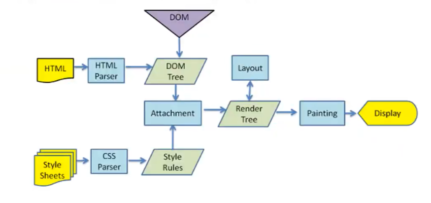

浏览器将 HTML 文件变成你眼前看到的网页，经历以下五个阶段：

1. **加载资源**
    下载 HTML 文件和 CSS 样式表。
2. **构建 DOM 与样式规则**
   - 解析 HTML → 生成 **DOM 树**（页面结构）
   - 解析 CSS → 生成 **Style Rules**（样式规则）
3. **生成渲染树（Render Tree）**
    将 DOM 与样式规则结合，**只保留可见元素**，形成 Render Tree。
4. **布局（Layout / Reflow）**
    计算每个元素的**位置、大小**（考虑容器、margin、定位、字体等）。
5. **绘制与显示（Painting → Display）**
   - **Painting**：将元素绘制成像素（颜色、文字、边框等）
   - **Display**：最终呈现在屏幕上

> 🌟 **一句话总结**：
>  浏览器先解析 HTML 和 CSS，构建 DOM 与样式；合并成渲染树后，计算布局、绘制像素，最终显示网页。

解释：

浏览器首先下载 HTML 和 CSS 文件；接着，它一边解析 HTML 构建出表示页面结构的 **DOM 树**，一边解析 CSS 生成 **样式规则**；然后，把这两者结合起来，为每个可见元素配上样式，形成 **渲染树（Render Tree）**；再根据渲染树计算每个元素的位置和大小（这叫 **布局** 或 **重排**）；之后，把所有元素绘制成像素（这叫 **绘制** 或 **重绘**）；最后，把这些像素显示在屏幕上，你就看到了完整的网页。


**浏览器内核和JS 引擎的关系**

浏览器内核负责“渲染页面”，JavaScript 引擎负责“执行脚本”，两者通过 DOM/CSSOM 接口紧密协作——内核提供舞台，JS 引擎在舞台上“表演”，但最终画面由内核绘制。

- **浏览器内核**（如 Blink）：负责**渲染页面**（HTML/CSS 解析、布局、绘制）。
- **JavaScript 引擎**（如 V8）：负责**执行 JS 代码**。

🔗 二者如何协作？

- 内核在解析 HTML 时遇到 `<script>`，会**暂停解析**，调用 JS 引擎执行脚本。
- JS 引擎通过内核提供的 **DOM/CSSOM 接口** 操作页面（如 `document.getElementById`）。
- 页面更新后，内核**重新渲染**（可能触发重排/重绘）。

> 🎭 **比喻**：
>  内核是“舞台”，JS 引擎是“演员”。演员不能自己搭台，但可以在舞台上表演；最终画面由舞台呈现。


### V8引擎

定义：v8是用**C++**编写的谷歌开源高性能JS和WebAssembly引擎，用于谷歌和Node.JS

作用：将JS 代码直接转换为机器码以便计算机能真正理解代码，然后执行转换或编译后的代码

支持在以下系统上运行：

- Windows 7 或更高版本
- macOS 10.12 及以上版本
- 使用 x64、IA-32、ARM 或 MIPS 处理器的 Linux 系统

v8也可以独立运行，也可以嵌入到任何C++应用程序中

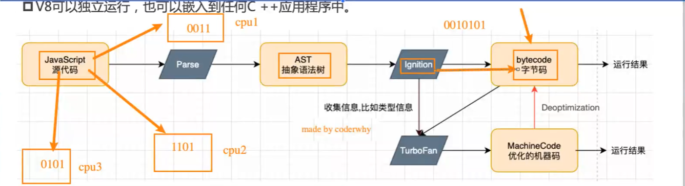

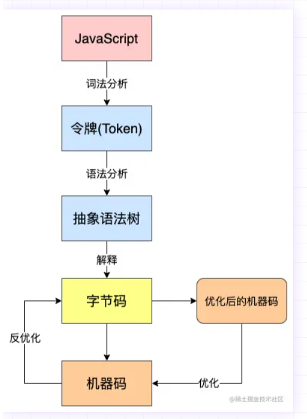

JavaScript 源代码首先经过**词法分析和语法分析**，被解析成一棵**抽象语法树（AST）**；然后由 **Ignition** 将 AST 编译为**字节码**并快速执行，同时收集运行时信息（如变量类型）；如果某段代码频繁执行，**TurboFan** 会根据这些信息将其优化为高效的**机器码**以提升性能；当运行时假设不成立时，会触发**去优化（Deoptimization）**，退回到字节码继续执行。整个过程实现了“快启动 + 高性能”的平衡。


四个关键组件：**Ignition、TurboFan、Orinoco 和 SparkPlug**

**Ignition：字节码解释器**

定义：

Ignition 是 V8 的**解释器**，它将 JavaScript 源代码先解析为**抽象语法树（AST）**，再编译成一种紧凑的**字节码（Bytecode）**，然后直接解释执行这些字节码。

作用：

Ignition 就是一个专门负责读取并执行字节码的解释器，它是 V8 实现快速启动和收集优化情报的关键部件。


**TurboFan：优化编译器**

定义：

TurboFan 是 V8 的**高级优化编译器**，负责将热点函数（频繁执行的代码）从字节码进一步编译为**高度优化的本地机器码**。

作用：

这是 TurboFan 最聪明的地方，它**不随意优化**，它的优化完全依赖于 Ignition 收集的性能反馈数据

负责把 JavaScript 那些高级、花哨的语法（如 async/await），在背后转换成扎实、高效的底层代码，让我们既能写得爽，又能跑得快

如果运行时假设错误（如变量类型变化），会触发 **deoptimization（去优化）**，回退到 Ignition 字节码继续执行。


**SparkPlug：快速编译器（介于 Ignition 与 TurboFan 之间）**

定义：

填补 Ignition 和 TurboFan 之间的性能鸿沟

作用： 

在 **“启动速度”** 和 **“执行速度”** 之间取一个非常好的平衡点。比纯解释执行快，又比等待深度优化编译要快得多。

代码运行起来非常稳定，永远不会因为猜错而退回重新执行。


 **Orinoco：并发垃圾回收器（GC）**

定义：

Orinoco 是 V8 的**新一代垃圾回收系统**，核心目标是**减少主线程停顿（stop-the-world）时间**，提升应用响应性（尤其对动画、游戏、实时应用至关重要）。

作用：

自动内存管理：回收不再使用的对象，防止内存泄漏。

并发 & 并行

- **并发（Concurrent）**：GC 工作与主线程同时进行（不阻塞 JS 执行）。
- **并行（Parallel）**：多个 GC 线程同时工作，加速回收。

支持多种 GC 算法：

- **Scavenger**：用于新生代（Young Generation），快速回收短命对象。
- **Mark-Compact**：用于老生代（Old Generation），处理长存活对象。


### JavaScript 执行过程

（执行上下文）

**后进先出**

```js
var name = "why";

foo(123);

function foo(num) {
  console.log(m); // 这里会报错？为什么？
  var m = 10;
  var n = 20;

  function bar() {
    console.log(name); // 查找 name 变量
  }

  bar();
}
```

关键点：

- `name` 是全局变量。
- `foo` 函数被调用时传入参数 `num = 123`。
- 在 `foo` 内部定义了局部变量 `m`, `n` 和嵌套函数 `bar`。
- `bar()` 调用了 `console.log(name)`，需要查找 `name`。

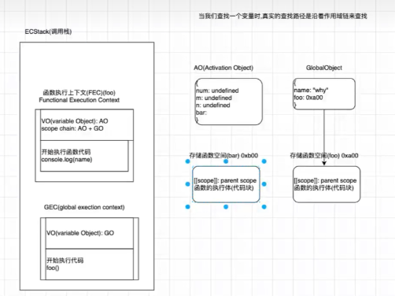

**中间：ECStack（调用栈）**

1. **GEC（全局执行上下文）**

- 包含全局变量对象 `GO`（Variable Object）
- 执行代码：`foo(123)` → 触发函数调用

2. **FEC（函数执行上下文） - foo**

- 当 `foo(123)` 被调用时，创建新的执行上下文并压入栈顶
- 包含：
  - `VO(AO)`：激活对象，存储函数内部变量和参数
  - `scope chain`: `AO + GO`（作用域链）
  - 正在执行：`console.log(name)`（来自 `bar()`）

> 💡 `bar()` 是在 `foo` 内部定义的，所以它的作用域链也继承自 `foo` 的上下文。


**右侧：对象与作用域关系**

**AO** (Activation Object) — `foo` 的激活对象

```js
{
  num: 123,
  m: undefined,  // 因为变量提升，先声明后赋值
  n: undefined,
  bar: 0xb00     // 指向 bar 函数的内存地址
}
```

- 参数 `num` 赋值为 `123`
- 局部变量 `m`, `n` 在声明前为 `undefined`
- `bar` 是一个函数引用

**GlobalObject**

```js
{
  name: "why",
  foo: 0xa00
}
```

- 存储全局变量 `name` 和全局函数 `foo`

**函数存储空间**

- `foo` 存储在内存地址 `0xa00`
- `bar` 存储在内存地址 `0xb00`
- 每个函数都有自己的 `[[scope]]` 链接父级作用域

**作用域链详解**

当 `bar()` 执行 `console.log(name)` 时，JavaScript 引擎如何查找 `name`？

1. 第一步：检查当前作用域（bar 的 AO）
   - `bar` 的 AO 中没有 `name`
2. 第二步：向上查找父级作用域（即 foo 的 AO）
   - `foo` 的 AO 也没有 `name`
3. 第三步：继续向上到全局作用域（GlobalObject）
   - 找到 `name: "why"`

✅ 最终输出：`"why"`


#### JS的执行过程

```
JS 源码
   ↓（解析）
词法分析 → 语法分析 → AST
   ↓
GEC(VO: GO;全局变量和函数声明)
   ↓
CEStack执行栈
   ↓
Ignition 编译 → 字节码 → 执行 + 收集反馈
   ↓（若为热点代码）
TurboFan 优化 → 机器码 → 高速执行
   ↓（若类型变化）
Deoptimization → 回退到字节码
   ↓
变量赋值，函数调用 → FEC(VO:AO ; 函数中的变量和函数声明)
   ↓
运行结束
```

JavaScript 代码先被解析为 AST，再由解释器（如 Ignition）编译成字节码并执行；热点代码会被优化编译器（如 TurboFan）转为高效机器码；若优化假设失败则回退；整个过程由垃圾回收器自动管理内存，并通过宿主环境（如浏览器）实现与外部世界的交互。


GEC（global excution context）全局执行上下文，执行全局代码

FEC（Function Execution Context）函数执行上下文，在调用函数的时候创建的执行环境

VO：每个执行上下文内部用于存储变量和函数声明的抽象容器

GO：全局执行上下文中的 VO，即全局对象（如浏览器中的 `window`）

AO：函数执行上下文中的 VO，用于存放形参、`arguments`、`var` 和函数声明


#### 变量环境

（Variable Environment）

> **ES2015（ES6）引入了更严谨的“词法环境”（Lexical Environment）模型**，将变量的管理分为两个部分：变量环境、环境记录

定义

变量环境是表示当前执行上下文中变量绑定的容器，它是执行上下文的一部分，用于存放通过 `var`、`function`、`let`、`const` 声明的变量。

特点

- 每个执行上下文都有自己的变量环境。
- 它不是直接可访问的对象，而是引擎内部使用的结构。
- 它包含一个指向环境记录（Environment Record）的引用。

#### 环境记录

（Environment Record）

**定义**

环境记录是**实际存储变量名**和**值的数据结构**，它记录了所有在当前作用域中声明的标识符（如变量、函数、参数等）。

**分类**

| 类型                           | 说明                                                         |
| ------------------------------ | ------------------------------------------------------------ |
| Object Environment Record      | 用于全局上下文，变量绑定到全局对象上（如 window）。          |
| Function Environment Record    | 用于函数上下文，包含形参、arguments、函数声明等。            |
| Declarative Environment Record | 用于 let、const、class 等块级作用域变量，不会提升到全局对象，且有“暂时性死区”（TDZ）保护。 |

**变量环境 vs 环境记录的关系**

变量环境是一个“容器”，它指向一个“环境记录”，而环境记录才是真正存储变量绑定的地方。

```
执行上下文
│
├── 变量环境（Variable Environment）
│   └── → 环境记录（Environment Record）
│       ├── 标识符：a, b, c, d ...
│       └── 值：1, 2, 3, 4 ...
│
└── 词法环境（Lexical Environment） ← 用于作用域链查找
```

**与旧概念的对应关系**

| 旧术语                  | 新术语                                      | 说明                                 |
| ----------------------- | ------------------------------------------- | ------------------------------------ |
| VO（Variable Object）   | Variable Environment + Environment Record   | 被拆分成了两个更清晰的部分           |
| GO（Global Object）     | Object Environment Record                   | 全局变量绑定到全局对象（如 window）  |
| AO（Activation Object） | Function Environment Record                 | 函数内的变量和参数存储在这里         |
| var 声明                | → 存入 Object / Function Environment Record | 会被提升，且挂到全局对象或函数上下文 |
| let/const 声明          | → 存入 Declarative Environment Record       | 不提升，有 TDZ，不会污染全局         |

**这个变化的重要性**

- 支持块级作用域：`let` 和 `const` 不再被提升到全局对象，避免污染。
- 支持暂时性死区（TDZ）：在声明前访问 `let/const` 会报错，提高安全性。
- 更清晰的作用域模型：区分了“变量绑定”和“作用域链”的不同层次。


```
执行上下文
│
├── 变量环境（Variable Environment）
│   └──→ 环境记录（Environment Record）
│       ├── Object Environment Record (全局)
│       ├── Function Environment Record (函数)
│       └── Declarative Environment Record (块级)
│
└── 词法环境（Lexical Environment）
    └──→ 父级词法环境（Parent Lexical Environment）
        └──→ ... (直到全局环境)
```


###  认识内存管理

定义：不管什么样的编程语言，在代码的执行过程中都是需要给他分配内存的，不同的是某些编程语言需要我们自己手动的管理内存，某些变成语言会可以自动帮助我们管理内存

**内存的生命周期**

不管什么程序语言，内存生命周期基本是一致的：

1. 分配你所需要的内存
2. 使用分配到的内存（读、写）
3. 不需要时将其释放

在所有语言中，第二点都是显式的。在底层语言中，第一点和第三点是显式的，但在高级语言中（如 JavaScript），大多数是隐式的。

**内存管理的两种模式对比**：

| 类型             | 代表语言                                 | 特点                                                         | 示例                                     |
| ---------------- | ---------------------------------------- | ------------------------------------------------------------ | ---------------------------------------- |
| **手动管理内存** | C、C++、早期 Objective-C                 | 需开发者显式申请和释放内存，使用如 `malloc` 和 `free` 等函数 | `malloc()` 分配，`free()` 释放           |
| **自动管理内存** | Java、JavaScript、Python、Swift、Dart 等 | 由运行时环境（如垃圾回收机制 GC）自动处理内存分配与释放      | 开发者无需手动释放，系统自动回收无用对象 |


### JS内存管理


#### 内存分配的基本概念

JavaScript 在定义变量时会自动为我们分配内存，但根据数据类型的不同，内存的分配方式也会有所不同。

#### JavaScript 数据类型与内存分配

##### **基本数据类型**（`string`、`number`、`boolean` 等）

**存储位置**：栈（Stack）

**特点**：值直接存于栈中

示例

```js
let name = "why";   // "why" 直接存栈
let age = 18;       // 18 直接存栈
```

##### **复杂数据类型**（对象、数组、函数等）

存储位置

- 实际数据 → 堆（Heap）
- 变量（引用）→ 栈中存指向堆的指针

**特点**：栈存引用，堆存内容

示例

```js
let obj = {name: "kobe", age: 40};   // 对象内容在堆，obj 在栈中存引用
let names = ["abc", "cba"];          // 数组内容在堆，names 在栈中存引用
```

 

### JS的垃圾回收

##### GC是什么？

`GC` 即 `Garbage Collection` ，程序工作过程中会产生很多 `垃圾`，这些垃圾是程序不用的内存或者是之前用过了，以后不会再用的内存空间，而 `GC` 就是负责回收垃圾的。

因为他工作在引擎内部，所以对于我们前端来说，`GC` 过程是相对比较无感的，这一套引擎执行而对我们又相对无感的操作也就是常说的 `垃圾回收机制` 了

当然也不是所有语言都有 `GC`，一般的高级语言里面会自带 `GC`，比如 `Java、Python、JavaScript` 等，也有无 `GC` 的语言，比如 `C、C++` 等，那这种就需要我们程序员手动管理内存了，相对比较麻烦


##### 为什么需要内存回收？

- 创建变量、对象、函数等都会占用内存。
- JavaScript 引擎自动分配内存，**我们不用手动管理**。
- 但当某些数据**不再被使用**时，如果不清理，内存会越占越多 → **内存泄漏** → 程序变慢甚至崩溃。

```js
let test = { name: "isboyjc" };  // test 引用一个对象（堆中）
test = [1, 2, 3, 4, 5];         // test 现在引用一个数组
```

> 原来的 `{ name: "isboyjc" }` **不再被任何变量引用**。
>
> 它变成“无用对象”，但还占着堆内存。


##### JavaScript 怎么清理无用对象？

- 使用 **垃圾回收机制（Garbage Collection, GC）**。

- 核心思想：**自动找出不再被引用的对象，释放其内存**。

- 最常用策略：

  可达性分析（Mark-and-Sweep）

  - 从“根对象”（如全局变量）出发，追踪所有能访问到的对象。
  - **无法到达的对象 = 垃圾 → 被回收**


##### 垃圾回收

- JavaScript **自动管理内存**，不需要手动释放。
- 当变量/对象 **不再被使用（不可达）**，引擎会自动回收其占用的内存。


##### 垃圾回收算法

######  **标记清除算法**（Mark-Sweep）✅ **主流方案**

定义：**通过两个主要阶段来回收内存：标记阶段，它从根对象（如全局对象、文档DOM树等）开始遍历，标记所有可达的对象；清除阶段，它会删除所有未被标记的对象，释放其内存空间**

标记阶段

1. **初始化标记**：垃圾回收器首先假设内存中的所有对象都是垃圾，并为它们打上“未标记”的标记（例如，在对象的某个二进制位上标记为“0”）。
2. **从根对象开始遍历**：从一组根对象（如全局 `window` 对象、文档DOM树等）开始，垃圾回收器会深度优先地遍历所有可达的对象。
3. **标记可达对象**：在遍历过程中，每访问到一个对象，就会将其标记为“可达”（例如，将标记改为“1”），表示这个对象是活动的，不会被回收。
4. **遍历引用的所有对象**：它会继续遍历被标记对象的引用，并将所有通过这些引用能够访问到的对象都标记为“可达”，以确保所有活动的引用链条上的对象都被标记。 

清除阶段

1. **回收未标记对象**：在标记阶段结束后，垃圾回收器会遍历整个内存空间。所有仍处于“未标记”状态的对象都被视为是不可达的垃圾。
2. **释放内存**：这些未被标记的对象所占用的内存空间将被回收并释放。
3. **重置标记**：最后，所有对象都会被重新标记为“未标记”（或“垃圾”），为下一轮的垃圾回收做准备。 

算法优点与缺点

- **优点**：
  - **处理循环引用**：它能有效地处理循环引用的情况，这是引用计数算法的一个主要缺点。
  - **简单易实现**：算法本身相对简单。
- **缺点**：
  - **性能影响**：在执行时可能会产生一个较长的“停止一切”（stop-the-world）暂停，对程序性能造成影响。
  - **现代引擎的优化**：现代JavaScript引擎通常会使用增量标记-整理算法等优化技术来缓解标记清除算法的暂停问题。 


### 闭包

#### 定义

1. 在计算机科学里
   - **闭包**（英语：Closure），又称**词法闭包**（Lexical Closure）或**函数闭包**（function closures）；
   - 是在支持**头等函数**的编程语言中，实现**词法绑定**的一种技术；
   - 闭包在实现上是一个结构体，它存储了一个函数和一个关联的环境（相当于一个符号查找表）；
   - 闭包跟函数最大的区别在于，当捕捉闭包的时候，**它的自由变量会在补充时被确定，这样即使脱离了捕捉时的上下文，它也能照常运行。**

2.  对 JavaScript 闭包的解释：
   - **一个函数**和对其**周围状态**（lexical environment，词法环境）的引用**捆绑在一起**（或者说函数被引用包围），这样的组合就是**闭包**（closure）；
   - 也就是说，闭包让你可以在一个内层函数中访问到其外层函数的作用域；
   - 在 JavaScript 中，**每当创建一个函数，闭包就会在函数创建的同时被创建出来。**

 

```js
function foo(){
	function bar(){
		console.log("bar")
	}
	return bar
}
var fn = foo() 
fn() 
```

理解闭包：

其实可以用一句话说明闭包：JS中一个函数，可以访问外层作用域的变量，那么他就是一个闭包

- 一个普通的函数 function，如果它可以**访问外层作用域**的自由**变量**，那么这个函数就是一个闭包；
- 从广义的角度来说：JavaScript 中的函数都是闭包；
- 从狭义的角度来说：JavaScript 中一个函数，如果**访问了外层作用域**的**变量**，那么它是一个闭包。


#### 闭包的表现形式

##### 返回一个函数

当一个函数内部定义了另一个函数，并将这个内部函数作为返回值返回时，就形成了一个闭包。返回的这个函数可以访问外部函数中的变量，即使外部函数已经执行完毕并且其内部变量已经被销毁。

```js
function outer() {
  var count = 0;
  function inner() {
    count++;
    console.log(count);
  }
  return inner;
}
var closure = outer();
closure(); // 输出1
closure(); // 输出2
closure(); // 输出3

```

在这个例子中，函数 outer 内部定义了一个函数 inner，并将其返回。变量 count 也定义在 outer 函数内部。
执行 outer 函数会返回函数 inner，将其赋值给变量 closure。
然后调用 closure 函数，由于 closure 函数是由 outer 函数返回的 inner 函数，所以它可以访问 outer 函数内部的变量 count。因此每次调用 closure 函数都会输出一个累加的数值。

##### 定义一个函数

在 JavaScript 中，通过定义一个函数并在该函数内部定义另一个函数，也可以形成一个闭包。这时需要将内部函数作为返回值返回，以便在外部调用。

```js
function makeCounter() {
  var count = 0;
  function counter() {
    count++;
    console.log(count);
  }
  return counter;
}
var closure = makeCounter();
closure(); // 输出1
closure(); // 输出2
closure(); // 输出3

```

在这个例子中，函数 makeCounter 内部定义了函数 counter，并将其返回。变量 count 也定义在 makeCounter 函数内部。
执行 makeCounter 函数会返回函数 counter，将其赋值给变量 closure。
然后调用 closure 函数，由于 closure 函数是由 makeCounter 函数返回的 counter 函数，所以它可以访问 makeCounter 函数内部的变量 count。因此每次调用 closure 函数都会输出一个累加的数值。


#### 闭包的内存泄漏 

#####  闭包的缺点

大量使用闭包，造成内存占用空间增大，有内存泄露的风险

##### 如何避免闭包引起的内存泄漏

1. 在退出函数之前，将不使用的局部变量**赋值为null**;

```js
 这段代码会导致内存泄露
    window.onload = function(){
        var el = document.getElementById("id");
        el.onclick = function(){
            alert(el.id);
        }
    }
    解决方法为
    window.onload = function(){
        var el = document.getElementById("id");
        var id = el.id;                                      //解除循环引用
        el.onclick = function(){
            alert(id); 
        }
        el = null;                                          // 将闭包引用的外部函数中活动对象清除
    }

```

2. 避免变量的循环赋值和引用。 （示例如上）

循环引用引起的内存泄漏，是因为IE 的bug，循环引用无法自动判断，所以通过拷贝值，把内外引用脱钩，这样就可回收。IE9及其以后已修复。

3. 利用Jquery释放自身指定的所有事件处理程序。

**由于jQuery考虑到了内存泄漏的潜在危害，所以它会手动释放自己指定的所有事件处理程序。** 只要坚持使用jQuery的事件绑定方法，就可以一定程度上避免这种特定的常见原因导致的内存泄漏。

```js
这段代码会导致内存泄露
$(document).ready(function() {
    var button = document.getElementById('button-1');
    button.onclick = function() {
         console.log('hello');
         return false;
    };
});
当指定单击事件处理程序时，就创建了一个在其封闭的环境中包含button变量的闭包。而且，现在的button也包含一个指向闭包（onclick属性自身）的引用。这样，就导致了在IE中即使离开当前页面也不会释放这个循环。

用jQuery化解引用循环
$(document).ready(function() {
    var $button = $('#button-1');
    $button.click(function(event) {
        event.preventDefault();
        console.log('hello');
    });
});

```


##### js闭包引用的自由变量销毁

```js
function foo(){
	var name = 'why'
	var age = 18
	
	function bar(){
		debugger
		console.log(name)
		console.log(age)
	}
	return bar
}
var fn = foo()
fn()
```

**AO对象不会被销毁时，并非里面所有的属性都不会被销毁。**

name和age都是闭包的父级[作用域](https://so.csdn.net/so/search?q=作用域&spm=1001.2101.3001.7020)里的变量，形成闭包后，name一定不会被销毁，但age会被销毁（js v8引擎为了性能，会销毁不使用的属性）


#### 闭包常见应用场景

##### 柯里化函数

为了避免频繁地调用具有相同参数的函数，可以将一个多参数的函数转化为一个单参数的函数，
其实就是一个高阶函数

```js
//普通函数
function getArea(w,h){
    return w * h;
}
const area1 = getArea(10,20);
const area2 = getArea(10,30);
const area3 = getArea(10,40);

//柯里化函数
function getArea(w){
    return function(h){
        return w * h;
    }
}
const getTenArea = getArea(10);

const area1 = getTenArea(20);
const area2 = getTenArea(30);
const area3 = getTenArea(40);
```

##### 通过闭包实现变量/方法的私有化

```js
function funOne(i){
    function getTwo(){
        console.log('参数：', i)
    }
    return getTwo;
}
const fa = funOne(100); 
const fb = funOne(200); 
const fc = funOne(300); 
```

##### 匿名执行函数

```js
var funOne = (function(){
    var num = 0;
    return function(){
        num++;
        return num;
    }
})()

console.log(funOne());   // 1
console.log(funOne());   // 2
console.log(funOne());   // 3 


```

##### 缓存一些结果

比如：外部函数定义一个变量，内部函数可以获取或修改这个变量的值，从而就延长了这个变量的生命周期

```js
function parent(){
    let list = [];
    function son(i){
        list.push(i);
    }
    return son;
}

const fn = parent();

fn(1);
fn(2);
fn(3);


```


###  JS函数的this指向

#### JS函数中this的指向

JS函数的 `this` 指向取决于函数是如何被调用的，而不是定义时。在**对象方法**中，`this` 指向调用该方法的对象；在**普通函数**调用中，`this` 指向全局对象（非严格模式下是 `window`）；在**箭头函数**中，`this` 继承自其外层作用域。此外，`apply()`、`call()` 和 `bind()` 方法可以显式地改变函数的 `this` 指向。 

```js
// 从某些角度来说，开发中如果没有this，很多的问题我们也是有解决方案
// 但是没有this，会让我们编写代码变得非常的不方便

var obj100 = {
    name: "why",
    eating: function() {
        console.log(this.name + "在吃东西")
    },
    running: function() {
        console.log(this.name + "在跑步")
    },
    studying: function() {
        console.log(this.name + "在学习")
    }
}

var info = {
    name: "why",
    eating: function() {
        console.log(this.name + "在吃东西")
    },
    running: function() {
        console.log(this.name + "在跑步")
    },
    studying: function() {
        console.log(this.name + "在学习")
    }
}
```


1. 方法调用模式下，this 总是指向调用它所在方法的对象，this 的指向与所在方法的调用位置有关，而与方法的声明位置无关（箭头函数特殊）；

2. 函数调用下，this 指向 window ,调用方法没有明确对象的时候，this 指向 window，如 setTimeout、匿名函数等；

3. 构造函数调用模式下，this 指向被构造的对象；

4. apply,call,bind 调用模式下，this 指向第一个参数；

5. 箭头函数，在声明的时候绑定this，而非取决于调用位置；

6. 严格模式下，如果 this 没有被执行环境（execution context）定义，那 this是 为undefined；


#### 绑定规则

##### 默认绑定

- **规则：** 函数被独立调用时，`this`指向全局对象。在严格模式下，`this`会绑定到`undefined`。

- **场景：** 单独调用一个函数，例如

  ```js
   function greet() { 
       console.log(this); 
   } greet();
  ```

##### 隐式绑定

- **规则：** 当函数被作为对象的方法调用时，`this`指向该对象。

- **场景：** 调用一个对象的方法，例如

  ```js
   let obj = { 
   	name: 'Alice', 
       sayHello: function() { 
           console.log(this.name); 
       } 
   }; 
  obj.sayHello();
  ```

##### 显示绑定

- **规则：** 使用 [call()](https://www.google.com/search?q=call()&sca_esv=f5b5a348d766e74b&authuser=0&biw=1536&bih=730&sxsrf=AE3TifMO1n1XXignLWznGiXe9HN7RxqS6A%3A1761792109887&ei=bdACadj0NYCq5NoPgsHLKA&ved=2ahUKEwjqwIrC9MqQAxXTsVYBHZqrI7EQgK4QegQIBxAB&uact=5&oq=this的绑定规则&gs_lp=Egxnd3Mtd2l6LXNlcnAiE3RoaXPnmoTnu5Hlrprop4TliJkyCBAAGIkFGKIEMgUQABjvBTIFEAAY7wUyBRAAGO8FMgUQABjvBUjdQFCbCFiIPXACeACQAQGYAYECoAGiKqoBBjAuMjMuNrgBA8gBAPgBAZgCFqAC7ByoAgrCAgoQABhHGNYEGLADwgIEECMYJ8ICBRAAGIAEwgIKEAAYgAQYigUYQ8ICBxAjGOoCGCfCAgcQLhjqAhgnwgIIEAAYgAQYsQPCAhEQLhiABBixAxiDARjHARjRA8ICCxAAGIAEGLEDGIMBwgIOEC4YgAQYigUYsQMYgwHCAg4QABiABBiKBRixAxiDAcICCxAuGIAEGMcBGNEDwgIFEC4YgATCAggQABiABBjLAcICChAAGIAEGMsBGArCAgoQLhiABBjLARgKwgIIEAAYgAQYogSYAwSIBgGQBgqSBwYyLjE2LjSgB-tfsgcGMC4xNi40uAfiHMIHBjEuMTUuNsgHLg&sclient=gws-wiz-serp&mstk=AUtExfDktaeqTmupKCKV_jMau-gjinuFl59toy7A2tvMhIZ2WkwtBDhiNs7cmHLTCI6YK7ZF4IGw7rHOZwtn8rjf03HETGjTTktZcWEOfqbPXHbjjk4SLSKgfhy3SMxhfnIZRbwrPGjBvmp3VHjW-b4PNOREbTDJwA2RegYMVndslW5KnEed6dj9E144JhcXm6PesyVi8bkrTFwxa_0kbyJsWo32wEFdUkJQ5N6SgXUJ7p6xMpkjM91UHzxyeYHG9pp4ydHnF5vjlVRQVvXGxMGU_9zVIgnZXt1tBtUYHJ6gMFjL0Q&csui=3)、[apply()](https://www.google.com/search?q=apply()&sca_esv=f5b5a348d766e74b&authuser=0&biw=1536&bih=730&sxsrf=AE3TifMO1n1XXignLWznGiXe9HN7RxqS6A%3A1761792109887&ei=bdACadj0NYCq5NoPgsHLKA&ved=2ahUKEwjqwIrC9MqQAxXTsVYBHZqrI7EQgK4QegQIBxAC&uact=5&oq=this的绑定规则&gs_lp=Egxnd3Mtd2l6LXNlcnAiE3RoaXPnmoTnu5Hlrprop4TliJkyCBAAGIkFGKIEMgUQABjvBTIFEAAY7wUyBRAAGO8FMgUQABjvBUjdQFCbCFiIPXACeACQAQGYAYECoAGiKqoBBjAuMjMuNrgBA8gBAPgBAZgCFqAC7ByoAgrCAgoQABhHGNYEGLADwgIEECMYJ8ICBRAAGIAEwgIKEAAYgAQYigUYQ8ICBxAjGOoCGCfCAgcQLhjqAhgnwgIIEAAYgAQYsQPCAhEQLhiABBixAxiDARjHARjRA8ICCxAAGIAEGLEDGIMBwgIOEC4YgAQYigUYsQMYgwHCAg4QABiABBiKBRixAxiDAcICCxAuGIAEGMcBGNEDwgIFEC4YgATCAggQABiABBjLAcICChAAGIAEGMsBGArCAgoQLhiABBjLARgKwgIIEAAYgAQYogSYAwSIBgGQBgqSBwYyLjE2LjSgB-tfsgcGMC4xNi40uAfiHMIHBjEuMTUuNsgHLg&sclient=gws-wiz-serp&mstk=AUtExfDktaeqTmupKCKV_jMau-gjinuFl59toy7A2tvMhIZ2WkwtBDhiNs7cmHLTCI6YK7ZF4IGw7rHOZwtn8rjf03HETGjTTktZcWEOfqbPXHbjjk4SLSKgfhy3SMxhfnIZRbwrPGjBvmp3VHjW-b4PNOREbTDJwA2RegYMVndslW5KnEed6dj9E144JhcXm6PesyVi8bkrTFwxa_0kbyJsWo32wEFdUkJQ5N6SgXUJ7p6xMpkjM91UHzxyeYHG9pp4ydHnF5vjlVRQVvXGxMGU_9zVIgnZXt1tBtUYHJ6gMFjL0Q&csui=3) 或 [bind()](https://www.google.com/search?q=bind()&sca_esv=f5b5a348d766e74b&authuser=0&biw=1536&bih=730&sxsrf=AE3TifMO1n1XXignLWznGiXe9HN7RxqS6A%3A1761792109887&ei=bdACadj0NYCq5NoPgsHLKA&ved=2ahUKEwjqwIrC9MqQAxXTsVYBHZqrI7EQgK4QegQIBxAD&uact=5&oq=this的绑定规则&gs_lp=Egxnd3Mtd2l6LXNlcnAiE3RoaXPnmoTnu5Hlrprop4TliJkyCBAAGIkFGKIEMgUQABjvBTIFEAAY7wUyBRAAGO8FMgUQABjvBUjdQFCbCFiIPXACeACQAQGYAYECoAGiKqoBBjAuMjMuNrgBA8gBAPgBAZgCFqAC7ByoAgrCAgoQABhHGNYEGLADwgIEECMYJ8ICBRAAGIAEwgIKEAAYgAQYigUYQ8ICBxAjGOoCGCfCAgcQLhjqAhgnwgIIEAAYgAQYsQPCAhEQLhiABBixAxiDARjHARjRA8ICCxAAGIAEGLEDGIMBwgIOEC4YgAQYigUYsQMYgwHCAg4QABiABBiKBRixAxiDAcICCxAuGIAEGMcBGNEDwgIFEC4YgATCAggQABiABBjLAcICChAAGIAEGMsBGArCAgoQLhiABBjLARgKwgIIEAAYgAQYogSYAwSIBgGQBgqSBwYyLjE2LjSgB-tfsgcGMC4xNi40uAfiHMIHBjEuMTUuNsgHLg&sclient=gws-wiz-serp&mstk=AUtExfDktaeqTmupKCKV_jMau-gjinuFl59toy7A2tvMhIZ2WkwtBDhiNs7cmHLTCI6YK7ZF4IGw7rHOZwtn8rjf03HETGjTTktZcWEOfqbPXHbjjk4SLSKgfhy3SMxhfnIZRbwrPGjBvmp3VHjW-b4PNOREbTDJwA2RegYMVndslW5KnEed6dj9E144JhcXm6PesyVi8bkrTFwxa_0kbyJsWo32wEFdUkJQ5N6SgXUJ7p6xMpkjM91UHzxyeYHG9pp4ydHnF5vjlVRQVvXGxMGU_9zVIgnZXt1tBtUYHJ6gMFjL0Q&csui=3) 方法**明确**指定函数中的`this`指向。

- **场景**

  ```js
  function greet() { 
      console.log(this); 
  } 
  greet.call({ 
      name: 'Bob' 
  });
  ```

##### `new`绑定

- **规则：** 当使用 `new` 操作符调用函数时，会创建一个新对象，并且函数内部的`this`被绑定到这个新对象上。

- **场景：** 使用 `new` 创建一个对象实例，例如

  ```js
  function Person(name) { 
      this.name = name; 
  } 
  let person = new Person('Charlie');
  ```

```js
var obj = {
    name: "obj",
    foo: function() {
        console.log(this)
    }
}

var f = new obj.foo()
console.log(f) // 输出新创建的对象实例
```

理解：new就是在堆中创建了一个对象，然后将构造函数中的this指向了这个对象并且在对象中添加了对象原型指回构造函数的原型对象，并且继承来constructor属性指回构造函数，之后调用构造函数，相当于我们手动使用对象名.属性名 = 属性值这样，巧妙地利用了new会修改this的指向，使用 new创建的对象.属性名 = 属性值，new创建的对象.方法名 = 函数 这样来为实例化的对象创建和构造函数一样解构的属性名和属性值，然后再将new创建的对象的地址赋给引用数据类型的变量，如果我new一次后打印构造函数的this值，那指向的应该是刚刚创建的对象


##### 箭头函数绑定

- **规则：** 箭头函数不绑定自己的`this`，它会捕获其所在作用域的`this`值。

-  **场景：** 在普通函数中使用箭头函数，箭头函数的`this`与外部普通函数相同，例如

  ```js
  function Outer() { 
      this.name = 'Outer'; 
      setTimeout(() => { 
          console.log(this.name); 
      }, 1000); 
  } 
  new Outer();
  ```

  

####  规则优先级

优先级从高到低是：new绑定 > 显示绑定 > 隐式绑定 > 默认绑定

当多种绑定规则同时存在时，优先级高的规则会覆盖优先级低的规则

优先级规则

- **最高优先级：`new` 绑定**
  - 当使用 `new` 关键字调用函数时，`this` 会指向新创建的对象，这是最高优先级的规则。
- **次高优先级：显式绑定**
  - 通过 `call()`、`apply()` 和 `bind()` 方法手动指定 `this` 的值，优先级高于隐式绑定和默认绑定。
  - `new` 绑定不能与 `call` 和 `apply` 同时使用，而 `new` 绑定可以与 `bind` 结合使用，但 `new` 绑定优先级更高，它会忽略掉 `bind` 的绑定。
- **中间优先级：隐式绑定**
  - 当函数作为对象的方法调用时（例如 `obj.foo()`），`this` 会指向该对象 `obj`。
- **最低优先级：默认绑定**
  - 当函数作为普通函数独立调用时（例如 `foo()`），`this` 默认指向全局对象（浏览器中的 `window` 对象，或在严格模式下是 `undefined`）。 


#### 特殊绑定

##### 箭头函数 

箭头函数不会绑定this、arguments属性；箭头函数不能作为**构造函数**来始用

由三部分组成：1. （）：参数 ； 2.  => 箭头  ； 3.  {} ：函数的执行体

> 高阶函数在使用时，可以传入箭头函数

```js
var num = [10,20,30,40,50]
nums.forEach((item,index,arr) => {})
```

箭头函数有一些常见的简写

1. 如果参数只有一个，（）可以省略

```js
nums.forEach(item => {
	console.log(item)
})
```

2. 如果函数执行体只有一行代码，那么{}可以省略

```js
nums.forEach(item => console.log(item))
```

3. 如果一个箭头函数，只有一行代码，并且返回一个对象，这个时候如何编写简写

```js
var bar = () => {
    return {name:"why",age:19}
}

// 简写,箭头右边加小括号，是把小括号内部的内容当成一个整体
var bar = () => ({name:"why",age:19})
```


##### 忽略显示绑定

如果在显示绑定中，我们传入一个null或者undefined，那么这个显示绑定会被忽略，使用默认规则

```js
    <script>
        function fn() {
            console.log(this);
        }
        fn.apply({name:'wc'}) //{name:'wc'}

        fn.apply(null);//window
        fn.apply(undefined);//window
        var gn = fn.bind(null);
        gn();//window
    </script>

```


##### 间接函数引用

 间接调用是通过函数引用、apply、call 等方式调用其他方法

```js
    <script>
        var obj = {
            name:'wc',
            fn:function(){
                console.log(this);
            }
        }
        var obj2 = {
            name:'xq'
        };
        ;(obj2.gn = obj.fn)();//obj2.gn();
        ;(function(){console.log(this);}())
    </script>

```


####  实现 `apply`,`call`,`bind`

 在JavaScript中，`call`,`apply`和`bind`是三种非常重要的函数方法，它们都可以用来改变函数执行时*this*的指向。这些方法在实际开发中非常有用，尤其是在处理对象和函数时。

##### call方法

`call`方法允许在特定上下文中调用一个函数。它的语法是`function.call(context,arg1,arg2,...)`,其中`cntext`是`this`要指向的对象`arg1`, `arg2`, ...是传递给函数的参数。例如，如果你有一个对象`obj`和一个方法`greeting`，你可以这样使用`call`方法：

```js
const obj = {
 name: 'Alice',
 greeting: function() {
   console.log(`Hello, my name is ${this.name}`);
 }
};
const person = {
 name: 'Bob'
};
obj.greeting.call(person); // 输出 "Hello, my name is Bob"
```

在这个例子中，`greeting`方法原本是`obj`对象的一部分，但是通过使用`call`方法，我们可以让这个方法在`person`对象的上下文中执行


##### apply方法

`apply`方法和`call`方法非常相似，但是他接受参数数组。它的语法是：`function.apply(context,[argsArray])`

这里的`context`同样是this的指向，而`argsArray`是一个参数数组。如果你有一个接受多个参数的函数，可以使用`apply`方法

```js
const obj = {
 name: 'Alice',
 greeting: function(city, country) {
   console.log(`Hello, my name is ${this.name} and I am from ${city}, ${country}`);
 }
};
obj.greeting.apply(person, ['London', 'UK']); // 输出 "Hello, my name is Bob and I am from London, UK"
```


##### bind方法

`bind`方法与`call`和`apply`不同，它不会立即执行函数，而是返回一个新的函数，当这个新函数被调用时，原函数会在指定的上下文中执行。它的语法是`function.bind(thisArg, arg1, arg2, ...)`, 其中`thisArg`是this的指向，`arg1`,` arg2`, ...是传递给函数的参数。例如：

```js
const boundGreeting = obj.greeting.bind(person, 'London');
boundGreeting('UK'); // 输出 "Hello, my name is Bob and I am from London, UK"
```

在这个例子中，我们使用`bind`方法创建一个新的函数`boundGreeting`，他将`greeting`方法绑定到`person`对象上，并预设了一个参数`'London'`。当我们调用`bound Greeting('UK')`时，他会以`person`对象为上下文执行


### `arguments`

#### 认识`arguments`

`arguments`是一个对应于**传递给函数的参数**的**类数组（array-like）对象**

`array-like`意味着他不是一个数组类型，而是一个对象类型：

* 但是它却拥有数组的一些特性，比如说length，比如可以通过index索引来访问
* 但是它却没有数组的一些方法，比如forEach、map等

```js
function foo(num1,num2,num3){
    console.log(arguments)
    console.log(num1,num2,num3)
}
foo(10,20,30,40,50)
```

根据上面的案例，常见的对arguments的操作有三个：

1. 获取参数的长度

```js
console.log(arguments.length)
```

2. 根据索引值获取某一个参数

```js
console.log(arguments[2])
console.log(arguments[3])
console.log(arguments[4])
```

3. 

```js
console.log(arguments.callee)
```


#### `arguments`转数组

```js
function foo(num1,num2){
    var newArr = []
    for(var i = 0 ; i < arguments.length ; i++){
        newArr.push
    }
    console.log(newArr) 
}
foo(10,20,30,40,50)
```


```js
// 2. arguments转成array类型

// 2.1. 自己遍历arguments中所有的元素

// 2.2. Array.prototype.slice将arguments转换为数组
var newArr2 = Array.prototype.slice.call(arguments);
console.log(newArr2);

var newArr3 = [].slice.call(arguments);
console.log(newArr3);

// 2.3. 展开运算符转换为数组
var newArr4 = Array.from(arguments);
console,log(newArr4)
var newArr5 = [...arguments]
console.log(newArr5)
```


#### 箭头函数中没有`arguments`

```js
function fn (){
    var bar = () =>{
        console.log(arguments)
    }
    return bar
}
var foo = fn(123)
foo()
```

剩余参数

```js
var foo = (num1,num2,...args) =>{
    console.log(args)    //  [30, 40, 50]
}
foo(10,20,30,40,50)

```


### JS函数式编程

#### 纯函数

函数式编程中有一个非常重要的概念叫纯函数，js符合函数式编程的范式，所以也有纯函数的概念

在`react`中组件就被要求像是一个纯函数（为什么像，因为还有class组件），`redux`中有一个`reducer`的概念，也是要求必须是一个纯函数

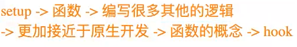

定义：

在程序设计中，一个函数被称为**纯函数**，需满足以下三个条件：

1. **确定性输出**：对于相同的输入值，总是产生相同的输出。
2. **无外部依赖**：函数的输出不依赖于输入值以外的隐藏信息、状态或I/O设备的外部输出。
3. **无副作用**：函数不能产生可观察的**副作用**，例如触发事件、修改外部数据、输出到设备等。

**简要总结**：
 纯函数是**只依赖输入、输出可预测、无副作用**的函数，具有高度可测试性和可复用性，常用于函数式编程。


（拓展）副作用：在计算机中，也引用了副作用的概念，表示在执行一个函数时，除了**返回函数值**之外，还对调用函数产生了附加的影响，比如**修改了全局变量**，**修改参数**或**改变外部的存储**

纯函数在执行过程中就是不能产生这样的副作用：副作用往往是产生bug的“温床”


纯函数的案例：

`slice`：`slice`截取数组时不会任何数组进行任何操作，而是生成一个新的数组

`splice`：`splice`截取数组，会返回一个新的数组，也会对原数组进行修改

splice就是一个纯函数，不会修改传入的参数

```js
  var names = ["abc","bhu","hui","ooi"]
// slice只要给他传入一个start/end，那么对于同一个数组来说，他会给我们返回确定的值
// slice函数本身他是不会修改原来的数组的
// slice ->this
// slice函数本身就是一个纯函数
// var newName1 = names.slice(0,3)
// console.log(newNames)
// console.log(names)

//  ["abc","bhu","hui","ooi"]
// solice在执行时，有修改调用的数组对象本身额，修改的这个操作就是产生的副作用
// splice不是一个纯函数
var newName2 = names.splice(2)
console.log(newName2)    // ['hui', 'ooi']
console.log(names)       // ['abc', 'bhu']

```


纯函数的优势：

- 相同输入始终返回相同输出，行为可预测；
- 不依赖也不修改外部状态，无副作用；
- 易于测试、并行执行和缓存，提升代码质量与开发效率。


### JS柯里化

#### 定义

柯里化是一种函数的转换，它是指将一个函数从可调用的`f(a,b,c)`转换为可调用的`f(a)(b)(c)`。柯里化不会调用函数，他只是**对函数进行转换**。

例子：

我们将创建一个辅助函数 `curry(f)`，该函数将对两个参数的函数 `f` 执行柯里化。换句话说，对于两个参数的函数 `f(a, b)` 执行 `curry(f)` 会将其转换为以 `f(a)(b)` 形式运行的函数：

```js
function curry(f) { // curry(f) 执行柯里化转换
  return function(a) {
    return function(b) {
      return f(a, b);
    };
  };
}

// 用法
function sum(a, b) {
  return a + b;
}

let curriedSum = curry(sum);

alert( curriedSum(1)(2) ); // 3
```

正如你所看到的，实现非常简单：只有两个包装器（wrapper）。

- `curry(func)` 的结果就是一个包装器 `function(a)`。
- 当它被像 `curriedSum(1)` 这样调用时，它的参数会被保存在词法环境中，然后返回一个新的包装器 `function(b)`。
- 然后这个包装器被以 `2` 为参数调用，并且，它将该调用传递给原始的 `sum` 函数。


#### 理解

举例来说，一个接收3个参数的普通函数，在进行柯里化后， 柯里化版本的函数接收一个参数并返回接收下一个参数的函数， 该函数返回一个接收第三个参数的函数。 最后一个函数在接收第三个参数后， 将之前接收到的三个参数应用于原普通函数中，并返回最终结果。

```js
// 数学和计算科学中的柯里化：

//一个接收三个参数的普通函数
function sum(a,b,c) {
    console.log(a+b+c)
}

//用于将普通函数转化为柯里化版本的工具函数
function curry(fn) {
  //...内部实现省略，返回一个新函数
}

//获取一个柯里化后的函数
let _sum = curry(sum);

//返回一个接收第二个参数的函数
let A = _sum(1);
//返回一个接收第三个参数的函数
let B = A(2);
//接收到最后一个参数，将之前所有的参数应用到原函数中，并运行
B(3)    // print : 6
```


我们Javascript实际应用中的柯里化函数，可以传递一个或多个参数

```js
//普通函数
function fn(a,b,c,d,e) {
  console.log(a,b,c,d,e)
}
//生成的柯里化函数
let _fn = curry(fn);

_fn(1,2,3,4,5);     // print: 1,2,3,4,5
_fn(1)(2)(3,4,5);   // print: 1,2,3,4,5
_fn(1,2)(3,4)(5);   // print: 1,2,3,4,5
_fn(1)(2)(3)(4)(5); // print: 1,2,3,4,5
```

对于已经柯里化后的 _fn 函数来说，当接收的参数数量与原函数的形参数量相同时，执行原函数； 当接收的参数数量小于原函数的形参数量时，返回一个函数用于接收剩余的参数，直至接收的参数数量与形参数量一致，执行原函数。


#### 作用

让一个函数处理的问题尽可能单一，而不是将一大堆的处理过程交给一个函数来处理

柯里化实际是把简单的问题复杂化，但是在复杂的同时，在使用函数时拥有了更加多的自由度。柯里化本质上是降低通用性，提高适用性

```js
// 假如在程序中,我们经常需要把5和另外一个数字进行相加
// console.log(sum(5, 10))
// console.log(sum(5, 14))
// console.log(sum(5, 1100))
// console.log(sum(5, 555))

function makeAdder(count) {
    return function(num) {
        return count + num
    }
}

// 修正调用方式：应该用圆括号()而不是方括号[]
var result = makeAdder(5)(10)
console.log(result) // 输出: 15

// 实际使用示例：
var add5 = makeAdder(5)
console.log(add5(10))   // 15
console.log(add5(14))   // 19  
console.log(add5(1100)) // 1105
console.log(add5(555))  // 560 
```


柯里化优化

```js
// 柯里化的优化
var log = date => type => message => {
    console.log(`[${date.getHours()}:${date.getMinutes()}][${type}]: [${message}]`)
}

// 如果我现在打印的都是当前时间的日志
var nowLog = log(new Date())
nowLog("DEBUG")("查找到轮播图的bug")
nowLog("FEATURE")("新增了添加用户的功能")

var nowAndDebugLog = log(new Date())("DEBUG")
nowAndDebugLog("查找到轮播图的bug")
nowAndDebugLog("查找到轮播图的bug") 
nowAndDebugLog("查找到轮播图的bug")
nowAndDebugLog("查找到轮播图的bug")
```


**案例**

我们工作中会遇到各种需要通过正则检验的需求，比如校验电话号码、校验邮箱、校验身份证号、校验密码等， 这时我们会封装一个通用函数 checkByRegExp ,接收两个参数，校验的正则对象和待校验的字符串

```js
function checkByRegExp(regExp,string) {
    return regExp.test(string);  
}

checkByRegExp(/^1\d{10}$/, '18642838455'); // 校验电话号码
checkByRegExp(/^(\w)+(\.\w+)*@(\w)+((\.\w+)+)$/, 'test@163.com'); // 校验邮箱
```

上面这段代码，乍一看没什么问题，可以满足我们所有通过正则检验的需求。 但是我们考虑这样一个问题，如果我们需要校验多个电话号码或者校验多个邮箱呢？

我们可能会这样做：

```js
checkByRegExp(/^1\d{10}$/, '18642838455'); // 校验电话号码
checkByRegExp(/^1\d{10}$/, '13109840560'); // 校验电话号码
checkByRegExp(/^1\d{10}$/, '13204061212'); // 校验电话号码

checkByRegExp(/^(\w)+(\.\w+)*@(\w)+((\.\w+)+)$/, 'test@163.com'); // 校验邮箱
checkByRegExp(/^(\w)+(\.\w+)*@(\w)+((\.\w+)+)$/, 'test@qq.com'); // 校验邮箱
checkByRegExp(/^(\w)+(\.\w+)*@(\w)+((\.\w+)+)$/, 'test@gmail.com'); // 校验邮箱
```

我们每次进行校验的时候都需要输入一串正则，再校验同一类型的数据时，相同的正则我们需要写多次， 这就导致我们在使用的时候效率低下，并且由于    checkByRegExp 函数本身是一个工具函数并没有任何意义， 一段时间后我们重新来看这些代码时，如果没有注释，我们必须通过检查正则的内容， 我们才能知道我们校验的是电话号码还是邮箱，还是别的什么。

此时，我们可以借助柯里化对 checkByRegExp 函数进行封装，以简化代码书写，提高代码可读性。

```js
//进行柯里化
let _check = curry(checkByRegExp);
//生成工具函数，验证电话号码
let checkCellPhone = _check(/^1\d{10}$/);
//生成工具函数，验证邮箱
let checkEmail = _check(/^(\w)+(\.\w+)*@(\w)+((\.\w+)+)$/);

checkCellPhone('18642838455'); // 校验电话号码
checkCellPhone('13109840560'); // 校验电话号码
checkCellPhone('13204061212'); // 校验电话号码

checkEmail('test@163.com'); // 校验邮箱
checkEmail('test@qq.com'); // 校验邮箱
checkEmail('test@gmail.com'); // 校验邮箱
```


#### 封装柯里化函数

当柯里化函数接收到足够参数后，就会执行原函数

我们有两种思路：

1. 通过函数的 length 属性，获取函数的形参个数，形参的个数就是所需的参数个数
2. 在调用柯里化工具函数时，手动指定所需的参数个数


###  with语句

`with语句` 扩展一个语句的作用域链。

```js
var obj = {
    name: "hello world",
    age: 18
}

with(obj) {
    console.log(name)
    console.log(age)
}
```

不建议使用 `with` 语句，因为它可能是**混淆错误**和**兼容性问题**的根源。

- `with` 语句会将指定对象（如 `obj`）添加到作用域链中，使得在 `with` 块内可以直接访问该对象的属性（如 `name` 和 `age`），无需通过 `obj.name` 的方式引用。
- 尽管语法简洁，但 `with` 语句可能导致变量名冲突、代码可读性差、调试困难等问题。
- 现代 JavaScript（ES6+）中已不推荐使用 `with`，且在严格模式（`'use strict'`）下会被禁止使用。


### eval函数

`eval` 是一个特殊的函数，它可以将传入的字符串当做 JavaScript 代码来运行。

```js
var evalString = `var message = "Hello World"; console.log(message)`;
eval(evalString);

console.log(message);
```

**不建议在开发中使用 `eval` 的原因：**

- ❌ `eval` 代码的可读性非常差（代码的可读性是高质量代码的重要原则）；
- ❌ `eval` 是一个字符串，那么有可能在执行的过程中被刻意篡改，从而造成被攻击的风险；
- ❌ `eval` 的执行必须经过 JS 解释器，不能被 JS 引擎优化。

补充说明：

- `eval()` 函数会动态执行字符串形式的 JavaScript 代码，这虽然灵活，但带来了安全性和性能上的隐患。
- 在现代开发中，应尽量避免使用 `eval`，推荐使用更安全、可维护的方式，如 `Function` 构造函数（谨慎使用）、模板字符串或配置化逻辑等替代方案。


### 严格模式

定义：在 ECMAScript 5 标准中，JavaScript 引入了**严格模式（Strict Mode）**，这是一种具有限制性的 JavaScript 执行模式，旨在让代码从“懒散（sloppy）模式”转向更规范、更安全的编程方式。

 严格模式可以应用到整个脚本或个别函数中。不要在封闭大括弧 `{}` 内这样做，在这样的上下文中这么做是没有效果的。在 `eval` 、`Function`、[事件处理器](https://developer.mozilla.org/zh-CN/docs/Web/HTML/Reference/Attributes#事件处理器属性)属性、[`setTimeout()`](https://developer.mozilla.org/zh-CN/docs/Web/API/Window/setTimeout) 方法中传入的脚本字符串，其行为类似于开启了严格模式的一个单独脚本，它们会如预期一样工作。

#### 为脚本开启严格模式

为整个脚本文件开启严格模式，需要在所有语句之前放一个*特定*语句 `"use strict";`（或 `'use strict';`）。

```js
// 整个脚本都开启严格模式的语法
"use strict";
const v = "你好！我是一个严格模式的脚本！";
```

#### 为函数开启严格模式

同样地，要给某个函数开启严格模式，得把*特定*语句 `"use strict";`（或 `'use strict';`）放在函数体所有语句之前。

```js
function myStrictFunction() {
  // 函数级别严格模式语法
  "use strict";
  function nested() {
    return "我也一样！";
  }
  return `你好！我是严格模式的函数！${nested()}`;
}
function myNotStrictFunction() {
  return "我不是严格模式的函数。";
}
```

#### 作用

**严格模式的核心特点**

1. **更严格的检测与执行**

   - 支持严格模式的浏览器在检测到代码启用严格模式后，会以更严格的方式进行语法检查和代码执行。

2. **消除“静默错误”（Silent Errors）**

   - 在非严格模式下，某些错误不会抛出异常，而是被“静默忽略”（如非法赋值、未声明变量等）。

   - 严格模式通过**抛出错误**来暴露这些原本被隐藏的问题，提高代码健壮性。

   - 示例：

     ```js
     123.name = "abc"; // 静默错误（非严格模式）
     var obj = {};
     Object.defineProperty(obj, "name", { writable: false });
     obj.name = "why"; // 抛出错误（严格模式下）
     ```

3. **提升性能优化**

   - JS 引擎在严格模式下可以进行更多优化，因为不需要处理一些特殊或不安全的语法行为。

4. **禁用未来可能使用的语法**

   - 严格模式禁用了某些在 ECMAScript 未来版本中可能定义的语法，防止兼容性问题。


#### 严格模式限制

强制要求**变量必须声明**，**禁止删除变量和函数**，**禁止使用 `with` 语句和八进制数**，**不允许对只读属性赋值**，**不允许同名函数参数**，以及**禁止 `this` 指向全局对象**等。这些限制是为了提高代码质量，减少潜在错误

1、变量声明

- **非严格模式：** 可以隐式声明变量，即没有使用 `var`、`let` 或 `const` 关键字 
- **严格模式：** 必须使用 `var`、`let` 或 `const` 关键字显式声明变量，否则会导致 ReferenceError

2、函数参数不能有同名属性，否则会报错

- **非严格模式：** 如果函数的参数重复了，**后面** 的参数会覆盖前面的参数
- **严格模式：** 这被认为是一个语法错误

3、不能使用`with`语句

- **非严格模式：** `with` 语句用于创建一个指定对象的作用域，延伸作用域链。但会导致代码可读性和性能问题，因此不推荐使用
- **严格模式：** 完全禁止使用 `with` 语句，会导致 `SyntaxError`

4、不能对只读属性赋值，否则会报错

- **非严格模式：** 对只读属性的赋值不会引发错误，但操作将被忽略
- **严格模式：** 对只读属性的赋值会导致 `TypeError`

5、禁止使用八进制字面量（前缀0）

- **非严格模式：** 八进制字面量（如 010，以0开头）会被解释为八进制数
- **严格模式：** 禁止使用八进制字面量，会导致 `SyntaxError`

6、禁止删除变量、函数和函数的形参

- **非严格模式：** 可以通过 `delete` 操作符删除变量、函数和函数的形参，不报错，但没有效果
- **严格模式：** 禁止使用 `delete` 操作符删除变量、函数和函数的形参，会报 `SyntaxError`，只能删除属性 `delete global[prop]`

7、`eval`中定义的变量和函数不会提升到外层作用域

8、`eval` 和 `arguments` 不能被重新赋值

- **非严格模式：** 可以被赋值
- **严格模式：** 不能被赋值

9、`arguments` 不会自动反映函数参数的变化

- **非严格模式：** 当你修改了函数参数的值，`arguments` 对象中对应的值也会同步更新；反向亦可影响。所以 `arguments` 可以看做是参数的别名，
- **严格模式：** 当你修改了函数参数的值，`arguments` 对象中对应的值不会变化；反向也不会变。相当于只保留初始值，后续变化不会互相影响

等.....我的天 太多了


### 面向对象

定义：面向对象是一种将**现实世界抽象为计算机模型的方法**；JS中的对象被设计成一组属性的无序集合，像是一个哈希表，有key和value组成；key是一个标识符名称，value可以是任意类型，也可以是其他对象或者函数类型；如果值是一个函数，那么我们可以称之为是对象的方法

面向对象如何模拟现实

- **将事物抽象为对象**：面向对象将现实中的事物（如人、车、银行账户等）抽象为具有特定属性和行为的对象。
  - **属性**：描述对象的特征，如汽车的颜色、品牌等。
  - **行为**：对象能做什么，如汽车的启动、停止、加速等方法。
- **通过对象交互解决问题**：在程序中，不再是按步骤执行函数，而是让这些对象通过调用自己的方法来完成任务。例如，一个“银行”对象可以通过调用其“取款”方法从另一个“账户”对象中减去金额。 

面向对象的优点：

* 更贴近现实：他以更自然的视角来组织代码，更容易理解和模拟现实世界中的复杂系统
* 更好的代码组织：将数据和操作数据的方法封装在一起，提高了代码的模块化程度
* 提高代码的可复用性：通过继承和多态，可以复用现有代码并扩展新功能
* 更易于维护和扩展：代码结构更加清晰，更容易进行修改和维护，尤其是大型项目

 

#### **对属性操作的控制**

- 在前面，我们的属性都直接定义在对象内部或者直接添加到对象内部的：
  - 但是这样做时，我们无法对属性进行一些限制，例如：
    - 这个属性是否可以通过 `delete` 删除？
    - 这个属性是否会在 `for-in` 遍历时被遍历出来？

```js
var obj = {
  name: "why",
  age: 18,
  height: 1.88
}
```

- 如果我们想要对一个属性进行更精准的操作控制，就可以使用属性描述符
  - 通过属性描述符可以**精准地添加或修改对象的属性**；
  - 属性描述符需要使用 `Object.defineProperty` 来对属性进行添加或修改。


##### **Object.defineProperty**

- `Object.defineProperty()` 方法会直接在一个对象上定义一个新属性，或者修改一个对象的现有属性，并返回此对象。

  ```js
  Object.defineProperty(obj, prop, descriptor)
  ```

- **可接收三个参数：**

  - `obj`：要定义属性的对象；
  - `prop`：要定义或修改的属性的名称或 Symbol；
  - `descriptor`：要定义或修改的属性描述符。

- **返回值：**

  - 被传递给函数的对象（即被修改的对象）。


#### **属性描述符分类**

- 属性描述符的类型分为两种：
  - **数据属性（Data Properties）描述符**
  - **存取属性（Accessor 访问器 Properties）描述符**

| 特性           | configurable | enumerable | value  | writable | get    | set    |
| -------------- | ------------ | ---------- | ------ | -------- | ------ | ------ |
| **数据描述符** | 可以         | 可以       | 可以   | 可以     | 不可以 | 不可以 |
| **存取描述符** | 可以         | 可以       | 不可以 | 不可以   | 可以   | 可以   |

------

**说明：**

- **数据描述符**：用于定义具有实际值的属性，可设置 `value` 和 `writable`。
- **存取描述符**：用于定义通过 getter 和 setter 方法访问的属性，必须提供 `get` 或 `set`。

> 注意：一个属性描述符不能同时是数据描述符和存取描述符（即不能同时存在 `value/writable` 和 `get/set`）。


#### 数据属性描述符

**数据属性描述符的四个特性**

- **[[Configurable]]**：表示属性是否可以通过 `delete` 删除，是否可以修改其特性，或是否可以将其改为存取属性描述符。
  - 当我们直接在一个对象上定义某个属性时，该属性的 `[[Configurable]]` 默认为 `true`；
  - 当我们通过属性描述符定义一个属性时，该属性的 `[[Configurable]]` 默认为 `false`。
- **[[Enumerable]]**：表示属性是否可以通过 `for-in` 循环或 `Object.keys()` 方法被枚举返回。
  - 当我们直接在一个对象上定义某个属性时，该属性的 `[[Enumerable]]` 默认为 `true`；
  - 当我们通过属性描述符定义一个属性时，该属性的 `[[Enumerable]]` 默认为 `false`。


#### **存取属性描述符**

存取属性描述符（Accessor Properties Descriptor）具有以下四个特性：

- **[[Configurable]]**：表示属性是否可以通过 `delete` 删除，是否可以修改其特性，或是否可以将其改为数据属性描述符。
  - 与数据属性描述符一致；
  - 当直接在对象上定义属性时，`[[Configurable]]` 默认为 `true`；
  - 当通过属性描述符定义属性时，`[[Configurable]]` 默认为 `false`。
- **[[Enumerable]]**：表示属性是否可以通过 `for-in` 或 `Object.keys()` 被枚举返回。
  - 与数据属性描述符一致；
  - 当直接在对象上定义属性时，`[[Enumerable]]` 默认为 `true`；
  - 当通过属性描述符定义属性时，`[[Enumerable]]` 默认为 `false`。
- **[[Get]]**：获取属性值时会执行的函数。默认为 `undefined`。
  - 用于定义 getter 方法。
- **[[Set]]**：设置属性值时会执行的函数。默认为 `undefined`。
  - 用于定义 setter 方法。


### 原型继承关系

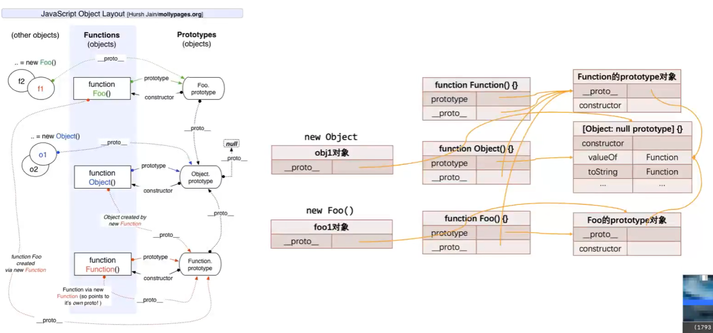


### ES6中类的使用

#### 基本概念

- **类（Class）**：是创建对象的模板（蓝图），用于封装数据和行为。
- **实例（Instance）**：通过 `new` 关键字调用类创建的具体对象。
- **本质**：`class` 是基于原型链的 **语法糖**，让面向对象编程更直观、更接近传统 OOP 语言。

#### 关键字

| 关键字        | 作用说明                                     |
| ------------- | -------------------------------------------- |
| `class`       | 声明一个类                                   |
| `constructor` | 构造方法，用于初始化实例属性                 |
| `get` / `set` | 定义属性的 getter 和 setter                  |
| `static`      | 声明静态成员（属于类本身，不能通过实例访问） |
| `extends`     | 实现类的继承                                 |
| `super`       | 在子类中调用父类的构造函数或方法             |


#### 认识class定义类

定义：它是一种创建对象的语法糖，让JavaScript的面向对象编程更加清晰。在类中，可以通过 `constructor` 方法来初始化对象，使用 `new` 关键字创建类的实例（对象）。

```js
class MyClass {
  // 构造方法，在创建实例时执行
  constructor(param1, param2) {
    this.property1 = param1;
    this.property2 = param2;
  }

  // 类的方法
  method1() {
    console.log('This is method1');
  }
}
```

##### 类的定义方法

类表达式

```js
// 匿名类
let Example = class {
    constructor(a) {
        this.a = a;
    }
}
// 命名类
let Example = class Example {
    constructor(a) {
        this.a = a;
    }
}
```

类声明（推荐）

```js
class Example {
    constructor(a) {
        this.a = a;
    }
}
```

不可重复声明

```js
class Example{}
class Example{}
// Uncaught SyntaxError: Identifier 'Example' has already been 
// declared
 
let Example1 = class{}
class Example{}
// Uncaught SyntaxError: Identifier 'Example' has already been 
// declared
```

**注意要点**

类定义不会被提升，这意味着，必须在访问前对类进行定义，否则就会报错。

类中方法不需要 function 关键字。

方法间不能加分号。

```js
new Example();  
class Example {}
```


#### class的构造方法（`constructor`）

##### **什么是 `constructor`？**

- **定义**：`constructor` 是类中的一个**特殊方法**，用于**创建并初始化类的实例对象**。
- **触发时机**：当使用 `new` 关键字调用类时，JavaScript 会自动执行 `constructor`。

```js
class MyClass {
  constructor(param1, param2) {
    this.property1 = param1;
    this.property2 = param2;
  }
}

const obj = new MyClass('hello', 42);
console.log(obj.property1); // 'hello'
```

>  `constructor` 接收参数，并将它们赋值给实例属性（通常绑定在 `this` 上）。

##### **是否必须显式定义 `constructor`？**

**不需要！**

- 如果未定义，JavaScript 会提供一个**默认的空构造函数**

  ```js
  class Person {}
  // 等价于
  class Person {
    constructor() {}
  }
  ```

- **建议**：仅在需要初始化属性或执行初始化逻辑时才显式编写 `constructor`。

##### `constructor` 的重要规则

1. **每个类只能有一个 `constructor`**

```
class BadExample {
  constructor() {}
  constructor(name) {} //  SyntaxError: A class may only have one constructor
}
```

2. **必须使用 `new` 调用类**

```
class A { constructor() {} }

A();        //  TypeError: Class constructor cannot be invoked without 'new'
new A();    //  正确
```

3. **子类若有 `constructor`，必须先调用 `super()`**

```
class Parent {
  constructor(name) {
    this.name = name;
  }
}

class Child extends Parent {
  constructor(name, age) {
    super(name); // ✅ 必须先调用 super() 才能使用 this
    this.age = age;
  }
}
```

>  否则会报错：
>
> ```
> ReferenceError: Must call super constructor in derived class before accessing 'this'
> ```

4. **默认返回 `this`，但可被覆盖**

- 通常无需 `return`。若显式返回一个对象，则该对象会替代默认的实例：

  ```
  class Example {
    constructor() {
      return { custom: true };
    }
  }
  console.log(new Example()); // { custom: true }（不再是 Example 的实例！）
  ```

- 若返回的是**基本类型**（如字符串、数字），则被忽略，仍返回 `this`。

##### **使用场景**

1. 初始化实例属性

```js
class User {
  constructor(name, email) {
    this.name = name;
    this.email = email;
    this.createdAt = new Date();
  }
}
```

✅ 2. 设置参数默认值

```js
class Product {
  constructor(name, price = 0) {
    this.name = name;
    this.price = price;
  }
}
```

✅ 3. 执行验证或副作用

```js
class Logger {
  constructor(level) {
    if (!['debug', 'info', 'error'].includes(level)) {
      throw new Error('Invalid log level');
    }
    this.level = level;
    console.log(`Logger created with level: ${level}`);
  }
}
```


### 封装


### 继承内置类

定义：在 JavaScript 中继承内置类（如 `Array`、`Date` 等）可以使用 `class` 关键字配合 `extends` 关键字，并需要通过 `super()` 方法调用父类的构造函数。这种继承方式允许你基于现有的内置类创建新类，并添加或修改其行为。

使用`extents`关键字：

1. 创建子类：使用`extents`关键字声明子类继承自内置类
2. 调用父类构造函数：在子类的构造函数（contructor）中，使用super（）调用父类（内置类）的构造函数，这是继承和创造对象时必需的步骤
3. 添加或重写方法：你可以在子类中添加新的方法，或者重写父类（内置类）的方法

```js
// 继承 Array 类
class MyArray extends Array {
  // 添加一个新的方法
  first() {
    return this[0];
  }

  // 重写一个方法
  push(item) {
    console.log('开始添加元素...');
    super.push(item); // 使用 super 调用 Array.prototype.push()
    console.log('元素添加完毕！');
  }
}

const arr = new MyArray();
arr.push(1); // 输出 "开始添加元素..." 和 "元素添加完毕！"
arr.push(2);
console.log(arr.first()); // 输出 1
console.log(arr); // 输出 MyArray [1, 2]

```


### 类的混入mixin

定义：**混入（Mixin）** 是一种**代码复用的设计模式**，用于向类“混入”额外的方法或属性，**而不使用传统的继承（`extends`）**。由于 JS 只支持**单继承**（一个类只能继承一个父类），混入提供了一种灵活的方式来组合多个功能模块。

js的类只支持单继承：也就是只能有一个父类

开发中需要在一个类中添加更多相似的功能时，可以使用混入（mixin）

##### 函数式混入（推荐）

定义一个**高阶函数**，接收一个类（或构造函数），返回一个**扩展了新方法的新类**。

```js
// 定义一个混入：可发声
const CanSpeak = (BaseClass) =>
  class extends BaseClass {
    speak() {
      console.log(`${this.name} says hello!`);
    }
  };

// 定义一个混入：可移动
const CanMove = (BaseClass) =>
  class extends BaseClass {
    move() {
      console.log(`${this.name} is moving.`);
    }
  };

// 基础类
class Animal {
  constructor(name) {
    this.name = name;
  }
}

// 组合混入
class Dog extends CanSpeak(CanMove(Animal)) {
  constructor(name) {
    super(name);
  }
}

const dog = new Dog('Buddy');
dog.move();   // Buddy is moving.
dog.speak();  // Buddy says hello!
```

> 💡 这种方式称为 **“函数式混入”** 或 **“装饰器式混入”**，是 ES6 中最常用、最清晰的方式。

##### 对象属性拷贝（较原始）

将混入对象的方法**复制到类的原型上**：

```js
const FlyMixin = {
  fly() {
    console.log(`${this.name} is flying!`);
  }
};

class Bird {
  constructor(name) {
    this.name = name;
  }
}

// 将 FlyMixin 的方法混入 Bird.prototype
Object.assign(Bird.prototype, FlyMixin);

const bird = new Bird('Eagle');
bird.fly(); // Eagle is flying!
```

> ⚠️ 缺点：
>
> - 无法在构造函数中初始化状态；
> - 不支持 `super`；
> - 类型系统（如 TypeScript）难以识别；
> - 更像是“打补丁”，不够优雅。


### let/const 基本使用

#### 作用域提升

`var` 与 `let/const` 的关键区别：作用域提升

- `var` 声明的变量会进行**作用域提升（hoisting）**，即在代码执行前被提前声明到作用域顶部。
- `let` 和 `const` 虽然也会被提升，但**不能在声明之前访问**，否则会报错。

```js
console.log(foo); // ReferenceError: Cannot access 'foo' before initialization
let foo = "foo";
```

>  报错原因：虽然 `foo` 已被创建，但尚未“初始化”（求值），处于“暂时性死区”（Temporal Dead Zone, TDZ）。


#### let/const的暂时性死区

定义：ES6规定，let/const 命令会使区块形成封闭的作用域。若在声明之前使用变量，就会报错。总之，在代码块内，使用 let 命令声明变量之前，该变量都是不可用的。 这在语法上，称为 “暂时性死区”。

**let所声明的变量一定要在声明后使用**

```js
var a = 123;

if (true) {
  // 变量a的暂时性死区开始
  console.log(a); // ReferenceError: Cannot access 'a' before initialization
  let a; 
  // 变量a的暂时性死区开始
  console.log(a); // undefined
  a = 123;
  console.log(a); // 123
}
```

在这个作用域里let声明变量之前的，都是这个变量的暂时性死区

如图：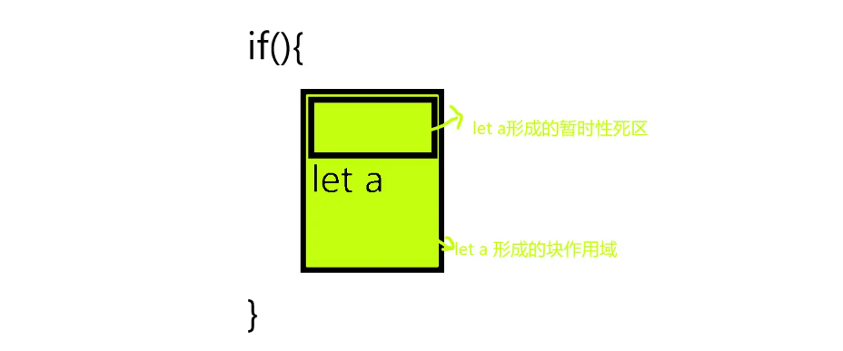


暂时性死区带来的影响：

1.let所生命的变量一定要在声明后使用，否则报错

2.let不允许在相同作用域内，重复声明同一个变量

3.typeof不在是一个百分之百安全的操作


### 模板字符串的使用

#### 定义

它使用反引号（`）来定义字符串，并支持插值表达式，使字符串拼接更加方便

```js
const name = "Alice";
const greeting = `Hello, ${name}!`;
console.log(greeting); // 输出 "Hello, Alice!"

```

在上面的示例中，`${name}` 是一个插值表达式，它会在运行时被替换为变量 `name` 的值。这使得在字符串中嵌入变量变得非常容易。

#### 多行字符串

传统的字符串表示方式要创建多行字符串通常需要使用换行符（`\n`），而模板字符串允许我们直接编写多行字符串，使代码更加清晰：

```js
const multiLineString = `
  This is a
  multi-line
  string.
`;
console.log(multiLineString);

```

这让文本块的创建变得更加自然，无需手动添加换行符。

#### 嵌套模板字符串

模板字符串可以嵌套在其他模板字符串内部，这样可以构建复杂的字符串结构。这在创建HTML模板或其他嵌套字符串时非常有用：

```javascript
const firstName = "John";
const lastName = "Doe";

const fullNameHTML = `
  <div>
    <p>First Name: ${firstName}</p>
    <p>Last Name: ${lastName}</p>
  </div>
`;

console.log(fullNameHTML);
```

#### 函数调用

模板字符串也可以作为函数的参数传递，这为字符串处理提供了更多的灵活性。我们可以定义一个函数，接收模板字符串作为参数，并在函数内部处理字符串，例如格式化字符串或执行其他操作：

```javascript
function formatCurrency(strings, ...values) {
  let result = "";
  values.forEach((value, index) => {
    result += `${strings[index]}${value}`;
  });
  result += strings[strings.length - 1];
  return result;
}

const price = 19.99;
const discount = 0.2;

const formattedPrice = formatCurrency`Price: ${price} (20%)`;

console.log(formattedPrice); // 输出 "Price: 19.99 (20%)"
```

这个例子中，`formatCurrency` 函数接收一个模板字符串以及值，然后将它们组合成一个新的字符串。这种方式可以用于国际化、文本格式化等场景。

#### 原始模板字符串

除了默认的模板字符串处理方式，我们还可以使用原始模板字符串（raw template strings）。原始模板字符串**不会对转义字符进行转义处理**，而是保留它们的原始形式。要使用原始模板字符串，只需在模板字符串前加上一个 `String.raw` 函数：

```javascript
const filePath = String.raw`C:\Users\John\Desktop\file.txt`;
console.log(filePath); // 输出 "C:\Users\John\Desktop\file.txt"
```

这在处理正则表达式、文件路径等需要保留转义字符的场景中非常有用。

#### 标签模板字符串

标签模板字符串是一种特殊的模板字符串，它允许我们定义一个标签函数，**该函数可以处理模板字符串的内容**。标签函数会接收模板字符串的各个部分，并返回最终的字符串结果。这样我们就可以自定义字符串的生成方式。

```javascript
function customTag(strings, ...values) {
  let result = "";
  strings.forEach((string, index) => {
    result += string;
    if (index < values.length) {
      result += values[index];
    }
  });
  return result.toUpperCase();
}

const name = "Alice";
const age = 30;

const formattedString = customTag`Name: ${name}, Age: ${age}`;

console.log(formattedString); // 输出 "NAME: ALICE, AGE: 30"
```

在这个例子中，`customTag` 函数将模板字符串的内容合并为一个大写的字符串。这种方式可用于自定义文本处理或创建特定格式的字符串。

#### 高级用法：标签函数

标签函数是一种强大的工具，它们允许您在模板字符串的每个部分上执行自定义操作。这些函数接收字符串部分和插值表达式的值，能够根据需要进行文本处理、格式化或执行其他操作。

以下是一个更复杂的示例，展示了标签函数的强大功能：

```javascript
function highlight(strings, ...values) {
  let result = "";
  strings.forEach((string, index) => {
    result += string;
    if (index < values.length) {
      result += `<span class="highlight">${values[index]}</span>`;
    }
  });
  return result;
}

const keyword = "JavaScript";
const description = "a versatile programming language";

const highlightedText = highlight`Learn ${keyword} - ${description} today!`;

console.log(highlightedText);
```

在这个示例中，`highlight` 标签函数将模板字符串的各个部分合并，并将 `${values[index]}` 部分用 `<span class="highlight">` 包装，以实现文本高亮效果。

####  模板字符串的性能

与传统字符串拼接相比，模板字符串具有更好的性能，因为JS引擎可以在编译时对模板字符串进行优化，从而降低了运行时的开销。当需要频繁进行字符串拼接操作时，建议大家尽量使用模板字符串。


### 函数的默认参数

**参数默认**：undefined

####  定义

JavaScript 中函数的参数默认是 **undefined** 。 然而，在某些情况下可能需要设置一个不同的默认值。 这是默认参数可以帮助的地方。 以前，一般设置默认参数的方法是在函数体测试参数是否为 undefined ，如果是的话就设置为默认的值。

#### 基本语法

如果参数未传入，或显示传入`undefined`，则使用默认值

传入`null`,`0`,`""`（空字符串），`false`等“假值”不会触发默认值，因为他们不是`undefined`

```js
function greet(name = "Guest") {
  console.log(`Hello, ${name}!`);
}

greet();        // Hello, Guest!
greet("Alice"); // Hello, Alice
```

```js
function test(a = 1) {
  console.log(a);
}

test();        // 1
test(undefined); // 1
test(null);    // null（不是 undefined，所以不使用默认值）
test(0);       // 0
test("");      // ""
```

##### 默认参数可以是表达式或函数调用

默认值可以是任意表达式，甚至可以调用其他函数：

```js
function getDefaultValue() {
  console.log("计算默认值...");
  return 42;
}

function foo(x = getDefaultValue()) {
  return x;
}

foo(); // 输出 "计算默认值..."，返回 42
foo(10); // 不调用 getDefaultValue，返回 10
```

> ⚠️ 注意：默认值表达式 **只在需要时求值**（惰性求值），且每次调用函数时若需默认值都会重新计算。

#####  后面的参数可以引用前面的参数

在参数列表中，后面的默认参数可以引用前面的参数（因为参数是从左到右依次初始化的）：

```js
function createPoint(x, y = x) {
  return { x, y };
}

console.log(createPoint(5));     // { x: 5, y: 5 }
console.log(createPoint(2, 3));  // { x: 2, y: 3 }
```

但不能反过来（前面的参数不能引用后面的）：

```js
// ❌ 报错：Cannot access 'y' before initialization
function bad(x = y, y = 1) {
  return x + y;
}
```

------

##### 与解构赋值结合使用

默认参数常和对象/数组解构一起使用，非常实用：

```js
function draw({ x = 0, y = 0, color = "black" } = {}) {
  console.log(`Draw at (${x}, ${y}) in ${color}`);
}

draw();                     // Draw at (0, 0) in black
draw({ x: 10, color: "red" }); // Draw at (10, 0) in red
```

注意：`= {}` 是为了防止传入 `undefined` 或没传参导致解构报错。

------

##### 与 `arguments` 对象的行为差异（非严格模式 vs 严格模式）

在 **非严格模式** 下，`arguments` 对象会与命名参数同步；但在 **使用默认参数的函数中，无论是否严格模式，`arguments` 都不会同步更新**。

```js
function f(a = 1) {
  a = 10;
  console.log(arguments[0]); // undefined（因为没传参）
}
f(); // 输出 undefined
```

> ✅ 建议：避免依赖 `arguments`，改用剩余参数（`...args`）。

------

##### 默认参数不影响函数的 `length` 属性

函数的 `.length` 表示**预期接收的、位于第一个默认参数之前的参数个数**：

```js
function f1(a) {}
function f2(a = 1) {}
function f3(a, b = 1) {}
function f4(a, b, c = 1) {}

console.log(f1.length); // 1
console.log(f2.length); // 0（第一个参数就有默认值）
console.log(f3.length); // 1
console.log(f4.length); // 2
```


### 函数的剩余参数

#### 定义

ES6中引用了rest parameter，可以将不定数量的参数放入到一个数组中。如果最后一个参数是`...`为前缀的，那么它会将剩余的参数放到该参数中，并且作为一个数组。

#### 剩余参数与arguments的区别

**剩余参数**只包含那些**没有对应形参**的**实参**，而arguments 对象包含了传给函数的所有实参。

arguments对象不是一个真正的数组（它是一个维数组），而rest参数是一个真正的数组，可以进行数组的所有操作。

arguments是早期的ECMAScript中为了方便去获取所有的参数提供的一个数据结构，而rest参数是ES6中提供 并且希望以此来替代arguments的。

- 注意：剩余参数必须放到形参的最后。

```js
//函数的剩余参数，剩余参数是用来替换arguments的。
//这...和展开运算符没关系
function foo(m,n,...args){ //剩余参数必须放最后
    console.log(m,n);
    console.log(args); //[40,50,60]

}
foo(20,30,40,50,60)
```


### 展开语法

#### 定义

可以在函数调用/数组构造时，将数组表达式或者string在语法层面展开

还可以在构造字面量对象时，将对象表达式按`ket-value`的方式展开

#### 使用场景

函数调用时

数组构造时

构建对象字面量时，也可以使用展开运算符，这个是ES9中的添加的新特性

```js
const names = ["abc","deg","eee","huj"]
const name = "whi"
const info = {name:"wjm",age:19}

// 1.函数调用时
function fn(x,y,z){
        console.log(x,y,z)
}

fn(...names)       //abc deg eee
fn(...name)        //w h i


// 2.构造数组时
const newNames = [...names,...name]
console.log(newNames)


// ES9,构建对象字面量时
const obj = {...info,address:"安徽省"}
console.log(obj)      //{ name: 'wjm', age: 19, address: '安徽省' }
```

补充：展开语法进行的是浅拷贝


### Symbol

#### 定义

Symbol 是es6中新增的一个基本的数据类型,翻译为符号

变成一种新增的数据类型

#### 基本特点

- **唯一性**：每次调用 `Symbol()` 都会返回一个全新的、唯一的值。
- **不可枚举**：用 Symbol 作为属性名时，默认不会出现在 `for...in`、`Object.keys()` 等遍历中。
- **不能使用 `new`**：`Symbol` 是原始类型，不是构造函数，不能用 `new Symbol()`。
- **可选描述**：可以传入一个字符串作为描述（仅用于调试，不影响唯一性）。

#### 基本语法

##### 1. 创建 Symbol

```js
const sym1 = Symbol();
const sym2 = Symbol('description'); // 可选描述
console.log(sym1 === sym2); // false，即使描述相同，也是不同 Symbol
```

##### 2. 用作对象属性的键

```js
const id = Symbol('id');
const user = {
  name: 'Alice',
  [id]: 12345
};

console.log(user[id]); // 12345
console.log(user.id);  // undefined（不能用点语法访问）
```

> 注意：必须用方括号 `[symbol]` 来定义或访问 Symbol 属性。

#### Symbol 的全局注册表（共享 Symbol）

如果你希望在多个地方使用同一个 Symbol，可以用 `Symbol.for(key)`：

```js
const symA = Symbol.for('shared');
const symB = Symbol.for('shared');

console.log(symA === symB); // true

// 获取 Symbol 的 key（仅对 Symbol.for 创建的 Symbol 有效）
console.log(Symbol.keyFor(symA)); // 'shared'
```

> `Symbol('x')` 和 `Symbol.for('x')` 是不同的！

#### 常见用途

##### 避免属性名冲突

```js
const _privateData = Symbol('private');

class MyClass {
  constructor(value) {
    this[_privateData] = value;
  }
  getValue() {
    return this[_privateData];
  }
}
```

外部无法直接访问 `_privateData`（除非拿到 Symbol 引用），实现“伪私有”。

##### 定义“魔术”方法（Well-known Symbols）

JavaScript 内置了一些预定义的 Symbol，用于自定义对象行为，例如：

- `Symbol.iterator`：定义对象的默认迭代器
- `Symbol.toPrimitive`：定义对象转原始值的行为
- `Symbol.hasInstance`：自定义 `instanceof` 行为

示例：自定义可迭代对象

```js
const myObj = {
  [Symbol.iterator]() {
    let step = 0;
    const values = ['a', 'b', 'c'];
    return {
      next() {
        if (step < values.length) {
          return { value: values[step++], done: false };
        }
        return { done: true };
      }
    };
  }
};

for (const item of myObj) {
  console.log(item); // 'a', 'b', 'c'
}
```

#### 注意

- `JSON.stringify()` 会忽略 Symbol 属性。
- `Object.getOwnPropertyNames()` 不会返回 Symbol 键，要用 `Object.getOwnPropertySymbols(obj)`。
- Symbol 不能被自动转换为字符串，直接拼接会报错：

```js
const sym = Symbol('test');
console.log('Symbol: ' + sym); // TypeError!
console.log('Symbol: ' + String(sym)); // OK
console.log(`Symbol: ${sym.toString()}`); // OK
```

| 特性     | 说明                                   |
| -------- | -------------------------------------- |
| 类型     | 原始类型（primitive）                  |
| 唯一性   | 每次 `Symbol()` 都唯一                 |
| 用途     | 作对象键、避免命名冲突、定义特殊行为   |
| 全局共享 | 用 `Symbol.for()` 和 `Symbol.keyFor()` |


### Set集合

#### 定义

在 JavaScript 中，`Set` 是 ES6（ES2015）引入的一种**集合数据结构**，用于存储**唯一值**（不允许重复）。这些值可以是任意类型：原始值（如字符串、数字）或对象引用。

#### 特点

- **值唯一**：自动去重。
- **有序**：元素按插入顺序迭代。
- **可迭代**：支持 `for...of`、扩展运算符 `...` 等。
- **不是数组**：没有 `map`、`filter` 等数组方法，但可以轻松转为数组。

#### 创建set

```js
// 创建一个空 Set
const set = new Set();

// 从可迭代对象（如数组）初始化
const numbers = new Set([1, 2, 3, 2, 1]); // 自动去重
console.log(numbers); // Set(3) {1, 2, 3}
```

> 注意：`{}` 不是 Set，`new Set()` 才是！

#### 常用方法和属性

| 方法/属性       | 说明                                    |
| --------------- | --------------------------------------- |
| `add(value)`    | 添加一个值，返回 Set 本身（可链式调用） |
| `delete(value)` | 删除某个值，返回布尔值（是否删除成功）  |
| `has(value)`    | 检查是否存在该值，返回布尔值            |
| `clear()`       | 清空所有元素                            |
| `size`          | 返回元素个数（属性，不是方法）          |

```js
const fruits = new Set();

fruits.add('apple');
fruits.add('banana').add('apple'); // 链式调用，重复的 'apple' 不会添加

console.log(fruits.size); // 2
console.log(fruits.has('apple')); // true

fruits.delete('banana');
console.log(fruits); // Set {'apple'}

fruits.clear();
console.log(fruits.size); // 0
```

#### 遍历 Set

Set 是可迭代的，支持以下方式遍历：

```js
const colors = new Set(['red', 'green', 'blue']);

// 1. for...of
for (const color of colors) {
  console.log(color);
}

// 2. forEach
colors.forEach(color => console.log(color));

// 3. 转为数组后使用数组方法
const colorArray = [...colors];
const upperColors = colorArray.map(c => c.toUpperCase());
```

> ⚠️ 注意：Set 的 `forEach` 回调函数接收三个参数：`(value, value, set)` —— 第一和第二个参数都是值（为了和 Map 统一）。

#### 常见用途

##### 1. 数组去重（最常用！）

```js
const arr = [1, 2, 2, 3, 4, 4, 5];
const uniqueArr = [...new Set(arr)];
console.log(uniqueArr); // [1, 2, 3, 4, 5]
```

##### 2. 求两个数组的交集、并集、差集

```js
const a = new Set([1, 2, 3]);
const b = new Set([3, 4, 5]);

// 并集（Union）
const union = new Set([...a, ...b]); // {1, 2, 3, 4, 5}

// 交集（Intersection）
const intersection = new Set([...a].filter(x => b.has(x))); // {3}

// 差集（a - b）
const difference = new Set([...a].filter(x => !b.has(x))); // {1, 2}
```

##### 3. 存储唯一用户 ID、标签等

```js
const userIds = new Set();
userIds.add('user123');
userIds.add('user456');
userIds.add('user123'); // 无效，已存在
```

#### 注意事项

- **对象引用比较**：Set 使用严格相等（`===`）判断是否重复。对于对象，即使内容相同，也是不同引用：

```js
const set = new Set();
set.add({ name: 'Alice' });
set.add({ name: 'Alice' });
console.log(set.size); // 2（两个不同对象）
```

- **NaN 的处理**：Set 认为所有 `NaN` 是相等的（与 `===` 不同），只会存一个：

```js
const s = new Set();
s.add(NaN);
s.add(NaN);
console.log(s.size); // 1 ✅
```

- **不能直接索引访问**：Set 没有 `set[0]`，必须遍历或转数组。


### WeakSet

#### 定义

`WeakSet` 是 JavaScript 中 ES6（ES2015）引入的一种**特殊集合数据结构**，和 `Set` 类似，但它有**更严格的限制**和**特殊的垃圾回收行为**，主要用于存储**对象的弱引用**。

#### 特点

| 特性               | 说明                                                         |
| ------------------ | ------------------------------------------------------------ |
| **只能存对象**     | 不能添加原始值（如字符串、数字、Symbol 等）                  |
| **弱引用**         | 存储的对象不会阻止垃圾回收（GC）                             |
| **不可迭代**       | 没有 `forEach`、`keys()`、`values()`，也不能用 `for...of` 遍历 |
| **没有 size 属性** | 无法知道当前有多少元素                                       |
| **API 极简**       | 只有 `add()`、`delete()`、`has()` 三个方法                   |

#### 基本语法

##### 创建 WeakSet

```js
const ws = new WeakSet();
```

##### 添加对象（必须是对象！）

```js
const obj1 = { name: 'Alice' };
const obj2 = { name: 'Bob' };

ws.add(obj1);
ws.add(obj2);

console.log(ws.has(obj1)); // true
ws.delete(obj1);
console.log(ws.has(obj1)); // false
```

##### ❌ 错误示例：不能添加原始值

```js
const ws = new WeakSet();
ws.add('hello');     // TypeError!
ws.add(42);          // TypeError!
ws.add(Symbol());    // TypeError!
```

#### 什么是“弱引用”？

- `WeakSet`中的对象是弱引用的，意味着：
  - 如果一个对象**只被 WeakSet 引用**，而没有其他变量引用它，
  - 那么这个对象**可以被垃圾回收器回收**。
- 这有助于**避免内存泄漏**。

示例：弱引用 vs 强引用

```js
let obj = { name: 'Test' };
const strongSet = new Set();
const weakSet = new WeakSet();

strongSet.add(obj);
weakSet.add(obj);

obj = null; // 解除强引用

// 此时：
// - strongSet 仍持有 obj 的强引用 → 对象不会被回收
// - weakSet 持有弱引用 → 对象可能被 GC 回收（无法再访问）
```

> ⚠️ 注意：你无法“观察”到对象是否已被回收（因为不能遍历 WeakSet），这是设计使然。

#### 典型使用场景

##### 1. 标记对象（而不影响其生命周期）

比如：标记某些 DOM 元素已经被处理过：

```js
const processedElements = new WeakSet();

function processElement(el) {
  if (processedElements.has(el)) {
    return; // 已处理，跳过
  }
  // 处理逻辑...
  processedElements.add(el);
}

// 当 el 从 DOM 移除且无其他引用时，会被自动 GC，WeakSet 不会阻止
```

##### 2. 实现私有数据（旧式方案，现在推荐用 `#private` 字段）

```js
const privateData = new WeakSet();

class Person {
  constructor(name) {
    const data = { name };
    privateData.add(data);
    this._dataRef = data; // 仅内部持有引用
  }

  getName() {
    if (privateData.has(this._dataRef)) {
      return this._dataRef.name;
    }
  }
}
```

> 💡 现代 JS 更推荐使用**类私有字段**（`#name`），但 WeakSet 在某些库或兼容场景仍有价值。

#### WeakSet vs Set 对比

| 特性       | WeakSet            | Set                |
| ---------- | ------------------ | ------------------ |
| 元素类型   | 仅对象             | 任意类型           |
| 弱引用     | ✅                  | ❌（强引用）        |
| 可遍历     | ❌                  | ✅                  |
| 有 `.size` | ❌                  | ✅                  |
| 可清空     | ❌（无 `.clear()`） | ✅（有 `.clear()`） |
| 内存安全   | ✅（自动释放）      | ❌（需手动管理）    |

> 🔸 `WeakSet` 没有 `.clear()` 方法！


### Map字典

#### 定义

`Map` 对象是字典，它保存**键值对**，并且能够记住键的原始插入顺序。任何值（无论是对象还是原始值）都可以作为一个键或一个值。

这与传统的 JavaScript 对象（`{}`）不同：

- 普通对象的键只能是 **字符串** 或 **Symbol**；
- 而 `Map` 的键可以是 **任意类型**（数字、字符串、对象、函数、甚至 `NaN`）。


### WeakMap

在 JavaScript 中，`Map` 和 `WeakMap` 都是 ES6 引入的键值对集合，但它们在**内存管理**和**使用场景**上有本质区别。

##### Map和WeakMap的区别

| 特性             | `Map`                            | `WeakMap`                        |
| ---------------- | -------------------------------- | -------------------------------- |
| **键的类型**     | 任意类型（字符串、对象、数字等） | **仅对象**（`{}`、数组、函数等） |
| **值的类型**     | 任意类型                         | 任意类型                         |
| **弱引用**       | ❌ 强引用（阻止 GC）              | ✅ **弱引用**（不阻止垃圾回收）   |
| **可遍历**       | ✅ 支持 `for...of`/`forEach`      | ❌ **不可遍历**（无迭代器方法）   |
| **`.size` 属性** | ✅ 有                             | ❌ **无**                         |
| **清空方法**     | ✅ `.clear()`                     | ❌ **无**（无 `.clear()`）        |
| **内存安全**     | 需手动管理                       | ✅ **自动释放**（避免内存泄漏）   |
| **典型场景**     | 通用键值存储                     | 私有数据、DOM 元数据、临时标记   |


### Object.values() 

（值获取）

#### 定义

`Object.values()` 是 JavaScript 中的一个内置方法，用于返回一个数组，该数组包含给定对象自身所有**可枚举属性**的值。

```js
Object.values(obj)
```

#### 参数

`obj`: 要返回其枚举自身属性值的对象

#### 返回值

一个包含对象自身所有可枚举属性值的数组

```js
const obj = { a: 1, b: 2, c: 3 };
console.log(Object.values(obj)); // [1, 2, 3]

// 对于数组
const array = ['a', 'b', 'c'];
console.log(Object.values(array)); // ['a', 'b', 'c']

// 对于非对象参数（会先转换为对象）
console.log(Object.values('foo')); // ['f', 'o', 'o']
```

#### 特点

- 只返回对象**自身**的属性，不包括继承的属性
- 只返回**可枚举**的属性
- 返回值的顺序与使用 `for...in` 循环遍历的顺序相同
- 与 `Object.keys()` 类似，但返回的是值而非键

#### 与相关方法比较

- `Object.keys(obj)`: 返回对象自身可枚举属性的**键名**数组
- `Object.values(obj)`: 返回对象自身可枚举属性的**值**数组
- `Object.entries(obj)`: 返回对象自身可枚举属性的**键值对**数组


### Object.entries() 方法

（键值对获取）

#### 定义

`Object.entries()` 是 JavaScript 中的一个内置方法，用于返回一个数组，该数组包含给定对象自身所有**可枚举属性**的 `[key, value]` 键值对。

#### 语法

```
Object.entries(obj)
```

#### 参数

`obj`: 要返回其枚举自身属性键值对的对象

#### 返回值

一个包含对象自身所有可枚举属性的 `[key, value]` 键值对数组

#### 示例

```js
const obj = { a: 1, b: 2, c: 3 };
console.log(Object.entries(obj)); 
// [['a', 1], ['b', 2], ['c', 3]]

// 可以与for...of循环结合使用
for (const [key, value] of Object.entries(obj)) {
  console.log(`${key}: ${value}`);
}
// 输出: a: 1, b: 2, c: 3

// 转换为Map对象
const map = new Map(Object.entries(obj));
console.log(map); // Map(3) { 'a' => 1, 'b' => 2, 'c' => 3 }

// 对于数组
const array = ['a', 'b', 'c'];
console.log(Object.entries(array)); 
// [['0', 'a'], ['1', 'b'], ['2', 'c']]
```

#### 特点

- 只返回对象**自身**的属性，不包括继承的属性
- 只返回**可枚举**的属性
- 返回的键值对顺序与使用 `for...in` 循环遍历的顺序相同
- 与 `Object.keys()` 和 `Object.values()` 不同，它同时返回键和值

#### 与相关方法比较

- `Object.keys(obj)`: 返回对象自身可枚举属性的**键名**数组
- `Object.values(obj)`: 返回对象自身可枚举属性的**值**数组
- `Object.entries(obj)`: 返回对象自身可枚举属性的**键值对**数组

#### 常见用途

- 遍历对象的键值对
- 将对象转换为 Map
- 对象的深拷贝
- 过滤或转换对象属性


### Object的fromEntries

（键值对转换）

#### 定义：

`Object.fromEntries()` 是 JavaScript 中的一个静态方法，用于将**键值对列表**（iterable of key-value pairs）转换为一个对象。它是 `Object.entries()` 的反向操作。

```js
Object.fromEntries(iterable)
```

#### 参数

`iterable`：任何可迭代对象，如数组、Map 等，其元素为 `[key, value]` 形式的键值对

#### 返回值

返回一个新对象，其属性由可迭代对象中的键值对定义。

#### 核心用途

将键值对集合转换为对象，特别适合与 `Object.entries()`、`Map` 等配合使用，实现数据转换。


### String Padding

ES2017 (ES8) 引入了两个非常实用的字符串填充方法：`padStart()` 和 `padEnd()`。这些方法使得字符串对齐和格式化变得更加简单。

#### padStart()

##### 定义

在当前字符串的**开头**（左侧）填充指定的字符串，直到达到指定的长度。

##### 语法

```js
str.padStart(targetLength [, padString])
```

##### 参数

- `targetLength`: 目标字符串的总长度
- `padString` (可选): 用来填充的字符串，默认为空格

示例

```js
// 基本用法
'abc'.padStart(10);          // "       abc"
'abc'.padStart(10, 'foo');   // "foofoofabc"
'abc'.padStart(6, '123456'); // "123abc"
'abc'.padStart(8, '0');      // "00000abc"

// 实用场景：格式化数字
'5'.padStart(3, '0');        // "005"
'12'.padStart(3, '0');       // "012"

// 日期格式化
const day = '8';
const month = '5';
const year = '2023';
`${day.padStart(2, '0')}/${month.padStart(2, '0')}/${year}`; // "08/05/2023"
```

#### padEnd()

##### 定义

在当前字符串的**末尾**（右侧）填充指定的字符串，直到达到指定的长度。

##### 语法

```js
str.padEnd(targetLength [, padString])
```

##### 参数

- `targetLength`: 目标字符串的总长度
- `padString` (可选): 用来填充的字符串，默认为空格

示例

```js
// 基本用法
'abc'.padEnd(10);          // "abc       "
'abc'.padEnd(10, 'foo');   // "abcfoofoof"
'abc'.padEnd(6, '123456'); // "abc123"
'abc'.padEnd(8, '0');      // "abc00000"

// 实用场景：文本对齐
const items = [
  { name: 'Apple', price: 1.99 },
  { name: 'Banana', price: 0.99 },
  { name: 'Strawberry', price: 3.49 }
];

items.forEach(item => {
  console.log(`${item.name.padEnd(15)} $${item.price.toFixed(2)}`);
});
// 输出:
// Apple           $1.99
// Banana          $0.99
// Strawberry      $3.49
```

#### 重要注意事项

1. **截断行为**：如果原字符串长度已等于或大于 `targetLength`，则返回原字符串，不做任何填充：

   ```js
   'abc'.padStart(2, 'x'); // "abc" (未填充，因为原字符串长度3 > 目标长度2)
   ```

2. **填充字符串重复**：填充字符串会重复应用，直到达到目标长度，且可能会被截断：

   ```js
   'abc'.padStart(8, '12'); // "12121abc" (不是"121212abc")
   ```

3. **空格作为默认填充**：如果不指定填充字符串，默认使用空格：

   ```js
   'abc'.padStart(5); // "  abc"
   ```

4. **多字符填充**：支持任何Unicode字符，包括表情符号：

   ```js
   'hello'.padStart(10, '😊'); // "😊😊😊😊hello"
   ```

#### 兼容性

- 这些方法在 ES2017 (ES8) 中引入
- 现代浏览器和 Node.js 环境均支持
- 如需支持旧环境，可以使用 polyfill 或 Babel 转译

#### 与其他方法对比

- 与传统的字符串填充方法（如循环拼接）相比，`padStart()` 和 `padEnd()` 更简洁、易读
- 比使用第三方库（如 Lodash 的 `_.padStart()`）更原生，无需额外依赖


### flat  flatMap

#### flat()

##### 定义

`flat()` 是 JavaScript 中用于将嵌套数组展平（压平）成单一层次数组的方法。它能够按照指定的深度将多维数组转换为一维数组。

```js
array.flat([depth])
```

##### 参数：

`depth`（可选）：指定要展平的层级深度，默认为 1。可以使用 `Infinity` 展平所有层级。

```js
// 展平一层
const arr1 = [1, [2, 3], [4, [5, 6]]];
console.log(arr1.flat()); // [1, 2, 3, 4, [5, 6]]

// 展平多层
const arr2 = [1, [2, [3, [4, 5]]]];
console.log(arr2.flat(2)); // [1, 2, 3, [4, 5]]
console.log(arr2.flat(Infinity)); // [1, 2, 3, 4, 5]
```


#### flatMap()

##### 定义

`flatMap()` 是一个结合了 `map()` 和 `flat()`（深度为1）功能的方法。它先对数组中的每个元素应用映射函数，然后将结果展平为一层。

```js
array.flatMap(callback[, thisArg])
```

**参数**：

`callback`：为每个元素调用的函数，返回新元素

`thisArg`（可选）：执行回调时使用的 this 值

```js
// 基本用法
const numbers = [1, 2, 3, 4];
const result = numbers.flatMap(x => [x, x * 2]);
console.log(result); // [1, 2, 2, 4, 3, 6, 4, 8]

// 展平嵌套数组
const nestedArray = [[1], [2, 3], [4]];
const flattened = nestedArray.flatMap(x => x);
console.log(flattened); // [1, 2, 3, 4]

// 字符串处理
const words = ["hello", "world"];
const characters = words.flatMap(word => word.split(''));
console.log(characters); // ['h', 'e', 'l', 'l', 'o', 'w', 'o', 'r', 'l', 'd']
```

#### flat() 与 flatMap() 的主要区别

| 特性         | flat()                               | flatMap()                                    |
| ------------ | ------------------------------------ | -------------------------------------------- |
| **核心功能** | 仅展平嵌套数组                       | 先映射转换元素，再展平结果                   |
| **参数**     | depth (展平深度)                     | callback 函数 (映射函数)                     |
| **展平深度** | 可控制深度 (默认1，可设置为Infinity) | 仅展平一层                                   |
| **数据转换** | 不改变元素值                         | 可以转换元素值                               |
| **性能**     | -                                    | 比先 map() 再 flat() 更高效 (只遍历一次数组) |
| **适用场景** | 只需展平数组，不需转换元素           | 需要先转换元素再展平                         |

补充：

**元素值：**

定义：元素值指的是数组中每个单独项目的内容或数据。在数组中，每个位置存储的数据就是该位置的元素值

```js
// 这个数组有4个元素
const fruits = ["苹果", "香蕉", "橘子", "葡萄"];

// 每个字符串就是元素值
// fruits[0] 的元素值是 "苹果"
// fruits[1] 的元素值是 "香蕉"
// 以此类推...

// 数字数组的例子
const numbers = [10, 20, 30, 40];
// 每个数字(10, 20, 30, 40)都是元素值
```

在复杂数组中，元素值本身也可以是数组：

```js
const nestedArray = [1, [2, 3], 4, [5, [6, 7]]];
// 元素值分别是：1, [2, 3], 4, [5, [6, 7]]
// 注意：这里有些元素值本身就是数组
```

**展平数组**：

定义：展平数组（或称为“扁平化数组”）是指将多维数组（嵌套数组）转换为一维数组的过程。简单来说，就是把"数组中的数组"变成一个没有嵌套的单一数组。

```js
原始嵌套数组：
[1, [2, 3], 4, [5, [6, 7]]]

展平一层后 (flat())：
[1, 2, 3, 4, 5, [6, 7]]

完全展平后 (flat(Infinity))：
[1, 2, 3, 4, 5, 6, 7]
```

展平就是整齐地排在一个平面上，不考虑原来的盒子和层次结构。

##### 转换元素

定义：转换元素是指对数组中的每个元素应用某种操作、函数或规则，从而改变元素的形式、类型或值，生成新的元素

简单转换：

```js
const numbers = [1, 2, 3, 4];

// 将每个数字转换为它的平方
const squared = numbers.map(x => x * x);
// 结果: [1, 4, 9, 16]
// 这里的转换是：将每个元素 x 变为 x*x
```

负责转换：

```js
const words = ["hello", "world"];

// 将每个单词转换为其字母组成的数组
const letters = words.map(word => word.split(''));
// 结果: [["h","e","l","l","o"], ["w","o","r","l","d"]]
// 这里的转换是：将字符串拆分为字符数组
```

#### flatMap() 如何结合转换和展平？

`flatMap()` 先对每个元素进行转换（像 `map()` 一样），然后自动将结果展平一层（像 `flat()` 一样）：

```js
const words = ["hello", "world"];

// 使用 flatMap
const allLetters = words.flatMap(word => word.split(''));
// 步骤分解：
// 1. 转换: "hello" -> ["h","e","l","l","o"]
//    转换: "world" -> ["w","o","r","l","d"]
// 2. 展平: [["h","e","l","l","o"], ["w","o","r","l","d"]] -> 
//          ["h","e","l","l","o","w","o","r","l","d"]

console.log(allLetters);
// 结果: ["h","e","l","l","o","w","o","r","l","d"]
```

#### 对比 flat() 和 flatMap() 的工作方式

**flat() 只做展平：**

```js
const nestedNumbers = [1, [2, 3], [4, [5, 6]]];

// flat() 只是把嵌套结构展开，不改变元素值
console.log(nestedNumbers.flat());
// 结果: [1, 2, 3, 4, [5, 6]]
// 元素值没有被转换，只是嵌套结构被简化了
```

**flatMap() 先转换再展平：**

```js
const sentences = ["Hello world", "JavaScript is fun"];

// flatMap() 先将每个句子转换为单词数组，然后展平
const allWords = sentences.flatMap(sentence => sentence.split(' '));
// 步骤:
// 1. 转换: "Hello world" -> ["Hello", "world"]
// 2. 转换: "JavaScript is fun" -> ["JavaScript", "is", "fun"]
// 3. 展平: [["Hello", "world"], ["JavaScript", "is", "fun"]] -> 
//          ["Hello", "world", "JavaScript", "is", "fun"]

console.log(allWords);
// 结果: ["Hello", "world", "JavaScript", "is", "fun"]
```


### trimStart()  trimEnd()

#### 定义

在JavaScript中，`trimStart()`和`trimEnd()`是字符串的两个实用方法，用于移除字符串两端的空白字符。它们是在**ES2019 (ES10)** 标准中正式引入的。

#### trimStart()

**功能**：移除字符串**开头**的所有空白字符

用法

```js
let text = "   Hello World   ";
let result = text.trimStart();
console.log(result); // "Hello World   "

// 注意：原始字符串不会被修改
console.log(text); // "   Hello World   "
```

#### trimEnd()

**功能**：移除字符串**结尾**的所有空白字符

用法

```js
let text = "   Hello World   ";
let result = text.trimEnd();
console.log(result); // "   Hello World"
```

#### 与trim()的区别

```js
let text = "   Hello World   ";
console.log(text.trim());    // "Hello World" (移除两端空白)
console.log(text.trimStart());// "Hello World   " (只移除开头空白)
console.log(text.trimEnd());  // "   Hello World" (只移除结尾空白)
```


### BigInt大整数类型

#### 定义

BigInt 是 JavaScript 中的一种**内置对象**，用于表示大于 2^53-1 的整数。在 JavaScript 中，标准的 Number 类型只能安全地表示 -(2^53-1) 到 2^53-1 范围内的整数（这个范围被称为"安全整数范围"），超出这个范围的整数会失去精度。

#### 作用

当处理非常大的整数时（如加密算法、高精度计算、天文数字等），Number 类型无法准确表示，会出现精度丢失问题。例如：

```js
console.log(9007199254740992 === 9007199254740993); // true，精度丢失
```

#### 创建BigInt

有两种方式创建：

1. 在整数末尾添加`n`后缀

```js
const bigNum = 9007199254740991n;
```

2. 使用BigInt()构造函数

```js
const bigNum = BigInt(9007199254740991);
// 或
const bigNum = BigInt("9007199254740991");
```

#### 特点

- 只能与 BigInt 进行运算（不能与 Number 混合运算）
- 不支持与 Math 对象中的方法一起使用
- 除法运算会向零取整
- 可以转换为字符串用于显示
- 相等性检查：BigInt 和 Number 严格不相等（`1n !== 1`），但松散相等（`1n == 1`）

**示例**

```js
const bigNum1 = 10n;
const bigNum2 = 20n;
console.log(bigNum1 + bigNum2); // 30n

const veryBig = 9007199254740991n + 20n;
console.log(veryBig); // 9007199254741011n，正确保持精度

// 比较
console.log(10n === 10); // false
console.log(10n == 10); // true
```


### Nullish Coalescing Operator

（空值合并运算符）

#### 定义

Nullish Coalescing Operator（空值合并运算符）是JavaScript在ES2020（也称为ES11）中引入的一个新运算符，符号为`??`。它用于处理值为`null`或`undefined`的情况，提供了一种更精确的默认值赋值方式。

#### 基本工作原理

它的语法很简单：`a ?? b`

- 当`a`**不是**`null`且**不是**`undefined`时，返回`a`
- 当`a`是`null`或`undefined`时，返回`b`

#### 与逻辑或(||)的关键区别

这是最需要理解的部分：`??`与`||`运算符有本质区别

```js
// 使用 ||
const items1 = 0 || 10;      // 结果是10，因为0被视为"假值"
const name1 = "" || "guest"; // 结果是"guest"，因为空字符串被视为"假值"

// 使用 ??
const items2 = 0 ?? 10;      // 结果是0，因为0不是null或undefined
const name2 = "" ?? "guest"; // 结果是""，因为空字符串不是null或undefined
```

`||`会将所有"假值"（0、false、空字符串等）视为无效，而`??`只会在值为`null`或`undefined`时才使用默认值。

```js
// 基本用法
let username;
console.log(username ?? "匿名用户"); // 输出"匿名用户"
username = "张三";
console.log(username ?? "匿名用户"); // 输出"张三"

// 选择第一个有效值
let firstName = null;
let lastName = null;
let nickName = "技术达人";
console.log(firstName ?? lastName ?? nickName ?? "匿名"); // 输出"技术达人"

// 与可选链操作符?.配合使用
let person = null;
console.log(person?.name ?? '匿名'); // 输出'匿名'
```

#### 注意事项

1. **优先级**：`??`的优先级较低，建议在复杂表达式中使用括号明确优先级

   ```js
   // 不明确
   let result = height ?? 100 * width ?? 50;
   
   // 更清晰
   let area = (height ?? 100) * (width ?? 50);
   ```

2. **混合使用限制**：不能直接与`&&`或`||`混用，需要括号

   ```js
   // 错误
   let x = 1 && 2 ?? 3; // 语法错误
   
   // 正确
   let x = (1 && 2) ?? 3; // 输出2
   ```

这个运算符特别适合需要精确区分`null/undefined`和其他假值（如0、false、空字符串）的场景，让代码更加健壮和可读。


### Optional Chaining

（可选链）

#### 定义

Optional Chaining（可选链）是JavaScript/TypeScript中的一项特性，它允许你安全地访问深层嵌套的对象属性、方法或数组元素，而无需担心中间值为null或undefined时抛出错误。

#### 基本语法

使用`?.`操作符，有以下几种用法：

- 访问对象属性：`obj?.property`
- 访问数组元素：`array?.[index]`
- 调用函数：`func?.()`

#### 工作原理

当使用可选链时，如果`?.`左侧的值为null或undefined，JavaScript会立即返回undefined，而不是抛出"Cannot read property of undefined/null"错误。

```js
// 没有可选链的情况
const street = user && user.address && user.address.street;

// 使用可选链
const street = user?.address?.street;

// 函数调用
const result = someObject?.someMethod?.();

// 数组访问
const firstItem = users?.[0];
```

#### 作用

- 代码更简洁清晰
- 减少空值检查的样板代码
- 提高代码可读性和可维护性
- 避免运行时错误


### Global this

#### 定义

`globalThis`是JavaScript中一个标准属性，它提供了一种在任何环境下都能获取全局对象的标准方式。

在不同的JavaScript执行环境中，全局对象的引用方式各不相同：

- **浏览器环境**：全局对象是`window`
- **Node.js环境**：全局对象是`global`
- **Web Worker**：全局对象是`self`

#### 作用

在`globalThis`出现之前，开发者需要编写环境检测代码来获取全局对象，例如：

```js
const getGlobal = () => {
  if (typeof window !== 'undefined') return window;
  if (typeof global !== 'undefined') return global;
  if (typeof self !== 'undefined') return self;
  throw new Error('无法找到全局对象');
};
```

#### 优势

- **标准化**：提供统一的API访问全局对象
- **可移植性**：代码可以在不同环境中无缝运行
- **可读性**：明确表达意图，无需环境检测


### FinalizationRegistry

#### 定义

`FinalizationRegistry` 是 JavaScript 中的一个内置对象，它是在 **ES2023**（ECMAScript 2023）中引入的，用于支持 **终结器（finalizers）** 的机制。它的主要作用是允许开发者在某个对象被垃圾回收（GC）之前执行一些清理操作。

理解

`FinalizationRegistry` 可以帮助你在某个对象被垃圾回收时，运行一段“清理代码”。这类似于 Java 中的 `finalize()` 方法，但更安全、更可控。

#### 使用场景

当你创建了一个对象，这个对象持有某些外部资源（比如文件句柄、网络连接、原生资源等），你希望在该对象不再被使用、被垃圾回收时自动释放这些资源，就可以用 `FinalizationRegistry`。

> ⚠️ 注意：不能保证“立即”执行，因为垃圾回收是异步且不可预测的。

```js
// 创建一个 FinalizationRegistry 实例
const registry = new FinalizationRegistry((heldValue) => {
  console.log("对象被回收了，执行清理操作");
  // 这里可以释放资源，比如关闭文件、释放内存等
});

// 创建一个对象，并注册到 registry
const obj = { data: "some data" };
registry.register(obj, "cleanup info");

// 当 obj 不再被引用，被 GC 回收后，回调会被触发
obj = null; // 让对象变成可回收状态
```

#### 关键点说明：

1. **不是立即执行**
    清理函数只会在垃圾回收发生之后、稍后某个时间点调用。不能依赖它来做实时清理。
2. **无法阻止 GC**
    它不会影响垃圾回收的时间或行为，只是提供一个“通知”。
3. **不推荐作为主要清理方式**
    更推荐使用 `try...finally`、`async/await` + 手动清理、或者 `AbortController` 等显式方式管理资源。
4. **适用于底层资源管理**
    比如 WebAssembly、原生模块、Canvas 上下文等需要手动释放的资源。
5. **`register()` 方法**

```js
registry.register(target, heldValue, [cleanupKey])
```

#### 注意事项

- `FinalizationRegistry` 并非所有浏览器都支持（目前主流现代浏览器已支持）。
- 它只能在全局作用域或模块中使用，不能在某些严格模式下随意使用。
- 它是 **弱引用（weak reference）** 机制的一部分，因此不会阻止对象被回收。

#### 总结

| 特性     | 说明                             |
| -------- | -------------------------------- |
| 名称     | `FinalizationRegistry`           |
| 用途     | 在对象被垃圾回收前执行清理逻辑   |
| 适用场景 | 外部资源释放、原生资源管理       |
| 是否可靠 | 不完全可靠，依赖 GC 时间         |
| 推荐程度 | 仅用于特定场景，优先考虑显式清理 |


### weakref

#### 定义

在JavaScript中，`WeakRef`是ES2021（ES12）引入的一个新特性，它允许你创建对对象的**弱引用**，而不会阻止该对象被垃圾回收。这是JS首次向开发者开放弱引用能力（之前只有内部实现如WeakMap/WeakSet使用）。

#### 基本概念

- **弱引用**：对对象的引用，但**不会阻止该对象被垃圾回收**
- 当对象**只有弱引用**指向它时，垃圾回收器可以自由回收它
- 通过`deref()`方法访问原始对象，如果对象已被回收则返回`undefined`

#### 配套API: FinalizationRegistry

WeakRef通常与`FinalizationRegistry`一起使用，后者允许你在对象被回收时得到通知：

```js
// 创建注册表
const registry = new FinalizationRegistry(heldValue => {
  console.log(`对象已被回收，关联值: ${heldValue}`);
});

const target = { name: "将被监控的对象" };
// 注册对象，第二个参数是在对象回收时传入回调的值
registry.register(target, "重要数据");

// 当target被垃圾回收时，会触发回调
target = null; // 移除强引用，允许垃圾回收
```


### 监听对象的操作

#### Object.defineProperty

使用Object.defineProperty 的存储属性描述符来对属性的操作进行监听 举例代码：

```js
const obj = {
  name: "why",
  age: 18
}
Object.keys(obj).forEach(key => {
  let value = obj[key]

  Object.defineProperty(obj, key, {
    get: function() {
      console.log(`监听到obj对象的${key}属性被访问了`)
      return value
    },
    set: function(newValue) {
      console.log(`监听到obj对象的${key}属性被设置值`)
      value = newValue
    }
  })
})

obj.name = "kobe"
obj.age = 30

console.log(obj.name)
console.log(obj.age)

obj.height = 1.88

// 以上代码打印结果如下
// 监听到obj对象的age属性被设置值
// 监听到obj对象的name属性被访问了
// kobe
// 监听到obj对象的age属性被访问了
// 30


```

缺点：如果我们想监听更加丰富的操作，比如新增属性、删除属性，那么`Object.defineProperty`是无能为力的。而且这种方法改变了数据的属性` name`和`age`的属性描述符从数据属性描述符变成了访问属性描述符。

#### Proxy

ES6中，新增了一个Proxy类，是用于帮助我们创建一个代理的： 如果我们希望监听一个对象的相关操作，那么我们可以先创建一个代理对象（Proxy对象）

之后对该对象的所有操作，都通过代理对象来完成，代理对象可以监听我们想要对原对象进行哪些操作。

使用Proxy的set和get捕获器可以监听对象的设置和获取操作 示例代码如下：

```js
const obj = {
  name: "why",
  age: 18
}

const objProxy = new Proxy(obj, {
  // 获取值时的捕获器
  get: function(target, key) {
    console.log(`监听到对象的${key}属性被访问了`, target)
    return target[key]
  },

  // 设置值时的捕获器
  set: function(target, key, newValue) {
    console.log(`监听到对象的${key}属性被设置值`, target)
    target[key] = newValue
  }
  
  // 监听in的捕获器
  has: function(target, key) {
    console.log(`监听到对象的${key}属性in操作`, target)
    return key in target
  },

  // 监听delete的捕获器
  deleteProperty: function(target, key) {
    console.log(`监听到对象的${key}属性in操作`, target)
    delete target[key]
  }
})

console.log(objProxy.name)
console.log(objProxy.age)

objProxy.name = "kobe"
objProxy.age = 30

console.log(obj.name)
console.log(obj.age)

// in操作符
console.log("name" in objProxy)

// delete操作
delete objProxy.name

// 以上代码运行结果
// 监听到对象的name属性被访问了 { name: 'why', age: 18 }
// why
// 监听到对象的age属性被访问了 { name: 'why', age: 18 }
// 18
// 监听到对象的name属性被设置值 { name: 'why', age: 18 }
// 监听到对象的age属性被设置值 { name: 'kobe', age: 18 }
// kobe
// 30
// 监听到对象的name属性in操作 { name: 'why', age: 18 }
// true
// 监听到对象的name属性delete操作 { name: 'why', age: 18 }

```

set和get分别对应的是函数类型；

set函数有四个参数：

- target：目标对象（侦听的对象）；
- property：将被设置的属性key；
- value：新属性值；
- receiver：调用的代理对象；

 get函数有三个参数：

- target：目标对象（侦听的对象）；
- property：被获取的属性key；
- receiver：调用的代理对象；


### Proxy代理类

所有的捕获器

#### 对象内部方法相关

1. **getPrototypeOf()** - 拦截 `Object.getPrototypeOf()` 操作
2. **setPrototypeOf()** - 拦截 `Object.setPrototypeOf()` 操作
3. **isExtensible()** - 拦截 `Object.isExtensible()` 操作
4. **preventExtensions()** - 拦截 `Object.preventExtensions()` 操作

#### 属性相关

1. **getOwnPropertyDescriptor()** - 拦截 `Object.getOwnPropertyDescriptor()` 操作
2. **defineProperty()** - 拦截 `Object.defineProperty()` 操作
3. **has()** - 拦截 `in` 操作符
4. **get()** - 拦截属性读取操作
5. **set()** - 拦截属性设置操作
6. **deleteProperty()** - 拦截 `delete` 操作
7. **ownKeys()** - 拦截 `Object.getOwnPropertyNames()` 和 `Object.getOwnPropertySymbols()` 操作

#### 函数相关

1. **apply()** - 拦截函数调用（当代理目标是函数时）
2. **construct()** - 拦截 `new` 操作符（当代理目标是构造函数时）

```js
const proxy = new Proxy(target, {
  getPrototypeOf(target) { /* 拦截 */ },
  setPrototypeOf(target, prototype) { /* 拦截 */ },
  isExtensible(target) { /* 拦截 */ },
  preventExtensions(target) { /* 拦截 */ },
  getOwnPropertyDescriptor(target, prop) { /* 拦截 */ },
  defineProperty(target, prop, descriptor) { /* 拦截 */ },
  has(target, prop) { /* 拦截 */ },
  get(target, prop, receiver) { /* 拦截 */ },
  set(target, prop, value, receiver) { /* 拦截 */ },
  deleteProperty(target, prop) { /* 拦截 */ },
  ownKeys(target) { /* 拦截 */ },
  apply(target, thisArg, argumentsList) { /* 拦截 */ },
  construct(target, argumentsList, newTarget) { /* 拦截 */ }
});
```


### reflect API

#### 定义

在JavaScript中，Reflect是一个内置的全局对象，它在ES6(ES2015)中被引入。与一般的反射概念不同，JS的Reflect不是用来"自我检查"的工具，而是一个提供了一系列静态方法的对象，用于操作对象属性和执行各种对象操作。

#### 作用

用来实现默认功能，与代理类配合使用

1. **提供一致的API**：将原本分散在不同地方的对象操作方法（如Object.defineProperty, delete操作符等）统一到一个命名空间下
2. **与Proxy配合使用**：Reflect的方法与Proxy的处理器方法一一对应，使代理行为更可预测
3. **函数式操作**：将原本是操作符的行为（如delete, new）转换为函数式调用

```js
// 获取属性
let obj = { a: 1 };
Reflect.get(obj, 'a'); // 1

// 设置属性
Reflect.set(obj, 'b', 2); // true

// 删除属性
Reflect.deleteProperty(obj, 'a'); // true

// 检查属性是否存在
Reflect.has(obj, 'b'); // true

// 构造函数创建实例（替代 new 操作符）
Reflect.construct(target, argumentsList[, newTarget])
// 示例：Reflect.construct(Date, []) // 等同于 new Date()

// 调用函数（替代 Function.prototype.apply）
Reflect.apply(target, thisArgument, argumentsList)
// 示例：Reflect.apply(Math.floor, null, [1.75]) // 1

// 应用函数，类似Function.prototype.apply
function sum(a, b) { return a + b; }
Reflect.apply(sum, null, [1, 2]); // 3

// 创建实例，类似new操作符
class Person { constructor(name) { this.name = name; } }
let person = Reflect.construct(Person, ['张三']); // Person { name: '张三' }

// 获取对象自身的所有键（包括不可枚举属性）
Reflect.ownKeys(target)
// 示例：Reflect.ownKeys({a: 1, b: 2}) // ['a', 'b']

// 获取属性描述符
Reflect.getOwnPropertyDescriptor(target, propertyKey)
// 示例：Reflect.getOwnPropertyDescriptor(obj, 'name')

// 定义属性（类似 Object.defineProperty，但返回布尔值）
Reflect.defineProperty(target, propertyKey, attributes)
// 示例：Reflect.defineProperty(obj, 'age', { value: 18 })
```

#### 与直接调用的区别

- 操作结果以返回值形式提供，而非抛出异常（例如`Reflect.defineProperty`返回布尔值，而`Object.defineProperty`在失败时抛出异常）
- 函数式调用更灵活，可以作为参数传递
- 行为更可预测，特别是与Proxy一起使用时

#### 应用场景

Reflect经常和Proxy一起使用，在Proxy的处理器中，通常会调用对应的Reflect方法来保持默认行为：

```js
let proxy = new Proxy(obj, {
  get(target, key, receiver) {
    console.log(`获取属性 ${key}`);
    return Reflect.get(target, key, receiver);
  }
});
```


### 响应式

#### 定义

响应式通常指的是**响应式网页设计**（Responsive Web Design，RWD），是一种网页设计和开发方法，使网站能够自动适应不同设备的屏幕尺寸和分辨率，为用户提供最佳的浏览体验。

### 响应式对象

响应式对象是一种特殊类型的JavaScript对象，当它的属性被访问或修改时，系统能够自动追踪依赖关系并触发相应的更新操作。这使得开发者无需手动管理数据与视图之间的同步关系。

##### 工作原理

通常采用两种技术实现

1. Proxy代理：可以拦截整个对象的操作，他是捕获对象的捕获器

```js
const data = { count: 0 };
const reactiveData = new Proxy(data, {
  get(target, key) {
    // 收集依赖
    track(target, key);
    return Reflect.get(target, key);
  },
  set(target, key, value) {
    // 设置新值
    const result = Reflect.set(target, key, value);
    // 触发更新
    trigger(target, key);
    return result;
  }
});
```

2. `Object.defineProperty`：针对单个属性进行拦截

```js
function defineReactive(obj, key, val) {
  Object.defineProperty(obj, key, {
    get() {
      // 依赖收集
      dep.depend();
      return val;
    },
    set(newVal) {
      if (newVal === val) return;
      val = newVal;
      // 触发更新
      dep.notify();
    }
  });
}
```

##### 框架中的应用

1. vue3：通过ref和reactive创建响应式数据

```js
import { reactive, ref } from 'vue';

// 响应式对象
const state = reactive({ count: 0 });

// 响应式引用
const count = ref(0);
```

2. React：通过useState\useReduce或状态管理库实现

```js
import { useState } from 'react';

function Counter() {
  const [count, setCount] = useState(0);
  return <button onClick={() => setCount(count + 1)}>{count}</button>;
}
```

3. **Angular**：通过变更检测和RxJS的Observable实现

```js
import { Component } from '@angular/core';

@Component({
  template: `<button (click)="increment()">{{ count }}</button>`
})
export class CounterComponent {
  count = 0;
  increment() { this.count++; }
}
```


### 对象的依赖管理

#### 定义

依赖管理是响应式系统的核心机制，它负责追踪哪些组件、计算属性或副作用函数依赖于特定的响应式数据，并在数据变化时**精确地触发相应更新**。

**理解**：依赖管理是响应式系统的核心机制，它解决了一个根本问题：**"当数据变化时，如何知道哪些地方需要更新？"**

#### 基本流程

在响应式系统中，依赖管理通常遵循"收集-触发"的模式：

1. **依赖收集**（当读取响应式数据时）：
   - 系统记录当前活动的副作用函数或组件对特定数据属性的依赖
   - 建立数据属性与依赖者之间的映射关系
2. **依赖触发**（当修改响应式数据时）：
   - 通知所有依赖此数据的组件或函数进行更新
   - 按照优先级或调度策略执行更新

#### 核心结构

依赖管理系统通常使用以下数据结构：

```js
// 依赖映射表的简化示例
const depsMap = new WeakMap(); // key: target对象, value: Map
// Map结构: key: 属性名, value: Set(依赖此属性的副作用函数集合)

// 例如：
// depsMap = {
//   [targetObject]: {
//     'count': [effectFn1, effectFn2],
//     'name': [effectFn3]
//   }
// }
```

简化实现

```js
// 全局变量，记录当前活跃的副作用函数
let activeEffect = null;

// 依赖收集
function track(target, key) {
  if (!activeEffect) return;
  
  // 获取或创建依赖集合
  let depsMap = targetMap.get(target);
  if (!depsMap) {
    depsMap = new Map();
    targetMap.set(target, depsMap);
  }
  
  let dep = depsMap.get(key);
  if (!dep) {
    dep = new Set();
    depsMap.set(key, dep);
  }
  
  // 将当前活跃的副作用函数添加到依赖集合
  dep.add(activeEffect);
}

// 触发更新
function trigger(target, key) {
  const depsMap = targetMap.get(target);
  if (!depsMap) return;
  
  const dep = depsMap.get(key);
  if (dep) {
    // 执行所有依赖此属性的副作用函数
    dep.forEach(effect => effect());
  }
}

// 副作用函数包装器
function effect(fn) {
  const effectFn = () => {
    // 清除旧的依赖
    cleanup(effectFn);
    // 设置当前活跃的副作用函数
    activeEffect = effectFn;
    // 执行函数，触发依赖收集
    fn();
    // 重置活跃函数
    activeEffect = null;
  };
  
  // 初始化执行
  effectFn();
  return effectFn;
}
```

#### 实际应用

在Vue 3中，依赖管理是这样工作的：

```vue
<template>
  <div>{{ doubleCount }}</div>
</template>

<script setup>
import { ref, computed } from 'vue';

const count = ref(0);
// 创建计算属性，会自动收集对count的依赖
const doubleCount = computed(() => count.value * 2);

// 修改count时，会触发doubleCount的重新计算
function increment() {
  count.value++;
}
</script>
```

1. 当组件首次渲染时，访问`doubleCount`会触发其getter
2. 在getter内部访问`count.value`，此时收集`doubleCount`对`count`的依赖
3. 当`count.value`变化时，系统知道需要重新计算`doubleCount`
4. 重新计算后，再触发组件的重新渲染

#### 依赖管理的高级特性

1. **嵌套依赖处理**：
   - 精确追踪深层嵌套的响应式对象属性
   - 处理数组索引和长度变化
2. **依赖清理**：
   - 避免内存泄漏，当组件销毁时移除相关依赖
   - 处理条件渲染中动态变化的依赖关系
3. **调度策略**：
   - 批量更新：合并多次数据变更，减少不必要的渲染
   - 优先级控制：区分同步/异步更新，优化用户体验
   - 惰性计算：仅在需要时才计算派生状态


### 异步请求的处理方式

promise承诺（规范好了所有的代码编写逻辑）

#### Promise API

定义：

Promise是**JavaScript异步编程的原生对象**，用于表示**异步操作的最终状态**（成功/失败）。

Promise的三种状态：

* pending（进行中）：初始状态
* resolve（已成功）：操作成功玩成
* rejected（以失败）：操作失败

Promise的特点：

* 状态只能从pending变成resolve或rejected
* 状态改变后不可逆
* 一个Promise只能改变一次状态

基本使用

```js
// 创建Promise
const myPromise = new Promise((resolve, reject) => {
  // 异步操作
  if (操作成功) {
    resolve(value); // 将状态改为fulfilled
  } else {
    reject(error); // 将状态改为rejected
  }
});

// 使用Promise
myPromise
  .then(result => {
    // then方法传入的回调函数，会在Promise执行resolve函数时，被回调
    // 处理成功的结果
  })
  .catch(error => {
    // catch方法传入的回调函数，会在Promise执行reject函数时，被回调
    // 处理失败的错误
  })
  .finally(() => {
    // 无论成功失败都会执行
  });
```


#### Promise类方法

##### resolve / reject

当你创建一个新的Promise对象时，需要传入一个`executor`函数，该函数接收两个参数：`resolve`和`reject`。

```js
const myPromise = new Promise((resolve, reject) => {
  // 异步操作
  if (/* 操作成功 */) {
    resolve(value); // 将Promise状态变为fulfilled
  } else {
    reject(error); // 将Promise状态变为rejected
  }
});
```

**resolve函数**

作用：**快速创建一个已经成功(fulfilled)状态的Promise，其结果就是你传入的值。**

- **作用**：将Promise的状态从未定(pending)变为已实现(fulfilled)
- **参数**：可以是任何JavaScript值，包括undefined、对象、甚至另一个Promise
- **特点**：一旦调用resolve，Promise的状态将永久固定，不能再改变

```js
// 基本用法
Promise.resolve('成功').then(value => console.log(value)); // "成功"

// 参数是Promise
const existingPromise = Promise.resolve('已存在');
Promise.resolve(existingPromise).then(value => console.log(value)); // "已存在"

// 参数是thenable对象
const thenable = {
  then: function(resolve) { resolve('thenable值'); }
};
Promise.resolve(thenable).then(value => console.log(value)); // "thenable值"
```

**reject函数**

作用：**快速创建一个已经失败(rejected)状态的Promise，其失败原因就是你传入的值。**

- **作用**：将Promise的状态从未定(pending)变为已拒绝(rejected)
- **参数**：通常是一个Error对象，但可以是任何值
- **特点**：一旦调用reject，Promise的状态将永久固定，不能再改变

```js
// 基本用法
Promise.reject(new Error('失败')).catch(error => console.log(error.message)); // "失败"

// 与Promise.resolve不同，不会展开Promise
const promise = Promise.reject('拒绝原因');
Promise.reject(promise).catch(reason => {
  console.log(reason === promise); // true，直接传递了promise对象
});
```


##### all / allSettled

**Promise.all()**

作用：**同时执行多个Promise，只有当所有Promise都成功时才成功；只要有一个失败，整个操作就失败。**

- 接收一个Promise可迭代对象(如数组)作为参数
- **全部成功时**：当所有Promise都变为fulfilled状态，返回一个包含所有结果的数组
- **任一失败时**：只要有一个Promise变为rejected状态，立即返回rejected状态，值为第一个被拒绝的Promise的原因

```js
Promise.all(iterable);
```

```js
// 全部成功
const promises = [
  Promise.resolve(1),
  Promise.resolve(2),
  Promise.resolve(3)
];

Promise.all(promises)
  .then(results => console.log(results)); // [1, 2, 3]

// 部分失败
const mixedPromises = [
  Promise.resolve('成功1'),
  Promise.reject('失败'),
  Promise.resolve('成功2')
];

Promise.all(mixedPromises)
  .then(results => console.log('不会执行'))
  .catch(error => console.log(error)); // "失败"
```

**Promise.allSettled()**

作用：**同时执行多个Promise，等待所有Promise完成（无论成功或失败），然后告诉你每个Promise的最终结果。**

- 接收一个Promise可迭代对象作为参数
- **等待所有Promise完成**：无论成功或失败，都会等待所有Promise settled
- **总是成功**：返回一个fulfilled状态的Promise，包含所有结果的状态信息
- 每个结果对象包含：
  - `status`: "fulfilled"或"rejected"
  - `value`: 当状态是fulfilled时的结果值
  - `reason`: 当状态是rejected时的拒绝原因

```js
// 实际作用：并行执行多个异步操作，无论成功失败都获取完整结果
Promise.allSettled([
  fetchUserData(),
  fetchUserPosts(),
  fetchUserSettings()
])
.then(results => {
  // 总是会执行这里，因为allSettled永远不会失败
  results.forEach((result, index) => {
    if (result.status === 'fulfilled') {
      console.log(`请求${index}成功:`, result.value);
    } else {
      console.log(`请求${index}失败:`, result.reason);
    }
  });
});
```


##### race / any

**Promise.race()**

作用：**在多个异步操作中进行赛跑，第一个完成的操作（无论成功或失败）决定最终结果。**

- **"速度竞赛"**：返回一个Promise，其状态会**立即跟随**传入的可迭代对象中**第一个settled**（完成或拒绝）的Promise
- 无论是fulfilled还是rejected，只要有一个Promise改变状态，race就会立即采用这个状态
- 其他未完成的Promise会被忽略

```js
Promise.race(iterable);
```

```js
// 1. 超时控制
function fetchWithTimeout(url, timeout = 3000) {
  const fetchPromise = fetch(url);
  const timeoutPromise = new Promise((_, reject) => 
    setTimeout(() => reject(new Error('请求超时')), timeout)
  );
  
  return Promise.race([fetchPromise, timeoutPromise]);
}

// 2. 获取最快响应的API
function getFastestResponse(urls) {
  const fetchPromises = urls.map(url => 
    fetch(url).then(response => response.json())
  );
  
  return Promise.race(fetchPromises);
}
```

**Promise.any()**

作用：**在多个异步操作中等待，只要有一个成功就成功；只有当全部失败时才失败。**

- **"至少一个成功"**：返回一个Promise，当**任一**传入的Promise变为fulfilled状态时，它就会fulfilled
- **只有当所有**传入的Promise都被rejected时，它才会rejected
- 当所有Promise都被rejected时，返回的Promise会以一个`AggregateError`对象rejected，该对象包含所有被拒绝的原因
- **注意**：此方法在ES2021中引入，旧环境可能需要polyfill

```js
Promise.any(iterable);
```

```js
// 1. 备用数据源 - 尝试多个数据源，只要有一个成功即可
async function getDataFromAnySource() {
  const sources = [
    fetch('https://primary-api.com/data'),
    fetch('https://backup-api.com/data'),
    fetch('https://fallback-api.com/data')
  ];
  
  try {
    const response = await Promise.any(sources);
    return response.json();
  } catch (error) {
    throw new Error('所有数据源都不可用');
  }
}

// 2. 资源加载 - 尝试加载多个CDN资源
function loadScriptFromAnyCDN(urls) {
  const loadPromises = urls.map(url => 
    new Promise((resolve, reject) => {
      const script = document.createElement('script');
      script.src = url;
      script.onload = () => resolve();
      script.onerror = () => reject(`加载失败: ${url}`);
      document.head.appendChild(script);
    })
  );
  
  return Promise.any(loadPromises);
}
```


### async修饰函数 / await暂停函数执行

#### 作用

用于简化Promise的链式调用，使异步代码以**同步形式书写**

#### 核心机制

- **async 关键字**：修饰函数，使其**自动返回 Promise**
- **await 关键字**：暂停函数执行，**等待 Promise 决议**（fulfilled/rejected）
- **错误处理**：通过 try/catch 捕获异步错误（替代 `.catch()`）

```js
async function fetchData() {
  try {
    const response = await fetch('https://api.example.com/data');
    return await response.json();
  } catch (error) {
    throw new Error('数据获取失败');
  }
}
```

> 本质：提供**同步风格的异步流程控制**，是 Promise 的语法增强，不改变 JavaScript 单线程事件循环模型。

基础用法

```js
// async 修饰函数：自动返回 Promise
async function getUserData(userId) {
  console.log('请求开始');
  
  // await 暂停函数执行，等待 Promise 决议
  const user = await fetch(`/api/users/${userId}`);
  const userData = await user.json(); // 再次暂停，等待 JSON 解析
  
  console.log('请求完成');
  return userData; // 等同于 Promise.resolve(userData)
}

// 调用：返回 Promise
getUserData(123).then(data => console.log(data));
```

错误处理：try/catch 捕获异步错误

```js
async function safeFetch(url) {
  try {
    const response = await fetch(url);
    if (!response.ok) {
      // 抛出错误会触发 rejected 状态
      throw new Error(`HTTP 错误! 状态码: ${response.status}`);
    }
    return await response.json();
  } catch (error) {
    // 捕获网络错误或业务错误
    console.error('请求失败:', error);
    throw error; // 重新抛出使返回的 Promise 变为 rejected
  } finally {
    console.log('清理资源');
  }
}
```


### try / catch异常处理机制

#### 定义

`try/catch` 是 JavaScript 的**异常处理机制**，用于**捕获和处理运行时错误**，防止程序因未处理异常而崩溃

#### 本质

**try/catch 与 async/await 结合，统一同步/异步错误处理，替代链式 .catch()，实现线性错误控制流。**

```js
try {
  // 可能抛出异常的代码
} catch (error) {
  // 处理捕获的异常
} finally {
  // 无论是否异常，必定执行的清理代码
}
```

#### 关键特性

同步错误处理

```js
try {
  JSON.parse('invalid json'); // 抛出 SyntaxError
} catch (e) {
  console.error('解析失败:', e.message); // 捕获同步错误
}
```

异步错误处理 (async/await)

```js
async function fetchData() {
  try {
    const response = await fetch('https://invalid.url');
    if (!response.ok) throw new Error('请求失败');
    return await response.json();
  } catch (error) {
    // 捕获网络错误、状态码错误、JSON解析错误
    console.error('异步操作失败:', error);
    throw error; // 可选择重新抛出
  }
}
```


### Fetch API 发起网络请求

#### 定义

Fetch是现代浏览器提供的一个JavaScript API，用于**发起网络请求**。

```js
// 简单GET请求
fetch('https://api.example.com/data')
  .then(response => response.json())
  .then(data => console.log(data))
  .catch(error => console.error('请求出错:', error));

// 带参数的POST请求
fetch('https://api.example.com/submit', {
  method: 'POST',
  headers: {
    'Content-Type': 'application/json',
  },
  body: JSON.stringify({ name: '示例', value: 123 })
})
.then(response => response.json())
.then(data => console.log('成功:', data));
```

#### Request 和 Response 对象

**Request对象**可复用:

```js
const request = new Request('https://api.example.com/data', {
  headers: { 'X-Requested-With': 'Fetch' }
});

// 可多次使用同一请求
fetch(request).then(...);
fetch(request).then(...); // 克隆使用
```

Response对象方法:

- `response.clone()` - 克隆响应用于多次读取
- `response.redirected` - 检测是否经过重定向
- `response.type` - 检查响应类型(cors, basic, opaque等)


**Response 对象**

1. 在HTTP协议中，Response对象代表服务器对客户端请求的响应，包含：

- **状态行**：状态码(如200、404)和状态消息
- **响应头(Headers)**：包含内容类型、编码、缓存策略等元数据
- **响应体(Body)**：实际返回给客户端的数据（HTML、JSON、图片等）

2. 在现代Web API中，特别是Fetch API，Response对象提供

```js
fetch('https://api.example.com/data')
  .then(response => {
    console.log(response.status);     // 状态码
    console.log(response.ok);         // 状态码是否在200-299范围内
    console.log(response.headers);    // Headers对象
    return response.json();           // 将响应体解析为JSON
  })
```

主要方法：

- `.json()` - 解析JSON响应
- `.text()` - 获取文本响应
- `.blob()` - 获取二进制大对象
- `.arrayBuffer()` - 获取ArrayBuffer

#### Fetch API 常见错误及处理方法

##### 常见错误类型

1. 网络级错误

- 网络连接中断
- DNS解析失败
- 服务器无响应
- 请求超时

2. HTTP状态码错误

- 4xx客户端错误（如404未找到、401未授权）
- 5xx服务器错误（如500内部服务器错误）

3. 数据处理错误

- JSON解析失败
- 响应格式不符合预期

4. 跨域问题(CORS)

- 服务器未配置正确的CORS头
- 凭证请求未正确处理

##### 有效处理方法

1. 正确处理网络错误

```js
fetch('https://api.example.com/data')
  .catch(error => {
    console.error('网络请求失败:', error);
    // 显示用户友好的错误信息
    showNetworkErrorUI();
  });
```

2. 检查HTTP状态码

```js
fetch('https://api.example.com/data')
  .then(response => {
    if (!response.ok) {
      // 处理HTTP错误状态
      throw new Error(`请求失败: ${response.status} ${response.statusText}`);
    }
    return response.json();
  })
  .catch(error => console.error('处理出错:', error));
```

3. 实现请求超时

```js
function fetchWithTimeout(url, options = {}, timeout = 5000) {
  const controller = new AbortController();
  const timeoutId = setTimeout(() => controller.abort(), timeout);
  
  return fetch(url, {
    ...options,
    signal: controller.signal
  })
  .finally(() => clearTimeout(timeoutId));
}

// 使用
fetchWithTimeout('https://api.example.com/data', {}, 3000)
  .then(response => response.json())
  .catch(error => {
    if (error.name === 'AbortError') {
      console.error('请求超时');
    } else {
      console.error('请求失败:', error);
    }
  });
```

4. 安全处理JSON解析

```js
fetch('https://api.example.com/data')
  .then(response => {
    if (!response.ok) throw new Error('请求失败');
    return response.text(); // 先获取原始文本
  })
  .then(text => {
    try {
      return JSON.parse(text); // 尝试解析
    } catch (e) {
      console.error('JSON解析失败，原始响应:', text);
      throw new Error('无效的JSON格式');
    }
  });
```

5. 统一错误处理封装

```js
async function safeFetch(url, options = {}) {
  try {
    const response = await fetch(url, options);
    
    // 检查HTTP状态
    if (!response.ok) {
      const errorData = await response.json().catch(() => ({}));
      throw {
        status: response.status,
        statusText: response.statusText,
        data: errorData,
        isApiError: true
      };
    }
    
    // 安全解析JSON
    const contentType = response.headers.get('content-type');
    if (contentType && contentType.includes('application/json')) {
      return await response.json();
    }
    
    return await response.text();
  } catch (error) {
    if (error.name === 'AbortError') {
      throw new Error('请求已取消');
    }
    
    if (!error.isApiError) {
      throw new Error('网络请求失败，请检查网络连接');
    }
    
    throw error;
  }
}
```

6. 处理CORS问题

- 客户端: 确保请求正确配置，必要时添加凭证

  ```js
  fetch('https://api.example.com/data', {
    credentials: 'include' // 包含cookie等凭证
  });
  ```


### Axios 请求中枢

#### 定义

Axios是一个基于Promise的HTTP客户端库，可用于浏览器和Node.js环境。它提供了一个**统一的API接口**，封装了底层的XMLHttpRequest（浏览器）和http/https模块（Node.js），实现了**跨平台网络通信**能力。

#### 特点

- **跨平台支持**：既可以在浏览器中使用，也可以在Node.js服务器端使用
- **Promise API**：基于Promise设计，支持async/await语法，使异步代码更清晰
- **请求/响应拦截**：可以全局拦截请求和响应，进行统一处理（如添加token、错误处理等）
- **自动转换**：自动将JSON数据转换为JavaScript对象
- **取消请求**：支持取消请求功能
- **XSRF防护**：内置对XSRF（跨站请求伪造）攻击的防护
- **TypeScript支持**：提供完整的TypeScript类型定义

```js
// 安装
// npm install axios

// 基本GET请求
axios.get('/api/users')
  .then(response => {
    console.log(response.data);
  })
  .catch(error => {
    console.error('请求失败:', error);
  });

// POST请求
axios.post('/api/users', {
  firstName: 'John',
  lastName: 'Doe'
})
.then(response => {
  console.log(response.data);
});

// 使用async/await
async function getUser() {
  try {
    const response = await axios.get('/api/user');
    console.log(response.data);
  } catch (error) {
    console.error('获取用户失败:', error);
  }
}
```

#### 功能

配置默认参数

```js
axios.defaults.baseURL = 'https://api.example.com';
axios.defaults.headers.common['Authorization'] = 'Bearer token';
```

```js
const api = axios.create({
  baseURL: 'https://api.example.com',
  timeout: 5000
});
```

请求 / 响应拦截器

```js
// 请求拦截器
axios.interceptors.request.use(config => {
  // 在发送请求前做些什么
  config.headers['Authorization'] = `Bearer ${token}`;
  return config;
});

// 响应拦截器
axios.interceptors.response.use(response => {
  // 对响应数据做些什么
  return response;
}, error => {
  // 对响应错误做些什么
  return Promise.reject(error);
});
```

#### Axios在异步编程中的优势

Axios作为基于Promise的HTTP客户端，在异步编程领域相比传统方法（如XMLHttpRequest）和原生Fetch API具有显著优势：

1. **基于Promise的统一API**

```js
// 传统回调方式（回调地狱）
$.get('/users', function(users) {
  // 回调1：获取用户后
  $.get('/posts?userId=' + users[0].id, function(posts) {
    // 回调2：获取文章后
    $.get('/comments?postId=' + posts[0].id, function(comments) {
      // 回调3：获取评论后
      console.log(comments);
      // 想象如果还有第4、5、6步操作...
    });
  });
});


// Axios使用Promise链
axios.get('/users')
  .then(users => {
    console.log("获取到用户:", users.data);
    return axios.get(`/posts?userId=${users.data[0].id}`);
  })
  .then(posts => {
    console.log("获取到文章:", posts.data);
    return axios.get(`/comments?postId=${posts.data[0].id}`);
  })
  .then(comments => {
    console.log("获取到评论:", comments.data);
  })
  .catch(error => {
    console.error('请求过程中出错了:', error);
  });
```

Promise就像一个"承诺"，它说"我现在去拿数据，拿到后会通知你"。

`then`方法让我们可以按顺序处理这些"承诺"，避免了层层嵌套。

当任何一步出错，`catch`会捕获所有错误，就像try-catch一样。


2. **无缝支持async/await语法**

**背景知识**：async/await是ES2017引入的语法糖，让异步代码看起来像同步代码，极大提高了可读性。

```js
// 使用async/await
async function fetchUserData() {
  try {
    // 第1步：获取用户列表
    const usersResponse = await axios.get('/users');
    const users = usersResponse.data;
    console.log("用户列表:", users);
    
    // 第2步：使用第一个用户的ID获取文章
    const postsResponse = await axios.get(`/posts?userId=${users[0].id}`);
    const posts = postsResponse.data;
    console.log("文章列表:", posts);
    
    // 第3步：使用第一篇文章的ID获取评论
    const commentsResponse = await axios.get(`/comments?postId=${posts[0].id}`);
    const comments = commentsResponse.data;
    console.log("评论列表:", comments);
    
    return comments;
  } catch (error) {
    console.error('数据获取失败:', error);
    // 可以选择返回默认值
    return [];
  }
}

// 调用函数
fetchUserData().then(comments => {
  console.log("最终获取到的评论:", comments);
});
```

`async/await`让代码读起来像故事一样自然，"先做A，然后做B，最后做C"。

`await`关键字会暂停函数执行，直到Promise完成，但不会阻塞整个程序。

这就像你在餐厅点餐：点完第一道菜后等待它上桌（await），吃完后再点第二道菜，而不是同时点所有菜然后一团混乱。


3. **统一的错误处理机制**

**背景知识**：在异步操作中，错误可能来自多个环节：网络问题、服务器错误、数据格式错误等。每个请求单独处理错误会导致代码重复。

```js
// 全局错误处理示例
// 这段代码通常在应用初始化时设置一次
axios.interceptors.response.use(
  // 成功响应的处理
  function (response) {
    return response;
  }, 
  // 失败响应的处理
  function (error) {
    // 1. 检查是否有服务器响应
    if (error.response) {
      // 服务器返回了错误状态码
      console.log('服务器返回错误，状态码:', error.response.status);
      
      // 根据不同状态码做不同处理
      switch (error.response.status) {
        case 401: // 未授权
          console.log('用户未登录或token过期');
          // 通常会跳转到登录页
          window.location.href = '/login';
          break;
        case 403: // 禁止访问
          console.log('没有权限访问此资源');
          showPermissionDeniedMessage();
          break;
        case 404: // 资源未找到
          console.log('请求的资源不存在');
          showErrorPage('内容不存在');
          break;
        case 500: // 服务器内部错误
          console.log('服务器出了问题');
          reportServerError(error); // 上报错误
          break;
      }
      
      // 返回一个被拒绝的Promise，以便调用方可以捕获
      return Promise.reject({
        message: getErrorMessageByStatus(error.response.status),
        status: error.response.status
      });
    } 
    // 2. 请求已发出但没有收到响应
    else if (error.request) {
      console.log('请求已发送，但没有收到响应');
      console.log('可能是网络问题或服务器宕机');
      showNetworkErrorNotification();
      return Promise.reject({
        message: '网络连接失败，请检查您的网络',
        type: 'network_error'
      });
    } 
    // 3. 请求配置错误
    else {
      console.log('请求配置错误:', error.message);
      return Promise.reject({
        message: '请求配置错误: ' + error.message,
        type: 'config_error'
      });
    }
  }
);

// 使用示例 - 无需每个请求都处理错误
axios.get('/some-data')
  .then(response => {
    // 处理成功响应
    console.log('获取数据成功', response.data);
  })
  // 这里的catch会捕获经过拦截器处理后的错误
  .catch(error => {
    console.log('捕获到错误:', error.message);
    // 这里的error已经是拦截器处理过的统一格式
  });
```

拦截器就像一个"门卫"，所有进出的请求和响应都要经过它。

这个门卫可以统一处理所有错误，比如当发现用户未登录(401)时，自动跳转到登录页，而不需要每个请求单独判断。

这大大减少了重复代码，也保证了错误处理的一致性。


4. 请求 / 相应转化与拦截

```js
// 假设后端返回的数据格式如下:
// {
//   code: 200,
//   message: "成功",
//   data: { /* 实际业务数据 */ }
// }

// 全局数据转换
axios.interceptors.response.use(response => {
  // 检查业务状态码
  if (response.data.code === 200 || response.data.code === 'success') {
    // 直接返回业务数据，而不是整个response对象
    return response.data.data;
  } else {
    // 业务逻辑错误，也视为请求失败
    return Promise.reject({
      message: response.data.message || '请求失败',
      code: response.data.code,
      data: response.data.data
    });
  }
});

// 使用示例
async function getUserProfile() {
  try {
    // 这里的profile已经是response.data.data
    const profile = await axios.get('/user/profile');
    console.log('用户信息:', profile);
    return profile;
  } catch (error) {
    console.error('获取用户信息失败:', error.message);
    throw error;
  }
}
```

这个转换器就像一个"翻译官"。后端返回的数据可能有统一的包装格式（如包含code、message、data字段），我们需要的是data字段中的实际业务数据。

通过拦截器，我们可以自动"剥开"这层包装，让业务代码直接使用核心数据，而不需要每次手动处理`response.data.data`。

这就像购买商品，快递员（axios）不仅把包裹送到，还帮你拆开包装，把里面的东西直接交给你。


5. 取消请求能力

```js
// 场景：搜索框的自动完成建议
// 当用户输入时，每次按键都发送请求，但可能之前的请求还未返回

let cancelTokenSource = null;

async function fetchSearchSuggestions(query) {
  // 1. 如果有正在进行的请求，先取消它
  if (cancelTokenSource) {
    cancelTokenSource.cancel('新搜索请求已发出，取消旧请求');
  }
  
  // 2. 创建新的取消令牌
  cancelTokenSource = axios.CancelToken.source();
  
  try {
    // 3. 发送请求，传入取消令牌
    const response = await axios.get('/search/suggestions', {
      params: { query: query },
      cancelToken: cancelTokenSource.token
    });
    
    // 4. 处理响应
    return response.data.suggestions;
  } catch (error) {
    // 5. 检查是否是取消错误
    if (axios.isCancel(error)) {
      console.log('请求被取消:', error.message);
      return []; // 返回空数组，不显示任何建议
    } else {
      console.error('获取搜索建议失败:', error);
      throw error;
    }
  } finally {
    // 6. 重置取消令牌源
    if (cancelTokenSource && !axios.isCancel(error)) {
      cancelTokenSource = null;
    }
  }
}

// 使用示例：输入框事件处理
document.getElementById('search-input').addEventListener('input', (e) => {
  const query = e.target.value.trim();
  if (query.length >= 2) { // 至少输入2个字符才搜索
    fetchSearchSuggestions(query)
      .then(suggestions => {
        displaySuggestions(suggestions);
      });
  } else {
    clearSuggestions();
  }
});
```

在Web应用中，当用户快速操作（如在搜索框中连续输入），我们可能需要取消之前的请求，只保留最新的请求结果。这样可以避免：

1. 资源浪费（不需要的请求仍在处理）
2. 逻辑混乱（旧请求的结果可能覆盖新请求的结果）
3. 内存泄漏（组件已卸载，但请求还在进行）

这是异步编程中一个重要的优化点，特别是在SPA（单页面应用）中。


6. 并行请求处理

```js
// 场景：仪表盘需要同时加载用户数据、文章数据和评论数据

// 方法1：使用axios.all和axios.spread (旧方法)
axios.all([
  axios.get('/users'),
  axios.get('/posts'),
  axios.get('/comments')
])
.then(axios.spread((usersResponse, postsResponse, commentsResponse) => {
  // 所有请求都成功完成
  const dashboardData = {
    users: usersResponse.data,
    posts: postsResponse.data,
    comments: commentsResponse.data
  };
  renderDashboard(dashboardData);
}))
.catch(error => {
  console.error('加载仪表盘数据失败:', error);
  showErrorMessage('无法加载仪表盘数据');
});

 
// 方法2：使用Promise.all (推荐，更标准)
async function loadDashboardData() {
  try {
    // Promise.all接收一个Promise数组
    // 只有所有Promise都成功，才会继续
    // 任何一个失败，整个Promise.all就会失败
    const [usersResponse, postsResponse, commentsResponse] = await Promise.all([
      axios.get('/users'),
      axios.get('/posts'),
      axios.get('/comments')
    ]);
    
    return {
      users: usersResponse.data,
      posts: postsResponse.data,
      comments: commentsResponse.data
    };
  } catch (error) {
    console.error('加载仪表盘数据失败:', error);
    throw error; // 可以选择抛出或返回部分数据
  }
}

// 使用
loadDashboardData()
  .then(data => renderDashboard(data))
  .catch(error => showErrorMessage('无法加载仪表盘数据'));


// 方法3：需要更精细控制时 - Promise.allSettled
// 即使部分请求失败，也能获取成功请求的结果
async function loadDashboardDataGracefully() {
  const results = await Promise.allSettled([
    axios.get('/users').then(res => ({ type: 'users', data: res.data })),
    axios.get('/posts').then(res => ({ type: 'posts', data: res.data })),
    axios.get('/comments').then(res => ({ type: 'comments', data: res.data }))
  ]);
  
  // 处理结果
  const dashboardData = { users: [], posts: [], comments: [] };
  const errors = [];
  
  results.forEach(result => {
    if (result.status === 'fulfilled') {
      // 请求成功
      const { type, data } = result.value;
      dashboardData[type] = data;
    } else {
      // 请求失败
      errors.push(result.reason);
    }
  });
  
  // 即使有错误，也返回部分数据
  if (errors.length > 0) {
    console.warn('部分数据加载失败:', errors);
    showPartialLoadWarning(errors);
  }
  
  return dashboardData;
}
```

并行请求就像你派三个朋友同时去不同的商店购物。

Promise.all会等待所有朋友都回来才开始做饭（处理数据），如果任何一个朋友没能买到东西（请求失败），整顿饭就取消。

而Promise.allSettled会收集所有朋友的购物结果，即使有人空手而归，也能用买回来的东西尽量做一顿饭。

Axios提供这些工具，让我们能够高效地处理多个并行的异步操作。


7. 自动JSON转换

```js
// 1. 配置默认值
// Fetch - 需要自定义封装
const myFetch = (url, options = {}) => {
  const defaultOptions = {
    headers: {
      'Content-Type': 'application/json',
      'Authorization': `Bearer ${getToken()}`
    }
  };
  return fetch(url, {...defaultOptions, ...options});
};


// Axios - 内置支持
axios.defaults.baseURL = 'https://api.example.com';
axios.defaults.headers.common['Authorization'] = `Bearer ${getToken()}`;
axios.defaults.headers.post['Content-Type'] = 'application/json';

// 2. 错误处理
// Fetch - 只有网络错误才reject，HTTP错误状态码不会
fetch('/data')
  .then(response => {
    if (!response.ok) { // 必须手动检查
      throw new Error(`请求失败，状态码: ${response.status}`);
    }
    return response.json();
  })
  .catch(error => console.error('错误:', error));


// Axios - HTTP状态码不在2xx范围会reject
axios.get('/data')
  .then(response => console.log(response.data))
  .catch(error => {
    if (error.response) {
      // 服务器响应了错误状态码
      console.log('服务器错误:', error.response.status);
    } else {
      // 网络错误
      console.log('网络错误');
    }
  });

// 3. 浏览器兼容性
// Fetch - 不支持IE，旧版浏览器需要polyfill
// Axios - 支持从IE8+的所有浏览器（依赖配置）
```

自动JSON转换就像你买了预处理的食材。

原生Fetch就像买了原材料，你需要自己清洗、切配（手动调用`response.json()`）；

而Axios直接给你处理好的食材（`response.data`），你可以直接下锅烹饪（使用数据）。

这不仅减少了代码量，也减少了出错的可能性（比如忘记检查`response.ok`）。


### import 导入 / export 导出

- **export**：导出模块中的内容（变量、函数、类、组件等），使它们可以被其他文件使用
- **import**：从其他模块导入已导出的内容，在当前文件中使用

**导出方法**

```js
// 命名导出
export const myVariable = 'value';
export function myFunction() { /* ... */ }

// 默认导出 (一个文件只能有一个)
export default {
  // Vue组件对象
}

// 先定义后导出
const utility = 'something';
export { utility };
```

**导入方法**

```js
// 导入命名导出
import { myVariable, myFunction } from './module.js';

// 导入默认导出
import MyComponent from './MyComponent.vue';

// 重命名导入
import { myVariable as renamedVar } from './module.js';

// 导入全部
import * as myModule from './module.js';
```

#### 在Vue项目中的实际应用

##### 组件复用

```js
// 导出组件
export default {
  name: 'MyButton',
  props: ['text']
}

// 在其他组件中导入使用
import MyButton from './components/MyButton.vue'
```

##### 状态管理

```js
// 导出store模块
export const userModule = {
  state: () => ({ /* ... */ }),
  actions: { /* ... */ }
}

// 在store中导入
import { userModule } from './store/modules/user'
```

##### 工具函数共享

```js
// utils.js
export function formatDate(date) { /* ... */ }
export function validateEmail(email) { /* ... */ }

// 在组件中使用
import { formatDate } from '@/utils'
```

##### 路由配置

```js
// 路由懒加载
const Home = () => import('@/views/Home.vue')
```


### throw 手动抛出异常

#### 基本概念

- `throw` 用于**手动抛出异常**，中断程序正常执行流程
- 基本语法：`throw expression;`
- 抛出后如果未被捕获，将终止程序执行并显示错误

#### 可抛出的值

- 任何类型都可抛出，但推荐使用 Error 对象：

  ```javascript
  throw new Error("标准错误");
  throw new TypeError("类型错误");
  throw new RangeError("范围错误");
  ```
  
- 避免抛出原始值：`throw "错误"`或`throw 404`

#### 与 try/catch 配合

```javascript
try {
  // 可能出错的代码
  if (invalid) throw new Error("验证失败");
} catch (error) {
  // 处理错误
  console.error(error.message);
} finally {
  // 无论成功失败都会执行
  cleanup();
}
```

#### 常见使用场景

- **参数验证**：检查函数参数是否有效
- **业务规则验证**：验证业务逻辑条件
- **API错误处理**：封装第三方API错误
- **自定义错误类型**：创建特定领域错误类

#### 最佳实践

1. **始终使用 Error 对象**：`throw new Error("消息")` 而非 `throw "消息"`
2. **提供有意义的错误消息**：清晰描述错误原因
3. **使用特定错误类型**：根据错误性质选择合适的Error子类
4. **不要静默忽略错误**：至少记录未处理的异常
5. **异步代码中**：在async函数中throw会自动reject Promise

#### 简单示例

```javascript
function divide(a, b) {
  if (b === 0) {
    throw new Error("除数不能为零");
  }
  return a / b;
}

// 使用
try {
  const result = divide(10, 0);
} catch (error) {
  console.error("计算失败:", error.message);
  // 输出: 计算失败: 除数不能为零
}
```


